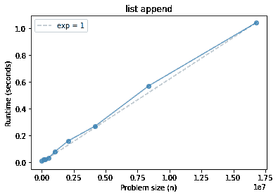
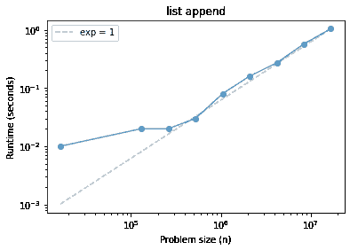
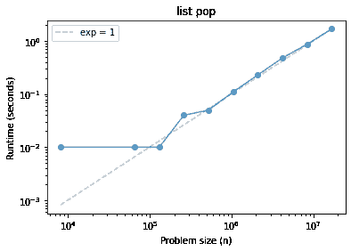
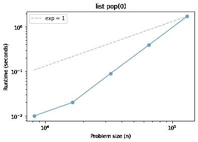
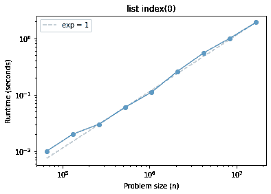
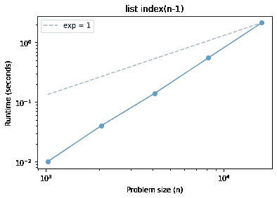
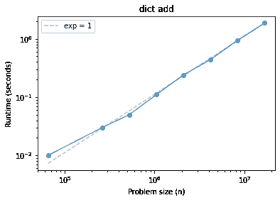
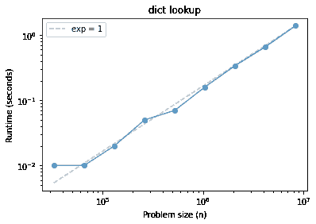

# 第四章：测试增长顺序

> 原文：[`allendowney.github.io/DSIRP/timing.html`](https://allendowney.github.io/DSIRP/timing.html)
> 
> 译者：[飞龙](https://github.com/wizardforcel)
> 
> 协议：[CC BY-NC-SA 4.0](http://creativecommons.org/licenses/by-nc-sa/4.0/)


[点击此处在 Colab 上运行本章](https://colab.research.google.com/github/AllenDowney/DSIRP/blob/main/notebooks/timing.ipynb)

算法分析使得能够预测随着问题规模增加运行时间的增长。但是这种分析忽略了主导系数和非主导项。因此，对于小型和中型问题，行为可能不符合分析的预测。

为了真正了解运行时间如何随问题规模的变化而变化，我们可以运行算法并进行测量。

为了进行测量，我们将使用`os`模块中的[times](https://docs.python.org/3/library/os.html#os.times)函数。

```py
import os

def etime():
  """Measures user and system time this process has used.

 Returns the sum of user and system time."""
    user, sys, chuser, chsys, real = os.times()
    return user+sys 
```

```py
start = etime()
t = [x**2 for x in range(10000)]
end = etime()
end - start 
```

```py
0.0 
```

练习：使用`etime`来测量`sleep`使用的计算时间。

```py
from time import sleep

sleep(1) 
```

```py
def time_func(func, n):
  """Run a function and return the elapsed time.

 func: function
 n: problem size, passed as an argument to func

 returns: user+sys time in seconds
 """
    start = etime()
    func(n)
    end = etime()
    elapsed = end - start
    return elapsed 
```

使计时变得棘手的一件事是许多操作速度太快，无法准确测量。

`%timeit`通过运行足够多次来获得精确估计，即使对于运行非常快的事情也是如此。

我们将通过运行一系列问题规模的范围来处理它，希望找到运行时间足够长但不超过几秒的规模。

以下函数接受一个大小`n`，创建一个空列表，并调用`list.append` `n`次。

```py
def list_append(n):
    t = []
    [t.append(x) for x in range(n)] 
```

`timeit`可以准确计时这个函数。

```py
%timeit list_append(10000) 
```

```py
427 µs ± 6.66 µs per loop (mean ± std. dev. of 7 runs, 1000 loops each) 
```

但是我们的`time_func`并不那么聪明。

```py
time_func(list_append, 10000) 
```

```py
0.0 
```

练习：增加迭代次数，直到运行时间可测量。

## 列表附加

以下函数逐渐增加`n`并记录总时间。

```py
def run_timing_test(func, max_time=1):
  """Tests the given function with a range of values for n.

 func: function object

 returns: list of ns and a list of run times.
 """
    ns = []
    ts = []
    for i in range(10, 28):
        n = 2**i
        t = time_func(func, n)
        print(n, t)
        if t > 0:
            ns.append(n)
            ts.append(t)
        if t > max_time:
            break

    return ns, ts 
```

```py
ns, ts = run_timing_test(list_append) 
```

```py
1024 0.0
2048 0.0
4096 0.0
8192 0.0
16384 0.009999999999999787
32768 0.0
65536 0.0
131072 0.020000000000000462
262144 0.019999999999999574
524288 0.02999999999999936
1048576 0.08000000000000096
2097152 0.15999999999999925
4194304 0.27000000000000046
8388608 0.5700000000000003
16777216 1.0399999999999991 
```

```py
import matplotlib.pyplot as plt

plt.plot(ns, ts, 'o-')
plt.xlabel('Problem size (n)')
plt.ylabel('Runtime (seconds)'); 
```


这个看起来是相当线性的，但不会总是那么清晰。绘制一条通过最后一个数据点的直线将有所帮助。

```py
def fit(ns, ts, exp=1.0, index=-1):
  """Fits a curve with the given exponent.

 ns: sequence of problem sizes
 ts: sequence of times
 exp: exponent of the fitted curve
 index: index of the element the fitted line should go through

 returns: sequence of fitted times

 """
    # Use the element with the given index as a reference point,
    # and scale all other points accordingly.
    nref = ns[index]
    tref = ts[index]

    tfit = []
    for n in ns:
        ratio = n / nref
        t = ratio**exp * tref
        tfit.append(t)

    return tfit 
```

```py
ts_fit = fit(ns, ts)
ts_fit 
```

```py
[0.0010156249999999992,
 0.008124999999999993,
 0.016249999999999987,
 0.03249999999999997,
 0.06499999999999995,
 0.1299999999999999,
 0.2599999999999998,
 0.5199999999999996,
 1.0399999999999991] 
```

以下函数绘制实际结果和拟合线。

```py
def plot_timing_test(ns, ts, label='', color='C0', exp=1.0, scale='log'):
  """Plots data and a fitted curve.

 ns: sequence of n (problem size)
 ts: sequence of t (run time)
 label: string label for the data curve
 color: string color for the data curve
 exp: exponent (slope) for the fitted curve
 scale: string passed to xscale and yscale
 """
    ts_fit = fit(ns, ts, exp)
    fit_label = 'exp = %d' % exp
    plt.plot(ns, ts_fit, label=fit_label, color='0.7', linestyle='dashed')
    plt.plot(ns, ts, 'o-', label=label, color=color, alpha=0.7)
    plt.xlabel('Problem size (n)')
    plt.ylabel('Runtime (seconds)')
    plt.xscale(scale)
    plt.yscale(scale)
    plt.legend() 
```

```py
plot_timing_test(ns, ts, scale='linear')
plt.title('list append'); 
```



从这些结果中，我们对`list.append`的增长顺序能得出什么结论？

在继续之前，让我们也在对数-对数刻度上查看结果。

```py
plot_timing_test(ns, ts, scale='log')
plt.title('list append'); 
```



为什么我们更喜欢这个刻度？

## 列表弹出

现在让我们对`list.pop`（默认从列表末尾弹出）做同样的事情。

请注意，我们必须在从中弹出东西之前制作列表，因此我们必须考虑如何解释结果。

```py
def list_pop(n):
    t = []
    [t.append(x) for x in range(n)]
    [t.pop() for _ in range(n)]

ns, ts = run_timing_test(list_pop)
plot_timing_test(ns, ts, scale='log')
plt.title('list pop'); 
```

```py
1024 0.0
2048 0.0
4096 0.0
8192 0.010000000000001563
16384 0.0
32768 0.0
65536 0.009999999999999787
131072 0.009999999999999787
262144 0.03999999999999915
524288 0.05000000000000071
1048576 0.11000000000000121
2097152 0.22999999999999865
4194304 0.4800000000000004
8388608 0.8699999999999992
16777216 1.6900000000000013 
```



我们能得出什么结论？

`pop(0)`是从列表的开头弹出的，怎么样？

注意：您可能需要调整`exp`以使拟合线拟合。

```py
def list_pop0(n):
    t = []
    [t.append(x) for x in range(n)]
    [t.pop(0) for _ in range(n)]

ns, ts = run_timing_test(list_pop0)
plot_timing_test(ns, ts, scale='log', exp=1)
plt.title('list pop(0)'); 
```

```py
1024 0.0
2048 0.0
4096 0.0
8192 0.010000000000001563
16384 0.019999999999999574
32768 0.08999999999999986
65536 0.39000000000000057
131072 1.7199999999999989 
```



## 搜索列表

`list.index`搜索列表并返回与目标匹配的第一个元素的索引。

如果我们总是搜索第一个元素，我们会得到什么期望？

```py
def list_index0(n):
    t = []
    [t.append(x) for x in range(n)]
    [t.index(0) for _ in range(n)]

ns, ts = run_timing_test(list_index0)

plot_timing_test(ns, ts, scale='log', exp=1)
plt.title('list index(0)'); 
```

```py
1024 0.0
2048 0.0
4096 0.0
8192 0.0
16384 0.0
32768 0.0
65536 0.009999999999999787
131072 0.019999999999999574
262144 0.030000000000001137
524288 0.05999999999999872
1048576 0.10999999999999943
2097152 0.26000000000000156
4194304 0.5500000000000007
8388608 1.0
16777216 1.9100000000000001 
```



如果我们总是搜索最后一个元素会怎样？

```py
def list_index_n(n):
    t = []
    [t.append(x) for x in range(n)]
    [t.index(n-1) for _ in range(n)]

ns, ts = run_timing_test(list_index_n)

plot_timing_test(ns, ts, scale='log', exp=1)
plt.title('list index(n-1)'); 
```

```py
1024 0.00999999999999801
2048 0.03999999999999915
4096 0.14000000000000057
8192 0.5499999999999972
16384 2.1400000000000006 
```



## 字典添加

```py
def dict_add(n):
    d = {}
    [d.setdefault(x, x) for x in range(n)]

ns, ts = run_timing_test(dict_add)

plot_timing_test(ns, ts, scale='log', exp=1)
plt.title('dict add'); 
```

```py
1024 0.0
2048 0.0
4096 0.0
8192 0.0
16384 0.0
32768 0.0
65536 0.00999999999999801
131072 0.0
262144 0.030000000000001137
524288 0.04999999999999716
1048576 0.11000000000000298
2097152 0.23999999999999844
4194304 0.4400000000000013
8388608 0.9400000000000013
16777216 1.8699999999999974 
```



## 字典查找

```py
def dict_lookup(n):
    d = {}
    [d.setdefault(x, x) for x in range(n)]
    [d[x] for x in range(n)]

ns, ts = run_timing_test(dict_lookup)

plot_timing_test(ns, ts, scale='log', exp=1)
plt.title('dict lookup'); 
```

```py
1024 0.0
2048 0.0
4096 0.0
8192 0.0
16384 0.0
32768 0.00999999999999801
65536 0.010000000000005116
131072 0.01999999999999602
262144 0.05000000000000071
524288 0.06999999999999673
1048576 0.1600000000000037
2097152 0.33999999999999986
4194304 0.6600000000000001
8388608 1.3900000000000006 
```



这种字典的特性是许多高效算法的基础！
