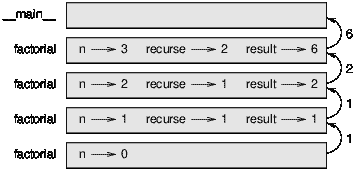
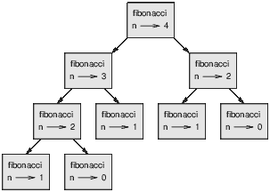

# 递归

> 原文：[`allendowney.github.io/DSIRP/recursion.html`](https://allendowney.github.io/DSIRP/recursion.html)

[点击这里在 Colab 上运行本章](https://colab.research.google.com/github/AllenDowney/DSIRP/blob/main/notebooks/recursion.ipynb)

## 示例 1

这是[Think Python 的这一部分](https://greenteapress.com/thinkpython2/html/thinkpython2006.html#sec62)中的递归示例。

```py
def countdown(n):
    if n == 0:
        print('Blastoff!')
    else:
        print(n)
        countdown(n-1) 
```

```py
countdown(3) 
```

```py
3
2
1
Blastoff! 
```

要理解递归，重要的是要对运行函数时发生的事情有一个良好的心智模型：

1.  Python 解释参数。

1.  它创建一个栈帧，其中包含参数和局部变量。

1.  接下来将参数的值分配给参数。

1.  Python 运行函数的主体。

1.  然后它回收了栈帧。

运行时栈包含当前运行函数的栈帧。

这是一个栈图，展示了当这个`countdown`运行时发生了什么。


**练习：** 如果你用负数运行倒计时会发生什么？点击这里了解更多信息

## 示例 2

这是一个递归函数返回值的示例，来自[Think Python 的这一部分](https://greenteapress.com/thinkpython2/html/thinkpython2007.html#sec74)。

```py
def factorial(n):
    if n == 0:
        print(n, 1)
        return 1
    else:
        recurse = factorial(n-1)
        result = n * recurse
        print(n, recurse, result)
        return result 
```

```py
factorial(3) 
```

```py
0 1
1 1 1
2 1 2
3 2 6 
```

```py
6 
```

这是栈帧。



**练习：** 假设你想将一个数`x`提升到一个整数幂`k`。一个高效的方法是：

+   如果`k`是偶数，将`x`提升到`k/2`并平方。

+   如果`k`是奇数，将`x`提升到`(k-1)/2`，平方它，然后再乘以`x`一次。

编写一个实现这个算法的递归函数。

这个算法的增长顺序是什么？为了简单起见，假设`k`是 2 的幂。在我们得到 1 之前，我们需要将`k`除以 2 多少次？

反过来思考，从 1 开始，我们需要将 1 加倍多少次才能得到`k`？在数学符号中，问题是

\[2^y = k\]

其中`y`是未知的步数。取两边的对数，以 2 为底：

\[y = log_2 k\]

就增长顺序而言，这个算法是`O(log k)`。我们不必指定对数的底，因为一个底为 1 的对数是任何其他底的对数的常数倍。

## 示例 3

这是[Think Python 的这一部分](https://greenteapress.com/thinkpython2/html/thinkpython2007.html#sec76)中的另一个递归示例。

```py
def fibonacci(n):
    print(n)
    if n == 0:
        return 0
    elif  n == 1:
        return 1
    else:
        return fibonacci(n-1) + fibonacci(n-2) 
```

```py
fibonacci(4) 
```

```py
4
3
2
1
0
1
2
1
0 
```

```py
3 
```

这是一个栈图，展示了在这个函数调用期间创建的所有栈帧。

请注意，这些帧不是同时都在栈上的。



这是[Think Python 的这一部分](https://greenteapress.com/thinkpython2/html/thinkpython2012.html#sec135)，展示了我们如何通过“记忆化”使斐波那契更快。这不是打字错误；这个词真的是[记忆化](https://en.wikipedia.org/wiki/Memoization)。

```py
known = {0:0, 1:1}

def fibonacci_memo(n):
    if n in known:
        return known[n]

    print(n)
    res = fibonacci_memo(n-1) + fibonacci_memo(n-2)
    known[n] = res
    return res 
```

```py
fibonacci_memo(4) 
```

```py
4
3
2 
```

```py
3 
```

**练习：** [Ackermann 函数](http://en.wikipedia.org/wiki/Ackermann_function)，\(A(m, n)\)，定义如下：

\[\begin{split} A(m, n) = \begin{cases} n+1 & \mbox{if } m = 0 \\ A(m-1, 1) & \mbox{if } m > 0 \mbox{ and } n = 0 \\ A(m-1, A(m, n-1)) & \mbox{if } m > 0 \mbox{ and } n > 0. \end{cases} \end{split}\]

编写一个名为`ackermann`的函数来评估 Ackermann 函数。使用你的函数来评估`ackermann(3, 4)`，结果应该是 125。

对于更大的`m`和`n`值会发生什么？

如果你记忆化它，你能用更大的值评估这个函数吗？

## 字符串函数

我们以迭代方式做的许多事情也可以用递归方式表达。

```py
def reverse(s):
    if len(s) < 2:
        return s

    first, rest = s[0], s[1:]
    return reverse(rest) + first 
```

```py
reverse('reverse') 
```

```py
'esrever' 
```

对于序列和映射类型，通常递归版本没有优势。但对于树和图，递归实现可以更清晰、更简洁，更容易证明正确。

**练习：** 这是一个来自[StackOverflow](https://stackoverflow.com/questions/28977737/writing-a-recursive-string-function)的练习：

> 编写一个递归的、字符串值的函数`replace`，它接受一个字符串，并返回一个新的字符串，其中每个空格都被星号(*)替换
> 
> 替换字符串中的空格包括：
> 
> 1.  如果字符串为空，则不做任何操作
> 1.  
> 1.  否则：如果第一个字符不是空格，只需将其与替换字符串的其余部分连接起来
> 1.  
> 1.  如果第一个字符是空格，则将*与替换字符串的其余部分连接起来

## 练习

这个来自[计算机程序的结构和解释](https://mitpress.mit.edu/sites/default/files/sicp/index.html)：

> 两个整数`a`和`b`的最大公约数（GCD）被定义为能够整除`a`和`b`的最大整数，没有余数。例如，16 和 28 的最大公约数是 4。[...]找到两个整数的最大公约数的一种方法是对它们进行因式分解并搜索公因数，但有一个[著名的算法](https://en.wikipedia.org/wiki/Euclidean_algorithm)要高效得多。
> 
> 该算法的思想基于这样的观察：如果`r`是`a`除以`b`的余数，那么`a`和`b`的公约数恰好与`b`和`r`的公约数相同。
> 
> 因此，我们可以使用方程
> 
> \[GCD(a, b) = GCD(b, r)\]
> 
> 将计算 GCD 的问题逐步减少到计算更小的整数对的 GCD 的问题。
> 
> 可以证明，从任意两个正整数开始，并进行重复的减少，最终总会产生一个第二个数字为 0 的对。然后最大公约数是对中的另一个数字。

编写一个名为`gcd`的函数，它接受两个整数，并使用这个算法来计算它们的最大公约数。

这个来自[计算机程序的结构和解释](https://mitpress.mit.edu/sites/default/files/sicp/index.html)：

> 有多少种不同的方式可以找零 1.00 美元，给定的是半美元、25 美分、10 美分、5 美分和 1 美分？
> 
> 假设我们将可用的硬币类型按某种顺序排列。[...]观察到，找零的方式可以分为两组：一组是不使用第一种硬币的，另一组是使用第一种硬币的。因此，某个金额的找零方式的总数等于不使用第一种硬币的金额的找零方式的数量，加上假设我们使用第一种硬币的找零方式的数量。

编写一个函数，它以美分为单位的金额和硬币面额序列作为参数。它应该返回组合硬币的数量，使其总和等于给定的金额。

使用面额为`(50, 25, 10, 5, 1)`的硬币，一个美元（100 美分）的结果应该是`292`。

你可能需要考虑基本情况。

**练习：**这是我最喜欢的 Car Talk Puzzlers 之一（[`www.cartalk.com/content/puzzlers`](http://www.cartalk.com/content/puzzlers)）：

> 当你一次又一次地去掉它的字母时，最长的英文单词是什么，它仍然是一个有效的英文单词？
> 
> 现在，字母可以从任一端或中间删除，但不能重新排列任何字母。每次你去掉一个字母，你最终会得到另一个英文单词。如果你这样做，最终你会得到一个字母，这也是一个英文单词——一个在字典中找到的单词。我想知道最长的单词是什么，它有多少个字母？
> 
> 我将给你一个小的例子：Sprite。好吗？你从 sprite 开始，你拿掉一个字母，从单词的中间拿掉一个字母，拿掉 r，我们剩下 spite 这个词，然后我们拿掉结尾的 e，我们剩下 spit，我们拿掉 s，我们剩下 pit，it，和 I。

编写一个程序，找出所有可以以这种方式减少的单词，然后找出最长的单词。

这个练习比大多数练习都要困难一些，所以这里有一些建议：

+   你可能想写一个函数，它接受一个单词并计算可以通过去掉一个字母形成的所有单词的列表。这些是该单词的“子代”。

+   递归地，如果任何一个子代是可减的，那么一个单词就是可减的。作为基本情况，你可以考虑单个字母单词“I”、“a”是可减的。

+   为了提高程序的性能，你可能想要记忆那些已知是可减的单词。

```py
from os.path import basename, exists

def download(url):
    filename = basename(url)
    if not exists(filename):
        from urllib.request import urlretrieve
        local, _ = urlretrieve(url, filename)
        print('Downloaded ' + local)

download('https://github.com/AllenDowney/DSIRP/raw/main/american-english') 
```

```py
def read_words(filename):
  """Read lines from a file and split them into words."""
    res = set()
    for line in open(filename):
        for word in line.split():
            res.add(word.strip().lower())
    return res 
```

```py
word_set = read_words('american-english')
len(word_set) 
```

```py
100781 
```

*Python 中的数据结构和信息检索*

版权所有 2021 Allen Downey

许可证：[知识共享署名-非商业性使用-相同方式共享 4.0 国际许可协议](https://creativecommons.org/licenses/by-nc-sa/4.0/)
