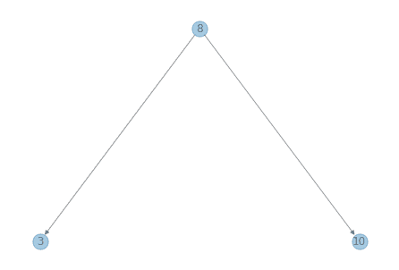
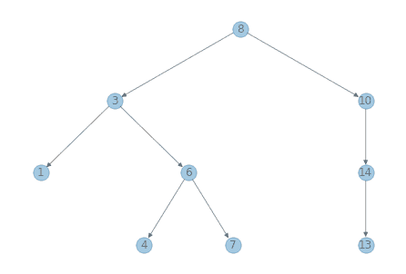
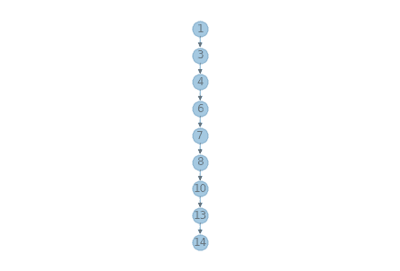
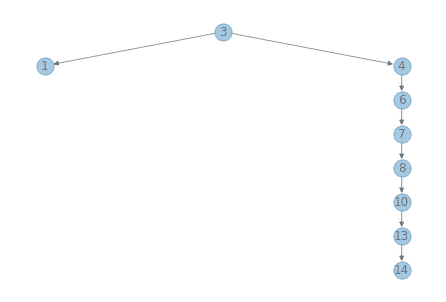

# 搜索

> 原文：[`allendowney.github.io/DSIRP/searching.html`](https://allendowney.github.io/DSIRP/searching.html)

[点击这里在 Colab 上运行这一章节](https://colab.research.google.com/github/AllenDowney/DSIRP/blob/main/notebooks/searching.ipynb)

## 线性搜索

假设你有一个列表。

```py
t = [5, 1, 2, 4, 2] 
```

而且你想知道一个元素是否出现在列表中。你可以使用`in`运算符，它返回`True`或`False`。

```py
5 in t, 6 in t 
```

```py
(True, False) 
```

如果你想知道它在列表中的位置，你可以使用`index`，它返回元素的索引。

```py
t.index(2) 
```

```py
2 
```

或者否则引发`ValueError`。

```py
try:
    t.index(6)
except ValueError as e:
    print(e) 
```

```py
6 is not in list 
```

以下函数做的事情与`string.index`相同：

```py
def index(t, target):
    for i, x in enumerate(t):
        if x == target:
            return i
    raise ValueError(f'{target} is not in list') 
```

```py
index(t, 2) 
```

```py
2 
```

```py
try:
    index(t, 6)
except ValueError as e:
    print(e) 
```

```py
6 is not in list 
```

这种搜索的运行时间是`O(n)`，其中`n`是列表的长度，因为

1.  如果目标不在列表中，你必须检查列表中的每个元素。

1.  如果目标在一个随机位置，你平均需要检查列表的一半。

作为一个例外，如果你知道目标在前`k`个元素内，对于一个不依赖于`n`的`k`值，你可以认为这个搜索是`O(1)`。

## 二分

如果我们知道列表的元素是有序的，我们可以做得更好。

`bisect`模块提供了一个“二分搜索”的实现，它的工作原理是

1.  检查列表中间的元素。如果它是目标，我们完成了。

1.  如果中间元素大于目标，我们搜索左半部分。

1.  如果中间元素小于目标，我们搜索右半部分。

[这是 bisect 模块的文档](https://docs.python.org/3/library/bisect.html)。

为了测试它，我们将从一个有序列表开始。

```py
t.sort()
t 
```

```py
[1, 2, 2, 4, 5] 
```

`bisect_left`类似于`index`

```py
from bisect import bisect_left

bisect_left(t, 1), bisect_left(t, 2), bisect_left(t, 4), bisect_left(t, 5) 
```

```py
(0, 1, 3, 4) 
```

但是对于不在列表中的元素，它返回它们的插入点，也就是你将目标放置在列表中保持排序的位置。

```py
bisect_left(t, 6) 
```

```py
5 
```

我们可以使用`bisect_left`来实现`index`，就像这样：

```py
from bisect import bisect_left

def index_bisect(a, x):
  """Locate the leftmost value exactly equal to x"""
    i = bisect_left(a, x)
    if i != len(a) and a[i] == x:
        return i
    raise ValueError(f'{x} not in list') 
```

```py
index_bisect(t, 1), index_bisect(t, 2), index_bisect(t, 4), index_bisect(t, 5) 
```

```py
(0, 1, 3, 4) 
```

```py
try:
    index_bisect(t, 6)
except ValueError as e:
    print(e) 
```

```py
6 not in list 
```

**练习：**编写你自己的`bisect_left`版本。你可以迭代或递归地完成。

每次循环，我们将搜索区域减半，所以如果我们从`n`个元素开始，下一个循环时有`n/2`个元素，第二个循环时有`n/4`个元素，依此类推。当我们到达 1 个元素时，我们完成了。

[看这个动画](https://blog.penjee.com/binary-vs-linear-search-animated-gifs/)

那需要多少步骤呢？反过来想，从 1 开始，我们需要翻倍多少次才能得到`n`？用数学符号表示，问题是

$$2^x = n$$

其中`x`是未知的步数。取对数的两边，底数为 2：

$$x = log_2 n$$

就增长的顺序而言，二分搜索是`O(log n)`。注意我们不必指定对数的底数，因为一个底数的对数是另一个底数的对数的常数倍。

`bisect`还提供了在保持排序顺序的同时插入元素的方法。

```py
from bisect import insort

insort(t, 3)
t 
```

```py
[1, 2, 2, 3, 4, 5] 
```

然而，正如文档所解释的，“请记住，O(log n)的搜索被慢的 O(n)插入步骤所支配。”

## 二叉搜索树

使用有序数组支持对数时间搜索是一个合理的选择，如果我们不经常添加或删除元素。

但是如果添加/删除操作的次数与搜索次数相似，整体性能将是线性的。

我们可以用[二叉搜索树](https://en.wikipedia.org/wiki/Binary_search_tree)来解决这个问题。

为了实现一个树，我将定义一个表示`Node`的新类。每个节点包含数据和指向两个称为`left`和`right`的“子节点”的引用。（它被称为二叉树，因为每个节点都有两个子节点）。

```py
class Node:
    def __init__(self, data, left=None, right=None):
        self.data = data
        self.left = left
        self.right = right

    def __repr__(self):
        return f'Node({self.data}, {repr(self.left)}, {repr(self.right)})' 
```

这是我们如何实例化两个节点的方法。

```py
node3 = Node(3)
node10 = Node(10) 
```

因为`Node`提供了`__repr__`，我们可以这样显示一个节点。

```py
node3 
```

```py
Node(3, None, None) 
```

现在我们将创建一个父节点，它有前两个节点作为子节点。

```py
node8 = Node(8, node3, node10)
node8 
```

```py
Node(8, Node(3, None, None), Node(10, None, None)) 
```

我将定义另一个类来表示树。它唯一包含的是对树顶的引用，这个引用令人困惑地被称为根节点。

```py
class BSTree:
    def __init__(self, root=None):
        self.root = root

    def __repr__(self):
        return f'BSTree({repr(self.root)})' 
```

这是一个带有对`node8`的引用的树，所以它隐含地包含了`node3`和`node10`。

```py
tree = BSTree(node8)
tree 
```

```py
BSTree(Node(8, Node(3, None, None), Node(10, None, None))) 
```

如果对于每个节点（1）左子节点的值较低且（2）右子节点的值较高，则二叉树是二叉搜索树。现在暂时假设没有重复值。

我们可以这样检查树是否是 BST：

```py
def is_bst(tree):
    return is_bst_rec(tree.root)

def is_bst_rec(node):
    if node is None:
        return True

    if node.left and node.left.data > node.data:
        return False
    if node.right and node.right.data < node.data:
        return False

    return is_bst_rec(node.left) and is_bst_rec(node.right) 
```

```py
is_bst(tree) 
```

```py
True 
```

让我们看一个不成立的例子。

```py
node5 = Node(5, node10, node3)
node5 
```

```py
Node(5, Node(10, None, None), Node(3, None, None)) 
```

```py
tree2 = BSTree(node5)
is_bst(tree2) 
```

```py
False 
```

## 绘制树

绘制树的较好函数之一是`EoN`包的一部分，用于“网络上的流行病”，提供“研究网络中 SIS 和 SIR 疾病传播的工具”。

我们将使用的函数称为[hierarchy_pos](https://epidemicsonnetworks.readthedocs.io/en/latest/functions/EoN.hierarchy_pos.html#EoN.hierarchy_pos)。它以表示树的 NetworkX 图作为参数，并返回一个将每个节点映射到笛卡尔平面位置的字典。如果我们将此字典传递给`nx.draw`，它将相应地布置树。

```py
try:
    import EoN
except ImportError:
    !pip  install  EoN 
```

```py
import networkx as nx

def add_edges(node, G):
  """Make a NetworkX graph that represents the heap."""
    if node is None:
        return

    G.add_node(node, label=node.data)
    for child in (node.left, node.right):
        if child:
            G.add_edge(node, child)
            add_edges(child, G) 
```

```py
G = nx.DiGraph()
add_edges(tree.root, G)
G.nodes() 
```

```py
NodeView((Node(8, Node(3, None, None), Node(10, None, None)), Node(3, None, None), Node(10, None, None))) 
```

```py
labels = {node: node.data for node in G.nodes()}
labels 
```

```py
{Node(8, Node(3, None, None), Node(10, None, None)): 8,
 Node(3, None, None): 3,
 Node(10, None, None): 10} 
```

```py
from EoN import hierarchy_pos

def draw_tree(tree):
    G = nx.DiGraph()
    add_edges(tree.root, G)
    pos = hierarchy_pos(G)
    labels = {node: node.data for node in G.nodes()}
    nx.draw(G, pos, labels=labels, alpha=0.4) 
```

```py
draw_tree(tree) 
```



## 搜索

给定一棵树和一个目标值，我们如何确定目标是否在树中？

1.  从根开始。如果找到目标，请停止。

1.  如果目标小于根处的值，则向左移动。

1.  如果目标大于根处的值，则向右移动。

1.  如果到达不存在的节点，请停止。

**练习：**编写一个名为`search`的函数，该函数接受`BSTree`和目标值，并在树中出现目标值时返回`True`。

**练习：**许多树操作适合递归实现。编写一个名为`search_rec`的函数，该函数递归搜索树。

提示：从`is_bst`的副本开始。

## 插入

BST 的重点是，与排序数组相比，我们可以高效地添加和删除元素。

所以让我们看看那是什么样子。

```py
def insert(tree, data):
    tree.root = insert_node(tree.root, data)

def insert_node(node, data):
    if node is None:
        return Node(data)

    if data < node.data:
        node.left = insert_node(node.left, data)
    else:
        node.right = insert_node(node.right, data)

    return node 
```

我们将通过从空树开始，逐个添加元素来进行测试。

```py
tree = BSTree()

values = [8, 3, 10, 1, 6, 14, 4, 7, 13]
for value in values:
    insert(tree, value)

tree 
```

```py
BSTree(Node(8, Node(3, Node(1, None, None), Node(6, Node(4, None, None), Node(7, None, None))), Node(10, None, Node(14, Node(13, None, None), None)))) 
```

```py
draw_tree(tree) 
```



如果一切按计划进行，结果应该是一棵二叉搜索树。

```py
is_bst(tree) 
```

```py
True 
```

## 排序

如果我们递归遍历树并在遍历过程中打印元素，则可以按顺序获取值。

```py
def print_tree(tree):
    print_tree_rec(tree.root)

def print_tree_rec(node):
    if node is None:
        return

    print_tree_rec(node.left)
    print(node.data, end=' ')
    print_tree_rec(node.right) 
```

```py
print_tree(tree) 
```

```py
1 3 4 6 7 8 10 13 14 
```

**练习：**编写一个名为`iterate_tree`的生成器方法，遍历树并按顺序产生元素。

您可以迭代或递归地执行此操作。

## 糟糕程度 10000

如果树相当平衡，则高度与`log n`成比例，其中`n`是元素的数量。

但是，让我们看看如果按顺序添加元素会发生什么。

```py
tree3 = BSTree()
for x in sorted(values):
    insert(tree3, x) 
```

```py
draw_tree(tree3) 
```



现在遍历树需要线性时间。为了避免这个问题，有一些变体的 BST 是[自平衡的](https://en.wikipedia.org/wiki/Self-balancing_binary_search_tree)。

大多数基于[树旋转](https://en.wikipedia.org/wiki/Tree_rotation)操作。例如，以下是一个将树向左旋转的函数（遵循维基百科对“左”和“右”的命名约定）。

```py
def rotate_left(node):
    if node is None or node.right is None:
        return node

    pivot = node.right
    node.right = pivot.left
    pivot.left = node

    return pivot 
```

```py
tree3.root = rotate_left(tree3.root)
draw_tree(tree3) 
```



*Python 中的数据结构和信息检索*

版权所有 2021 Allen Downey

许可：[知识共享署名-非商业性使用-相同方式共享 4.0 国际许可协议](https://creativecommons.org/licenses/by-nc-sa/4.0/)
