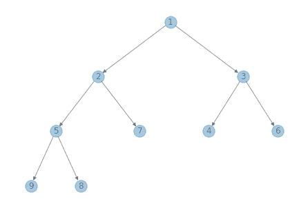

# 第十四章：优先队列和堆

> 原文：[`allendowney.github.io/DSIRP/heap.html`](https://allendowney.github.io/DSIRP/heap.html)

[单击此处在 Colab 上运行本章](https://colab.research.google.com/github/AllenDowney/DSIRP/blob/main/notebooks/heap.ipynb)

## `heapq`模块

`heapq`模块提供了向堆中添加和删除元素的函数。

```py
from heapq import heappush, heappop 
```

堆本身实际上是一个列表，因此如果创建一个空列表，可以将其视为没有元素的堆。

```py
heap = [] 
```

然后，您可以使用`heappush`逐个添加一个元素。

```py
data = [4, 9, 3, 7, 5, 1, 6, 8, 2]

for x in data:
    heappush(heap, x)

heap 
```

```py
[1, 2, 3, 5, 7, 4, 6, 9, 8] 
```

结果是一个表示树的列表。以下是列表表示和树表示之间的对应关系：

+   第一个元素（索引 0）是根。

+   接下来的两个元素是根的子节点。

+   接下来的四个元素是根的孙子。

等等。

一般来说，如果一个元素的索引是`i`，其父元素是`(i-1)//2`，其子元素是`2*i + 1`和`2*i + 2`。

## 绘制树

为了生成堆的树表示，以下函数遍历堆并创建一个 NetworkX 图，其中每个节点与其父节点之间都有一条边。

```py
import networkx as nx

def make_dag(heap):
  """Make a NetworkX graph that represents the heap."""
    G = nx.DiGraph()

    for i in range(1, len(heap)):
        parent = (i-1)//2
        G.add_edge(parent, i)

    return G 
```

```py
G = make_dag(heap) 
```

要绘制树，我们将使用一个名为`EoN`的模块，它提供了一个名为[hierarchy_pos](https://epidemicsonnetworks.readthedocs.io/en/latest/functions/EoN.hierarchy_pos.html#EoN.hierarchy_pos)的函数。

它以一个表示树的 NetworkX 图作为参数，并返回一个将每个节点映射到笛卡尔平面上的位置的字典。如果我们将此字典传递给`nx.draw`，它会相应地布置树。

```py
try:
    import EoN
except ImportError:
    !pip  install  EoN 
```

```py
Collecting EoN
  Using cached EoN-1.1-py3-none-any.whl
Requirement already satisfied: numpy in /home/downey/anaconda3/envs/DSIRP/lib/python3.10/site-packages (from EoN) (1.21.4)
Requirement already satisfied: scipy in /home/downey/anaconda3/envs/DSIRP/lib/python3.10/site-packages (from EoN) (1.7.3)
Requirement already satisfied: matplotlib in /home/downey/anaconda3/envs/DSIRP/lib/python3.10/site-packages (from EoN) (3.5.1)
Requirement already satisfied: networkx in /home/downey/anaconda3/envs/DSIRP/lib/python3.10/site-packages (from EoN) (2.6.3)
Requirement already satisfied: cycler>=0.10 in /home/downey/anaconda3/envs/DSIRP/lib/python3.10/site-packages (from matplotlib->EoN) (0.11.0)
Requirement already satisfied: python-dateutil>=2.7 in /home/downey/anaconda3/envs/DSIRP/lib/python3.10/site-packages (from matplotlib->EoN) (2.8.2)
Requirement already satisfied: pyparsing>=2.2.1 in /home/downey/anaconda3/envs/DSIRP/lib/python3.10/site-packages (from matplotlib->EoN) (3.0.6)
Requirement already satisfied: fonttools>=4.22.0 in /home/downey/anaconda3/envs/DSIRP/lib/python3.10/site-packages (from matplotlib->EoN) (4.28.5)
Requirement already satisfied: packaging>=20.0 in /home/downey/anaconda3/envs/DSIRP/lib/python3.10/site-packages (from matplotlib->EoN) (21.3)
Requirement already satisfied: pillow>=6.2.0 in /home/downey/anaconda3/envs/DSIRP/lib/python3.10/site-packages (from matplotlib->EoN) (8.4.0)
Requirement already satisfied: kiwisolver>=1.0.1 in /home/downey/anaconda3/envs/DSIRP/lib/python3.10/site-packages (from matplotlib->EoN) (1.3.2)
Requirement already satisfied: six>=1.5 in /home/downey/anaconda3/envs/DSIRP/lib/python3.10/site-packages (from python-dateutil>=2.7->matplotlib->EoN) (1.16.0)
Installing collected packages: EoN
Successfully installed EoN-1.1 
```

```py
from EoN import hierarchy_pos

def draw_heap(heap):
    G = make_dag(heap)
    pos = hierarchy_pos(G)
    labels = dict(enumerate(heap))
    nx.draw(G, pos, labels=labels, alpha=0.4) 
```

以下是树表示的样子。

```py
print(heap)
draw_heap(heap) 
```

```py
[1, 2, 3, 5, 7, 4, 6, 9, 8] 
```



## 堆属性

如果列表是一个堆，树应该具有堆属性：

> 每个父节点都小于或等于其子节点。

或者更正式地说：

> 对于所有节点 P 和 C 的对，其中 P 是 C 的父节点，P 的值必须小于或等于 C 的值。

以下函数检查所有节点是否满足此属性。

```py
def is_heap(heap):
  """Check if a sequence has the heap property.

 Every child should be >= its parent.
 """
    for i in range(1, len(heap)):
        parent = (i-1) // 2
        if heap[parent] > heap[i]:
            return False
    return True 
```

正如我们所希望的那样，`heap`是一个堆。

```py
is_heap(heap) 
```

```py
True 
```

以下是一个无特定顺序的整数列表，正如您所期望的那样，它没有堆属性。

```py
data = [4, 9, 3, 7, 5, 1, 6, 8, 2]
is_heap(data) 
```

```py
False 
```

## 使用堆进行排序

给定一个堆，我们可以实现一个称为[heapsort](https://en.wikipedia.org/wiki/Heapsort)的排序算法。

让我们从一个新的堆开始：

```py
heap = []
for x in data:
    heappush(heap, x) 
```

如果我们知道列表是一个堆，我们可以使用`heappop`来查找并删除最小的元素。

```py
heappop(heap) 
```

```py
1 
```

`heappop`重新排列列表的剩余元素以恢复堆属性（我们很快就会看到如何实现）。

```py
heap 
```

```py
[2, 5, 3, 8, 7, 4, 6, 9] 
```

```py
is_heap(heap) 
```

```py
True 
```

这意味着我们可以再次使用`heappop`来获取原始堆的第二个最小元素：

```py
heappop(heap) 
```

```py
2 
```

这意味着我们可以使用堆来对列表进行排序。

**练习：**编写一个名为`heapsort`的生成器函数，它接受一个可迭代对象，并以递增顺序产生可迭代对象的元素。

现在让我们看看堆是如何实现的。两个关键方法是`push`和`pop`。

## 推

要在堆中插入一个元素，您首先将其附加到列表中。

通常结果不是一个堆，因此您必须做一些工作来恢复堆属性：

+   如果新元素大于或等于其父元素，则完成。

+   否则，将新元素与其父元素交换。

+   如果新元素大于或等于父元素的父元素，则完成。

+   否则，将新元素与其父元素的父元素交换。

+   并重复，一直向上工作，直到完成或达到根。

这个过程称为“sift-up”或有时称为[swim](https://en.wikipedia.org/wiki/Heap_(data_structure)#Implementation)。

**练习：**编写一个名为`push`的函数，它与`heappush`执行相同的操作：它应该接受一个列表（应该是一个堆）和一个新元素作为参数；它应该将新元素添加到列表中并恢复堆属性。

您可以使用此示例来测试您的代码：

```py
heap = []
for x in data:
    push(heap, x)
    assert is_heap(heap)

heap 
```

```py
[1, 2, 3, 5, 7, 4, 6, 9, 8] 
```

```py
is_heap(heap) 
```

```py
True 
```

## 弹出

要从堆中删除一个元素，您需要：

+   复制根元素，

+   从列表中弹出*最后*一个元素，并将其存储在根处。

+   然后你必须恢复堆属性。如果新的根节点小于或等于它的两个子节点，那么你就完成了。

+   否则，将父节点与较小的子节点交换。

+   然后用刚刚替换的子节点重复这个过程，并继续直到达到叶节点。

这个过程称为“筛选下降”或有时称为“下沉”。

**练习：**编写一个名为 `pop` 的函数，它执行与 `heappop` 相同的操作：它应该删除最小的元素，恢复堆属性，并返回最小的元素。

提示：这个有点棘手，因为你必须处理几种特殊情况。

```py
heap = []
for x in data:
    heappush(heap, x)

while heap:
    print(pop(heap))
    assert is_heap(heap) 
```

```py
1
2
3
4
5
6
7
8
9 
```

*Python 中的数据结构和信息检索*

版权所有 2021 年 Allen Downey

许可证：[知识共享署名-非商业性使用-相同方式共享 4.0 国际许可协议](https://creativecommons.org/licenses/by-nc-sa/4.0/)
