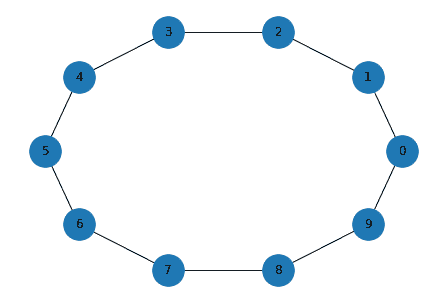
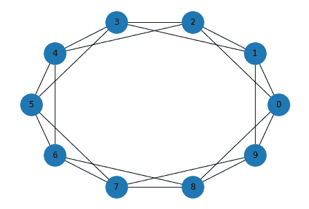
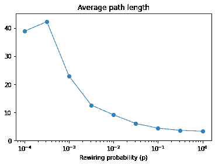

# 第二十五章：广度优先搜索

> 原文：[`allendowney.github.io/DSIRP/bfs.html`](https://allendowney.github.io/DSIRP/bfs.html)
> 
> 译者：[飞龙](https://github.com/wizardforcel)
> 
> 协议：[CC BY-NC-SA 4.0](http://creativecommons.org/licenses/by-nc-sa/4.0/)


[单击此处在 Colab 上运行本章](https://colab.research.google.com/github/AllenDowney/DSIRP/blob/main/notebooks/bfs.ipynb)

在之前的笔记本中，我们构建了一个 Erdos-Renyi 图，并编写了一个适用于图的深度优先搜索（DFS）版本。

当我们在树中进行 DFS 时，从根到任何其他节点只有一条路径，因此我们永远不会发现相同的节点两次。在图中，可能有多条通往相同节点的路径。为了避免一遍又一遍地发现相同的节点，我们必须跟踪我们已经看到的节点。

在这个笔记本中，我们将以相同的方式调整层次遍历；结果是广度优先搜索（BFS）。然后我们将调整 BFS 以实现 Dijkstra 算法，该算法计算从起始节点到每个其他节点的最短路径（如果可达）。

我们将使用 Watts-Strogatz 图测试这些函数，然后复制一部分来自[著名论文](https://github.com/AllenDowney/ThinkComplexity2/blob/master/papers/watts98collective.pdf)的实验。

## Watts-Strogatz 图

Watts-Strogatz（WS）图是一个随机图，类似于 Erdos-Renyi 图，但构建过程不同。WS 图从一个环形晶格开始，然后随机“重连”一些边。

NetworkX 提供了[一个创建 WS 图的函数](https://networkx.org/documentation/stable/reference/generated/networkx.generators.random_graphs.watts_strogatz_graph.html)，因此我们可以看看它的样子。

这是一个示例，其中`n=10`个节点，每个节点连接到`k=2`个邻居，每条边重连的概率为`p=0`。

```py
import networkx as nx

G = nx.watts_strogatz_graph(n=10, k=3, p=0)
G.nodes() 
```

```py
NodeView((0, 1, 2, 3, 4, 5, 6, 7, 8, 9)) 
```

结果是一个环，其中每个节点与其直接邻居手牵手。

```py
def draw_graph(G):
    nx.draw_circular(G, node_size=1000, with_labels=True) 
```

```py
draw_graph(G) 
```



**练习：**使用不同的`k`和`p`值再次运行此代码，看看效果如何。

注意：如果`k`是奇数，则会“向下取整”为偶数。

## 广度优先搜索

以下是前一个笔记本中实现图的深度优先搜索的函数。

```py
def reachable_nodes(G, start):
    seen = set()
    stack = [start]
    while stack:
        node = stack.pop()
        if node not in seen:
            seen.add(node)
            stack.extend(G[node])
    return seen 
```

```py
reachable_nodes(G, 0) 
```

```py
{0, 1, 2, 3, 4, 5, 6, 7, 8, 9} 
```

**练习：**制作一个名为`reachable_nodes_bfs`的此函数版本，使用广度优先搜索完成相同的操作。

您可以使用此示例来测试您的代码。

```py
reachable_nodes_bfs(G, 0) 
```

```py
{0, 1, 2, 3, 4, 5, 6, 7, 8, 9} 
```

## 快速 BFS

NetworkX 提供了 BFS 的简单快速实现，可从[GitHub 上的 NetworkX 存储库](https://github.com/networkx/networkx/blob/master/networkx/algorithms/components/connected.py)中获得。这是我修改后返回节点集的一个版本：

```py
def plain_bfs(G, start):
    seen = set()
    nextlevel = {start}
    while nextlevel:
        thislevel = nextlevel
        nextlevel = set()
        for v in thislevel:
            if v not in seen:
                seen.add(v)
                nextlevel.update(G[v])
    return seen 
```

让我们将这个函数与`reachable_nodes_bfs`进行比较，看看哪个更快。

```py
G = nx.watts_strogatz_graph(1000, 10, 0.01) 
```

```py
%timeit reachable_nodes_bfs(G, 0) 
```

```py
1.52 ms ± 7.91 µs per loop (mean ± std. dev. of 7 runs, 1000 loops each) 
```

```py
%timeit plain_bfs(G, 0) 
```

```py
946 µs ± 6.7 µs per loop (mean ± std. dev. of 7 runs, 1000 loops each) 
```

## Dijkstra 算法

在广度优先搜索期间，每当我们发现一个新节点时，我们所走的路径必须是最短的。这是必然的，因为如果有更短的路径，我们会更早地发现该节点。

这个洞察力是 Dijkstra 算法的基础，它计算从给定的“源”节点到所有其他（可达）节点的最短路径。

Dijkstra 算法的一般版本适用于边长不同的图，例如城市之间的距离。

我们将从一个更简单的版本开始，其中所有边的长度都为`1`。这个版本类似于 BFS，只有一个变化：我们不再保留已经看到的节点的集合，而是保留一个字典，将每个发现的节点映射到其与源节点的距离。

**练习：**编写一个名为`shortest_path_dijkstra`的`reachable_nodes_bfs`版本。它应该接受图和源节点作为参数，并返回一个字典，将每个可达节点映射到其与源节点的距离。

提示：从源节点到距离`0`开始一个映射的字典。

我们将在一个环形晶格上进行测试。

```py
G = nx.watts_strogatz_graph(10, 4, 0) 
```

```py
draw_graph(G) 
```



```py
shortest_path_dijkstra(G, 0) 
```

```py
{0: 0, 8: 1, 1: 1, 2: 1, 9: 1, 6: 2, 7: 2, 3: 2, 4: 2, 5: 3} 
```

**练习：**从`plain_bfs`开始编写 Dijkstra 算法的（可能更快的）实现，该实现返回一个字典，将每个可达节点映射到给定源节点的距离。

您可以使用以下示例进行测试。

```py
G = nx.watts_strogatz_graph(1000, 10, 0)
d1 = shortest_path_dijkstra(G, 0)
d2 = plain_shortest_path(G, 0)
d1 == d2 
```

```py
True 
```

让我们看看哪个版本更快。

```py
%timeit shortest_path_dijkstra(G, 0) 
```

```py
1.3 ms ± 12.3 µs per loop (mean ± std. dev. of 7 runs, 1000 loops each) 
```

```py
%timeit plain_shortest_path(G, 0) 
```

```py
955 µs ± 11.1 µs per loop (mean ± std. dev. of 7 runs, 1000 loops each) 
```

我们还可以将其与执行相同操作的 NetworkX 函数进行比较。

```py
%timeit nx.shortest_path_length(G, 0) 
```

```py
778 µs ± 9.5 µs per loop (mean ± std. dev. of 7 runs, 1000 loops each) 
```

## WS 实验

Watts-Strogatz 图的原始目的是探索社交网络的结构，特别是“小世界”现象，也称为“六度分隔”。

观察结果是社交网络中的路径长度比您预期的要短：地球上任何两个人之间的距离平均可能是六个连接（或更少）。

WS 图中的随机边通常连接图中本来相距很远的部分的人。即使只有少量这样的“长链接”，也可以大大减少平均路径长度。

为了复制他们原始实验的一部分，我将使用`nx.average_shortest_path_length`，它接受一个图，使用 Dijkstra 算法的无权重版本来计算从每个节点到其他所有节点的最短路径，并返回最短路径长度的平均值。

```py
G = nx.watts_strogatz_graph(10, 4, 0)
nx.average_shortest_path_length(G) 
```

```py
1.6666666666666667 
```

```py
G = nx.watts_strogatz_graph(1000, 10, 0)
nx.average_shortest_path_length(G) 
```

```py
50.450450450450454 
```

我们将对具有一系列`p`值的 WS 图运行此函数。

```py
import numpy as np

ps = np.logspace(-4, 0, 9)
print(ps) 
```

```py
[1.00000000e-04 3.16227766e-04 1.00000000e-03 3.16227766e-03
 1.00000000e-02 3.16227766e-02 1.00000000e-01 3.16227766e-01
 1.00000000e+00] 
```

```py
lengths = []

n = 1000
k = 10
for p in ps:
    print(p)
    G = nx.watts_strogatz_graph(n, k, p)    
    aspl = nx.average_shortest_path_length(G)
    lengths.append(aspl) 
```

```py
0.0001
0.00031622776601683794
0.001
0.0031622776601683794
0.01
0.03162277660168379
0.1
0.31622776601683794
1.0 
```

以下是结果的样子。

```py
import matplotlib.pyplot as plt

plt.plot(ps, lengths, 'o-', linewidth=1, label='L(p)')
plt.xlabel('Rewiring probability (p)') 
plt.xscale('log')
plt.ylim([0, max(lengths)+3])
plt.title('Average path length'); 
```



当`p=0.01`时，我们只重新连接 1%的边，但平均路径长度已经降到了它可能达到的最低水平。 

*Python 中的数据结构和信息检索*

版权所有 2021 Allen Downey

许可证：[知识共享署名-非商业性使用-相同方式共享 4.0 国际许可协议](https://creativecommons.org/licenses/by-nc-sa/4.0/)
