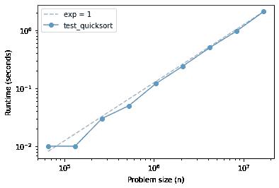
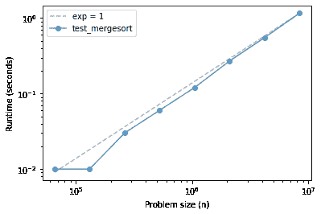
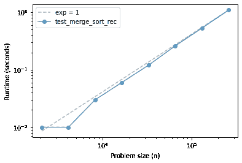

# 第二十八章：归并排序

> 原文：[`allendowney.github.io/DSIRP/mergesort.html`](https://allendowney.github.io/DSIRP/mergesort.html)
> 
> 译者：[飞龙](https://github.com/wizardforcel)
> 
> 协议：[CC BY-NC-SA 4.0](http://creativecommons.org/licenses/by-nc-sa/4.0/)


[点击这里在 Colab 上运行本章](https://colab.research.google.com/github/AllenDowney/DSIRP/blob/main/notebooks/mergesort.ipynb)

## 实现归并排序

[归并排序](https://en.wikipedia.org/wiki/Merge_sort)是一种分而治之的策略：

1.  将序列分成两半，

1.  对两半进行排序，并

1.  将排序好的子序列合并成一个序列。

由于步骤 2 涉及排序，这个算法是递归的，所以我们需要一个基本情况。有两种选择：

1.  如果大小低于某个阈值，我们可以使用另一种排序算法。

1.  如果子序列的大小为 1，则它已经排序好了。

[与其他排序算法的比较](https://en.wikipedia.org/wiki/Merge_sort#Comparison_with_other_sort_algorithms)

要实现归并排序，我认为从使用 Python 的`sort`函数对子序列进行排序的非递归版本开始会很有帮助。

```py
def merge_sort_norec(xs):
    n = len(xs)
    mid = n//2
    left = xs[:mid]
    right = xs[mid:]

    left.sort()
    right.sort()

    return merge(left, right) 
```

**练习：**编写一个名为`merge`的函数，它接受两个排序好的序列`left`和`right`，并返回一个包含`left`和`right`中所有元素的序列，按升序（或非递减）排序。

注意：这个函数在概念上并不难，但是要在不使函数难以阅读的情况下正确处理所有边缘情况是非常棘手的。把它当作一个挑战，写一个正确、简洁和可读的版本。我发现我可以把它写得更简洁一些，作为一个生成器函数。

你可以使用以下示例来测试你的代码。

```py
import random

population = range(100)
xs = random.sample(population, k=6)
ys = random.sample(population, k=6)
ys 
```

```py
[65, 55, 62, 4, 1, 91] 
```

```py
xs.sort()
ys.sort()
ys 
```

```py
[1, 4, 55, 62, 65, 91] 
```

```py
res = list(merge(xs, ys))
res 
```

```py
[1, 4, 13, 26, 55, 62, 65, 68, 71, 90, 91, 98] 
```

```py
sorted(res) == res 
```

```py
True 
```

**练习：**从`merge_sort_norec`开始，编写一个名为`merge_sort_rec`的函数，它是完全递归的；也就是说，它应该使用`merge_sort_rec`而不是使用 Python 的`sort`函数来对两半进行排序。当然，你需要一个基本情况来避免无限递归。

通过运行下一个单元格中的代码来测试你的方法，然后使用下面的`test_merge_sort_rec`来检查你的函数的性能。

```py
xs = random.sample(population, k=12)
xs 
```

```py
[5, 25, 67, 88, 35, 71, 26, 28, 12, 7, 57, 8] 
```

```py
res = list(merge_sort_rec(xs))
res 
```

```py
[5, 7, 8, 12, 25, 26, 28, 35, 57, 67, 71, 88] 
```

```py
sorted(res) == res 
```

```py
True 
```

## 堆合并

假设我们想要合并两个以上的子序列。一个方便的方法是使用堆。例如，这里有三个排序好的子序列。

```py
xs = random.sample(population, k=5)
ys = random.sample(population, k=5)
zs = random.sample(population, k=5)

min(xs), min(ys), min(zs) 
```

```py
(3, 16, 12) 
```

```py
xs.sort()
ys.sort()
zs.sort() 
```

对于每个序列，我将创建一个迭代器，并将一个包含以下内容的元组推入堆中：

+   迭代器的第一个元素，

+   每个迭代器都有一个不同的索引，

+   迭代器本身。

当堆比较这两个元组时，首先比较元素。如果有平局，它会比较索引。由于索引是唯一的，所以不可能有平局，所以我们永远不必比较迭代器（这将是一个错误）。

```py
sequences = [xs, ys, zs] 
```

```py
from heapq import heappush, heappop

heap = []
for i, seq in enumerate(sequences):
    iterator = iter(seq)
    first = next(iterator)
    heappush(heap, (first, i, iterator)) 
```

当我们从堆中弹出一个值时，我们得到的是具有最小值的元组。

```py
value, i, iterator = heappop(heap)
value 
```

```py
3 
```

如果我们知道迭代器还有更多的值，我们可以使用`next`来获取下一个值，然后将一个元组推回到堆中。

```py
heappush(heap, (next(iterator), i, iterator)) 
```

如果我们重复这个过程，我们将按升序得到所有子序列的所有元素。

然而，我们必须处理迭代器为空的情况。在 Python 中，检查的唯一方法是调用`next`并冒险！如果迭代器中没有更多的元素，`next`会引发一个`StopIteration`异常，你可以用一个`try`语句来处理，就像这样：

```py
iterator = iter(xs)

while True:
    try:
        print(next(iterator))
    except StopIteration:
        break 
```

```py
3
10
13
87
95 
```

**练习：**编写一个名为`heapmerge`的生成器函数，它接受一个序列列表，并按升序从序列中产生元素。

你可以使用以下示例来测试你的函数。

```py
seq = list(heapmerge([xs, ys, zs]))
seq 
```

```py
[3, 10, 12, 13, 16, 17, 20, 29, 34, 44, 87, 89, 92, 95, 97] 
```

```py
sorted(seq) == seq 
```

```py
True 
```

`heapq`模块提供了一个名为`merge`的函数，它实现了这个算法。

## 比较排序算法

NumPy 提供了三种排序算法的实现，快速排序、归并排序和堆排序。

在理论上，它们都是`O(n log n)`。让我们看看当我们绘制运行时间与问题大小的关系时会是什么样子。

```py
from os.path import basename, exists

def download(url):
    filename = basename(url)
    if not exists(filename):
        from urllib.request import urlretrieve
        local, _ = urlretrieve(url, filename)
        print('Downloaded ' + local)

download('https://github.com/AllenDowney/DSIRP/raw/main/timing.py') 
```

```py
from timing import run_timing_test, plot_timing_test 
```

```py
import numpy as np

def test_quicksort(n):
    xs = np.random.normal(size=n)
    xs.sort(kind='quicksort')

ns, ts = run_timing_test(test_quicksort)
plot_timing_test(ns, ts, 'test_quicksort', exp=1) 
```

```py
1024 0.0
2048 0.0
4096 0.0
8192 0.0
16384 0.0
32768 0.0
65536 0.010000000000000231
131072 0.009999999999999787
262144 0.03000000000000025
524288 0.04999999999999982
1048576 0.1200000000000001
2097152 0.23999999999999977
4194304 0.5000000000000004
8388608 0.9699999999999993
16777216 2.0900000000000007 
```



快速排序很难与线性区分，直到大约 1000 万个元素。

```py
def test_mergesort(n):
    xs = np.random.normal(size=n)
    xs.sort(kind='mergesort')

ns, ts = run_timing_test(test_mergesort)
plot_timing_test(ns, ts, 'test_mergesort', exp=1) 
```

```py
1024 0.0
2048 0.0
4096 0.0
8192 0.0
16384 0.0
32768 0.0
65536 0.010000000000000675
131072 0.009999999999999787
262144 0.03000000000000025
524288 0.05999999999999961
1048576 0.1200000000000001
2097152 0.2699999999999996
4194304 0.5499999999999998
8388608 1.160000000000001 
```



归并排序类似，也许有一些上升的曲线。

```py
def test_heapsort(n):
    xs = np.random.normal(size=n)
    xs.sort(kind='heapsort')

ns, ts = run_timing_test(test_quicksort)
plot_timing_test(ns, ts, 'test_heapsort', exp=1) 
```

```py
1024 0.0
2048 0.0
4096 0.0
8192 0.0
16384 0.0
32768 0.0
65536 0.009999999999999787
131072 0.009999999999999787
262144 0.030000000000001137
524288 0.049999999999998934
1048576 0.10999999999999943
2097152 0.21000000000000085
4194304 0.4499999999999993
8388608 0.9800000000000004
16777216 1.9700000000000006 
```


这三种方法在问题规模范围内都是有效的线性方法。

它们的运行时间大致相同，其中快速排序是最快的，尽管在最坏情况下性能最差。

现在让我们看看我们的归并排序实现如何。

```py
def test_merge_sort_rec(n):
    xs = np.random.normal(size=n)
    spectrum = merge_sort_rec(xs)

ns, ts = run_timing_test(test_merge_sort_rec)
plot_timing_test(ns, ts, 'test_merge_sort_rec', exp=1) 
```

```py
1024 0.0
2048 0.009999999999999787
4096 0.010000000000001563
8192 0.02999999999999936
16384 0.0600000000000005
32768 0.11999999999999922
65536 0.2599999999999998
131072 0.5300000000000011
262144 1.089999999999998 
```



如果一切按计划进行，我们的归并排序实现应该接近线性，或者稍微陡一点。

*Python 中的数据结构和信息检索*

版权所有 2021 Allen Downey

许可：[知识共享署名-非商业性使用-相同方式共享 4.0 国际许可协议](https://creativecommons.org/licenses/by-nc-sa/4.0/)
