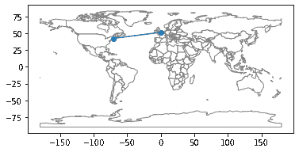

# 第四章：时间和地点

> 原文：[`allendowney.github.io/ElementsOfDataScience/02_times.html`](https://allendowney.github.io/ElementsOfDataScience/02_times.html)
> 
> 译者：[飞龙](https://github.com/wizardforcel)
> 
> 协议：[CC BY-NC-SA 4.0](http://creativecommons.org/licenses/by-nc-sa/4.0/)


[在 Colab 上运行此笔记本](https://colab.research.google.com/github/AllenDowney/ElementsOfDataScience/blob/master/02_times.ipynb) 或

[在 Sagemaker Studio Lab 上运行此笔记本](https://studiolab.sagemaker.aws/import/github/AllenDowney/ElementsOfDataScience/blob/master/02_times.ipynb) 或

[下载此笔记本](https://github.com/AllenDowney/ElementsOfDataScience/raw/master/02_times.ipynb)。

在上一章中，您学习了变量和两种值：整数和浮点数。

在本章中，您将看到一些其他类型：

+   表示文本的字符串。

+   时间戳，表示日期和时间。

+   以及表示和显示地理位置的几种方法。

并非每个数据科学项目都使用所有这些类型，但许多项目至少使用一个。

## 字符串

**字符串**是字母、数字和标点符号的序列。在 Python 中，您可以通过在单引号或双引号之间放置文本来创建字符串。

```py
'Elements' 
```

```py
'Elements' 
```

```py
"of" 
```

```py
'of' 
```

您还可以将字符串值分配给变量。

```py
first = 'Data' 
```

```py
last = "Science" 
```

一些算术运算符可以与字符串一起使用，但它们可能不会产生您期望的结果。例如，`+`运算符**连接**两个字符串；也就是说，它创建一个包含第一个字符串后跟第二个字符串的新字符串：

```py
first + last 
```

```py
'DataScience' 
```

如果要在单词之间放置一个空格，可以使用包含空格的字符串：

```py
first + ' ' + last 
```

```py
'Data Science' 
```

字符串用于存储文本数据，如姓名、地址、标题等。

当您从文件中读取数据时，您可能会看到看起来像数字的值，但实际上是字符串，就像这样：

```py
not_actually_a_number = '123' 
```

如果您尝试对这些字符串进行数学运算，*可能*会出现错误。例如，以下表达式会导致`TypeError`，并显示“can only concatenate `str` (not `int`) to `str`”。

```py
not_actually_a_number + 1 
```

但您并不总是会收到错误消息；相反，您可能会得到一个令人惊讶的结果。例如：

```py
not_actually_a_number * 3 
```

```py
'123123123' 
```

如果您将字符串乘以整数，Python 将重复给定次数的字符串。

如果字符串只包含数字，可以使用`int`函数将其转换为整数：

```py
int('123') 
```

```py
123 
```

或者您可以使用`float`将其转换为浮点数：

```py
float('123') 
```

```py
123.0 
```

但是，如果字符串包含小数点，您无法将其转换为`int`。

另一方面，您可以使用`str`将任何类型的值转换为字符串：

```py
str(123) 
```

```py
'123' 
```

```py
str(12.3) 
```

```py
'12.3' 
```

**练习**：当个人姓名存储在数据库中时，它们通常存储在三个变量中：名、姓和有时是中间名。例如，伟大的摇滚鼓手名单可能包括：

```py
given = 'Neil'
middle = 'Ellwood'
family = 'Peart' 
```

但是在不同的上下文中，名称通常以不同的方式显示。例如，在文章中首次提到某人时，您可能会给出所有三个名称，例如“Neil Ellwood Peart”。但在书的索引中，您可能会先放姓，例如“Peart, Neil Ellwood”。

使用变量`given`，`middle`和`family`编写 Python 表达式，以这两种格式显示 Neil Peart 的名称。

## 表示日期和时间

如果您从文件中读取数据，您可能还会发现日期和时间是用字符串表示的。

```py
not_really_a_date = 'June 4, 1989' 
```

要确认该值是字符串，我们可以使用`type`函数，该函数接受一个值并报告其类型。

```py
type(not_really_a_date) 
```

```py
str 
```

`str`表示`not_really_a_date`的值是字符串。

我们可以在下面的`not_really_a_time`中获得相同的结果：

```py
not_really_a_time = '6:30:00'
type(not_really_a_time) 
```

```py
str 
```

表示日期和时间的字符串对于人们来说是可读的，但对于计算来说并不实用。

幸运的是，Python 提供了用于处理日期和时间数据的库；我们将使用的一个库叫做 Pandas。与往常一样，在使用库之前，我们必须导入它；通常使用缩写名称`pd`导入 Pandas：

```py
import pandas as pd 
```

Pandas 提供了一种称为`Timestamp`的类型，它表示日期和时间。

它还提供了一个名为`Timestamp`的函数，我们可以使用它将字符串转换为`Timestamp`：

```py
pd.Timestamp('6:30:00') 
```

```py
Timestamp('2022-01-25 06:30:00') 
```

或者我们可以使用上面定义的变量执行相同的操作。

```py
pd.Timestamp(not_really_a_time) 
```

```py
Timestamp('2022-01-25 06:30:00') 
```

在这个例子中，字符串指定了时间但没有日期，所以 Pandas 填充了今天的日期。

`Timestamp`是一个值，所以你可以将它赋给一个变量。

```py
date_of_birth = pd.Timestamp('June 4, 1989')
date_of_birth 
```

```py
Timestamp('1989-06-04 00:00:00') 
```

如果字符串指定了日期但没有时间，Pandas 会将午夜填充为默认时间。

如果你将`Timestamp`赋给一个变量，你可以使用变量名来获取年、月和日，就像这样：

```py
date_of_birth.year, date_of_birth.month, date_of_birth.day 
```

```py
(1989, 6, 4) 
```

你也可以得到月份的名称和星期几。

```py
date_of_birth.day_name(), date_of_birth.month_name() 
```

```py
('Sunday', 'June') 
```

`Timestamp`提供了一个名为`now`的函数，返回当前的日期和时间。

```py
now = pd.Timestamp.now()
now 
```

```py
Timestamp('2022-01-25 14:26:11.312256') 
```

**练习：**使用`now`的值来显示当前月份和星期几的名称。

## 时间差

`Timestamp`值支持一些算术运算。例如，你可以计算两个`Timestamp`对象之间的差异：

```py
age = now - date_of_birth
age 
```

```py
Timedelta('11923 days 14:26:11.312256') 
```

结果是一个`Timedelta`，表示出生于`date_of_birth`的人的当前年龄。`Timedelta`包含`components`，存储两个`Timestamp`值之间的天数、小时等。

```py
age.components 
```

```py
Components(days=11923, hours=14, minutes=26, seconds=11, milliseconds=312, microseconds=256, nanoseconds=0) 
```

你可以这样得到其中的一个组成部分：

```py
age.days 
```

```py
11923 
```

`Timedelta`的最大组成部分是天数，而不是年份，因为天数是明确定义的，而年份是有问题的。

大多数年份为 365 天，但有些为 366 天。平均日历年为 365.24 天，这是对太阳年的一个非常好的近似，但并不是精确的（参见[`pumas.jpl.nasa.gov/files/04_21_97_1.pdf`](https://pumas.jpl.nasa.gov/files/04_21_97_1.pdf)）。

计算年龄的一种方法是将天数除以 365.24：

```py
age.days / 365.24 
```

```py
32.64428868689081 
```

但人们通常用整数年龄来报告他们的年龄。我们可以使用 Numpy 的`floor`函数向下取整：

```py
import numpy as np

np.floor(age.days / 365.24) 
```

```py
32.0 
```

或者使用`ceil`函数（代表“天花板”）来向上取整：

```py
np.ceil(age.days / 365.24) 
```

```py
33.0 
```

我们也可以比较`Timestamp`值，看哪个先出现。例如，让我们看看一个具有给定生日的人今年是否已经过了生日。这是一个新的`Timestamp`，年份来自`now`，月份和日期来自`date_of_birth`。

```py
bday_this_year = pd.Timestamp(now.year, 
                              date_of_birth.month, 
                              date_of_birth.day)
bday_this_year 
```

```py
Timestamp('2022-06-04 00:00:00') 
```

结果代表了今年的人的生日。现在我们可以使用`>`运算符来检查`now`是否晚于生日：

```py
now > bday_this_year 
```

```py
False 
```

结果要么是`True`要么是`False`。这些值属于一种叫做`bool`的类型；这个名字来自“布尔代数”，这是代数的一个分支，其中所有的值要么是真要么是假。

```py
type(True) 
```

```py
bool 
```

```py
type(False) 
```

```py
bool 
```

**练习：**任何两个生日不同的人都有一个“双倍日”，当一个人的年龄是另一个人的两倍时。假设你有两个`Timestamp`值，`d1`和`d2`，代表两个人的生日。使用`Timestamp`算术来计算他们的双倍日。根据以下日期，结果应该是 2009 年 12 月 19 日。

```py
d1 = pd.Timestamp('2003-07-12')
d2 = pd.Timestamp('2006-09-30') 
```

## 位置表示

除了时间和日期，我们可能还想表示位置，特别是如果我们正在处理地理数据的话。

有很多种方法来表示位置，但至少对于全球数据来说，最常见的是纬度和经度。当存储为字符串时，纬度和经度用度数和罗盘方向 N、S、E 和 W 来表示。例如，这个字符串表示了波士顿，马萨诸塞州，美国的位置：

```py
lat_lon_string = '42.3601° N, 71.0589° W' 
```

当我们使用位置信息进行计算时，我们使用浮点数，其中

+   北半球的纬度为正，南半球的纬度为负，

+   东半球的经度为正，西半球的经度为负。

当然，原点的选择和正负的方向是出于历史原因而做出的任意选择。我们可能无法改变这些约定，但我们应该意识到它们是约定。

这是我们如何用两个变量表示波士顿的位置。

```py
lat = 42.3601
lon = -71.0589 
```

也可以将两个数字组合成一个复合值，并将其赋给一个单一的变量：

```py
boston = lat, lon
boston 
```

```py
(42.3601, -71.0589) 
```

这个变量的类型是`tuple`，这是一个数学术语，表示包含一系列元素的值。数学家读作“tuh’ ple”，但计算机人通常说“too’ ple”。随你喜欢。

```py
type(boston) 
```

```py
tuple 
```

如果你有一个包含两个元素的元组，你可以将它们分配给两个变量，就像这样：

```py
y, x = boston
y 
```

```py
42.3601 
```

```py
x 
```

```py
-71.0589 
```

请注意，我将纬度赋给`y`，经度赋给`x`，因为`y`坐标通常上下移动，就像纬度一样，而`x`坐标通常左右移动，就像经度一样。

**练习：**找到你出生的地方或者你认为是你的“家乡”的经纬度。[你可以使用这个网页查找](https://www.latlong.net/)。创建一个表示该位置的浮点数元组。

## 计算距离

如果你有两个表示位置的元组，你可以使用 haversine 函数计算它们之间的大致距离，沿着地球表面，如果你对此感兴趣，[你可以在这篇文章中阅读解释](https://janakiev.com/blog/gps-points-distance-python/)。要估算 haversine 距离，我们必须计算 haversine 函数，它的定义是：

$\mathrm{haversine}(\theta)=\sin²(\theta/2)$

角度$\theta$是以弧度表示的。我们可以在 Python 中计算这个函数：

```py
import numpy as np

θ = 1
np.sin(θ/2)**2 
```

```py
0.22984884706593015 
```

你可以在变量名中使用希腊字母，但目前在 Jupyter/Colab 中没有办法输入它们，所以我通常是从网页上复制然后粘贴。

为了避免不便，更常见的是写出字母名称，就像这样：

```py
theta = 1
np.sin(theta/2)**2 
```

```py
0.22984884706593015 
```

记住，求幂的运算符是`**`。

在其他一些语言中，它是`^`，这也是 Python 中的一个运算符，但它执行完全不同的操作。

## 定义函数

如果我们打算多次使用类似`np.sin(theta/2)**2`的表达式，我们可以定义一个新的函数来计算它，就像这样：

```py
def haversine(theta):
    """Compute the haversine function of theta."""
    return np.sin(theta/2)**2 
```

在第一行，`def`表示我们正在定义一个函数。

第二行是一个三引号字符串，它是一个**注释**：它描述了函数的功能，但在程序运行时没有任何影响。

在第三行，`return`表示函数的结果。

当你运行前面的单元格时，它会创建一个名为`haversine`的新变量。你可以这样显示它的值：

```py
haversine 
```

```py
<function __main__.haversine(theta)> 
```

你可以这样显示它的类型：

```py
type(haversine) 
```

```py
function 
```

所以`haversine`是一个指向函数的变量。要运行函数并计算结果，我们必须**调用**函数并为`theta`提供一个值：

```py
haversine(1) 
```

```py
0.22984884706593015 
```

当你定义一个函数时，你创建了一个新变量。但是函数实际上直到你调用它时才运行。

## Haversine 距离

现在我们可以使用`haversine`作为计算 haversine 距离的函数的一部分。我不会详细解释这个函数，但如果你仔细阅读它，你可能会对它的工作原理有所了解。

```py
def haversine_distance(coord1, coord2):
    """Haversine distance between two locations.

 coord1: lat-lon as tuple of float 
 coord2: lat-lon as tuple of float

 returns: distance in km
 """
    R = 6372.8  # Earth radius in km
    lat1, lon1 = coord1
    lat2, lon2 = coord2

    phi1, phi2 = np.radians(lat1), np.radians(lat2) 
    dphi       = np.radians(lat2 - lat1)
    dlambda    = np.radians(lon2 - lon1)

    a = haversine(dphi) + np.cos(phi1)*np.cos(phi2)*haversine(dlambda)

    distance = 2*R*np.arctan2(np.sqrt(a), np.sqrt(1 - a))

    return distance 
```

当我们调用这个函数时，我们提供两个元组；每个元组都是一个纬度-经度对。我们已经有一个表示波士顿位置的元组。现在这是一个表示英格兰伦敦位置的元组：

```py
london = 51.5074, -0.1278 
```

这是波士顿和伦敦之间的 haversine 距离。

```py
haversine_distance(boston, london) 
```

```py
5265.656325981015 
```

实际的地理距离略有不同，因为地球不是一个完美的球体。但这个估计的误差小于 1%。

**练习：**使用`haversine_distance`计算波士顿和你在前一个练习中的家乡之间的距离。

如果可能的话，使用在线地图来检查结果。

## Geopandas

Python 提供了用于处理地理数据的库。其中最流行的之一是 Geopandas，它基于另一个叫做 Shapely 的库。Shapely 提供了`Point`和`LineString`值，我们将用它们来表示地理位置和它们之间的线。

```py
from shapely.geometry import Point, LineString 
```

我们可以使用前一节中定义的元组来创建 Shapely `Point`值，但是我们必须颠倒坐标的顺序，以`x`-`y`的顺序提供它们，而不是`lat`-`lon`的顺序，因为这是`Point`函数期望的顺序。

```py
lat, lon = boston
p1 = Point(lon, lat) 
```

```py
lat, lon = london
p2 = Point(lon, lat) 
```

我们可以使用刚刚定义的点来创建一个`LineString`：

```py
line = LineString([p1, p2]) 
```

现在我们可以使用 Geopandas 在地图上显示这些点和线。以下代码加载了世界地图并绘制了它。

```py
import geopandas as gpd

path = gpd.datasets.get_path('naturalearth_lowres')
world = gpd.read_file(path)
world.plot(color='white', edgecolor='gray'); 
```

默认情况下，Geopandas 使用等距投影，这会给出相对陆地面积的错误印象（参见[`en.wikipedia.org/wiki/Equirectangular_projection`](https://en.wikipedia.org/wiki/Equirectangular_projection)）。你不能在不做可视化决策的情况下制作地图。

现在让我们在地图上标出波士顿和伦敦的点。我们必须将`Point`值和`LineString`放入`GeoSeries`中。

```py
t = [p1, p2, line]
series = gpd.GeoSeries(t) 
```

这是将地图和线绘制在一起的第一次尝试：

```py
# plot the map
world.plot(color='white', edgecolor='gray')

# plot Boston, London, and the line
series.plot(); 
```

 

这两个图是在不同的坐标轴上，这在这种情况下并不是我们想要的。

为了在同一坐标轴上获得点和地图，我们必须使用 Matplotlib 中的一个函数，这是一个我们将广泛使用的可视化库。我们会像这样导入它。

```py
import matplotlib.pyplot as plt 
```

该函数是`gca`，代表“获取当前坐标轴”。我们可以使用结果告诉`plot`将点和线放在当前坐标轴上，而不是创建一个新的坐标轴。

```py
ax = plt.gca()
world.plot(color='white', edgecolor='gray', ax=ax)
series.plot(ax=ax); 
```



**练习：** 修改本节中的代码，以绘制一个点，显示你在之前练习中选择的家乡，并从那里到波士顿的一条线。

然后去[这个在线调查](https://forms.gle/2LDcqxJmcWY3Q3X47)并回答那里的问题。

## 总结

本章介绍了三种新的数据类型：字符串表示字母和单词，`Timestamp`对象表示日期和时间，以及元组表示纬度和经度对。

它还介绍了 Geopandas，这是一个处理位置数据的库。

在下一章中，我们将看到两种表示数据集的方法，一个是 Python 列表，另一个是 Numpy 数组。
