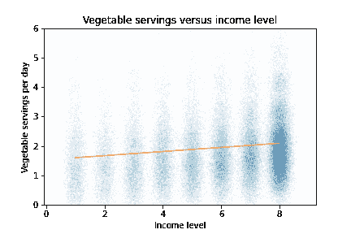
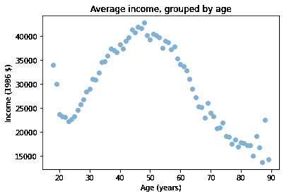
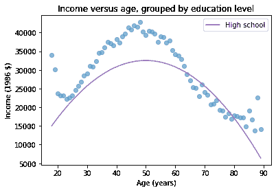
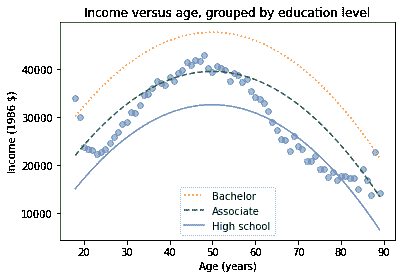
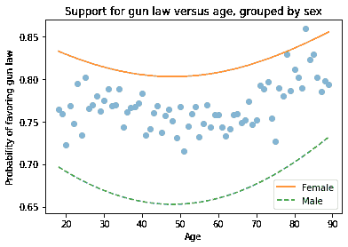

# 第十二章：回归

> 原文：[`allendowney.github.io/ElementsOfDataScience/10_regression.html`](https://allendowney.github.io/ElementsOfDataScience/10_regression.html)
> 
> 译者：[飞龙](https://github.com/wizardforcel)
> 
> 协议：[CC BY-NC-SA 4.0](http://creativecommons.org/licenses/by-nc-sa/4.0/)


[点击这里在 Colab 上运行这个笔记本](https://colab.research.google.com/github/AllenDowney/ElementsOfDataScience/blob/master/10_regression.ipynb) 或 [点击这里下载](https://github.com/AllenDowney/ElementsOfDataScience/raw/master/10_regression.ipynb)。

在上一章中，我们使用简单线性回归来量化两个变量之间的关系。在本章中，我们将更深入地研究回归，包括多元回归和我最喜欢的工具之一，逻辑回归。

这些工具将允许我们探索变量集之间的关系。例如，我们将使用来自普通社会调查（GSS）的数据来探索收入、教育、年龄和性别之间的关系。但首先让我们了解简单回归的限制。

## 简单回归的限制

在以前的练习中，你画了一个关于蔬菜消费与收入的散点图，并绘制了最佳拟合线。这就是它的样子：



线的斜率是 0.07，这意味着最低和最高收入档次之间的差异约为 0.49 份/天。所以这不是一个很大的差异。

但是将蔬菜的收入作为一个任意选择。我们可以把它画成另一种方式，就像这样。


这条线的斜率约为 0.2，这意味着每天 0 到 10 份之间的差异约为 2 个收入水平，大致从 5 级到 7 级。

而收入水平 5 和 7 之间的差异约为每年 30,000 美元，这是相当大的。

因此，如果我们使用蔬菜消费来预测收入，我们会看到一个很大的差异。但是当我们使用收入来预测蔬菜消费时，我们看到了一个小的差异。

这个例子表明，回归不是对称的；A 对 B 的回归与 B 对 A 的回归不同。

我们可以通过并排放置两个图形并在两个图形上绘制两条回归线来更清楚地看到这一点。


它们是不同的，因为它们基于不同的假设。

+   在左边，我们把收入视为已知数量，蔬菜消费为随机。

+   在右边，我们将蔬菜消费视为已知，收入为随机。

当你运行回归模型时，你要做出关于如何处理数据的决定，这些决定会影响你得到的结果。

这个例子展示了另一个观点，即回归并不能告诉你关于因果关系的太多信息。

+   如果你认为收入较低的人买不起蔬菜，你可能会看左边的图表，并得出结论说这并没有太大的差异。

+   如果你认为更好的饮食会增加收入，右边的图表可能会让你认为它确实会。

但总的来说，回归不能告诉你是什么导致了什么。如果你看到两个变量 A 和 B 之间的关系，这种关系的原因可能是 A 导致 B，或者 B 导致 A，或者可能有其他因素导致 A 和 B。单单通过回归不能告诉你它是怎么回事。

然而，我们有工具来量化多个变量之间的关系；其中最重要的之一是多元回归。

## 使用 StatsModels 进行回归

SciPy 不进行多元回归，所以我们将转到一个新的库，StatsModels。这是导入语句。

```py
import statsmodels.formula.api as smf 
```

对于第一个例子，我们将加载来自行为风险因素监测调查（BRFSS）的数据，这是我们在上一章中看到的。

```py
import pandas as pd

brfss = pd.read_hdf('brfss.hdf5', 'brfss') 
```

现在我们可以使用 StatsModels 来拟合一个回归模型。我们将从上一章的示例之一开始，即收入和蔬菜消费之间的关系。我们将检查 StatsModels 的结果是否与 SciPy 的结果相同。然后我们将继续进行多元回归。

我们将使用的函数是`ols`，它代表“普通最小二乘法”，这是回归的另一个名称。

```py
results = smf.ols('INCOME2 ~ _VEGESU1', data=brfss).fit() 
```

第一个参数是一个**公式字符串**，指定我们要将收入回归为蔬菜消费的函数。第二个参数是 BRFSS 的`DataFrame`。公式字符串中的名称对应于`DataFrame`中的列。

`ols`的结果是一个代表模型的对象；它提供了一个名为`fit`的函数，用于进行实际计算。

结果是一个`RegressionResultsWrapper`，其中包含几个属性；我们将首先查看的是`params`，其中包含与`_VEGESU1`相关的估计截距和斜率。

```py
results.params 
```

```py
Intercept    5.450700
_VEGESU1     0.204935
dtype: float64 
```

Statsmodels 的结果与我们从 SciPy 得到的结果相同，这很好！

在这个例子中只有两个变量，所以它仍然是简单回归。在下一节中，我们将继续进行多元回归。但首先，一些练习。

**练习：** 在 BRFSS 数据集中，蔬菜消费与收入之间存在着很强的关系。每天食用 8 份蔬菜的人的收入平均是不吃蔬菜的人的两倍。

我们可以从这些数据中得出以下哪些结论？ 

A. 饮食良好会导致更好的健康和更高的收入。

B. 收入较高的人能够负担更好的饮食。

C. 收入较高的人更有可能是素食主义者。

**练习：** 让我们使用 SciPy 和 StatsModels 来运行回归，并确认我们得到相同的结果。

+   使用 SciPy 的`linregress()`计算`INCOME2`的函数作为`_VEGESU1`的回归。

+   使用 StatsModels 的`smf.ols()`计算`INCOME2`的函数作为`_VEGESU1`的回归。

注意：`linregress`不能处理`NaN`值，因此您将需要使用`dropna`来选择具有有效数据的行。

## 多元回归

现在我们有了 StatsModels，从简单到多元回归变得容易。作为示例，我们将使用来自普通社会调查（GSS）的数据，探索与收入相关的变量。

首先，让我们加载 GSS 数据。

```py
import pandas as pd

gss = pd.read_hdf('gss_eda.hdf', 'gss') 
```

这是`gss`的前几行：

```py
gss.head() 
```

|  | 年份 | ID_ | 年龄 | 教育 | 性别 | 枪支法 | 大麻 | 真实收入 |
| --- | --- | --- | --- | --- | --- | --- | --- | --- |
| 0 | 1972 | 1 | 23.0 | 16.0 | 2 | 1.0 | NaN | 18951.0 |
| 1 | 1972 | 2 | 70.0 | 10.0 | 1 | 1.0 | NaN | 24366.0 |
| 2 | 1972 | 3 | 48.0 | 12.0 | 2 | 1.0 | NaN | 24366.0 |
| 3 | 1972 | 4 | 27.0 | 17.0 | 2 | 1.0 | NaN | 30458.0 |
| 4 | 1972 | 5 | 61.0 | 12.0 | 2 | 1.0 | NaN | 50763.0 |

我们将从另一个简单回归开始，估计真实收入的参数作为教育年限的函数。

```py
results = smf.ols('REALINC ~ EDUC', data=gss).fit()
results.params 
```

```py
Intercept   -13054.459834
EDUC          3464.463066
dtype: float64 
```

在公式字符串的左侧，`REALINC`是我们试图预测的变量；在右侧，`EDUC`是我们用来预测的变量。

估计的斜率约为`3450`，这意味着每多一年的教育与额外的 3450 美元的收入相关联。但收入也取决于年龄，因此也应该将其包括在模型中。这是如何做的：

```py
results = smf.ols('REALINC ~ EDUC + AGE', data=gss).fit()
results.params 
```

```py
Intercept   -16152.855386
EDUC          3514.291894
AGE             54.008253
dtype: float64 
```

在公式字符串的右侧，您可以列出尽可能多的变量，例如教育和年龄。`plus`符号表示我们期望这两个变量的贡献是相加的，这是这种模型的常见假设。

`EDUC`的估计斜率比我们之前看到的要小一点，大约每年 3514 美元。

`AGE`的估计斜率只有大约每年 54 美元，这是令人惊讶的小。

## 按年龄分组

为了了解情况，让我们更仔细地看一下收入和年龄之间的关系。我们将使用一个我们以前没有见过的 Pandas 方法，称为`groupby`，将`DataFrame`分成年龄组。

```py
grouped = gss.groupby('AGE')
type(grouped) 
```

```py
pandas.core.groupby.generic.DataFrameGroupBy 
```

结果是一个`GroupBy`对象，它包含每个年龄值的一个组。在许多方面，`GroupBy`对象的行为类似于`DataFrame`。你可以使用方括号选择一个列，比如这个例子中的`REALINC`，然后调用一个方法，比如`mean`。

```py
mean_income_by_age = grouped['REALINC'].mean() 
```

结果是一个包含每个年龄组平均收入的 Pandas`Series`，我们可以像这样绘制它。

```py
import matplotlib.pyplot as plt

plt.plot(mean_income_by_age, 'o', alpha=0.5)
plt.xlabel('Age (years)')
plt.ylabel('Income (1986 $)')
plt.title('Average income, grouped by age'); 
```



平均收入从 20 岁增加到 50 岁，然后开始下降。

这就解释了为什么估计的斜率如此之小，因为关系是非线性的。记住，相关性和简单回归无法衡量非线性关系。

但多元回归可以！为了描述非线性关系，一个选择是添加一个新变量，它是其他变量的非线性组合。

例如，我们将创建一个名为`AGE2`的新变量，它等于`AGE`的平方。

```py
gss['AGE2'] = gss['AGE']**2 
```

现在我们可以对右侧同时运行`age`和`age2`的回归。

```py
model = smf.ols('REALINC ~ EDUC + AGE + AGE2', data=gss)
results = model.fit()
results.params 
```

```py
Intercept   -49865.446557
EDUC          3293.454914
AGE           1758.622812
AGE2           -17.341566
dtype: float64 
```

在这个模型中，与`AGE`相关的斜率很大，大约每年 1760 美元。

与`AGE2`相关的斜率约为-17 美元，但这更难解释。

在下一节中，我们将看到解释多元模型和可视化结果的方法。但首先，这里有两个练习，你可以练习使用`groupby`和`ols`。

**练习：**为了更仔细地观察收入和教育之间的关系，让我们使用变量`EDUC`对数据进行分组，然后绘制每个组的平均收入。

+   按`EDUC`对`gss`进行分组。

+   从结果的`GroupBy`对象中提取`REALINC`并计算平均值。

+   将每个教育组的平均收入作为散点图绘制。

关于教育和收入之间的关系，你能说些什么？看起来像是线性关系吗？

**练习：**上一个练习中的图表表明收入和教育之间的关系是非线性的。所以让我们尝试拟合一个非线性模型。

+   在`gss`DataFrame 中添加一个名为`EDUC2`的列；它应该包含`EDUC`的平方值。

+   运行一个回归模型，使用`EDUC`、`EDUC2`、`age`和`age2`来预测`REALINC`。

## 可视化回归结果

在上一节中，我们运行了一个多元回归模型来描述收入、年龄和教育之间的关系。因为模型包括二次项，参数很难解释。例如，你可能会注意到`EDUC`的参数是负的，这可能会让人感到惊讶，因为它表明更高的教育与较低的收入相关联。

但`EDUC2`的参数是正的，这会产生很大的差异。在本节中，我们将看到一种通过数据视觉化解释模型并验证模型的方法。

这是上一个练习中的模型。

```py
gss['EDUC2'] = gss['EDUC']**2

model = smf.ols('REALINC ~ EDUC + EDUC2 + AGE + AGE2', data=gss)
results = model.fit()
results.params 
```

```py
Intercept   -26080.884938
EDUC          -522.032930
EDUC2          153.405410
AGE           1711.838648
AGE2           -17.128130
dtype: float64 
```

有时我们可以通过查看模型的参数来理解模型，但通常最好查看其预测。

回归结果提供了一个名为`predict`的方法，它使用模型生成预测。它以一个`DataFrame`作为参数，并返回一个包含`DataFrame`中每一行预测的`Series`。为了使用它，我们将创建一个新的`DataFrame`，其中`AGE`从 18 到 89，而`AGE2`设置为`AGE`的平方。

```py
import numpy as np

df = pd.DataFrame()
df['AGE'] = np.linspace(18, 89)
df['AGE2'] = df['AGE']**2 
```

接下来，我们将选择一个`EDUC`的水平，比如 12 年，这是最常见的值。当你给`DataFrame`的一列分配一个单个值时，Pandas 会为每一行创建一个副本。

```py
df['EDUC'] = 12
df['EDUC2'] = df['EDUC']**2 
```

然后我们可以使用`results`来预测每个年龄组的平均收入，保持教育水平不变。

```py
pred12 = results.predict(df) 
```

`predict`的结果是一个包含每一行预测的`Series`。因此，我们可以将其与年龄作为$x$-轴和每个年龄组的预测收入作为$y$-轴进行绘制。我们可以绘制数据进行比较。

```py
plt.plot(mean_income_by_age, 'o', alpha=0.5)

plt.plot(df['AGE'], pred12, label='High school', color='C4')

plt.xlabel('Age (years)')
plt.ylabel('Income (1986 $)')
plt.title('Income versus age, grouped by education level')
plt.legend(); 
```



点显示了每个年龄组的平均收入。线显示了模型生成的预测，保持教育水平不变。这个图显示了模型的形状，一个朝下的抛物线。

我们可以对其他教育水平进行相同的操作，比如 14 年，这是获得副学士学位的名义时间，以及 16 年，这是获得学士学位的名义时间。

```py
df['EDUC'] = 16
df['EDUC2'] = df['EDUC']**2
pred16 = results.predict(df)

df['EDUC'] = 14
df['EDUC2'] = df['EDUC']**2
pred14 = results.predict(df) 
```

```py
plt.plot(mean_income_by_age, 'o', alpha=0.5)

plt.plot(df['AGE'], pred16, ':', label='Bachelor')
plt.plot(df['AGE'], pred14, '--', label='Associate')
plt.plot(df['AGE'], pred12, label='High school', color='C4')

plt.xlabel('Age (years)')
plt.ylabel('Income (1986 $)')
plt.title('Income versus age, grouped by education level')
plt.legend(); 
```



线显示了平均收入，由模型预测生成，作为年龄的函数，对于三个教育水平。这种可视化有助于验证模型，因为我们可以将预测与数据进行比较。它还有助于我们解释模型，因为我们可以看到年龄和教育的单独贡献。

在练习中，您将有机会运行多元回归，生成预测并可视化结果。

**练习：**到目前为止，我们有一个使用年龄、教育和性别预测收入的模型。

让我们看看它对不同教育水平的预测，保持`AGE`不变。

+   创建一个名为`df`的空`DataFrame`。

+   使用`np.linspace()`，向`df`添加一个名为`EDUC`的变量，其值范围从`0`到`20`。

+   添加一个名为`AGE`的变量，其常量值为`30`。

+   使用`df`生成预测的收入作为教育的函数。

**练习：**现在让我们可视化前面练习的结果！

+   按`EDUC`对 GSS 数据进行分组，并计算每个教育组的平均收入。

+   绘制每个教育组的平均收入的散点图。

+   绘制前面练习的预测。

预测与数据相比如何？

**可选练习：**扩展前面的练习，包括对其他几个年龄水平的预测。

## 分类变量

到目前为止，我们使用的大多数变量，如收入、年龄和教育，都是数值型的。但是像性别和种族这样的变量是**分类**的；也就是说，每个受访者属于一组指定的类别之一。如果只有两个类别，我们会说这个变量是**二元**的。

使用 StatsModels，将分类变量包括在回归模型中很容易。以下是一个例子：

```py
formula = 'REALINC ~ EDUC + EDUC2 + AGE + AGE2 + C(SEX)'
results = smf.ols(formula, data=gss).fit()
results.params 
```

```py
Intercept     -24567.566164
C(SEX)[T.2]    -4626.727813
EDUC            -303.398385
EDUC2            143.954306
AGE             1702.199322
AGE2             -16.995151
dtype: float64 
```

在公式字符串中，字母`C`表示`SEX`是一个分类变量。

回归将`SEX=1`（男性）的值视为默认值，并报告与`SEX=2`（女性）相关联的差异。因此，这个结果表明，控制年龄和教育水平后，女性的收入比男性少约 4156 美元。

## 逻辑回归

在上一节中，我们在回归公式的右侧添加了一个分类变量；也就是说，我们将其用作预测变量。

但是，如果分类变量在回归公式的左侧；也就是说，它是我们试图预测的值，那么我们可以使用**逻辑回归**。

例如，《美国社会总体调查》中的一个问题是“您是否赞成或反对一项法律，该法律要求人们在购买枪支之前必须获得警察许可证？”回答在一个名为`GUNLAW`的列中；以下是这些值。

```py
gss['GUNLAW'].value_counts() 
```

```py
1.0    32038
2.0     9975
Name: GUNLAW, dtype: int64 
```

`1`表示是，`2`表示否，因此大多数受访者赞成。

为了探索这个变量与年龄、性别和教育等因素之间的关系，我们可以使用 StatsModels，它提供了一个进行逻辑回归的函数。

要使用它，我们必须重新编码变量，使`1`表示“是”，`0`表示“否”。我们可以通过用`0`替换`2`来做到这一点。

```py
gss['GUNLAW'].replace([2], [0], inplace=True) 
```

现在我们可以运行回归。我们使用`logit()`而不是`ols()`，它是以 logit 函数命名的，与逻辑回归有关。

```py
formula = 'GUNLAW ~ AGE + AGE2 + EDUC + EDUC2 + C(SEX)'
results = smf.logit(formula, data=gss).fit() 
```

```py
Optimization terminated successfully.
         Current function value: 0.532878
         Iterations 6 
```

对逻辑模型的参数进行估计是一个迭代过程，因此输出包含有关迭代次数的信息。除此之外，一切都与我们之前看到的一样。以下是结果。

```py
results.params 
```

```py
Intercept      1.347289
C(SEX)[T.2]    0.771791
AGE           -0.021314
AGE2           0.000222
EDUC          -0.075406
EDUC2          0.004867
dtype: float64 
```

参数以**对数几率**的形式给出，这可能是您熟悉的，也可能不是。我不会在这里详细解释它们，除了说正值与使结果更有可能的事物相关联，负值使结果更不可能。

例如，与`SEX=2`相关的参数为 0.75，这表明女性更有可能支持这种形式的枪支管制。为了了解更有可能的程度，我们可以生成预测，就像我们用线性回归一样。

举个例子，我们将为不同年龄和性别生成预测，教育水平保持不变。首先我们需要一个包含`AGE`和`EDUC`的`DataFrame`。

```py
df = pd.DataFrame()
df['AGE'] = np.linspace(18, 89)
df['EDUC'] = 12 
```

然后我们可以计算`AGE2`和`EDUC2`。

```py
df['AGE2'] = df['AGE']**2
df['EDUC2'] = df['EDUC']**2 
```

我们可以这样为男性生成预测。

```py
df['SEX'] = 1
pred1 = results.predict(df) 
```

以及为女性生成预测。

```py
df['SEX'] = 2
pred2 = results.predict(df) 
```

现在，为了可视化结果，我们将从绘制数据开始。和以前一样，我们将调查对象分成年龄组，并计算每组的平均值。二元变量的平均值是支持的人的比例。

然后我们可以绘制预测，男性和女性的预测作为年龄的函数。

```py
grouped = gss.groupby('AGE')
favor_by_age = grouped['GUNLAW'].mean()
plt.plot(favor_by_age, 'o', alpha=0.5)

plt.plot(df['AGE'], pred2, label='Female')
plt.plot(df['AGE'], pred1, '--', label='Male')

plt.xlabel('Age')
plt.ylabel('Probability of favoring gun law')
plt.title('Support for gun law versus age, grouped by sex')
plt.legend(); 
```



根据模型，接近 50 岁的人最不可能支持枪支管制（至少是按照这个问题的提法）。女性比男性更有可能支持，差距近 15 个百分点。

逻辑回归是一种探索二元变量和预测因素之间关系的强大工具。在练习中，您将探索预测支持大麻合法化的因素。

**练习：**让我们使用逻辑回归来预测一个二元变量。具体来说，我们将使用年龄、性别和教育水平来预测美国对大麻合法化的支持。

在 GSS 数据集中，变量`GRASS`记录了问题“您认为大麻的使用应该合法化吗？”的答案。

1.  首先，使用`replace`重新编码`GRASS`列，使`1`表示是，`0`表示否。使用`value_counts`进行检查。

1.  接下来，使用`smf.logit()`来使用变量`AGE`、`AGE2`、`EDUC`和`EDUC2`以及`SEX`作为分类变量来预测`GRASS`。显示参数。男性还是女性更有可能支持合法化？

1.  要生成预测，从一个空的 DataFrame 开始。添加一个名为`AGE`的列，其中包含从 18 到 89 的值的序列。添加一个名为`EDUC`的列，并将其设置为 12 年。然后计算一个名为`AGE2`的列，它是`AGE`的平方，以及一个名为`EDUC2`的列，它是`EDUC`的平方。

1.  使用`predict`来为男性（`SEX=1`）和女性（`SEX=2`）生成预测。

1.  生成一个图表，显示（1）每个年龄组对大麻合法化的平均支持水平，（2）模型对男性的预测支持水平作为年龄的函数，以及（3）模型对女性的预测支持水平作为年龄的函数。

## 总结

此时，我想总结一下我们到目前为止所涵盖的主题，并进行一些可能澄清整体情况的联系。

本书的一个核心主题是**探索性数据分析**，这是一种探索数据集、可视化分布和发现变量之间关系的过程和工具集。最后四章展示了这个过程的步骤：

+   第七章是关于导入和清理数据，检查错误和其他特殊情况。这可能不是过程中最令人兴奋的部分，但验证数据所花费的时间可以避免令人尴尬的错误。

+   第八章是关于逐一探索变量，使用 PMF、CDF 和 KDE 可视化分布，并选择适当的摘要统计信息。

+   第九章中，我们探讨了两两变量之间的关系，使用散点图和其他可视化工具，并使用相关性和简单回归来量化这些关系。

+   最后，在这一章中，我们使用多元回归和逻辑回归探索了多变量关系。

在第七章，我们研究了来自国家家庭增长调查的出生体重分布。如果你只记住一件事，记住 99 磅的婴儿，以及如果你不验证数据会对结果产生多大影响。

在第八章，我们研究了来自综合社会调查的年龄、收入和其他变量的分布。我建议使用 CDF 作为探索分布的最佳方式。但当你向不熟悉 CDF 的观众展示时，如果唯一值较少，可以使用 PMF，如果唯一值较多，可以使用 KDE。

在第九章，我们研究了来自 BRFSS 的身高和体重，并开发了几种可视化变量之间关系的方法，包括散点图、小提琴图和箱线图。

我们使用相关系数来量化关系的强度。我们还使用简单回归来估计斜率，这通常是我们更关心的，而不是相关性。

但请记住，这两种方法只能捕捉线性关系；如果关系是非线性的，它们可能会误导。在计算相关性或简单回归之前，始终查看可视化，比如散点图。

在第十章，我们使用多元回归来添加控制变量并描述非线性关系。最后，我们使用逻辑回归来解释和预测二元变量。

我们迅速地涉及了很多材料，但如果你练习并将这些方法应用到其他问题和其他数据集，你会在实践中学到更多。

在下一章中，我们将继续讨论一个新主题，重采样，这是统计推断的一种多功能工具。
