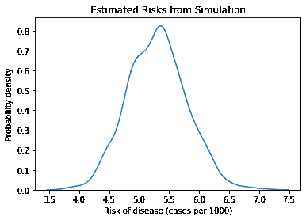
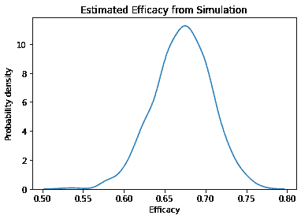
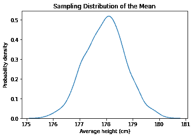

# 第十三章：重采样

> 原文：[`allendowney.github.io/ElementsOfDataScience/11_resampling.html`](https://allendowney.github.io/ElementsOfDataScience/11_resampling.html)
> 
> 译者：[飞龙](https://github.com/wizardforcel)
> 
> 协议：[CC BY-NC-SA 4.0](http://creativecommons.org/licenses/by-nc-sa/4.0/)


[点击此处在 Colab 上运行此笔记本](https://colab.research.google.com/github/AllenDowney/ElementsOfDataScience/blob/master/11_resampling.ipynb) 或 [点击此处下载](https://github.com/AllenDowney/ElementsOfDataScience/raw/master/11_resampling.ipynb)。

本章介绍了**重采样方法**，用于量化估计的精度。例如，我们将使用疫苗试验的结果来估计疫苗的有效性，使用行为风险因素监测系统的数据来估计美国男性的平均身高，以及使用社会普查的数据来查看对枪支管制的支持如何随时间变化。

## 疫苗测试

假设你读到一份关于一种新疫苗的报告，制造商表示它在预防疾病方面的有效性为 67%。你可能会想知道这个数字是从哪里来的，它的含义是什么，以及我们应该对它的准确性有多大的信心。

这样的结果通常来自随机对照试验（RCT），其工作原理如下：

+   你招募了一大群志愿者，并将他们随机分成两组：``治疗组''接种疫苗；``对照组''不接种。

+   然后，你跟踪这两组一段时间，并记录每组被诊断出患有这种疾病的人数。

例如，假设你招募了 43,783 名参与者，并将他们随机分配到大致相同大小的组中。

```py
n_control = 21885
n_treatment = 21911 
```

在观察期间，有 468 人被诊断出患有这种疾病：控制组 352 人，治疗组 116 人。

```py
k_control = 352
k_treatment = 116 
```

我们可以使用这些结果来计算每组患病的风险，每 1000 人的病例数

```py
risk_control = k_control / n_control * 1000
risk_control 
```

```py
16.084075851039522 
```

```py
risk_treatment = k_treatment / n_treatment * 1000
risk_treatment 
```

```py
5.294144493633334 
```

治疗组的风险明显较低 - 每 1000 人约为 5 例，而控制组为 16 例 - 这表明疫苗是有效的。我们可以通过计算相对风险来总结这些结果，相对风险是两种风险的比值（参见[`en.wikipedia.org/wiki/Relative_risk`](https://en.wikipedia.org/wiki/Relative_risk)）：

```py
relative_risk = risk_treatment / risk_control
relative_risk 
```

```py
0.3291544097817203 
```

在这个例子中，相对风险约为 0.33，这意味着治疗组的患病风险是控制组的 33%。同样，我们可以报告相对风险的补集，即**有效性**：

```py
efficacy = 1 - relative_risk
efficacy 
```

```py
0.6708455902182797 
```

在这个例子中，疫苗的有效性为 0.67，这意味着疫苗可以将患病风险降低 67%。这是个好消息，但作为怀疑论的数据科学家，我们不应该假设它是完全准确的。可能出现了很多问题。

例如，如果治疗组的人知道他们已接种疫苗，他们可能会采取更少的预防措施来预防疾病，而控制组的人可能会更加小心。这将影响估计的有效性，这就是为什么很多试验都是“盲目”的，意思是受试者不知道他们属于哪个组。

如果任何一组的人不遵循协议，估计也会不太准确。例如，治疗组中的某人可能没有完成治疗，或者控制组中的某人可能从其他来源接受了治疗。

还有许多其他可能的误差来源，包括诚实的错误和故意的欺诈。

总的来说，很难知道这样的估计是否准确；尽管如此，我们可以做一些事情来评估它们的质量。

当科学期刊中报告估计值时，它们几乎总是包括两种不确定性测量中的一种：标准误差或置信区间。在下一节中，我将解释它们的含义，并展示如何计算它们。

## 模拟一个组

在我们的假设例子中，治疗组有 21,911 人，其中有 116 人患病，因此估计的风险约为每 1000 人 5 例。

```py
n_treatment, k_treatment, risk_treatment 
```

```py
(21911, 116, 5.294144493633334) 
```

但很容易想象，由于偶然性可能会有更多或更少的病例。例如，如果有 10 个病例，估计风险将是每 1000 人中的 5.8，如果有 10 个病例少，估计风险将是每 1000 人中的 4.8。

```py
(k_treatment + 10) / n_treatment * 1000, (k_treatment - 10) / n_treatment * 1000 
```

```py
(5.750536260325863, 4.837752726940806) 
```

这个差异很大，我们应该想知道由于随机变化而导致的估计值有多大的变异性。我们将在三个步骤中回答这个问题：

+   我们将编写一个使用随机数生成器来模拟试验的函数。

+   然后我们将运行这个函数 1000 次，看看估计值的变化程度。

+   然后我们将总结结果。

以下函数接受两个参数：`n`是组中的人数（治疗组或对照组），`p`是任何一个人患病的概率。

```py
import numpy as np

def simulate_group(n, p):
    xs = np.random.random(size=n)
    k = np.sum(xs < p)
    return k / n * 1000 
```

第一行生成一个介于 0 和 1 之间的`n`个随机值的数组。这些值在这个范围内均匀分布，因此每个值小于`p`的概率是... `p`。

第二行计算了值中有多少小于`p`的值，也就是说，在模拟组中有多少人患病。然后函数返回估计风险。

这是我们调用这个函数的方式，将治疗组的大小和估计风险作为参数传递：

```py
p = k_treatment / n_treatment
simulate_group(n_treatment, p) 
```

```py
4.609556843594541 
```

结果是从模拟试验中估计出的风险。如果我们运行这个函数 1000 次，就像一遍又一遍地运行试验。

```py
t = [simulate_group(n_treatment, p)
     for i in range(1000)] 
```

结果是一个估计风险的列表，显示了由于随机性导致试验结果变化的程度。我们可以使用 KDE 图来可视化这些估计值的分布。

```py
import matplotlib.pyplot as plt
import seaborn as sns

sns.kdeplot(t, label='control')

plt.xlabel('Risk of disease (cases per 1000)')
plt.ylabel('Probability density')
plt.title('Estimated Risks from Simulation'); 
```



这个分布的平均值约为 5.3，接近观察到的风险，这是我们应该期望的。

```py
np.mean(t), risk_treatment 
```

```py
(5.299210442243623, 5.294144493633334) 
```

这个分布的宽度表示了由于随机性导致估计值的变化程度。量化分布宽度的一种方法是标准偏差。

```py
standard_error = np.std(t)
standard_error 
```

```py
0.48944411243624414 
```

这个结果被称为**标准误差**（参见[`en.wikipedia.org/wiki/Standard_error`](https://en.wikipedia.org/wiki/Standard_error)）。

另一种量化分布宽度的方法是两个百分位数之间的区间。例如，如果我们计算第 5 和第 95 百分位数，得到的区间包含了 90%的模拟估计值。

```py
confidence_interval = np.percentile(t, [5, 95])
confidence_interval 
```

```py
array([4.47263931, 6.11793163]) 
```

这个结果被称为**置信区间**；具体来说，这个是“90%置信区间”，或者 90% CI（参见[`en.wikipedia.org/wiki/Confidence_interval`](https://en.wikipedia.org/wiki/Confidence_interval)）。如果我们假设观察到的风险是正确的，并且我们多次运行相同的试验，我们期望 90%的估计值落在这个区间内。

标准误差和置信区间量化了由于从一个试验到另一个试验的随机变化而对估计值的不确定性。

## 模拟试验

如果这还不清楚，让我们试另一个例子。在前一节中，我们模拟了一组并估计了他们的风险。现在我们将模拟两组，并估计疫苗的功效。

以下函数接受四个参数：两组的大小和它们的实际风险。

```py
def simulate_trial(n1, p1, n2, p2):
    risk1 = simulate_group(n1, p1)
    risk2 = simulate_group(n2, p2)
    efficacy = 1 - risk2 / risk1
    return efficacy 
```

如果我们调用这个函数一次，它会模拟两个组，计算每组的风险，并使用结果来估计治疗的功效（假设第一组是对照组）。

```py
p1 = k_control / n_control
p2 = k_treatment / n_treatment
simulate_trial(n_control, p1, n_treatment, p2) 
```

```py
0.6891301291299345 
```

如果我们调用它 1000 次，结果将是从 1000 次模拟试验中估计出的功效的列表。

```py
t2 = [simulate_trial(n_control, p1, n_treatment, p2)
      for i in range(1000)] 
```

我们可以使用 KDE 图来可视化这些估计值的分布。

```py
sns.kdeplot(t2)

plt.xlabel('Efficacy')
plt.ylabel('Probability density')
plt.title('Estimated Efficacy from Simulation'); 
```



这个分布的平均值接近我们用实际试验结果计算出的功效。

```py
np.mean(t2), efficacy 
```

```py
(0.6713727268668117, 0.6708455902182797) 
```

这个分布的标准偏差就是估计值的标准误差。

```py
np.std(t2) 
```

```py
0.035068503707114076 
```

在科学论文中，我们可以报告估计的功效和标准误差为 0.67（SE 0.035）。作为另一种选择，我们可以使用百分位数来计算 90%的置信区间。

```py
np.percentile(t2, [5, 95]) 
```

```py
array([0.61344412, 0.72785182]) 
```

在科学论文中，我们可以报告这些结果为 0.67，90%置信区间[0.61, 0.72]”。

标准误差和置信区间代表了几乎相同的信息。一般来说，我更倾向于报告置信区间，因为它更容易解释：

+   正式地，置信区间意味着如果我们再次进行相同的实验，我们期望 90%的结果落在 61%和 72%之间（假设估计的风险是正确的）。

+   更随意地说，这意味着实际的功效可能低至 61%，或高至 72%（假设除了随机变化之外没有其他误差来源）。

## 估计均值

在之前的例子中，我们估计了风险，这是一个比例，以及功效，这是两个比例的比率。作为第三个例子，让我们估计一个均值。

假设我们想要估计美国男性的平均身高。测量全国所有人是不切实际的，但如果我们从人口中随机抽取一个样本并测量样本中的人，我们可以使用测量的平均值来估计人口的平均值。

理想情况下，样本应该是**代表性**的，这意味着人口中的每个人都有相同的机会出现在样本中。一般来说，这并不容易做到。根据你如何招募人员，你的样本可能有太多高个子或太多矮个子。

但假设我们有一个美国成年男性居民的代表性样本，样本的平均身高为 177 厘米，标准差为 8.4 厘米。

如果有人问你对美国男性的平均身高的最佳猜测，你会报告 177 厘米。但你认为这个估计有多准确？如果你只从大约 1 亿成年男性中抽取了 103 人进行测量，似乎实际的人口平均值可能会高得多或低得多。

同样，我们可以使用随机模拟来量化这一估计的不确定性。就像在之前的例子中一样，我们将假定估计值是正确的，并模拟 1000 次抽样过程。

以下函数以样本大小`n`、假定的人口平均身高`mu`和假定的标准差`std`作为参数。

```py
def simulate_sample_mean(n, mu, sigma):
    sample = np.random.normal(mu, sigma, size=n)
    return sample.mean() 
```

这个函数从具有给定均值和标准差的正态分布中生成`n`个随机值，并返回它们的平均值。

我们可以这样运行它，使用样本的观察平均值和标准差作为人口的假定平均值和标准差。

```py
n_height = 103
mean_height = 178
std_height = 7.97

simulate_sample_mean(n_height, mean_height, std_height) 
```

```py
178.64931744931997 
```

如果我们运行 1000 次，它模拟了抽样和测量过程，并返回了 1000 次模拟实验的结果列表。

```py
t3 = [simulate_sample_mean(n_height, mean_height, std_height)
      for i in range(1000)] 
```

我们可以使用 KDE 图来可视化这些值的分布。

```py
sns.kdeplot(t3)

plt.xlabel('Average height (cm)')
plt.ylabel('Probability density')
plt.title('Sampling Distribution of the Mean'); 
```



这个分布被称为**抽样分布**，因为它代表了由于随机抽样过程而产生的结果的变化。如果我们招募了 100 个人并计算他们身高的平均值，由于偶然性，结果可能低至 175 厘米，或高至 179 厘米。

抽样分布的平均值接近于人口的假定平均值。

```py
np.mean(t3), mean_height 
```

```py
(177.96271260304573, 178) 
```

抽样分布的标准差是估计的标准误差。

```py
np.std(t3) 
```

```py
0.7646185415617497 
```

我们可以使用`percentile`来计算 90%的置信区间。

```py
np.percentile(t3, [5, 95]) 
```

```py
array([176.7094124 , 179.22734483]) 
```

如果我在论文中报告这个结果，我会说美国成年男性的估计身高为 177 厘米，90%置信区间[176, 178]厘米。

非正式地，这意味着估计值可能由于随机抽样而偏差约一厘米。但我们应该记住还有其他可能的误差来源，所以我们可能偏离得更多。

置信区间对估计的精度设定了最佳情况的界限；在这个例子中，估计的精度最多为 1 厘米，可能更差。

## 重新采样框架

到目前为止，我们所做的例子都符合这个图表所示的框架：


使用实验数据，我们计算一个样本统计量。在疫苗的例子中，我们计算了每个组的风险和效力。在身高的例子中，我们计算了样本的平均身高。

然后我们建立一个抽样过程的模型。在疫苗的例子中，模型假设每个组中的每个人患病的概率相同，我们使用数据来选择概率。在身高的例子中，模型假设身高是从正态分布中抽取的，并且我们使用数据来选择参数`mu`和`sigma`。

我们使用模型多次模拟实验。每次模拟生成一个数据集，我们用它来计算样本统计量。

最后，我们从模拟中收集样本统计量，绘制抽样分布，并计算标准误差和置信区间。

我强调模型在这个框架中的作用，因为对于给定的实验，可能存在几种可能的模型，每个模型包括一些真实世界的元素，忽略其他元素。

例如，我们对疫苗实验的模型假设是每个组中的每个人患病的风险相同，但这可能并不正确。这是`simulate_group`的另一个版本，它包括每个组内风险的变化。

```py
def simulate_variable_group(n, p):
    ps = np.random.uniform(0, 2*p, size=n)
    xs = np.random.random(size=n)
    k = np.sum(xs < ps)
    return k / n * 1000 
```

这个函数的版本假设每个人患病的概率不同，从`0`到`2*p`的均匀分布中抽取。当然，这只是关于概率在群体中可能分布的猜测，但我们可以用它来了解这种分布对结果的影响。

函数的其余部分与之前的版本相同：它生成`xs`，这是在`0`和`1`之间的随机值数组。然后它比较`xs`和`ps`，计算`p`超过`x`的次数。

这是我们如何调用这个函数，模拟治疗组。

```py
p = k_treatment / n_treatment
simulate_variable_group(n_treatment, p) 
```

```py
5.339783670302587 
```

返回值是每 1000 例中的病例数。

**练习：** 使用这个函数对治疗组进行 1000 次模拟。计算结果的均值，并确认它接近观察到的`risk_treatment`。为了量化抽样分布的扩展，计算标准误差。它与我们在每个组中的每个人患病风险相同的原始模型计算的标准误差相比如何？

**练习：** 以下是`simulate_trial`的一个版本，它使用前面练习中的`simulate_variable_group`来使用修改后的模型模拟疫苗试验，组内风险有所变化。

使用这个函数来模拟 1000 次试验。计算抽样分布的均值，并确认它接近观察到的`efficacy`。计算标准误差，并将其与我们为原始模型计算的标准误差进行比较。

```py
def simulate_variable_trial(n1, p1, n2, p2):
    risk1 = simulate_variable_group(n1, p1)
    risk2 = simulate_variable_group(n2, p2)
    efficacy = 1 - risk2 / risk1
    return efficacy 
```

**练习：** 重新采样框架的一个好处是，可以轻松计算其他统计量的抽样分布。

例如，假设我们想要估计成年男性身高的变异系数（标准差占均值的比例）。下面是我们如何计算它。

```py
cv = std_height / mean_height
cv 
```

```py
0.044775280898876405 
```

在这个例子中，标准差约为均值的 4.5%。以下是`simulate_sample`的一个版本，它生成身高的随机样本并返回变异系数，而不是均值。

```py
def simulate_sample_cv(n, mu, sigma):
    sample = np.random.normal(mu, sigma, size=n)
    return sample.std() / sample.mean() 
```

使用这个函数来模拟大小为`n=103`的 1000 个样本，使用`mean_height`作为`mu`，`std_height`作为`sigma`。绘制变异系数的抽样分布，并计算 90%的置信区间。

## 支持枪支管制

在第十章中，我们使用了来自《社会总体调查》的数据，具体来说是一个名为`GUNLAW`的变量，用来描述对枪支管制法的支持与年龄、性别和教育年限的关系。现在让我们回到那个数据集，看看随着时间的推移，回答发生了什么变化。

以下单元格重新加载数据。

```py
import pandas as pd

gss = pd.read_hdf('gss_eda.hdf', 'gss') 
```

名为`GUNLAW`的列记录了对问题“您是否赞成或反对法律要求一个人在购买枪支之前必须获得警察许可证？”的回答。

响应代码`1`表示是；`2`表示否。如果我们重新编码，使`0`表示否，那么处理这个变量会更容易。

```py
gss['GUNLAW'].replace(2, 0, inplace=True)
gss['GUNLAW'].value_counts() 
```

```py
1.0    32038
0.0     9975
Name: GUNLAW, dtype: int64 
```

对于调查的每一年，我们将计算受访者人数和支持该法律的人数。我们可以使用`groupby`按访谈年份对受访者进行分组，并使用`agg`来计算两个聚合函数，`sum`和`count`。

```py
grouped = gss.groupby('YEAR')['GUNLAW']
agg = grouped.agg(['sum', 'count'])
agg.head() 
```

|  | sum | count |
| --- | --- | --- |
| 年份 |  |  |
| --- | --- | --- |
| 1972 | 1131.0 | 1562 |
| 1973 | 1099.0 | 1470 |
| 1974 | 1112.0 | 1459 |
| 1975 | 1096.0 | 1450 |
| 1976 | 1068.0 | 1472 |

结果是一个`DataFrame`，有两列：`sum`是回答“是”的受访者人数；`count`是被问及该问题的受访者人数。

有些年份没有问这个问题，所以我将使用`drop`来删除这些行。

```py
zero = (agg['count'] == 0)
labels = agg.index[zero]
agg.drop(labels, inplace=True) 
```

现在我们可以绘制每年支持枪支管制的受访者百分比（至少对于这个问题的措辞）。

```py
percent = agg['sum'] / agg['count'] * 100
percent.plot(style='o')

plt.xlabel('Year of survey')
plt.ylabel('Percent in favor')
plt.title('Support for gun control over time'); 
```


结果每年都有所不同。很难说这种变化有多少是由于舆论的真实变化，有多少是由于随机抽样造成的。在接下来的练习中，您将通过计算每个数据点的置信区间来回答这个问题。

**练习：**编写一个循环，遍历`agg`中的行，并为每年计算一个置信区间。您可以使用`itertuples`来遍历行，就像这样：

```py
for year, k, n in agg.itertuples():
    print(year, k, n) 
```

对于每一行，计算一个 90%的置信区间，并将其绘制为垂直线。然后绘制数据点并标记坐标轴。结果应该让您了解我们由于随机抽样而预期在年度间看到的变化有多大。

您可能希望使用`simulate_group`的这个版本，它返回结果的百分比，而不是每 1000 个。

```py
def simulate_group_percent(n, p):
    xs = np.random.random(size=n)
    k = np.sum(xs < p)
    return k / n * 100 
```

## 总结

让我们回顾本章中的例子：

1.  我们从疫苗试验的结果开始。我们估计了疫苗的有效性，并使用模拟从有效性的抽样分布中随机抽取了一个样本。我们使用该样本来计算标准误差和 90%的置信区间，这些度量了我们在再次进行实验时预期的变异性（假设观察到的效力是正确的）。

1.  作为第二个例子，我们估计了美国成年男性的身高，并使用基于正态模型的模拟来计算均值、标准误差和置信区间的抽样分布。

1.  我介绍了重新采样框架，展示了这些例子的共同之处。我们实施了疫苗试验的第二个模型，基于这样一个假设：在治疗组和对照组内存在风险的变化。两个模型的结果相似，这表明简单模型对于实际目的已经足够好了。

1.  与数学分析相比，重新抽样的一个优势是几乎可以计算任何统计量的抽样分布。作为练习，您计算了变异系数的抽样分布。

1.  最后，我们使用了来自综合社会调查的数据，探讨了对枪支管制的支持在不同时间的变化。我们使用重新抽样来计算并绘制了每年调查中支持一项提案法律的受访者百分比的置信区间。

下一章介绍了自举抽样，这是一种特别适合我们一直在处理的调查数据的重新抽样方法。
