# 估计比例

> 原文：[`allendowney.github.io/ThinkBayes2/chap04.html`](https://allendowney.github.io/ThinkBayes2/chap04.html)

在上一章中，我们解决了 101 碗的问题，并且我承认这个问题并不是关于猜测饼干来自哪个碗，而是关于估计比例。

在本章中，我们通过解决欧元问题，迈出了贝叶斯统计的另一步。我们将从相同的先验分布开始，并且我们将看到更新在数学上是相同的。但我会认为这是一个不同的问题，在哲学上是一个不同的问题，并用它来介绍贝叶斯统计的两个定义要素：选择先验分布和使用概率来表示未知。

## 欧元问题

在《信息论、推理和学习算法》一书中，David MacKay 提出了这个问题：

“《卫报》2002 年 1 月 4 日星期五刊登了一条统计声明：

> 当比利时一欧元硬币被抛掷 250 次时，出现了 140 次正面和 110 次反面。伦敦政治经济学院的统计学讲师巴里·布莱特说：“这对我来说看起来非常可疑。如果这枚硬币是公平的，得到这样极端结果的机会将低于 7%。”

“但是[MacKay 问道]这些数据是否证明了硬币是有偏的，而不是公平的？”

为了回答这个问题，我们将分两步进行。首先我们将使用二项分布来看看这 7%是从哪里来的；然后我们将使用贝叶斯定理来估计这个硬币出现正面的概率。

## 二项分布

假设我告诉你一枚硬币是“公平的”，也就是说，正面的概率是 50%。如果你把它抛两次，就会有四种结果：`HH`、`HT`、`TH`和`TT`。所有四种结果的概率都是 25%。

如果我们把所有的头的数量加起来，有三种可能的结果：0、1 或 2。0 和 2 的概率是 25%，1 的概率是 50%。

更一般地，假设正面的概率是\(p\)，我们抛硬币\(n\)次。得到\(k\)个正面的概率由[二项分布](https://en.wikipedia.org/wiki/Binomial_distribution)给出：

\[\binom{n}{k} p^k (1-p)^{n-k}\]

对于从 0 到 n 的任何值的\(k\)，包括两者。术语\(\binom{n}{k}\)是[二项式系数](https://en.wikipedia.org/wiki/Binomial_coefficient)，通常发音为“n choose k”。

我们可以自己评估这个表达式，但我们也可以使用 SciPy 函数`binom.pmf`。例如，如果我们抛一枚硬币`n=2`次，正面的概率是`p=0.5`，那么得到`k=1`个正面的概率是：

```py
from scipy.stats import binom

n = 2
p = 0.5
k = 1

binom.pmf(k, n, p) 
```

```py
0.5 
```

除了提供`k`的单个值之外，我们还可以使用一个值数组来调用`binom.pmf`。

```py
import numpy as np
ks = np.arange(n+1)

ps = binom.pmf(ks, n, p)
ps 
```

```py
array([0.25, 0.5 , 0.25]) 
```

结果是一个 NumPy 数组，其中包含 0、1 或 2 个头的概率。如果我们把这些概率放在`Pmf`中，结果就是给定`n`和`p`的`k`的分布。

它看起来是这样的：

```py
from empiricaldist import Pmf

pmf_k = Pmf(ps, ks)
pmf_k 
```

|  | probs |
| --- | --- |
| 0 | 0.25 |
| 1 | 0.50 |
| 2 | 0.25 |

以下函数计算给定`n`和`p`的二项分布，并返回代表结果的`Pmf`。

```py
def make_binomial(n, p):
  """Make a binomial Pmf."""
    ks = np.arange(n+1)
    ps = binom.pmf(ks, n, p)
    return Pmf(ps, ks) 
```

当`n=250`和`p=0.5`时，它看起来是这样的：

```py
pmf_k = make_binomial(n=250, p=0.5) 
```

<details class="hide above-input"><summary aria-label="Toggle hidden content">显示代码单元格源代码 隐藏代码单元格源代码</summary>

```py
from utils import decorate

pmf_k.plot(label='n=250, p=0.5')

decorate(xlabel='Number of heads (k)',
         ylabel='PMF',
         title='Binomial distribution') 
```</details> 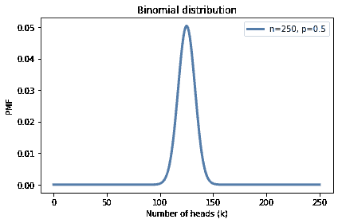

这个分布中最可能的数量是 125：

```py
pmf_k.max_prob() 
```

```py
125 
```

但即使它是最可能的数量，我们得到恰好 125 个头的概率只有大约 5%。

```py
pmf_k[125] 
```

```py
0.05041221314731537 
```

在 MacKay 的例子中，我们得到了 140 个头，这比 125 个头更不可能：

```py
pmf_k[140] 
```

```py
0.008357181724917673 
```

在 MacKay 引用的文章中，统计学家说：“如果硬币是公平的，得到这样极端结果的机会将低于 7%。”

我们可以使用二项分布来检查他的数学。以下函数接受一个 PMF 并计算大于或等于`threshold`的数量的总概率。

```py
def prob_ge(pmf, threshold):
  """Probability of quantities greater than threshold."""
    ge = (pmf.qs >= threshold)
    total = pmf[ge].sum()
    return total 
```

这是得到 140 个或更多正面朝上的概率：

```py
prob_ge(pmf_k, 140) 
```

```py
0.033210575620022706 
```

`Pmf`提供了一个执行相同计算的方法。

```py
pmf_k.prob_ge(140) 
```

```py
0.033210575620022706 
```

结果约为 3.3%，低于引用的 7%。差异的原因是统计学家包括所有“和 140 一样极端”的结果，其中包括小于或等于 110 的结果。

要看出这是从哪里来的，回想一下预期的正面朝上的数量是 125。如果我们得到 140，我们超出了预期 15 个。如果我们得到 110，我们就少了 15 个。

7%是这两个“尾巴”的总和，如下图所示。

<details class="hide above-input"><summary aria-label="Toggle hidden content">显示代码单元格源代码 隐藏代码单元格源代码</summary>

```py
import matplotlib.pyplot as plt

def fill_below(pmf):
    qs = pmf.index
    ps = pmf.values
    plt.fill_between(qs, ps, 0, color='C5', alpha=0.4)

qs = pmf_k.index
fill_below(pmf_k[qs>=140])
fill_below(pmf_k[qs<=110])
pmf_k.plot(label='n=250, p=0.5')

decorate(xlabel='Number of heads (k)',
         ylabel='PMF',
         title='Binomial distribution') 
```</details> 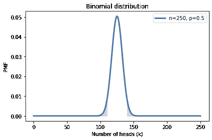

这是我们如何计算左尾的总概率。

```py
pmf_k.prob_le(110) 
```

```py
0.033210575620022706 
```

小于或等于 110 的结果的概率也是 3.3%，因此“和 140 一样极端”的结果的总概率是 6.6%。

这个计算的要点是，如果硬币是公平的，这些极端的结果是不太可能的。

这很有趣，但并没有回答 MacKay 的问题。让我们看看能否。

## 贝叶斯估计

任何给定的硬币在边缘旋转时都有一定的概率正面朝上；我将这个概率称为`x`。认为`x`取决于硬币的物理特征，比如重量的分布，似乎是合理的。如果一个硬币完全平衡，我们期望`x`接近 50%，但对于一个不平衡的硬币，`x`可能会有很大不同。我们可以使用贝叶斯定理和观察到的数据来估计`x`。

为简单起见，我将从一个均匀先验开始，假设`x`的所有值是同等可能的。这可能不是一个合理的假设，所以我们稍后会回来考虑其他的先验。

我们可以这样制作一个均匀先验：

```py
hypos = np.linspace(0, 1, 101)
prior = Pmf(1, hypos) 
```

`hypos`是 0 到 1 之间等间距数值的数组。

我们可以使用假设来计算可能性，就像这样：

```py
likelihood_heads = hypos
likelihood_tails = 1 - hypos 
```

我将正面朝上和反面朝上的可能性放在一个字典中，以便更容易进行更新。

```py
likelihood = {
    'H': likelihood_heads,
    'T': likelihood_tails
} 
```

为了表示数据，我将构建一个字符串，其中`H`重复 140 次，`T`重复 110 次。

```py
dataset = 'H' * 140 + 'T' * 110 
```

以下函数进行更新。

```py
def update_euro(pmf, dataset):
  """Update pmf with a given sequence of H and T."""
    for data in dataset:
        pmf *= likelihood[data]

    pmf.normalize() 
```

第一个参数是代表先验的`Pmf`。第二个参数是一个字符串序列。每次循环时，我们将`pmf`乘以一个结果的可能性，`H`代表正面，`T`代表反面。

请注意，`normalize`在循环外部，因此后验分布只在最后归一化一次。这比在每次旋转后对其进行归一化更有效（尽管后面我们会看到它也可能导致浮点运算问题）。

这是我们如何使用`update_euro`。

```py
posterior = prior.copy()
update_euro(posterior, dataset) 
```

这就是后验的样子。

<details class="hide above-input"><summary aria-label="Toggle hidden content">显示代码单元格内容 隐藏代码单元格内容</summary>

```py
def decorate_euro(title):
    decorate(xlabel='Proportion of heads (x)',
             ylabel='Probability',
             title=title) 
```</details> <details class="hide above-input"><summary aria-label="Toggle hidden content">显示代码单元格源代码 隐藏代码单元格源代码</summary>

```py
posterior.plot(label='140 heads out of 250', color='C4')
decorate_euro(title='Posterior distribution of x') 
```</details> 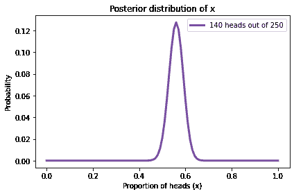

这个图显示了`x`的后验分布，即我们观察到的硬币正面朝上的比例。

后验分布表示我们在看到数据后对`x`的信念。它表明小于 0.4 和大于 0.7 的值是不太可能的；0.5 到 0.6 之间的值是最有可能的。

事实上，`x`的最可能值是 0.56，这是数据集`140/250`中正面朝上的比例。

```py
posterior.max_prob() 
```

```py
0.56 
```

## 三角形先验

到目前为止，我们一直在使用均匀先验：

```py
uniform = Pmf(1, hypos, name='uniform')
uniform.normalize() 
```

但根据我们对硬币的了解，这可能不是一个合理的选择。我可以相信，如果硬币是不对称的，`x`可能会大大偏离 0.5，但比利时欧元硬币如此不平衡，`x`为 0.1 或 0.9 似乎不太可能。

选择一个先验，使`x`的值接近 0.5 的概率更高，而极端值的概率更低可能更合理。

例如，让我们尝试一个三角形状的先验。以下是构造它的代码：

```py
ramp_up = np.arange(50)
ramp_down = np.arange(50, -1, -1)

a = np.append(ramp_up, ramp_down)

triangle = Pmf(a, hypos, name='triangle')
triangle.normalize() 
```

```py
2500 
```

`arange`返回一个 NumPy 数组，所以我们可以使用`np.append`将`ramp_down`附加到`ramp_up`的末尾。然后我们使用`a`和`hypos`来制作一个`Pmf`。

下图显示了结果，以及均匀的先验。

<details class="hide above-input"><summary aria-label="Toggle hidden content">显示代码单元格源代码 隐藏代码单元格源代码</summary>

```py
uniform.plot()
triangle.plot()
decorate_euro(title='Uniform and triangle prior distributions') 
```</details> 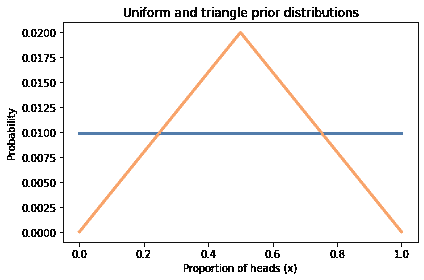

现在我们可以使用相同的数据更新两个先验：

```py
update_euro(uniform, dataset)
update_euro(triangle, dataset) 
```

这是后验分布。

<details class="hide above-input"><summary aria-label="Toggle hidden content">显示代码单元格源代码 隐藏代码单元格源代码</summary>

```py
uniform.plot()
triangle.plot()
decorate_euro(title='Posterior distributions') 
```</details> 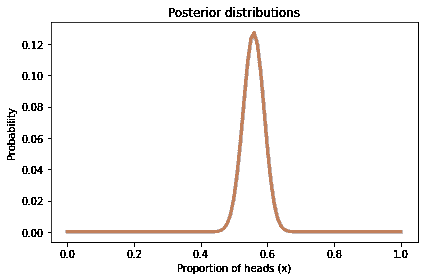

后验分布之间的差异几乎看不见，而且非常小，实际上几乎没有什么影响。

这是个好消息。要知道为什么，想象一下两个人对哪个先验更好，均匀还是三角形，进行激烈争论。他们每个人都有自己偏好的原因，但没有人能说服对方改变主意。

但假设他们同意使用数据来更新他们的信念。当他们比较他们的后验分布时，他们发现几乎没有什么可以争论的了。

这是**淹没先验**的一个例子：有了足够的数据，以不同先验开始的人们倾向于收敛到相同的后验分布。

## 二项式似然函数

到目前为止，我们一次计算一个旋转的更新，因此对于欧元问题，我们必须进行 250 次更新。

一个更有效的替代方法是一次计算整个数据集的似然。对于每个假设的`x`值，我们必须计算在 250 次旋转中出现 140 次正面朝上的概率。

好吧，我们知道如何做了；这是二项分布回答的问题。如果正面朝上的概率是\(p\)，则在\(n\)次旋转中出现\(k\)次正面朝上的概率是：

\[\binom{n}{k} p^k (1-p)^{n-k}\]

我们可以使用 SciPy 来计算它。以下函数接受一个代表先验分布的`Pmf`和一个代表数据的整数元组：

```py
from scipy.stats import binom

def update_binomial(pmf, data):
  """Update pmf using the binomial distribution."""
    k, n = data
    xs = pmf.qs
    likelihood = binom.pmf(k, n, xs)
    pmf *= likelihood
    pmf.normalize() 
```

数据用`k`和`n`的值组成的元组表示，而不是一长串的结果。以下是更新。

```py
uniform2 = Pmf(1, hypos, name='uniform2')
data = 140, 250
update_binomial(uniform2, data) 
```

我们可以使用`allclose`来确认结果与前一节中的结果相同，除了一个小的浮点舍入误差。

```py
np.allclose(uniform, uniform2) 
```

```py
True 
```

但这种计算方式更有效率。

## 贝叶斯统计

你可能已经注意到了欧元问题和<<_101Bowls>>中的 101 碗问题之间的相似之处。先验分布相同，似然性相同，而且使用相同的数据结果也将相同。但有两个不同之处。

首先是选择先验的问题。有 101 个碗，均匀的先验是由问题的陈述隐含的，问题陈述说我们以相等的概率随机选择一个碗。

在欧元问题中，选择先验是主观的；也就是说，合理的人可能会有不同的意见，也许是因为他们对硬币有不同的信息，或者是因为他们以不同的方式解释相同的信息。

由于先验是主观的，后验也是主观的。有些人认为这可能有问题。

另一个区别在于我们正在估计的性质。在 101 碗问题中，我们随机选择碗，因此计算选择每个碗的概率是毫无争议的。在欧元问题中，正面的比例是给定硬币的物理特性。根据概率的某些解释，这是一个问题，因为物理特性不被认为是随机的。

例如，考虑宇宙的年龄。目前，我们最好的估计是 138.0 亿年，但它可能偏差 0.02 亿年（参见[这里](https://en.wikipedia.org/wiki/Age_of_the_universe)）。

现在假设我们想知道宇宙的年龄实际上是否超过 138.1 亿年的概率。根据概率的某些解释，我们将无法回答这个问题。我们将被要求说：“宇宙的年龄不是一个随机数量，因此它没有超过特定值的概率。”

根据概率的贝叶斯解释，将物理量视为随机并计算与其相关的概率是有意义且有用的。

在欧元问题中，先验分布代表我们对硬币的一般信念，后验分布代表我们在看到数据后对特定硬币的信念。因此，我们可以使用后验分布来计算有关硬币及其正面比例的概率。

先验的主观性和后验的解释是使用贝叶斯定理和进行贝叶斯统计之间的关键区别。

贝叶斯定理是概率的数学定律；没有理智的人会反对它。但贝叶斯统计却令人意外地有争议。从历史上看，许多人对其主观性和将概率用于非随机事物感到困扰。

如果你对这段历史感兴趣，我推荐 Sharon Bertsch McGrayne 的书，*[The Theory That Would Not Die](https://yalebooks.yale.edu/book/9780300188226/theory-would-not-die)*。

## 总结

在本章中，我提出了大卫·麦凯的欧元问题，并开始解决它。根据数据，我们计算了`x`的后验分布，即欧元硬币正面朝上的概率。

我们尝试了两种不同的先验，用相同的数据进行了更新，发现后验几乎相同。这是个好消息，因为它表明，如果两个人从不同的信念出发并看到相同的数据，他们的信念往往会趋于一致。

本章介绍了二项分布，我们用它来更有效地计算后验分布。我讨论了应用贝叶斯定理的不同之处，就像在 101 碗问题中一样，以及进行贝叶斯统计，就像在欧元问题中一样。

然而，我们仍然没有回答麦凯的问题：“这些数据是否证明了硬币有偏向性而不是公平的？”我将让这个问题再悬而未决一会儿；我们将在<<_Testing>>中回到这个问题。

在下一章中，我们将解决与计数有关的问题，包括火车、坦克和兔子。

但首先你可能想要解决这些练习。

## 练习

**练习：**在美国职业棒球大联盟中，大多数球员的打击率在 0.200 和 0.330 之间，这意味着他们击中的概率在 0.2 和 0.33 之间。

假设一名首次出场的球员在 3 次尝试中击中 3 次。他们击中的概率的后验分布是什么？

对于这个练习，我将通过从均匀分布开始并使用虚构的数据进行更新，直到它具有反映我对打击率背景知识的形状来构建先验分布。

这是均匀的先验：

<details class="hide above-input"><summary aria-label="Toggle hidden content">显示代码单元格内容 隐藏代码单元格内容</summary>

```py
hypos = np.linspace(0.1, 0.4, 101)
prior = Pmf(1, hypos) 
```</details>

这是一个可能性的字典，`Y`表示得到一个命中，`N`表示没有得到一个命中。

<details class="hide above-input"><summary aria-label="切换隐藏内容">显示代码单元格内容 隐藏代码单元格内容</summary>

```py
likelihood = {
    'Y': hypos,
    'N': 1-hypos
} 
```</details>

这是一个产生合理先验分布的数据集。

<details class="hide above-input"><summary aria-label="切换隐藏内容">显示代码单元格内容 隐藏代码单元格内容</summary>

```py
dataset = 'Y' * 25 + 'N' * 75 
```</details>

这是用虚构数据更新的。

<details class="hide above-input"><summary aria-label="切换隐藏内容">显示代码单元格内容 隐藏代码单元格内容</summary>

```py
for data in dataset:
    prior *= likelihood[data]

prior.normalize() 
```</details>

最后，这就是先验的样子。

<details class="hide above-input"><summary aria-label="切换隐藏内容">显示代码单元格内容 隐藏代码单元格内容</summary>

```py
prior.plot(label='prior')
decorate(xlabel='Probability of getting a hit',
         ylabel='PMF') 
```

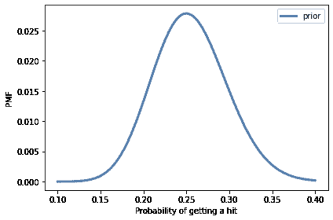</details>

这个分布表明大多数球员的击球率接近 250，只有少数球员的击球率低于 175 或高于 350。我不确定这个先验分布如何准确地反映了大联盟棒球击球率的分布，但对于这个练习来说已经足够了。

现在使用数据更新这个分布并绘制后验分布。后验分布中最可能的数量是什么？

<details class="hide above-input"><summary aria-label="切换隐藏内容">显示代码单元格内容 隐藏代码单元格内容</summary>

```py
# Solution

posterior = prior.copy()

for data in 'YYY':
    posterior *= likelihood[data]

posterior.normalize() 
```

```py
0.017944179687707326 
```</details> <details class="hide above-input"><summary aria-label="切换隐藏内容">显示代码单元格内容 隐藏代码单元格内容</summary>

```py
# Solution

prior.plot(label='prior')
posterior.plot(label='posterior ')
decorate(xlabel='Probability of getting a hit',
         ylabel='PMF') 
```

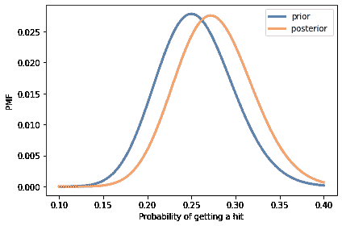</details><details class="hide above-input"><summary aria-label="切换隐藏内容">显示代码单元格内容 隐藏代码单元格内容</summary>

```py
# Solution

prior.max_prob() 
```

```py
0.25 
```</details> <details class="hide above-input"><summary aria-label="切换隐藏内容">显示代码单元格内容 隐藏代码单元格内容</summary>

```py
# Solution

posterior.max_prob() 
```

```py
0.271 
```</details>

**练习：**每当你调查人们对敏感问题的看法时，你都必须处理[社会期望偏差](https://en.wikipedia.org/wiki/Social_desirability_bias)，即人们倾向于调整他们的答案以展现自己最积极的一面。改善结果准确性的一种方法是[随机响应](https://en.wikipedia.org/wiki/Randomized_response)。

举个例子，假设你想知道有多少人在报税时作弊。如果你直接问他们，很可能一些作弊者会撒谎。如果你间接地问他们，就像这样：让每个人抛一枚硬币，而不透露结果，

+   如果他们得到正面，他们会报告 YES。

+   如果他们得到反面，他们会诚实地回答问题“你有没有在报税时作弊？”

如果有人说 YES，我们不知道他们是否真的在报税时作弊；他们可能已经翻了正面。知道这一点，人们可能更愿意诚实地回答。

假设你以这种方式调查了 100 个人，得到了 80 个 YES 和 20 个 NO。根据这些数据，作弊纳税人的比例的后验分布是什么？后验分布中最可能的数量是什么？

<details class="hide above-input"><summary aria-label="切换隐藏内容">显示代码单元格内容 隐藏代码单元格内容</summary>

```py
# Solution

# I'll use a uniform distribution again, although there might
# be background information we could use to choose a more
# specific prior.

hypos = np.linspace(0, 1, 101)
prior = Pmf(1, hypos) 
```</details> <details class="hide above-input"><summary aria-label="切换隐藏内容">显示代码单元格内容 隐藏代码单元格内容</summary>

```py
# Solution

# If the actual fraction of cheaters is `x`, the number of
# YESes is (0.5 + x/2), and the number of NOs is (1-x)/2

likelihood = {
    'Y': 0.5 + hypos/2,
    'N': (1-hypos)/2
} 
```</details> <details class="hide above-input"><summary aria-label="切换隐藏内容">显示代码单元格内容 隐藏代码单元格内容</summary>

```py
# Solution

dataset = 'Y' * 80 + 'N' * 20

posterior = prior.copy()

for data in dataset:
    posterior *= likelihood[data]

posterior.normalize() 
```

```py
3.6945139133967024e-21 
```</details> <details class="hide above-input"><summary aria-label="切换隐藏内容">显示代码单元格内容 隐藏代码单元格内容</summary>

```py
# Solution

posterior.plot(label='80 YES, 20 NO')
decorate(xlabel='Proportion of cheaters',
         ylabel='PMF') 
```

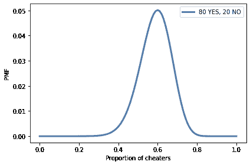</details><details class="hide above-input"><summary aria-label="Toggle hidden content">显示代码单元格内容 隐藏代码单元格内容</summary>

```py
# Solution

posterior.idxmax() 
```

```py
0.6 
```</details>

**练习：** 假设你想测试一枚硬币是否公平，但又不想把它抛几百次。所以你制造了一台自动旋转硬币并使用计算机视觉来确定结果的机器。

然而，你发现这台机器并不总是准确的。具体来说，假设实际上出现正面被报告为反面，或者实际上出现反面被报告为正面的概率是`y=0.2`。

如果我们把一枚硬币抛 250 次，机器报告说有 140 个正面，那么`x`的后验分布是什么？当你改变`y`的值时会发生什么？

<details class="hide above-input"><summary aria-label="Toggle hidden content">显示代码单元格内容 隐藏代码单元格内容</summary>

```py
# Solution

def update_unreliable(pmf, dataset, y):

    likelihood = {
        'H': (1-y) * hypos + y * (1-hypos),
        'T': y * hypos + (1-y) * (1-hypos)
    }
    for data in dataset:
        pmf *= likelihood[data]

    pmf.normalize() 
```</details> <details class="hide above-input"><summary aria-label="Toggle hidden content">显示代码单元格内容 隐藏代码单元格内容</summary>

```py
# Solution

hypos = np.linspace(0, 1, 101)
prior = Pmf(1, hypos)
dataset = 'H' * 140 + 'T' * 110

posterior00 = prior.copy()
update_unreliable(posterior00, dataset, 0.0)

posterior02 = prior.copy()
update_unreliable(posterior02, dataset, 0.2)

posterior04 = prior.copy()
update_unreliable(posterior04, dataset, 0.4) 
```</details> <details class="hide above-input"><summary aria-label="Toggle hidden content">显示代码单元格内容 隐藏代码单元格内容</summary>

```py
# Solution

posterior00.plot(label='y = 0.0')
posterior02.plot(label='y = 0.2')
posterior04.plot(label='y = 0.4')
decorate(xlabel='Proportion of heads',
         ylabel='PMF') 
```

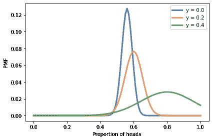</details><details class="hide above-input"><summary aria-label="Toggle hidden content">显示代码单元格内容 隐藏代码单元格内容</summary>

```py
# Solution

posterior00.idxmax(), posterior02.idxmax(), posterior04.idxmax() 
```

```py
(0.56, 0.6, 0.8) 
```</details>

**练习：** 为了应对外星人入侵，地球防御联盟（EDL）一直在研发新型导弹来击落太空入侵者。当然，一些导弹设计比其他的更好；让我们假设每种设计都有一定的概率击中外星飞船，`x`。

根据以前的测试，设计人口中`x`的分布在 0.1 和 0.4 之间大致均匀。

现在假设正在测试新的绝密 Alien Blaster 9000。在一次新闻发布会上，一位 EDL 将军报告说，新设计已经进行了两次测试，在每次测试中进行了两次射击。测试的结果是保密的，所以将军不会说击中了多少目标，但他们报告说：“在两次测试中击中了相同数量的目标，所以我们有理由认为这个新设计是一致的。”

这个数据是好还是坏？也就是说，它增加还是减少了你对 Alien Blaster 9000 的估计？

提示：如果击中每个目标的概率是\(x\)，那么在两次测试中击中一个目标的概率是\(\left[2x(1-x)\right]²\)。

<details class="hide above-input"><summary aria-label="Toggle hidden content">显示代码单元格内容 隐藏代码单元格内容</summary>

```py
# Solution

hypos = np.linspace(0.1, 0.4, 101)
prior = Pmf(1, hypos) 
```</details> <details class="hide above-input"><summary aria-label="Toggle hidden content">显示代码单元格内容 隐藏代码单元格内容</summary>

```py
# Solution

# Here's a specific version for n=2 shots per test

x = hypos
likes = [(1-x)**4, (2*x*(1-x))**2, x**4]
likelihood = np.sum(likes, axis=0) 
```</details> <details class="hide above-input"><summary aria-label="Toggle hidden content">显示代码单元格内容 隐藏代码单元格内容</summary>

```py
# Solution

# Here's a more general version for any n shots per test

from scipy.stats import binom

n = 2
likes2 = [binom.pmf(k, n, x)**2 for k in range(n+1)]
likelihood2 = np.sum(likes2, axis=0) 
```</details> <details class="hide above-input"><summary aria-label="Toggle hidden content">显示代码单元格内容 隐藏代码单元格内容</summary>

```py
# Solution

# Here are the likelihoods, computed both ways

import matplotlib.pyplot as plt

plt.plot(x, likelihood, label='special case')
plt.plot(x, likelihood2, label='general formula')
decorate(xlabel='Probability of hitting the target',
         ylabel='Likelihood',
         title='Likelihood of getting the same result') 
```

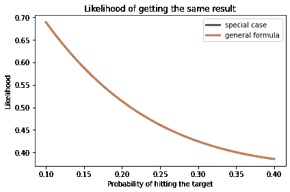</details><details class="hide above-input"><summary aria-label="Toggle hidden content">显示代码单元格内容 隐藏代码单元格内容</summary>

```py
# Solution

posterior = prior * likelihood
posterior.normalize() 
```

```py
49.129627998379995 
```</details> <details class="hide above-input"><summary aria-label="Toggle hidden content">显示代码单元格内容 隐藏代码单元格内容</summary>

```py
# Solution

posterior.plot(label='Two tests, two shots, same outcome',
               color='C4')
decorate(xlabel='Probability of hitting the target',
         ylabel='PMF',
         title='Posterior distribution',
         ylim=[0, 0.015]) 
```

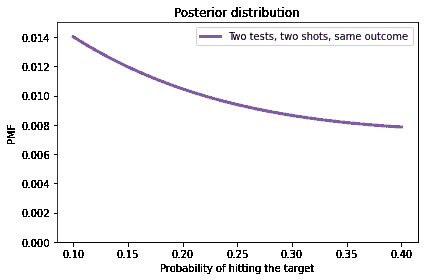</details><details class="hide above-input"><summary aria-label="Toggle hidden content">显示代码单元格内容 隐藏代码单元格内容</summary>

```py
# Solution

# Getting the same result in both tests is more likely for 
# extreme values of `x` and least likely when `x=0.5`.

# In this example, the prior indicates that `x` is less than 0.5,
# and the update gives more weight to extreme values.

# So the dataset makes lower values of `x` more likely. 
```</details>
