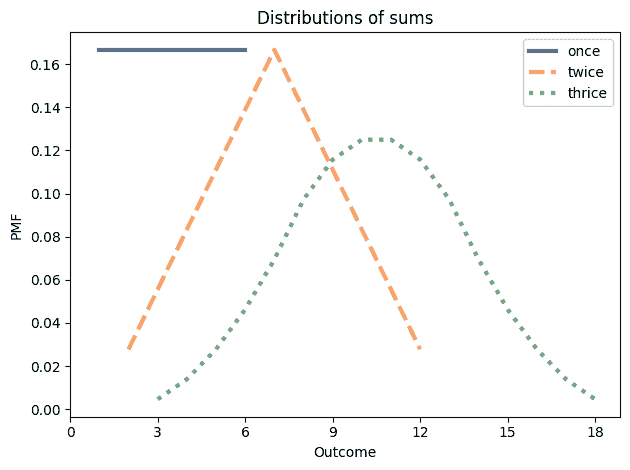
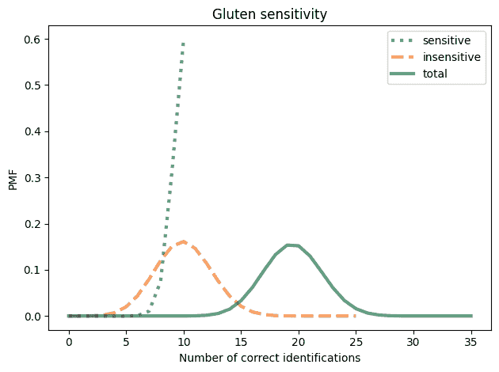
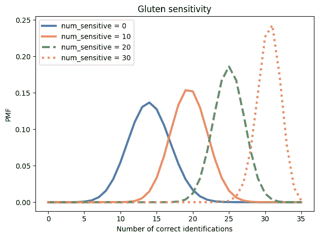
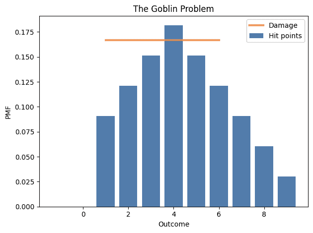
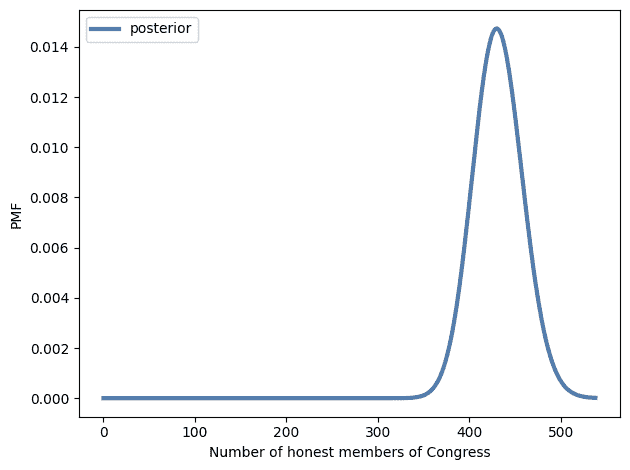

# 第六章：赔率和加数

> 原文：[`allendowney.github.io/ThinkBayes2/chap06.html`](https://allendowney.github.io/ThinkBayes2/chap06.html)
> 
> 译者：[飞龙](https://github.com/wizardforcel)
> 
> 协议：[CC BY-NC-SA 4.0](http://creativecommons.org/licenses/by-nc-sa/4.0/)


本章介绍了表示确定度的一种新方式，**赔率**，以及贝叶斯定理的一种新形式，称为**贝叶斯定理**。如果你想在纸上或脑海中进行贝叶斯更新，贝叶斯定理是方便的。它还阐明了**证据**的重要概念以及我们如何量化证据的强度。

本章的第二部分是关于“加数”，即被加的数量，以及我们如何计算它们的分布。我们将定义计算总和、差异、乘积和其他操作的函数。然后我们将使用这些分布作为贝叶斯更新的一部分。

## 赔率

表示概率的一种方式是用 0 到 1 之间的数字，但这不是唯一的方式。如果你曾经在足球比赛或赛马中下注过，你可能遇到过另一种概率表示，称为**赔率**。

你可能听过“赔率是三比一”之类的表达，但你可能不知道这意味着什么。一个事件的**有利赔率**是它发生的概率与不发生的概率的比值。

以下函数执行这个计算。

```py
def odds(p):
    return p / (1-p) 
```

例如，如果我的团队有 75%的获胜几率，他们有利的赔率是三比一，因为获胜的几率是失败的三倍。

```py
odds(0.75) 
```

```py
3.0 
```

你可以用小数形式写赔率，但通常也会将它们写成整数的比例。所以“三比一”有时会写成$3:1$。

当概率很低时，更常见的是报告**不利的赔率**而不是有利的赔率。例如，如果我的马有 10%的获胜几率，有利的赔率是$1:9$。

```py
odds(0.1) 
```

```py
0.11111111111111112 
```

但在这种情况下，更常见的是说不利的赔率是$9:1$。

```py
odds(0.9) 
```

```py
9.000000000000002 
```

给定有利的赔率，以小数形式，你可以这样转换成概率：

```py
def prob(o):
    return o / (o+1) 
```

例如，如果赔率是$3/2$，相应的概率是$3/5$：

```py
prob(3/2) 
```

```py
0.6 
```

或者，如果你用分子和分母来表示赔率，你可以这样转换成概率：

```py
def prob2(yes, no):
    return yes / (yes + no) 
```

```py
prob2(3, 2) 
```

```py
0.6 
```

概率和赔率是相同信息的不同表示；给定其中一个，你可以计算另一个。但有些计算在我们使用赔率时更容易，正如我们将在下一节中看到的那样，有些计算甚至在使用对数赔率时更容易，我们稍后会看到。

## 贝叶斯定理

到目前为止，我们已经在“概率形式”下使用了贝叶斯定理：

$$P(H|D) = \frac{P(H)~P(D|H)}{P(D)}$$

用$\mathrm{odds}(A)$表示$A$的有利赔率，我们可以用“赔率形式”表达贝叶斯定理：

$$\mathrm{odds}(A|D) = \mathrm{odds}(A)~\frac{P(D|A)}{P(D|B)}$$

这就是贝叶斯定理，它说后验赔率是先验赔率乘以似然比。贝叶斯定理方便在纸上或脑海中进行贝叶斯更新。例如，让我们回到饼干问题：

> 假设有两碗饼干。碗 1 里有 30 块香草饼干和 10 块巧克力饼干。碗 2 里每种饼干都有 20 块。现在假设你随机选择其中一碗饼干，并且不看的情况下随机选择一块饼干。这块饼干是香草味的。那么它来自碗 1 的概率是多少？

先验概率是 50%，所以先验赔率是 1。似然比是$\frac{3}{4} / \frac{1}{2}$，或$3/2$。所以后验赔率是$3/2$，对应的概率是$3/5$。

```py
prior_odds = 1
likelihood_ratio = (3/4) / (1/2)
post_odds = prior_odds * likelihood_ratio
post_odds 
```

```py
1.5 
```

```py
post_prob = prob(post_odds)
post_prob 
```

```py
0.6 
```

如果我们再拿出一块饼干，是巧克力味的，我们可以再进行一次更新：

```py
likelihood_ratio = (1/4) / (1/2)
post_odds *= likelihood_ratio
post_odds 
```

```py
0.75 
```

然后转换回概率。

```py
post_prob = prob(post_odds)
post_prob 
```

```py
0.42857142857142855 
```

## 奥利弗的血

我将使用贝叶斯定理来解决 MacKay 的[*信息论、推理和学习算法*](https://www.inference.org.uk/mackay/itila/)中的另一个问题：

> 两个人在犯罪现场留下了自己的血迹。嫌疑人奥利弗经过测试，发现有‘O’型血。两个血迹的血型分别为‘O’（当地人口中常见类型，频率为 60%）和‘AB’（罕见类型，频率为 1%）。这些数据[在现场发现的痕迹]是否支持奥利弗是[在现场留下血迹的人]的命题？

要回答这个问题，我们需要考虑数据对假设支持（或反对）的含义。直观上，我们可能会说，如果数据在数据的支持下假设在数据的支持下比以前更有可能，那么数据支持假设。

在饼干问题中，先验几率为 1，对应概率为 50%。后验几率为$3/2$，或概率为 60%。因此，香草饼干是支持 Bowl 1 的证据。

贝叶斯定理提供了一种使这种直觉更加精确的方法。再次

$$\mathrm{odds}(A|D) = \mathrm{odds}(A)~\frac{P(D|A)}{P(D|B)}$$

通过$\mathrm{odds}(A)$除以，我们得到：

$$\frac{\mathrm{odds}(A|D)}{\mathrm{odds}(A)} = \frac{P(D|A)}{P(D|B)}$$

左边的项是后验和先验几率的比值。右边的项是可能性比，也称为**贝叶斯因子**。

如果贝叶斯因子大于 1，这意味着数据在$A$下的可能性大于$B$。这意味着在数据的支持下，几率比以前更大。

如果贝叶斯因子小于 1，这意味着数据在$A$下的可能性小于$B$，因此支持$A$的几率下降。

最后，如果贝叶斯因子恰好为 1，则数据在任一假设下的可能性相等，因此几率不会改变。

让我们将这个应用到手头的问题上。如果奥利弗是在犯罪现场留下血液的人之一，他解释了‘O’样本；在这种情况下，数据的概率是人口中随机成员具有‘AB’型血液的概率，即 1%。

如果奥利弗没有在现场留下血液，我们有两个样本要解释。如果我们从人口中随机选择两个人，找到一个人有‘O’型血，一个人有‘AB’型血的机会是多少？嗯，可能有两种方式：

+   第一个人可能有‘O’，第二个人可能有‘AB’，

+   或者第一个人可能有‘AB’，第二个人有‘O’。

任一组合的概率是$(0.6) (0.01)$，即 0.6%，因此总概率是这个的两倍，即 1.2%。因此，如果奥利弗*不是*在现场留下血液的人，数据可能性更大。

我们可以使用这些概率来计算可能性比：

```py
like1 = 0.01
like2 = 2 * 0.6 * 0.01

likelihood_ratio = like1 / like2
likelihood_ratio 
```

```py
0.8333333333333334 
```

由于可能性比小于 1，血液测试是反对奥利弗在现场留下血液的假设的证据。

但这是弱证据。例如，如果先验几率为 1（即 50%的概率），后验几率将为 0.83，对应概率为 45%：

```py
post_odds = 1 * like1 / like2
prob(post_odds) 
```

```py
0.45454545454545453 
```

所以这个证据并没有“改变”太多。

这个例子有点牵强，但它展示了与假设一致的数据不一定有利于假设的反直觉结果。

如果这个结果仍然困扰你，这种思考方式可能会有所帮助：数据包括一个常见事件，类型为‘O’的血液，和一个罕见事件，类型为‘AB’的血液。如果奥利弗解释了常见事件，那就留下了无法解释的罕见事件。如果奥利弗没有解释‘O’血液，我们有两次机会在人口中找到‘AB’血液的人。这个因素是两倍。

**练习：**假设基于其他证据，你对奥利弗的有罪信念是 90%。这一部分的血液证据会如何改变你的信念？如果你最初认为他有罪的可能性只有 10%呢？


```py
# Solution

post_odds = odds(0.9) * like1 / like2
prob(post_odds) 
```

```py
0.8823529411764706 
``` 

```py
# Solution

post_odds = odds(0.1) * like1 / like2
prob(post_odds) 
```

```py
0.0847457627118644 
```

## 加数

本章的后半部分是关于总和的分布和其他操作的结果。我们将从一个正向问题开始，我们已经给出了输入，计算输出的分布。然后我们将解决逆问题，我们已经给出了输出，我们计算输入的分布。

首先，假设你掷两个骰子并把它们加在一起。和的分布是什么？我将使用以下函数来创建一个代表骰子可能结果的`Pmf`：

```py
import numpy as np
from empiricaldist import Pmf

def make_die(sides):
    outcomes = np.arange(1, sides+1)
    die = Pmf(1/sides, outcomes)
    return die 
```

在一个六面骰子上，结果是 1 到 6，都是等可能的。

```py
die = make_die(6) 
```

显示代码单元格源代码 隐藏代码单元格源代码

```py
from utils import decorate

die.bar(alpha=0.4)
decorate(xlabel='Outcome',
         ylabel='PMF') 
``` 

如果我们掷两个骰子并把它们加在一起，就有 11 种可能的结果，从 2 到 12，但它们并不是等可能的。要计算和的分布，我们必须列举可能的结果。

这就是这个函数的工作原理：

```py
def add_dist(pmf1, pmf2):
  """Compute the distribution of a sum."""
    res = Pmf()
    for q1, p1 in pmf1.items():
        for q2, p2 in pmf2.items():
            q = q1 + q2
            p = p1 * p2
            res[q] = res(q) + p
    return res 
```

参数是代表分布的`Pmf`对象。

循环迭代`Pmf`对象中的数量和概率。每次循环中，`q`得到一对数量的和，`p`得到一对的概率。因为同样的和可能会出现不止一次，我们必须把每个和的总概率相加起来。

注意这行的微妙之处：

```py
 res[q] = res(q) + p 
```

我在赋值的右侧使用括号，如果`q`在`res`中还没有出现，它会返回 0。我在赋值的左侧使用方括号来创建或更新`res`中的一个元素；在左侧使用括号是行不通的。

`Pmf`提供了`add_dist`，它也可以做同样的事情。你可以像这样调用它作为一个方法：

```py
twice = die.add_dist(die) 
```

或者作为一个函数，像这样：

```py
twice = Pmf.add_dist(die, die) 
```

这就是结果的样子：


```py
from utils import decorate

def decorate_dice(title=''):
    decorate(xlabel='Outcome',
             ylabel='PMF',
             title=title) 
``` 显示代码单元格源代码 隐藏代码单元格源代码

```py
twice = add_dist(die, die)
twice.bar(color='C1', alpha=0.5)
decorate_dice() 
``` 

如果我们有一系列代表骰子的`Pmf`对象，我们可以这样计算和的分布：

```py
def add_dist_seq(seq):
  """Compute Pmf of the sum of values from seq."""
    total = seq[0]
    for other in seq[1:]:
        total = total.add_dist(other)
    return total 
```

例如，我们可以像这样制作一个三个骰子的列表：

```py
dice = [die] * 3 
```

我们可以这样计算它们的和的分布。

```py
thrice = add_dist_seq(dice) 
```

下图显示了这三个分布的样子：

+   单个骰子的分布是从 1 到 6 的均匀分布。

+   两个骰子的和在 2 到 12 之间有一个三角形分布。

+   三个骰子的和在 3 到 18 之间有一个钟形分布。

显示代码单元格源代码 隐藏代码单元格源代码

```py
import matplotlib.pyplot as plt

die.plot(label='once')
twice.plot(label='twice', ls='--')
thrice.plot(label='thrice', ls=':')

plt.xticks([0,3,6,9,12,15,18])
decorate_dice(title='Distributions of sums') 
``` 

顺便说一句，这个例子证明了中心极限定理，它说的是总和的分布会收敛到一个钟形的正态分布，至少在某些条件下是这样。

## 麸质敏感

2015 年，我读了一篇论文，测试了被诊断为麸质敏感（但不是乳糜热）的人是否能在盲目挑战中区分麸质面粉和非麸质面粉（[你可以在这里阅读这篇论文](https://onlinelibrary.wiley.com/doi/full/10.1111/apt.13372)）。

在 35 名受试者中，有 12 人根据恢复症状而正确识别了麸质面粉。另外 17 人根据他们的症状错误地识别了无麸质面粉，还有 6 人无法区分。

作者得出结论：“双盲麸质挑战只会导致三分之一的患者出现症状复发。”

这个结论对我来说似乎很奇怪，因为如果没有一个患者对麸质过敏，我们会期望其中一些人碰巧识别出麸质面粉。因此，这里的问题是：根据这些数据，有多少受试者对麸质过敏，有多少是猜测的？

我们可以使用贝叶斯定理来回答这个问题，但首先我们必须做一些建模决策。我假设：

+   对于对麸质敏感的人来说，在挑战条件下正确识别麸质面粉的几率为 95％，

+   对于不敏感的人来说，有 40％的几率碰巧识别出麸质面粉（60％的几率要么选择其他面粉，要么无法区分）。

这些特定值是任意的，但结果不会受到这些选择的影响。

我将分两步解决这个问题。首先，假设我们知道有多少受试者对麸质过敏，我将计算数据的分布。然后，使用数据的似然性，我将计算敏感患者数量的后验分布。

第一个是**正向问题**；第二个是**逆问题**。

## 正向问题

假设我们知道 35 名受试者中有 10 名对麸质过敏。这意味着有 25 名不过敏：

```py
n = 35
num_sensitive = 10
num_insensitive = n - num_sensitive 
```

每个敏感的受试者有 95％的几率识别麸质面粉，因此正确识别的数量遵循二项分布。

我将使用我们在<<_TheBinomialDistribution>>中定义的`make_binomial`来制作代表二项分布的`Pmf`。

```py
from utils import make_binomial

dist_sensitive = make_binomial(num_sensitive, 0.95)
dist_insensitive = make_binomial(num_insensitive, 0.40) 
```

结果是每组正确识别数量的分布。

现在我们可以使用`add_dist`来计算总正确识别数量的分布：

```py
dist_total = Pmf.add_dist(dist_sensitive, dist_insensitive) 
```

以下是结果：

显示代码单元格源代码隐藏代码单元格源代码

```py
dist_sensitive.plot(label='sensitive', ls=':')
dist_insensitive.plot(label='insensitive', ls='--')
dist_total.plot(label='total')

decorate(xlabel='Number of correct identifications',
         ylabel='PMF',
         title='Gluten sensitivity') 
``` 

我们期望大多数敏感的受试者能够正确识别麸质面粉。在 25 名不敏感的受试者中，我们预计大约有 10 人会碰巧识别出麸质面粉。因此，我们预计总共有大约 20 个正确的识别。

这是正向问题的答案：鉴于敏感受试者的数量，我们可以计算数据的分布。

## 逆问题

现在让我们解决逆问题：鉴于数据，我们将计算敏感受试者数量的后验分布。

这是如何做的。我将循环遍历`num_sensitive`的可能值，并计算每个值的数据分布：

```py
import pandas as pd

table = pd.DataFrame()
for num_sensitive in range(0, n+1):
    num_insensitive = n - num_sensitive
    dist_sensitive = make_binomial(num_sensitive, 0.95)
    dist_insensitive = make_binomial(num_insensitive, 0.4)
    dist_total = Pmf.add_dist(dist_sensitive, dist_insensitive)    
    table[num_sensitive] = dist_total 
```

循环枚举`num_sensitive`的可能值。对于每个值，它计算总正确识别数量的分布，并将结果存储为 Pandas`DataFrame`中的一列。


```py
table.head(3) 
```

|  | 0 | 1 | 2 | 3 | 4 | 5 | 6 | 7 | 8 | 9 | ... | 26 | 27 | 28 | 29 | 30 | 31 | 32 | 33 | 34 | 35 |
| --- | --- | --- | --- | --- | --- | --- | --- | --- | --- | --- | --- | --- | --- | --- | --- | --- | --- | --- | --- | --- | --- |
| 0 | 1.719071e-08 | 1.432559e-09 | 1.193799e-10 | 9.948326e-12 | 8.290272e-13 | 6.908560e-14 | 5.757133e-15 | 4.797611e-16 | 3.998009e-17 | 3.331674e-18 | ... | 1.501694e-36 | 1.251411e-37 | 1.042843e-38 | 8.690357e-40 | 7.241964e-41 | 6.034970e-42 | 5.029142e-43 | 4.190952e-44 | 3.492460e-45 | 2.910383e-46 |
| 1 | 4.011165e-07 | 5.968996e-08 | 7.162795e-09 | 7.792856e-10 | 8.013930e-11 | 7.944844e-12 | 7.676178e-13 | 7.276377e-14 | 6.796616e-15 | 6.274653e-16 | ... | 7.508469e-34 | 6.486483e-35 | 5.596590e-36 | 4.823148e-37 | 4.152060e-38 | 3.570691e-39 | 3.067777e-40 | 2.633315e-41 | 2.258457e-42 | 1.935405e-43 |
| 2 | 4.545987e-06 | 9.741401e-07 | 1.709122e-07 | 2.506426e-08 | 3.269131e-09 | 3.940182e-10 | 4.490244e-11 | 4.908756e-12 | 5.197412e-13 | 5.365476e-14 | ... | 1.806613e-31 | 1.620070e-32 | 1.449030e-33 | 1.292922e-34 | 1.151034e-35 | 1.022555e-36 | 9.066202e-38 | 8.023344e-39 | 7.088005e-40 | 6.251357e-41 |

3 行×36 列

以下图显示了来自`DataFrame`的选定列，对应于`num_sensitive`的不同假设值：

显示代码单元格源代码 隐藏代码单元格源代码

```py
table[0].plot(label='num_sensitive = 0')
table[10].plot(label='num_sensitive = 10')
table[20].plot(label='num_sensitive = 20', ls='--')
table[30].plot(label='num_sensitive = 30', ls=':')

decorate(xlabel='Number of correct identifications',
         ylabel='PMF',
         title='Gluten sensitivity') 
``` 

现在我们可以使用这个表格来计算数据的似然性：

```py
likelihood1 = table.loc[12] 
```

`loc`从`DataFrame`中选择一行。索引为 12 的行包含了每个`num_sensitive`假设值的 12 个正确识别的概率。这正是我们需要进行贝叶斯更新的似然性。

我将使用均匀先验，这意味着我对`num_sensitive`的任何值都会感到同样惊讶：

```py
hypos = np.arange(n+1)
prior = Pmf(1, hypos) 
```

这是更新：

```py
posterior1 = prior * likelihood1
posterior1.normalize() 
```

显示代码单元格输出 隐藏代码单元格输出

```py
0.4754741648615131 
```

为了比较，我还计算了另一个可能结果的后验，即 20 个正确的识别。

```py
likelihood2 = table.loc[20]
posterior2 = prior * likelihood2
posterior2.normalize() 
```

显示代码单元格输出 隐藏代码单元格输出

```py
1.7818649765887378 
```

以下图显示了基于实际数据（12 个正确识别）和另一个可能结果（20 个正确识别）的`num_sensitive`的后验分布。

显示代码单元格源代码 隐藏代码单元格源代码

```py
posterior1.plot(label='posterior with 12 correct', color='C4')
posterior2.plot(label='posterior with 20 correct', color='C1')

decorate(xlabel='Number of sensitive subjects',
         ylabel='PMF',
         title='Posterior distributions') 
``` 

有 12 个正确的识别时，最可能的结论是没有一个受麸质过敏的受试者。如果有 20 个正确的识别，最可能的结论是 11-12 个受试者对麸质过敏。

```py
posterior1.max_prob() 
```

```py
0 
```

```py
posterior2.max_prob() 
```

```py
11 
```

## 摘要

本章介绍了两个主题，它们几乎没有关联，除了它们使得章节标题引人注目。 

本章的第一部分是关于贝叶斯定理、证据以及我们如何使用似然比或贝叶斯因子来量化证据的强度。

第二部分是关于`add_dist`，它计算总和的分布。我们可以使用这个函数来解决正向和反向问题；也就是说，给定系统的参数，我们可以计算数据的分布，或者，给定数据，我们可以计算参数的分布。

在下一章中，我们将计算最小值和最大值的分布，并使用它们来解决更多的贝叶斯问题。但首先，您可能想要解决这些练习。

## 练习

**练习：** 让我们使用贝叶斯定理来解决<<_Distributions>>中的埃尔维斯问题：

> 埃尔维斯·普雷斯利有一个在出生时去世的孪生兄弟。埃尔维斯是同卵双胞胎的概率是多少？

1935 年，大约 2/3 的双胞胎是异卵的，1/3 是同卵的。问题包含了两个我们可以用来更新先验的信息。

+   首先，埃尔维斯的孪生兄弟也是男性，如果他们是同卵双胞胎，这更有可能，可能性比为 2。

+   此外，埃尔维斯的孪生兄弟在出生时去世，如果他们是同卵双胞胎，这更有可能，可能性比为 1.25。

如果您对这些数字的来源感到好奇，我写了一篇[博客文章](https://www.allendowney.com/blog/2020/01/28/the-elvis-problem-revisited)。


```py
# Solution

prior_odds = odds(1/3) 
``` 

```py
# Solution

post_odds = prior_odds * 2 * 1.25 
``` 

```py
# Solution

prob(post_odds) 
```

```py
0.5555555555555555 
```

**练习：**以下是一个出现在 glassdoor.com 上的[面试问题](https://www.glassdoor.com/Interview/You-re-about-to-get-on-a-plane-to-Seattle-You-want-to-know-if-you-should-bring-an-umbrella-You-call-3-random-friends-of-y-QTN_519262.htm)，据说是 Facebook 提出的：

> 您即将搭乘飞往西雅图的飞机。您想知道是否应该带伞。您给住在那里的 3 个朋友分别打电话，独立询问是否下雨。您的每个朋友都有 2/3 的机会告诉您实话，有 1/3 的机会开玩笑说谎。所有 3 个朋友都告诉您“是的”，现在西雅图是否下雨的概率是多少？

使用贝叶斯定理来解决这个问题。作为先验，您可以假设西雅图下雨的概率约为 10%。

这个问题引起了一些关于贝叶斯和频率主义概率解释之间的差异的混淆；如果您对这一点感到好奇，我写了一篇[博客文章](http://allendowney.blogspot.com/2016/09/bayess-theorem-is-not-optional.html)。


```py
# Solution

prior_odds = odds(0.1) 
``` 

```py
# Solution

post_odds = prior_odds * 2 * 2 * 2 
``` 

```py
# Solution

prob(post_odds) 
```

```py
0.4705882352941177 
```

**练习：**[根据疾病控制和预防中心的数据](https://www.cdc.gov/tobacco/data_statistics/fact_sheets/health_effects/effects_cig_smoking)，吸烟者患肺癌的风险大约是不吸烟者的 25 倍。

[根据疾病控制和预防中心的数据](https://www.cdc.gov/tobacco/data_statistics/fact_sheets/adult_data/cig_smoking/index.htm)，美国大约有 14%的成年人是吸烟者。如果您得知某人患有肺癌，那么他们是吸烟者的概率是多少？


```py
# Solution

prior_odds = odds(0.14) 
``` 

```py
# Solution

post_odds = prior_odds * 25 
``` 

```py
# Solution

prob(post_odds) 
```

```py
0.8027522935779816 
```

**练习：**在《龙与地下城》中，地精可以承受的伤害量是两个六面骰子的总和。你用短剑造成的伤害量是通过掷一个六面骰子来确定的。如果你造成的总伤害大于或等于地精所能承受的伤害量，那么地精就被打败了。

假设您正在与一个地精战斗，并且您已经造成了 3 点伤害。在下一次成功的攻击中，您打败地精的概率是多少？

提示：您可以使用`Pmf.sub_dist`从`Pmf`中减去一个常数，比如 3。


```py
# Solution

d6 = make_die(6) 
``` 

```py
# Solution
# The amount the goblin started with is the sum of two d6
hp_before = Pmf.add_dist(d6, d6) 
``` 

```py
# Solution
# Here's the number of hit points after the first attack
hp_after = Pmf.sub_dist(hp_before, 3)
hp_after 
```

|  | 概率 |
| --- | --- |
| -1 | 0.027778 |
| 0 | 0.055556 |
| 1 | 0.083333 |
| 2 | 0.111111 |
| 3 | 0.138889 |
| 4 | 0.166667 |
| 5 | 0.138889 |
| 6 | 0.111111 |
| 7 | 0.083333 |
| 8 | 0.055556 |

| 9 | 0.027778 | 

```py
# Solution
# But -1 and 0 are not possible, because in that case the goblin would be defeated.
# So we have to zero them out and renormalize
hp_after[[-1, 0]] = 0
hp_after.normalize()
hp_after 
```

|  | 概率 |
| --- | --- |
| -1 | 0.000000 |
| 0 | 0.000000 |
| 1 | 0.090909 |
| 2 | 0.121212 |
| 3 | 0.151515 |
| 4 | 0.181818 |
| 5 | 0.151515 |
| 6 | 0.121212 |
| 7 | 0.090909 |
| 8 | 0.060606 |

| 9 | 0.030303 | 

```py
# Solution
# The damage from the second attack is one d6
damage = d6 
``` 

```py
# Solution
# Here's what the distributions look like
hp_after.bar(label='Hit points')
damage.plot(label='Damage', color='C1')
decorate_dice('The Goblin Problem') 
```



```py
# Solution

# Here's the distribution of points the goblin has left
points_left = Pmf.sub_dist(hp_after, damage) 
``` 

```py
# Solution

# And here's the probability the goblin is dead
points_left.prob_le(0) 
```

```py
0.4545454545454545 
```

**练习：**假设我有一个装有一个 6 面骰子、一个 8 面骰子和一个 12 面骰子的盒子。我随机选择一个骰子，掷两次，将结果相乘，并报告乘积为 12。我选择了 8 面骰子的概率是多少？

提示：`Pmf`提供了一个名为`mul_dist`的函数，该函数接受两个`Pmf`对象并返回一个代表乘积分布的`Pmf`。


```py
# Solution

hypos = [6, 8, 12]
prior = Pmf(1, hypos) 
``` 

```py
# Solution

# Here's the distribution of the product for the 4-sided die

d4 = make_die(4)
Pmf.mul_dist(d4, d4) 
```

|  | 概率 |
| --- | --- |
| 1 | 0.0625 |
| 2 | 0.1250 |
| 3 | 0.1250 |
| 4 | 0.1875 |
| 6 | 0.1250 |
| 8 | 0.1250 |
| 9 | 0.0625 |
| 12 | 0.1250 |

| 16 | 0.0625 | 

```py
# Solution

# Here's the likelihood of getting a 12 for each die
likelihood = []

for sides in hypos:
    die = make_die(sides)
    pmf = Pmf.mul_dist(die, die)
    likelihood.append(pmf[12])

likelihood 
```

```py
[0.1111111111111111, 0.0625, 0.041666666666666664] 
``` 

```py
# Solution

# And here's the update
posterior = prior * likelihood
posterior.normalize()
posterior 
```

|  | 概率 |
| --- | --- |
| 6 | 0.516129 |
| 8 | 0.290323 |

| 12 | 0.193548 |

**练习：**《背叛之屋》是一款策略游戏，其中具有不同属性的角色探索一个闹鬼的房子。根据他们的属性，角色掷出不同数量的骰子。例如，如果尝试依赖知识的任务，Longfellow 教授掷 5 个骰子，Madame Zostra 掷 4 个，Ox Bellows 掷 3 个。每个骰子以相等的概率产生 0、1 或 2。

如果随机选择的字符尝试了三次任务，并且第一次尝试得到了 3，第二次得到了 4，第三次得到了 5，你认为是哪个字符？


```py
# Solution

die = Pmf(1/3, [0,1,2])
die 
```

|  | 概率 |
| --- | --- |
| 0 | 0.333333 |
| 1 | 0.333333 |

| 2 | 0.333333 | 

```py
# Solution

pmfs = {}
pmfs['Bellows'] = add_dist_seq([die]*3)
pmfs['Zostra'] = add_dist_seq([die]*4)
pmfs['Longfellow'] = add_dist_seq([die]*5) 
``` 

```py
# Solution

pmfs'Zostra' 
```

```py
0.2345679012345679 
``` 

```py
# Solution

pmfs'Zostra'.prod() 
```

```py
0.00915247412224499 
``` 

```py
# Solution

hypos = pmfs.keys()
prior = Pmf(1/3, hypos)
prior 
```

|  | 概率 |
| --- | --- |
| 贝洛斯 | 0.333333 |
| 佐斯特拉 | 0.333333 |

| 朗费罗 | 0.333333 | 

```py
# Solution

likelihood = prior.copy()

for hypo in hypos:
    likelihood[hypo] = pmfshypo.prod()

likelihood 
```

|  | 概率 |
| --- | --- |
| 贝洛斯 | 0.006401 |
| 佐斯特拉 | 0.009152 |

| 朗费罗 | 0.004798 | 

```py
# Solution

posterior = (prior * likelihood)
posterior.normalize()
posterior 
```

|  | 概率 |
| --- | --- |
| 贝洛斯 | 0.314534 |
| 佐斯特拉 | 0.449704 |

| 朗费罗 | 0.235762 |

**练习：** 美国国会有 538 名成员。假设我们审计他们的投资组合，并发现其中有 312 人的表现超过了市场。让我们假设一个诚实的国会成员只有 50%的机会超过市场，但一个利用内部信息交易的不诚实成员有 90%的机会。国会有多少名成员是诚实的？


```py
# Solution

n = 538

ns = range(0, n+1)
table = pd.DataFrame(index=ns, columns=ns, dtype=float)

for n_honest in ns:
    n_dishonest = n - n_honest

    dist_honest = make_binomial(n_honest, 0.5)
    dist_dishonest = make_binomial(n_dishonest, 0.9)
    dist_total = Pmf.add_dist(dist_honest, dist_dishonest)    
    table[n_honest] = dist_total

table.shape 
```

```py
(539, 539) 
``` 

```py
# Solution

data = 312
likelihood = table.loc[312]
len(likelihood) 
```

```py
539 
``` 

```py
# Solution

hypos = np.arange(n+1)
prior = Pmf(1, hypos)
len(prior) 
```

```py
539 
``` 

```py
# Solution

posterior = prior * likelihood
posterior.normalize()
posterior.mean() 
```

```py
431.4882114501996 
``` 

```py
# Solution

posterior.plot(label='posterior')
decorate(xlabel='Number of honest members of Congress',
         ylabel='PMF') 
```



```py
# Solution

posterior.max_prob() 
```

```py
430 
``` 

```py
# Solution

posterior.credible_interval(0.9) 
```

```py
array([388., 477.]) 
```
