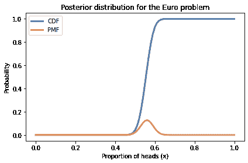
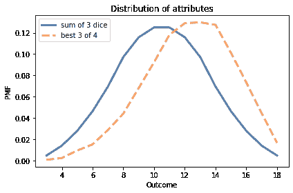
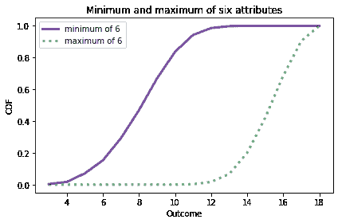
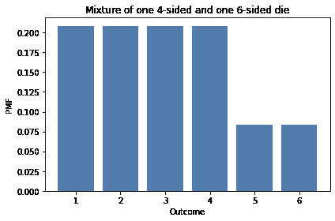
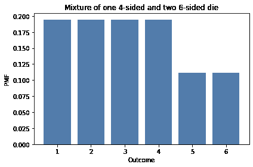
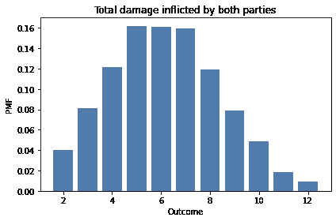
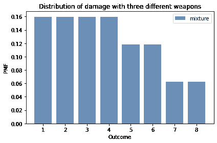
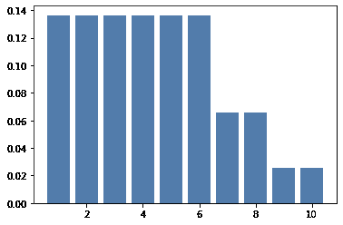
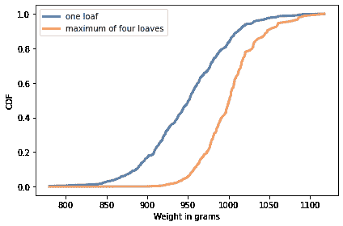

# 最小值、最大值和混合

> 原文：[`allendowney.github.io/ThinkBayes2/chap07.html`](https://allendowney.github.io/ThinkBayes2/chap07.html)

<详细信息类="隐藏在输入上方"><总结 aria-label="切换隐藏内容">显示代码单元格内容隐藏代码单元格内容</总结>

```py
# Get utils.py

from os.path import basename, exists

def download(url):
    filename = basename(url)
    if not exists(filename):
        from urllib.request import urlretrieve
        local, _ = urlretrieve(url, filename)
        print('Downloaded ' + local)

download('https://github.com/AllenDowney/ThinkBayes2/raw/master/soln/utils.py') 
```</详细信息>

在上一章中，我们计算了总和的分布。在本章中，我们将计算最小值和最大值的分布，并使用它们来解决正向和反向问题。

然后我们将研究其他分布，这些分布是其他分布的混合，这将被证明对于进行预测特别有用。

但是我们将从一个强大的用于处理分布的工具开始，即累积分布函数。

## 累积分布函数

到目前为止，我们一直在使用概率质量函数来表示分布。一个有用的替代方案是**累积分布函数**，或者 CDF。

举个例子，我将使用从 Euro 问题中计算的后验分布，我们在<<_BayesianEstimation>>中计算过。

这是我们开始的均匀先验。

```py
import numpy as np
from empiricaldist import Pmf

hypos = np.linspace(0, 1, 101)
pmf = Pmf(1, hypos)
data = 140, 250 
```

这是更新。

```py
from scipy.stats import binom

def update_binomial(pmf, data):
  """Update pmf using the binomial distribution."""
    k, n = data
    xs = pmf.qs
    likelihood = binom.pmf(k, n, xs)
    pmf *= likelihood
    pmf.normalize() 
```

```py
update_binomial(pmf, data) 
```

CDF 是 PMF 的累积和，因此我们可以这样计算它：

```py
cumulative = pmf.cumsum() 
```

这是它的样子，以及 PMF。

<详细信息类="隐藏在输入上方"><总结 aria-label="切换隐藏内容">显示代码单元格内容隐藏代码单元格内容</总结>

```py
from utils import decorate

def decorate_euro(title):
    decorate(xlabel='Proportion of heads (x)',
             ylabel='Probability',
             title=title) 
```</详细信息> <详细信息类="隐藏在输入上方"><总结 aria-label="切换隐藏内容">显示代码单元格源隐藏代码单元格源</总结>

```py
cumulative.plot(label='CDF')
pmf.plot(label='PMF')
decorate_euro(title='Posterior distribution for the Euro problem') 
```</详细信息> 

CDF 的范围总是从 0 到 1，与 PMF 相反，PMF 的最大值可以是任何概率。

`cumsum`的结果是一个 Pandas`Series`，因此我们可以使用括号运算符来选择一个元素：

```py
cumulative[0.61] 
```

```py
0.9638303193984255 
```

结果约为 0.96，这意味着所有小于或等于 0.61 的数量的总概率为 96%。

另一种方法是，查找概率并获得相应的分位数，我们可以使用插值：

```py
from scipy.interpolate import interp1d

ps = cumulative.values
qs = cumulative.index

interp = interp1d(ps, qs)
interp(0.96) 
```

```py
array(0.60890171) 
```

结果约为 0.61，这证实了该分布的第 96 百分位数为 0.61。

`empiricaldist`提供了一个称为`Cdf`的类，表示累积分布函数。给定一个`Pmf`，可以这样计算`Cdf`：

```py
cdf = pmf.make_cdf() 
```

`make_cdf`使用`np.cumsum`来计算概率的累积和。

您可以使用括号从`Cdf`中选择一个元素：

```py
cdf[0.61] 
```

```py
0.9638303193984255 
```

但是，如果查找的数量不在分布中，就会得到一个`KeyError`。

<详细信息类="隐藏在输入上方"><总结 aria-label="切换隐藏内容">显示代码单元格内容隐藏代码单元格内容</总结>

```py
try:
    cdf[0.615]
except KeyError as e:
    print(repr(e)) 
```

```py
KeyError(0.615) 
```</详细信息>

为了避免这个问题，您可以将`Cdf`作为函数调用，使用括号。如果参数不在`Cdf`中，它会在数量之间进行插值。

```py
cdf(0.615) 
```

```py
array(0.96383032) 
```

另一方面，您可以使用`quantile`来查找累积概率并获得相应的数量：

```py
cdf.quantile(0.9638303) 
```

```py
array(0.61) 
```

`Cdf`还提供了`credible_interval`，用于计算包含给定概率的可信区间：

```py
cdf.credible_interval(0.9) 
```

```py
array([0.51, 0.61]) 
```

CDF 和 PMF 在含义上是等价的，因为它们包含有关分布的相同信息，您可以随时从一个转换到另一个。给定一个`Cdf`，可以这样获得等效的`Pmf`：

```py
pmf = cdf.make_pmf() 
```

`make_pmf`使用`np.diff`来计算连续累积概率之间的差异。

`Cdf`对象有用的一个原因是它们可以有效地计算分位数。另一个原因是它们可以轻松地计算最大值或最小值的分布，我们将在下一节中看到。

## 最好的四个中的三个

在*龙与地下城*中，每个角色都有六个属性：力量、智力、智慧、灵巧、体质和魅力。

为了生成一个新角色，玩家为每个属性掷四个 6 面骰子并加上最好的三个。例如，如果我为力量掷骰子得到 1、2、3、4，我的角色的力量将是 2、3 和 4 的总和，即 9。

作为练习，让我们找出这些属性的分布。然后，对于每个角色，我们将找出他们最好属性的分布。

我将从上一章导入两个函数：`make_die`，它制作一个代表掷骰子结果的`Pmf`，和`add_dist_seq`，它接受一个`Pmf`对象的序列并计算它们的总和的分布。

这是一个代表六面骰子和一个包含三个对它的引用的序列的`Pmf`。

```py
from utils import make_die

die = make_die(6)
dice = [die] * 3 
```

这是三个骰子的总和的分布。

```py
from utils import add_dist_seq

pmf_3d6 = add_dist_seq(dice) 
```

这是它的样子：

<details class="hide above-input"><summary aria-label="Toggle hidden content">显示代码单元内容 隐藏代码单元内容</summary>

```py
def decorate_dice(title=''):
    decorate(xlabel='Outcome',
             ylabel='PMF',
             title=title) 
```</details> <details class="hide above-input"><summary aria-label="Toggle hidden content">显示代码单元源代码 隐藏代码单元源代码</summary>

```py
pmf_3d6.plot()
decorate_dice('Distribution of attributes') 
```</details> 

如果我们掷四个骰子并加上最好的三个，计算总和的分布会更加复杂。我将通过模拟 10000 次掷骰子来估计分布。

首先，我将创建一个从 1 到 6 的随机值数组，有 10000 行和 4 列：

```py
n = 10000
a = np.random.randint(1, 7, size=(n, 4)) 
```

为了找到每行中最好的三个结果，我将使用`sort`和`axis=1`，这将按升序对行进行排序。

```py
a.sort(axis=1) 
```

最后，我将选择最后三列并将它们相加。

```py
t = a[:, 1:].sum(axis=1) 
```

现在`t`是一个有一列和 10000 行的数组。我们可以这样计算`t`中值的 PMF：

```py
pmf_best3 = Pmf.from_seq(t) 
```

下图显示了三个骰子的总和的分布`pmf_3d6`和四个中最好的三个的分布`pmf_best3`。

<details class="hide above-input"><summary aria-label="Toggle hidden content">显示代码单元源代码 隐藏代码单元源代码</summary>

```py
pmf_3d6.plot(label='sum of 3 dice')
pmf_best3.plot(label='best 3 of 4', ls='--')

decorate_dice('Distribution of attributes') 
```</details> 

正如你所期望的那样，从四个中选择最好的三个往往会产生更高的值。

接下来我们将找到六个属性的分布，每个属性是四个骰子中最好的三个的总和。

## 最大值

要计算最大值或最小值的分布，我们可以充分利用累积分布函数。首先，我将计算四个中最好的三个的`Cdf`：

```py
cdf_best3 = pmf_best3.make_cdf() 
```

回想一下，`Cdf(x)`是小于或等于`x`的数量的概率之和。等价地，它是从分布中选择的随机值小于或等于`x`的概率。

现在假设我从这个分布中抽取 6 个值。所有 6 个值都小于或等于`x`的概率是`Cdf(x)`的 6 次方，我们可以这样计算：

```py
cdf_best3**6 
```

<details class="hide below-input"><summary aria-label="Toggle hidden content">显示代码单元输出 隐藏代码单元输出</summary>

```py
3     4.665600e-20
4     5.948233e-16
5     3.297304e-12
6     4.139767e-10
7     3.084098e-08
8     1.000000e-06
9     2.248307e-05
10    3.110606e-04
11    2.935667e-03
12    1.706486e-02
13    6.693521e-02
14    1.998047e-01
15    4.212166e-01
16    6.859162e-01
17    9.049950e-01
18    1.000000e+00
dtype: float64 
```</details>

如果所有 6 个值都小于或等于`x`，那意味着它们的最大值小于或等于`x`。因此结果是它们的最大值的 CDF。我们可以这样将其转换为`Cdf`对象：

```py
from empiricaldist import Cdf

cdf_max6 = Cdf(cdf_best3**6) 
```

并且可以这样计算等效的`Pmf`：

<details class="hide above-input"><summary aria-label="Toggle hidden content">显示代码单元内容 隐藏代码单元内容</summary>

```py
pmf_max6 = cdf_max6.make_pmf() 
```</details>

下图显示了结果。

<details class="hide above-input"><summary aria-label="Toggle hidden content">显示代码单元内容 隐藏代码单元内容</summary>

```py
pmf_max6.plot(label='max of 6 attributes')

decorate_dice('Distribution of attributes') 
```

</details>

大多数角色至少有一个属性大于 12；将近 10%的角色属性为 18。

下图显示了我们计算的三个分布的 CDF。

<details class="hide above-input"><summary aria-label="Toggle hidden content">显示代码单元格源代码隐藏代码单元格源代码</summary>

```py
import matplotlib.pyplot as plt

cdf_3d6 = pmf_3d6.make_cdf()
cdf_3d6.plot(label='sum of 3 dice')

cdf_best3 = pmf_best3.make_cdf()
cdf_best3.plot(label='best 3 of 4 dice', ls='--')

cdf_max6.plot(label='max of 6 attributes', ls=':')

decorate_dice('Distribution of attributes')
plt.ylabel('CDF'); 
```</details> 

`Cdf`提供了`max_dist`，它执行相同的计算，所以我们也可以这样计算最大值的`Cdf`：

```py
cdf_max_dist6 = cdf_best3.max_dist(6) 
```

在下一节中，我们将找到最小值的分布。这个过程类似，但稍微复杂一些。在继续之前，看看您是否能弄清楚。

## 最小值

在上一节中，我们计算了角色最佳属性的分布。现在让我们计算最差属性的分布。

计算最小值的分布时，我们将使用**补充 CDF**，我们可以这样计算：

```py
prob_gt = 1 - cdf_best3 
```

如变量名所示，补充 CDF 是分布中的值大于`x`的概率。如果我们从分布中抽取 6 个值，那么 6 个值都大于`x`的概率是：

```py
prob_gt6 = prob_gt**6 
```

如果 6 个值都大于`x`，那么它们的最小值就大于`x`，所以`prob_gt6`是最小值的补充 CDF。这意味着我们可以这样计算最小值的 CDF：

```py
prob_le6 = 1 - prob_gt6 
```

结果是一个代表六个属性的最小值的 CDF 的 Pandas`Series`。我们可以这样将这些值放入`Cdf`对象中：

```py
cdf_min6 = Cdf(prob_le6) 
```

这是它的样子，以及最大值的分布。

<details class="hide above-input"><summary aria-label="Toggle hidden content">显示代码单元格源代码隐藏代码单元格源代码</summary>

```py
cdf_min6.plot(color='C4', label='minimum of 6')
cdf_max6.plot(color='C2', label='maximum of 6', ls=':')
decorate_dice('Minimum and maximum of six attributes')
plt.ylabel('CDF'); 
```</details> 

`Cdf`提供了`min_dist`，它执行相同的计算，所以我们也可以这样计算最小值的`Cdf`：

```py
cdf_min_dist6 = cdf_best3.min_dist(6) 
```

我们可以确认差异很小。

```py
np.allclose(cdf_min_dist6, cdf_min6) 
```

```py
True 
```

在本章末尾的练习中，您将使用最小值和最大值的分布进行贝叶斯推断。但首先，我们将看看当我们混合分布时会发生什么。

## 混合

在本节中，我将展示如何计算其他分布的混合分布。我将用一些简单的例子解释这意味着什么；然后，更有用的是，我们将看到这些混合是如何用于预测的。

这是受*龙与地下城*启发的另一个例子：

+   假设您的角色一手拿着匕首，一手拿着短剑。

+   在每一轮中，您随机选择两种武器之一攻击怪物。

+   匕首造成一次 4 面骰的伤害；短剑造成一次 6 面骰的伤害。

在每一轮中，您造成的伤害分布是什么？

为了回答这个问题，我将制作一个`Pmf`来表示 4 面和 6 面骰：

```py
d4 = make_die(4)
d6 = make_die(6) 
```

现在，让我们计算您造成 1 点伤害的概率。

+   如果您用匕首攻击，那么概率是 1/4。

+   如果您用短剑攻击，那么概率是 1/6。

因为选择任何一种武器的概率是 1/2，所以总概率是平均值：

```py
prob_1 = (d4(1) + d6(1)) / 2
prob_1 
```

```py
0.20833333333333331 
```

对于结果 2、3 和 4，概率是相同的，但对于 5 和 6，概率是不同的，因为这些结果在 4 面骰中是不可能的。

```py
prob_6 = (d4(6) + d6(6)) / 2
prob_6 
```

```py
0.08333333333333333 
```

要计算混合的分布，我们可以循环遍历可能的结果并计算它们的概率。

但我们可以使用`+`运算符进行相同的计算：

```py
mix1 = (d4 + d6) / 2 
```

这是这些分布的混合的样子。

<details class="hide above-input"><summary aria-label="Toggle hidden content">显示代码单元格源代码隐藏代码单元格源代码</summary>

```py
mix1.bar(alpha=0.7)
decorate_dice('Mixture of one 4-sided and one 6-sided die') 
```</details> 

现在假设您正在与三只怪物战斗：

+   一种是狼牙棒，造成一次 4 面骰的伤害。

+   一种是狼牙棒，造成一次 6 面骰的伤害。

+   还有一种是长棍，也造成一次 6 面骰的伤害。

因为近战是无序的，每轮你都会被这些怪物中的一个攻击，随机选择。为了找到他们造成的伤害分布，我们可以计算分布的加权平均值，就像这样：

```py
mix2 = (d4 + 2*d6) / 3 
```

这个分布是一个 4 面的骰子和两个 6 面的骰子的混合物。这就是它的样子。

<details class="hide above-input"><summary aria-label="Toggle hidden content">显示代码单元格源代码隐藏代码单元格源代码</summary>

```py
mix2.bar(alpha=0.7)
decorate_dice('Mixture of one 4-sided and two 6-sided die') 
```</details> 

在本节中，我们使用了`+`运算符，它将分布中的概率相加，不要与`Pmf.add_dist`混淆，后者计算分布的总和的分布。

为了展示区别，我将使用`Pmf.add_dist`来计算每轮造成的总伤害分布，这是两个混合物的总和：

```py
total_damage = Pmf.add_dist(mix1, mix2) 
```

这就是它的样子。

```py
total_damage.bar(alpha=0.7)
decorate_dice('Total damage inflicted by both parties') 
```



## 一般混合物

在前一节中，我们以一种*特设*的方式计算了混合物。现在我们将看到一个更一般的解决方案。在以后的章节中，我们将使用这个解决方案来为现实世界的问题生成预测，而不仅仅是角色扮演游戏。但是如果你能忍耐一下，我们将在下一节继续上一个例子。

假设又有三个怪物加入战斗，每个怪物都有一把造成 8 面骰子伤害的战斧。仍然，每轮只有一个怪物随机攻击，所以他们造成的伤害是一个混合物：

+   一个 4 面的骰子，

+   两个 6 面的骰子，和

+   三个 8 面的骰子。

我将使用`Pmf`来表示一个随机选择的怪物：

```py
hypos = [4,6,8]
counts = [1,2,3]
pmf_dice = Pmf(counts, hypos)
pmf_dice.normalize()
pmf_dice 
```

|  | probs |
| --- | --- |
| 4 | 0.166667 |
| 6 | 0.333333 |
| 8 | 0.500000 |

这个分布代表了我们将掷骰子的面数以及掷每个面的概率。例如，六个怪物中的一个有一把匕首，所以我们掷一个 4 面的骰子的概率是\(1/6\)。

接下来我将制作一个`Pmf`对象序列来表示骰子：

```py
dice = [make_die(sides) for sides in hypos] 
```

为了计算混合物的分布，我将使用`pmf_dice`中的概率计算骰子的加权平均值。

为了简洁地表达这个计算，将分布放入 Pandas 的`DataFrame`中是很方便的：

```py
import pandas as pd

pd.DataFrame(dice) 
```

|  | 1 | 2 | 3 | 4 | 5 | 6 | 7 | 8 |
| --- | --- | --- | --- | --- | --- | --- | --- | --- |
| 0 | 0.250000 | 0.250000 | 0.250000 | 0.250000 | NaN | NaN | NaN | NaN |
| 1 | 0.166667 | 0.166667 | 0.166667 | 0.166667 | 0.166667 | 0.166667 | NaN | NaN |
| 2 | 0.125000 | 0.125000 | 0.125000 | 0.125000 | 0.125000 | 0.125000 | 0.125 | 0.125 |

结果是一个`DataFrame`，每个分布一行，每个可能的结果一列。不是所有的行都是相同的长度，所以 Pandas 用特殊值`NaN`填充额外的空格，`NaN`代表“不是一个数字”。我们可以使用`fillna`将`NaN`值替换为 0。

下一步是将每一行乘以`pmf_dice`中的概率，如果我们将矩阵转置，使分布沿列而不是行进行，这样做会更容易：

```py
df = pd.DataFrame(dice).fillna(0).transpose() 
```

<details class="hide above-input"><summary aria-label="Toggle hidden content">显示代码单元格内容隐藏代码单元格内容</summary>

```py
df 
```

|  | 0 | 1 | 2 |
| --- | --- | --- | --- |
| 1 | 0.25 | 0.166667 | 0.125 |
| 2 | 0.25 | 0.166667 | 0.125 |
| 3 | 0.25 | 0.166667 | 0.125 |
| 4 | 0.25 | 0.166667 | 0.125 |
| 5 | 0.00 | 0.166667 | 0.125 |
| 6 | 0.00 | 0.166667 | 0.125 |
| 7 | 0.00 | 0.000000 | 0.125 |

| 8 | 0.00 | 0.000000 | 0.125 |</details>

现在我们可以乘以`pmf_dice`中的概率：

```py
df *= pmf_dice.ps 
```

```py
df 
```

|  | 0 | 1 | 2 |
| --- | --- | --- | --- |
| 1 | 0.041667 | 0.055556 | 0.0625 |
| 2 | 0.041667 | 0.055556 | 0.0625 |
| 3 | 0.041667 | 0.055556 | 0.0625 |
| 4 | 0.041667 | 0.055556 | 0.0625 |
| 5 | 0.000000 | 0.055556 | 0.0625 |
| 6 | 0.000000 | 0.055556 | 0.0625 |
| 7 | 0.000000 | 0.000000 | 0.0625 |
| 8 | 0.000000 | 0.000000 | 0.0625 |

然后将加权分布相加：

```py
df.sum(axis=1) 
```

<details class="hide below-input"><summary aria-label="Toggle hidden content">显示代码单元格输出隐藏代码单元格输出</summary>

```py
1    0.159722
2    0.159722
3    0.159722
4    0.159722
5    0.118056
6    0.118056
7    0.062500
8    0.062500
dtype: float64 
```</details>

参数`axis=1`表示我们要沿着行求和。结果是一个 Pandas`Series`。

将所有内容放在一起，这是一个制作加权分布混合的函数。

```py
def make_mixture(pmf, pmf_seq):
  """Make a mixture of distributions."""
    df = pd.DataFrame(pmf_seq).fillna(0).transpose()
    df *= np.array(pmf)
    total = df.sum(axis=1)
    return Pmf(total) 
```

第一个参数是一个从每个假设到概率的`Pmf`，第二个参数是一个`Pmf`对象的序列，每个假设一个。我们可以这样调用它： 

```py
mix = make_mixture(pmf_dice, dice) 
```

这就是它的样子。

<details class="hide above-input"><summary aria-label="Toggle hidden content">显示代码单元格源隐藏代码单元格源</summary>

```py
mix.bar(label='mixture', alpha=0.6)
decorate_dice('Distribution of damage with three different weapons') 
```</details> 

在本节中，我使用了 Pandas，使得`make_mixture`简洁、高效，并且希望不太难理解。在本章末尾的练习中，你将有机会练习混合，我们将在下一章中再次使用`make_mixture`。

## 摘要

本章介绍了`Cdf`对象，它表示累积分布函数（CDF）。

`Pmf`和相应的`Cdf`在含有相同信息的意义上是等价的，因此你可以从一个转换为另一个。

它们之间的主要区别是性能：一些操作使用`Pmf`更快更容易，而另一些操作使用`Cdf`更快。

在本章中，我们使用`Cdf`对象来计算最大值和最小值的分布；如果我们已知最大值或最小值作为数据，这些分布对推断是有用的。你将在练习中看到一些例子，并在未来的章节中也会看到。我们还计算了分布的混合，我们将在下一章中用来进行预测。

但首先你可能想要做这些练习。

## 练习

**练习：** 当你生成一个 D&D 角色时，你可以使用“标准数组”而不是掷骰子，标准数组是 15、14、13、12、10 和 8。你认为使用标准数组还是（真的）掷骰子更好？

将标准数组中的值的分布与我们计算出的四个中的最好三个的分布进行比较：

+   哪个分布的平均值更高？使用`mean`方法。

+   哪个分布的标准差更高？使用`std`方法。

+   标准数组中的最小值为 8。对于每个属性，获得小于 8 的值的概率是多少？如果你掷骰子六次，你至少有一个属性小于 8 的概率是多少？

+   标准数组中的最大值为 15。对于每个属性，获得大于 15 的值的概率是多少？如果你掷骰子六次，你至少有一个属性大于 15 的概率是多少？

为了让你开始，这里有一个代表标准数组中属性分布的`Cdf`：

<details class="hide above-input"><summary aria-label="Toggle hidden content">显示代码单元格内容隐藏代码单元格内容</summary>

```py
standard = [15,14,13,12,10,8]
cdf_standard = Cdf.from_seq(standard) 
```</details>

我们可以将其与通过掷四个骰子并将最好的三个相加得到的属性分布进行比较。

<details class="hide above-input"><summary aria-label="Toggle hidden content">显示代码单元格内容隐藏代码单元格内容</summary>

```py
cdf_best3.plot(label='best 3 of 4', color='C1', ls='--')
cdf_standard.step(label='standard set', color='C7')

decorate_dice('Distribution of attributes')
plt.ylabel('CDF'); 
```

</details>

我将`cdf_standard`绘制为阶梯函数，以更清楚地显示它只包含了少量的数量。

<details class="hide above-input"><summary aria-label="Toggle hidden content">显示代码单元格内容隐藏代码单元格内容</summary>

```py
# Solution

# Here are the means
cdf_best3.mean(), cdf_standard.mean() 
```

```py
(12.296699999999998, 12.0) 
```</details> <details class="hide above-input"><summary aria-label="Toggle hidden content">显示代码单元格内容隐藏代码单元格内容</summary>

```py
# Solution

# And the standard deviations
cdf_best3.std(), cdf_standard.std() 
```

```py
(2.8381101299984817, 2.3804761428476167) 
```</details> <details class="hide above-input"><summary aria-label="Toggle hidden content">显示代码单元格内容隐藏代码单元格内容</summary>

```py
# Solution

# Here's the probability that a single attribute is less than 8
cdf_best3.lt_dist(8) 
```

```py
0.055999999999999994 
```</details> <details class="hide above-input"><summary aria-label="Toggle hidden content">显示代码单元格内容隐藏代码单元格内容</summary>

```py
# Solution

# And the probability that a single attribute is greater than 15
cdf_best3.gt_dist(15) 
```

```py
0.13419999999999999 
```</details> <details class="hide above-input"><summary aria-label="Toggle hidden content">显示代码单元格内容隐藏代码单元格内容</summary>

```py
# Solution

# Here are two ways to compute the probability that at
# least one attribute is less than 8
cdf_min6.lt_dist(8), 1 - (1-cdf_best3.lt_dist(8))**6 
```

```py
(0.2923280761096768, 0.2923280761096768) 
```</details> <details class="hide above-input"><summary aria-label="Toggle hidden content">显示代码单元格内容隐藏代码单元格内容</summary>

```py
# Solution

# And two ways to compute the probability that at least
# one attribute is greater than 15
cdf_max6.gt_dist(15), 1 - (1-cdf_best3.gt_dist(15))**6 
```

```py
(0.5787833897023915, 0.5787833897023917) 
```</details>

**练习：**假设你正在与三个怪物战斗：

+   一个用短剑武装，造成 6 面骰子的伤害，

+   一个用战斧武装，造成 8 面骰子的伤害，

+   一个用阔剑武装，造成 10 面骰子的伤害。

其中一个怪物随机选择攻击你，并造成 1 点伤害。

你认为是哪个怪物？计算每个怪物是攻击者的后验概率。

如果同一个怪物再次攻击你，你受到 6 点伤害的概率是多少？

提示：计算后验分布，就像我们以前做过的那样，并将其作为`make_mixture`的一个参数传递。

<details class="hide above-input"><summary aria-label="Toggle hidden content">显示代码单元格内容隐藏代码单元格内容</summary>

```py
# Solution

# Here's what we believe about the dice after seeing the data

hypos = [6, 8, 10]
prior = Pmf(1, hypos)
likelihood = 1/prior.qs
posterior = prior * likelihood
posterior.normalize()
posterior 
```

|  | 概率 |
| --- | --- |
| 6 0.425532 |
| 8 0.319149 |

| 10 | 0.255319 |</details> <details class="hide above-input"><summary aria-label="Toggle hidden content">显示代码单元格内容隐藏代码单元格内容</summary>

```py
# Solution

# Here's a sequence that represents the three dice

d6 = make_die(6)
d8 = make_die(8)
d10 = make_die(10)

dice = d6, d8, d10 
```</details> <details class="hide above-input"><summary aria-label="Toggle hidden content">显示代码单元格内容隐藏代码单元格内容</summary>

```py
# Solution

# And here's a mixture of the three dice, weighting
# each one with the probability from the posterior distribution

mix3 = make_mixture(posterior, dice)
mix3.bar() 
```

</details><details class="hide above-input"><summary aria-label="Toggle hidden content">显示代码单元格内容隐藏代码单元格内容</summary>

```py
# Solution

# From the mixture, we can pull out the probability of
# rolling a 6.

mix3[6] 
```

```py
0.13634751773049647 
```</details>

**练习：**亨利·庞加莱是一位法国数学家，他在 1900 年左右在索邦大学任教。关于他的以下轶事可能是虚构的，但它构成了一个有趣的概率问题。

据说庞加莱怀疑他当地的面包店出售的面包比宣传的 1 公斤还要轻，所以他每天买一条面包，带回家称重。一年结束时，他绘制了他的测量分布，并表明它符合均值为 950 克，标准差为 50 克的正态分布。他把这个证据带给了面包警察，警告了面包师傅。

在接下来的一年里，庞加莱继续每天称重他的面包。一年结束时，他发现平均重量是 1000 克，正如应该的那样，但他再次向面包警察投诉，这次他们罚了面包师。

为什么？因为新分布的形状是不对称的。与正态分布不同，它向右倾斜，这与面包师仍在制作 950 克面包，但故意给庞加莱更重的面包的假设一致。

看看这个轶事是否可信，假设当面包师看到庞加莱来时，他举起`n`条面包并给庞加莱最重的一条。面包师必须举起多少条面包才能使最大 1000 克的平均值？

为了让你开始，我将从具有给定参数的正态分布生成一年的数据。

<details class="hide above-input"><summary aria-label="Toggle hidden content">显示代码单元格内容隐藏代码单元格内容</summary>

```py
mean = 950
std = 50

np.random.seed(17)
sample = np.random.normal(mean, std, size=365) 
```</details> <details class="hide above-input"><summary aria-label="Toggle hidden content">显示代码单元格内容 隐藏代码单元格内容</summary>

```py
# Solution

# Here's the mean of the maximum of `n` loaves,
# for a range of values of `n`

cdf = Cdf.from_seq(sample)

for n in range(2, 6):
    cdf_max = cdf.max_dist(n)
    print(n, cdf_max.mean()) 
```

```py
2 978.4666876067706
3 992.7589004318227
4 1002.0372868686195
5 1008.8226939493089 
```</details> <details class="hide above-input"><summary aria-label="Toggle hidden content">显示代码单元格内容 隐藏代码单元格内容</summary>

```py
# Solution

# It looks like hefting 4 loaves is enough to get the mean over 1000,
# so the story is not entirely implausible.

# Here's what the distribution of the maximum looks like, compared
# to the actual distribution of weights.

cdf.plot(label='one loaf')
cdf.max_dist(4).plot(label='maximum of four loaves')

decorate(xlabel='Weight in grams',
         ylabel='CDF') 
```

</details>
