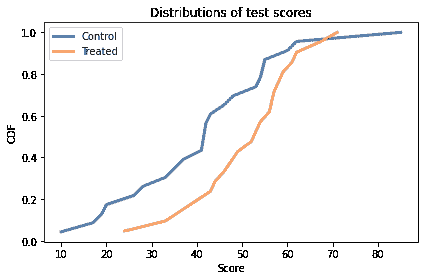
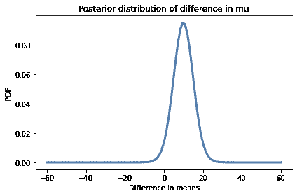
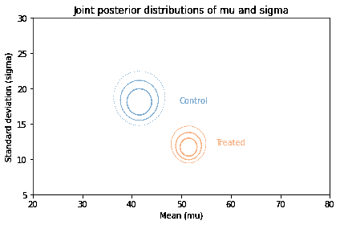
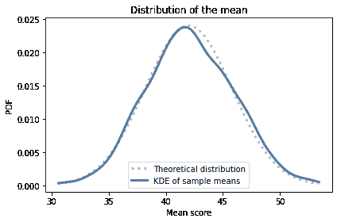
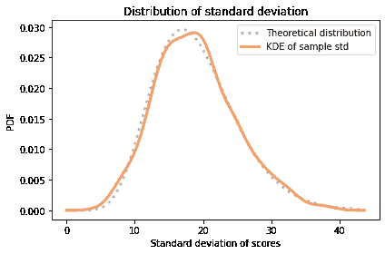
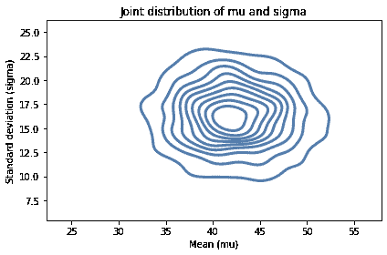
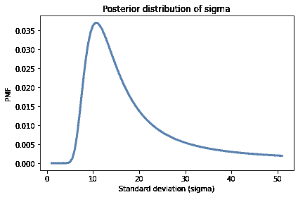
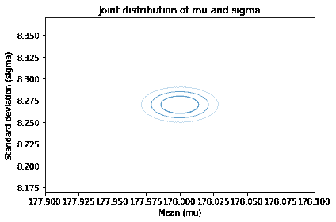
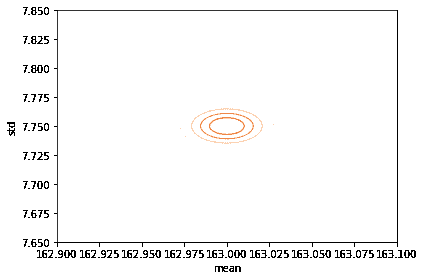

# 第十三章：推断

> 原文：[`allendowney.github.io/ThinkBayes2/chap13.html`](https://allendowney.github.io/ThinkBayes2/chap13.html)
> 
> 译者：[飞龙](https://github.com/wizardforcel)
> 
> 协议：[CC BY-NC-SA 4.0](http://creativecommons.org/licenses/by-nc-sa/4.0/)


每当人们将贝叶斯推断与传统方法进行比较时，最常见的问题之一是：“p 值呢？”其中最常见的例子之一是比较两组，看看它们的平均值是否有差异。

在经典统计推断中，这种情况的常用工具是[学生的*t*检验](https://en.wikipedia.org/wiki/Student%27s_t-test)，结果是[p 值](https://en.wikipedia.org/wiki/P-value)。这个过程是[零假设显著性检验](https://en.wikipedia.org/wiki/Statistical_hypothesis_testing)的一个例子。

贝叶斯的替代方法是计算两组之间差异的后验分布。然后我们可以使用该分布来回答我们感兴趣的任何问题，包括差异的最可能大小，可能包含真实差异的可信区间，优越性的概率，或者差异超过某个阈值的概率。

为了演示这个过程，我将解决一个从统计教科书借来的问题：评估教育“治疗”与对照组的效果。

## 提高阅读能力

我们将使用 1987 年[教育心理学博士论文](https://docs.lib.purdue.edu/dissertations/AAI8807671/)中的数据，该论文被用作 1989 年[统计教科书](https://books.google.com/books/about/Introduction_to_the_practice_of_statisti.html?id=pGBNhajABlUC)的例子，并在[DASL](https://web.archive.org/web/20000603124754/http://lib.stat.cmu.edu/DASL/Datafiles/DRPScores.html)上发布，这是一个收集数据故事的网页。

以下是 DASL 的描述：

> 一位教育工作者进行了一个实验，测试课堂上的新定向阅读活动是否会帮助小学生提高阅读能力的某些方面。她安排了一个由 21 名学生组成的三年级班级，在 8 周的时间里进行这些活动。一个由 23 名三年级学生组成的对照班级在没有这些活动的情况下遵循相同的课程。在 8 周结束时，所有学生参加了一个度量阅读能力的测试，该测试衡量了治疗旨在改善的阅读能力方面。

[数据集在这里可用](https://web.archive.org/web/20000603124754/http://lib.stat.cmu.edu/DASL/Datafiles/DRPScores.html)。

我将使用 Pandas 将数据加载到`DataFrame`中。

```py
import pandas as pd

df = pd.read_csv('drp_scores.csv', skiprows=21, delimiter='\t')
df.head(3) 
```

|  | 治疗 | 反应 |
| --- | --- | --- |
| 0 | Treated | 24 |
| 1 | Treated | 43 |
| 2 | Treated | 58 |

`Treatment`列指示每个学生是在治疗组还是对照组。`Response`是他们在测试中的得分。

我将使用`groupby`来分离`Treated`和`Control`组的数据：

```py
grouped = df.groupby('Treatment')
responses = {}

for name, group in grouped:
    responses[name] = group['Response'] 
```

这是两组分数的 CDF 和摘要统计信息。

```py
from empiricaldist import Cdf
from utils import decorate

for name, response in responses.items():
    cdf = Cdf.from_seq(response)
    cdf.plot(label=name)

decorate(xlabel='Score', 
         ylabel='CDF',
         title='Distributions of test scores') 
```



这两个分布之间存在重叠，但看起来治疗组的分数更高。两组的分数分布都不完全符合正态分布，但足够接近，正态模型是一个合理的选择。

因此，我将假设在整个学生群体中（不仅仅是实验中的学生），分数的分布可以很好地由未知均值和标准差的正态分布模拟。我将使用`mu`和`sigma`来表示这些未知参数，并且我们将进行贝叶斯更新来估计它们。

## 估计参数

和往常一样，我们需要参数的先验分布。由于有两个参数，它将是一个联合分布。我将通过为每个参数选择边际分布并计算它们的外积来构造它。

作为一个简单的起点，我将假设`mu`和`sigma`的先验分布是均匀的。以下函数制作了代表均匀分布的`Pmf`对象。

```py
from empiricaldist import Pmf

def make_uniform(qs, name=None, **options):
  """Make a Pmf that represents a uniform distribution."""
    pmf = Pmf(1.0, qs, **options)
    pmf.normalize()
    if name:
        pmf.index.name = name
    return pmf 
```

`make_uniform`接受参数

+   一个数量的数组，`qs`，和

+   一个字符串，`name`，它被分配给索引，所以当我们显示`Pmf`时它会出现。

这是`mu`的先验分布：

```py
import numpy as np

qs = np.linspace(20, 80, num=101)
prior_mu = make_uniform(qs, name='mean') 
```

我通过试错选择了下限和上限。我们在查看后验分布时会解释这个过程。

这是`sigma`的先验分布：

```py
qs = np.linspace(5, 30, num=101)
prior_sigma = make_uniform(qs, name='std') 
```

现在我们可以使用`make_joint`来制作联合先验分布。

```py
from utils import make_joint

prior = make_joint(prior_mu, prior_sigma) 
```

我们将从对照组的数据开始。

```py
data = responses['Control']
data.shape 
```

```py
(23,) 
```

在下一节中，我们将计算先验分布中每对参数的数据的似然。

## 似然

我们想要知道数据集中每个分数在每个假设的`mu`和`sigma`值对中的概率。我将通过在第一个轴上使用`mu`的值，在第二个轴上使用`sigma`的值，并在第三个轴上使用数据集中的分数来制作一个三维网格来做到这一点。

```py
mu_mesh, sigma_mesh, data_mesh = np.meshgrid(
    prior.columns, prior.index, data)

mu_mesh.shape 
```

```py
(101, 101, 23) 
```

现在我们可以使用`norm.pdf`来计算每个假设参数对应的每个分数的概率密度。

```py
from scipy.stats import norm

densities = norm(mu_mesh, sigma_mesh).pdf(data_mesh)
densities.shape 
```

```py
(101, 101, 23) 
```

结果是一个 3-D 数组。为了计算似然，我将沿着`axis=2`相乘这些密度，这是数据的轴：

```py
likelihood = densities.prod(axis=2)
likelihood.shape 
```

```py
(101, 101) 
```

结果是一个包含每个假设参数对应的整个数据集的似然的 2-D 数组。

我们可以使用这个数组来更新先验，就像这样：

```py
from utils import normalize

posterior = prior * likelihood
normalize(posterior)
posterior.shape 
```

```py
(101, 101) 
```

结果是一个代表联合后验分布的`DataFrame`。

以下函数封装了这些步骤。

```py
def update_norm(prior, data):
  """Update the prior based on data."""
    mu_mesh, sigma_mesh, data_mesh = np.meshgrid(
        prior.columns, prior.index, data)

    densities = norm(mu_mesh, sigma_mesh).pdf(data_mesh)
    likelihood = densities.prod(axis=2)

    posterior = prior * likelihood
    normalize(posterior)

    return posterior 
```

这是对照组和治疗组的更新：

```py
data = responses['Control']
posterior_control = update_norm(prior, data) 
```

```py
data = responses['Treated']
posterior_treated = update_norm(prior, data) 
```

这是它们的样子：

<details class="hide above-input"><summary aria-label="Toggle hidden content">显示代码单元格源代码隐藏代码单元格源代码</summary>

```py
import matplotlib.pyplot as plt
from utils import plot_contour

plot_contour(posterior_control, cmap='Blues')
plt.text(49.5, 18, 'Control', color='C0')

cs = plot_contour(posterior_treated, cmap='Oranges')
plt.text(57, 12, 'Treated', color='C1')

decorate(xlabel='Mean (mu)', 
         ylabel='Standard deviation (sigma)',
         title='Joint posterior distributions of mu and sigma') 
```</details> 

沿着$x$-轴，看起来处理组的平均分数更高。沿着$y$-轴，看起来处理组的标准差更低。

如果我们认为治疗导致了这些差异，数据表明治疗增加了分数的平均值并减少了它们的波动。我们可以通过查看`mu`和`sigma`的边际分布更清楚地看到这些差异。

## 后验边际分布

我将使用`marginal`，我们在<<_MarginalDistributions>>中看到的，来提取人口均值的后验边际分布。

```py
from utils import marginal

pmf_mean_control = marginal(posterior_control, 0)
pmf_mean_treated = marginal(posterior_treated, 0) 
```

这是它们的样子：

```py
pmf_mean_control.plot(label='Control')
pmf_mean_treated.plot(label='Treated')

decorate(xlabel='Population mean (mu)', 
         ylabel='PDF', 
         title='Posterior distributions of mu') 
```


在这两种情况下，范围末端的后验概率接近零，这意味着我们选择的先验分布的边界足够宽。

比较两组的边际分布，看起来处理组的人口均值更高。我们可以使用`prob_gt`来计算优越性的概率：

```py
Pmf.prob_gt(pmf_mean_treated, pmf_mean_control) 
```

```py
0.980479025187326 
```

有 98%的机会处理组的平均值更高。

## 差异的分布

为了量化组之间差异的大小，我们可以使用`sub_dist`来计算差异的分布。

```py
pmf_diff = Pmf.sub_dist(pmf_mean_treated, pmf_mean_control) 
```

当您使用`sub_dist`等方法时，有两件事需要注意。第一点是结果通常包含比原始`Pmf`更多的元素。

在这个例子中，原始分布具有相同的数量，因此大小增加是适度的。

```py
len(pmf_mean_treated), len(pmf_mean_control), len(pmf_diff) 
```

```py
(101, 101, 879) 
```

在最坏的情况下，结果的大小可以是原始大小的乘积。

另一件需要注意的事情是绘制`Pmf`。在这个例子中，如果我们绘制差异的分布，结果会非常嘈杂。

<details class="hide above-input"><summary aria-label="Toggle hidden content">显示代码单元格源代码隐藏代码单元格源代码</summary>

```py
pmf_diff.plot()

decorate(xlabel='Difference in population means', 
         ylabel='PDF', 
         title='Posterior distribution of difference in mu') 
```</details> 

有两种方法可以解决这个限制。一种是绘制 CDF，这样可以平滑噪音：

```py
cdf_diff = pmf_diff.make_cdf() 
```

<details class="hide above-input"><summary aria-label="Toggle hidden content">显示代码单元格源代码隐藏代码单元格源代码</summary>

```py
cdf_diff.plot()

decorate(xlabel='Difference in population means', 
         ylabel='CDF', 
         title='Posterior distribution of difference in mu') 
```</details> 

另一个选择是使用核密度估计（KDE）在等间距网格上对 PDF 进行平滑近似，这就是这个函数的作用：

```py
from scipy.stats import gaussian_kde

def kde_from_pmf(pmf, n=101):
  """Make a kernel density estimate for a PMF."""
    kde = gaussian_kde(pmf.qs, weights=pmf.ps)
    qs = np.linspace(pmf.qs.min(), pmf.qs.max(), n)
    ps = kde.evaluate(qs)
    pmf = Pmf(ps, qs)
    pmf.normalize()
    return pmf 
```

`kde_from_pmf`以`Pmf`和要评估 KDE 的位置数作为参数。

它使用了`gaussian_kde`，我们在<<_KernelDensityEstimation>>中看到了，将`Pmf`中的概率作为权重传递。这使得在`Pmf`中概率较高的地方，估计的密度更高。

这是`Pmf`之间差异的核密度估计的样子。

```py
kde_diff = kde_from_pmf(pmf_diff) 
```

<details class="hide above-input"><summary aria-label="Toggle hidden content">显示代码单元格源代码隐藏代码单元格源代码</summary>

```py
kde_diff.plot()

decorate(xlabel='Difference in means', 
         ylabel='PDF', 
         title='Posterior distribution of difference in mu') 
```</details> 

这个分布的均值几乎是测试中的 45 分的 10 分，因此治疗的效果似乎是显著的。

```py
pmf_diff.mean() 
```

```py
9.954413088940848 
```

我们可以使用`credible_interval`来计算 90%的可信区间。

```py
pmf_diff.credible_interval(0.9) 
```

```py
array([ 2.4, 17.4]) 
```

根据这个区间，我们相当确定治疗可以使测试分数提高 2 到 17 分。

## 使用总结统计

在这个例子中，数据集并不是很大，因此计算每个假设下每个分数的概率并不需要太长时间。但结果是一个 3-D 数组；对于更大的数据集，实际上可能太大而无法实际计算。

此外，对于更大的数据集，可能性会变得非常小，有时甚至小到我们无法用浮点运算来计算。这是因为我们正在计算特定数据集的概率；可能的数据集数量是天文数字级别的，因此它们的概率非常小。

另一种选择是计算数据集的摘要并计算摘要的可能性。例如，如果我们计算数据的均值和标准差，我们可以计算每个假设下这些摘要统计的可能性。

例如，假设我们知道人口的实际均值$\mu$是 42，实际标准差$\sigma$是 17。

```py
mu = 42
sigma = 17 
```

现在假设我们从这个分布中抽取一个样本，样本大小为`n=20`，并计算样本的均值，我将其称为`m`，以及样本的标准差，我将其称为`s`。

假设结果是：

```py
n = 20
m = 41
s = 18 
```

摘要统计`m`和`s`与参数$\mu$和$\sigma$相差不远，因此它们似乎不太可能。

为了计算它们的可能性，我们将利用数理统计的三个结果：

+   给定$\mu$和$\sigma$，`m`的分布是具有参数$\mu$和$\sigma/\sqrt{n}$的正态分布；

+   $s$的分布更复杂，但如果我们计算变换$t = n s² / \sigma²$，$t$的分布是具有参数$n-1$的卡方分布；以及

+   根据[巴苏定理](https://en.wikipedia.org/wiki/Basu%27s_theorem)，`m`和`s`是独立的。

因此，让我们计算给定$\mu$和$\sigma$的`m`和`s`的可能性。

首先，我将创建一个代表`m`分布的`norm`对象。

```py
dist_m = norm(mu, sigma/np.sqrt(n)) 
```

这是“均值的抽样分布”。我们可以用它来计算观察到的`m`值的可能性，即 41。

```py
like1 = dist_m.pdf(m)
like1 
```

```py
0.10137915138497372 
```

现在让我们计算观察到的`s`值的可能性，即 18。首先，我们计算变换后的值`t`：

```py
t = n * s**2 / sigma**2
t 
```

```py
22.422145328719722 
```

然后我们创建一个代表`t`分布的`chi2`对象：

```py
from scipy.stats import chi2

dist_s = chi2(n-1) 
```

现在我们可以计算`t`的似然性：

```py
like2 = dist_s.pdf(t)
like2 
```

```py
0.04736427909437004 
```

最后，因为`m`和`s`是独立的，它们的联合似然性是它们各自似然性的乘积：

```py
like = like1 * like2
like 
```

```py
0.004801750420548287 
```

现在我们可以计算任何$\mu$和$\sigma$值的数据的似然性，我们将在下一节中使用它们进行更新。

## 使用摘要统计数据进行更新

现在我们准备进行更新。我将计算两组的摘要统计数据。

```py
summary = {}

for name, response in responses.items():
    summary[name] = len(response), response.mean(), response.std()

summary 
```

```py
{'Control': (23, 41.52173913043478, 17.148733229699484),
 'Treated': (21, 51.476190476190474, 11.00735684721381)} 
```

结果是一个字典，将组名映射到一个包含样本量`n`、样本均值`m`和样本标准差`s`的元组，对于每个组。

我将演示使用对照组的摘要统计数据进行更新。

```py
n, m, s = summary['Control'] 
```

我将用`x`轴上的`mu`的假设值和`y`轴上的`sigma`值创建一个网格。

```py
mus, sigmas = np.meshgrid(prior.columns, prior.index)
mus.shape 
```

```py
(101, 101) 
```

现在我们可以计算每对参数的样本均值`m`的似然性。

```py
like1 = norm(mus, sigmas/np.sqrt(n)).pdf(m)
like1.shape 
```

```py
(101, 101) 
```

我们可以计算每对参数的样本标准差`s`的似然性。

```py
ts = n * s**2 / sigmas**2
like2 = chi2(n-1).pdf(ts)
like2.shape 
```

```py
(101, 101) 
```

最后，我们可以用两个似然性进行更新：

```py
posterior_control2 = prior * like1 * like2
normalize(posterior_control2) 
```

计算治疗组的后验分布，我将把之前的步骤放在一个函数中：

```py
def update_norm_summary(prior, data):
  """Update a normal distribution using summary statistics."""
    n, m, s = data
    mu_mesh, sigma_mesh = np.meshgrid(prior.columns, prior.index)

    like1 = norm(mu_mesh, sigma_mesh/np.sqrt(n)).pdf(m)
    like2 = chi2(n-1).pdf(n * s**2 / sigma_mesh**2)

    posterior = prior * like1 * like2
    normalize(posterior)

    return posterior 
```

这是治疗组的更新：

```py
data = summary['Treated']
posterior_treated2 = update_norm_summary(prior, data) 
```

这就是结果。

<details class="hide above-input"><summary aria-label="Toggle hidden content">显示代码单元格源代码 隐藏代码单元格源代码</summary>

```py
plot_contour(posterior_control2, cmap='Blues')
plt.text(49.5, 18, 'Control', color='C0')

cs = plot_contour(posterior_treated2, cmap='Oranges')
plt.text(57, 12, 'Treated', color='C1')

decorate(xlabel='Mean (mu)', 
         ylabel='Standard deviation (sigma)',
         title='Joint posterior distributions of mu and sigma') 
```</details> 

从视觉上看，这些后验联合分布与我们使用整个数据集计算的分布相似，而不仅仅是摘要统计数据。但它们并不完全相同，我们可以通过比较边际分布来看到这一点。

## 比较边际分布

再次，让我们提取边际后验分布。

```py
from utils import marginal

pmf_mean_control2 = marginal(posterior_control2, 0)
pmf_mean_treated2 = marginal(posterior_treated2, 0) 
```

并将它们与使用整个数据集得到的结果进行比较（虚线）。

<details class="hide above-input"><summary aria-label="Toggle hidden content">显示代码单元格源代码 隐藏代码单元格源代码</summary>

```py
pmf_mean_control.plot(color='C5', ls='--')
pmf_mean_control2.plot(label='Control')
pmf_mean_treated.plot(color='C5', ls='--')
pmf_mean_treated2.plot(label='Treated')

decorate(xlabel='Population mean', 
         ylabel='PDF', 
         title='Posterior distributions of mu') 
```</details> 

基于摘要统计数据的后验分布与我们使用整个数据集计算的后验分布相似，但在两种情况下都更短且略宽。

这是因为使用摘要统计数据进行更新是基于数据分布是正态分布的隐含假设。但实际上并不是这样；因此，当我们用摘要统计数据替换数据集时，我们会丢失一些关于真实数据分布的信息。信息越少，我们对参数的确定性就越低。

## 通过模拟证明

使用摘要统计数据进行更新是基于理论分布的，而且似乎是有效的，但我认为测试这样的理论是有用的，有几个原因：

+   它证实了我们对理论的理解是正确的，

+   它证实了我们应用理论的条件是理论成立的，

+   它证实了实现细节是正确的。对于许多分布，有多种指定参数的方法。如果使用了错误的规范，这种测试将帮助您捕捉错误。

在本节中，我将使用模拟来展示样本均值和标准差的分布如我所说的那样。但是如果你愿意相信我的话，你可以跳过这一节和下一节。

假设我们知道总体的实际均值和标准差：

<details class="hide above-input"><summary aria-label="Toggle hidden content">显示代码单元格内容 隐藏代码单元格内容</summary>

```py
mu = 42
sigma = 17 
```</details>

我将创建一个`norm`对象来表示这个分布。

<details class="hide above-input"><summary aria-label="Toggle hidden content">显示代码单元格内容 隐藏代码单元格内容</summary>

```py
dist = norm(mu, sigma) 
```</details>

`norm`提供了`rvs`，它可以从分布中生成随机值。我们可以用它来模拟 1000 个样本，每个样本的样本量为`n=20`。

<details class="hide above-input"><summary aria-label="Toggle hidden content">显示代码单元格内容 隐藏代码单元格内容</summary>

```py
n = 20
samples = dist.rvs((1000, n))
samples.shape 
```

```py
(1000, 20) 
```</details>

结果是一个包含 1000 行的数组，每行包含一个样本或 20 个模拟测试分数。

如果我们计算每行的平均值，结果将是一个包含 1000 个样本均值的数组；也就是说，每个值都是一个样本的均值，样本量为`n=20`。

<details class="hide above-input"><summary aria-label="Toggle hidden content">显示代码单元格内容 隐藏代码单元格内容</summary>

```py
sample_means = samples.mean(axis=1)
sample_means.shape 
```

```py
(1000,) 
```</details>

现在，让我们将这些均值的分布与`dist_m`进行比较。我将使用`pmf_from_dist`来对`dist_m`进行离散近似：

<details class="hide above-input"><summary aria-label="Toggle hidden content">显示代码单元格内容 隐藏代码单元格内容</summary>

```py
def pmf_from_dist(dist, low, high):
  """Make a discrete approximation of a continuous distribution.

 dist: SciPy dist object
 low: low end of range
 high: high end of range

 returns: normalized Pmf
 """
    qs = np.linspace(low, high, 101)
    ps = dist.pdf(qs)
    pmf = Pmf(ps, qs)
    pmf.normalize()
    return pmf 
```</details>

`pmf_from_dist`接受一个表示连续分布的对象，在`low`和`high`之间的等间距点上评估其概率密度函数，并返回一个近似分布的归一化`Pmf`。

我将用它来评估`dist_m`在六个标准差范围内的情况。

<details class="hide above-input"><summary aria-label="Toggle hidden content">显示代码单元格内容 隐藏代码单元格内容</summary>

```py
low = dist_m.mean() - dist_m.std() * 3
high = dist_m.mean() + dist_m.std() * 3

pmf_m = pmf_from_dist(dist_m, low, high) 
```</details>

现在让我们将这个理论分布与样本的均值进行比较。我将使用`kde_from_sample`来估计它们的分布，并在与`pmf_m`相同的位置进行评估。

<details class="hide above-input"><summary aria-label="Toggle hidden content">显示代码单元格内容 隐藏代码单元格内容</summary>

```py
from utils import kde_from_sample

qs = pmf_m.qs
pmf_sample_means = kde_from_sample(sample_means, qs) 
```</details>

以下图显示了这两个分布。

<details class="hide above-input"><summary aria-label="Toggle hidden content">显示代码单元格内容 隐藏代码单元格内容</summary>

```py
pmf_m.plot(label='Theoretical distribution',
           ls=':', color='C5')
pmf_sample_means.plot(label='KDE of sample means')

decorate(xlabel='Mean score',
         ylabel='PDF',
         title='Distribution of the mean') 
```

</details>

理论分布和样本均值的分布是一致的。

## 检查标准差

我们还要检查一下标准差是否符合我们的预期分布。首先，我将计算 1000 个样本的标准差。

<details class="hide above-input"><summary aria-label="Toggle hidden content">显示代码单元格内容 隐藏代码单元格内容</summary>

```py
sample_stds = samples.std(axis=1)
sample_stds.shape 
```

```py
(1000,) 
```</details>

现在我们将计算转换后的值，$t = n s² / \sigma²$。

<details class="hide above-input"><summary aria-label="Toggle hidden content">显示代码单元格内容 隐藏代码单元格内容</summary>

```py
transformed = n * sample_stds**2 / sigma**2 
```</details>

我们期望转换后的值遵循参数为$n-1$的卡方分布。SciPy 提供了`chi2`，我们可以用它来表示这个分布。

<details class="hide above-input"><summary aria-label="Toggle hidden content">显示代码单元格内容 隐藏代码单元格内容</summary>

```py
from scipy.stats import chi2

dist_s = chi2(n-1) 
```</details>

我们可以再次使用`pmf_from_dist`进行离散近似。

<details class="hide above-input"><summary aria-label="Toggle hidden content">显示代码单元格内容 隐藏代码单元格内容</summary>

```py
low = 0
high = dist_s.mean() + dist_s.std() * 4

pmf_s = pmf_from_dist(dist_s, low, high) 
```</details>

我们将使用`kde_from_sample`来估计样本标准差的分布。

<details class="hide above-input"><summary aria-label="Toggle hidden content">显示代码单元格内容 隐藏代码单元格内容</summary>

```py
qs = pmf_s.qs
pmf_sample_stds = kde_from_sample(transformed, qs) 
```</details>

现在我们可以将理论分布与标准差的分布进行比较。

<details class="hide above-input"><summary aria-label="Toggle hidden content">显示代码单元格内容 隐藏代码单元格内容</summary>

```py
pmf_s.plot(label='Theoretical distribution',
           ls=':', color='C5')
pmf_sample_stds.plot(label='KDE of sample std',
                     color='C1')

decorate(xlabel='Standard deviation of scores',
         ylabel='PDF',
         title='Distribution of standard deviation') 
```

</details>

转换后的标准差的分布与理论分布一致。

最后，为了确认样本均值和标准差是独立的，我将计算它们的相关系数：

<details class="hide above-input"><summary aria-label="Toggle hidden content">显示代码单元格内容 隐藏代码单元格内容</summary>

```py
np.corrcoef(sample_means, sample_stds)[0][1] 
```

```py
-0.027451907688034228 
```</details>

它们的相关性接近零，这与它们是独立的一致。

因此，模拟结果证实了我们用来使用摘要统计数据进行更新的理论结果。

我们还可以使用 Seaborn 中的`kdeplot`来查看它们的联合分布是什么样子的。

<details class="hide above-input"><summary aria-label="Toggle hidden content">显示代码单元格内容 隐藏代码单元格内容</summary>

```py
import seaborn as sns

sns.kdeplot(x=sample_means, y=sample_stds)

decorate(xlabel='Mean (mu)',
         ylabel='Standard deviation (sigma)',
         title='Joint distribution of mu and sigma') 
```

</details>

看起来椭圆的轴与坐标轴对齐，这表明变量是独立的。

## 摘要

在本章中，我们使用联合分布来表示正态分布的参数`mu`和`sigma`的先验概率。然后我们以两种方式更新了该分布：首先使用整个数据集和正态 PDF；然后使用摘要统计数据、正态 PDF 和卡方 PDF。使用摘要统计数据在计算上更有效，但在过程中会丢失一些信息。

正态分布出现在许多领域，因此本章中的方法具有广泛的适用性。本章末尾的练习将让您有机会应用它们。

## 练习

**练习：** 再次查看`mu`和`sigma`的后验联合分布，似乎处理组的标准差可能较低；如果是这样，那就表明对于分数较低的学生，治疗更有效。

但在我们进行过多推测之前，我们应该估计差异的大小，并查看它是否实际上可能为 0。

提取两组的`sigma`的边际后验分布。控制组的标准差更高的概率是多少？

计算两组之间`sigma`的差异的分布。这种差异的均值是多少？90%的可信区间是多少？

<details class="hide above-input"><summary aria-label="Toggle hidden content">显示代码单元格内容 隐藏代码单元格内容</summary>

```py
# Solution

pmf_std_control = marginal(posterior_control, 1)
pmf_std_treated = marginal(posterior_treated, 1) 
```</details> <details class="hide above-input"><summary aria-label="Toggle hidden content">显示代码单元格内容 隐藏代码单元格内容</summary>

```py
# Solution

pmf_std_control.plot(label='Control')
pmf_std_treated.plot(label='Treated')

decorate(xlabel='Population standard deviation', 
         ylabel='PDF', 
         title='Posterior distributions of sigma') 
```

</details><details class="hide above-input"><summary aria-label="Toggle hidden content">显示代码单元格内容 隐藏代码单元格内容</summary>

```py
# Solution

Pmf.prob_gt(pmf_std_control, pmf_std_treated) 
```

```py
0.9685103375300469 
```</details> <details class="hide above-input"><summary aria-label="Toggle hidden content">显示代码单元格内容 隐藏代码单元格内容</summary>

```py
# Solution

pmf_diff2 = Pmf.sub_dist(pmf_std_control, pmf_std_treated) 
```</details> <details class="hide above-input"><summary aria-label="Toggle hidden content">显示代码单元格内容 隐藏代码单元格内容</summary>

```py
# Solution

pmf_diff2.mean() 
```

```py
6.41717132817218 
```</details> <details class="hide above-input"><summary aria-label="Toggle hidden content">显示代码单元格内容 隐藏代码单元格内容</summary>

```py
# Solution

pmf_diff2.credible_interval(0.9) 
```

```py
array([ 1\. , 12.5]) 
```</details> <details class="hide above-input"><summary aria-label="Toggle hidden content">显示代码单元格内容 隐藏代码单元格内容</summary>

```py
# Solution

kde_from_pmf(pmf_diff2).plot()

decorate(xlabel='Difference in population standard deviation', 
         ylabel='PDF', 
         title='Posterior distributions of difference in sigma') 
```

</details>

**练习：** [效应大小](http://en.wikipedia.org/wiki/Effect_size)是一种旨在量化现象大小的统计量。如果现象是两组之间均值的差异，一种常见的量化方法是科恩效应大小，表示为$d$。

如果第 1 组的参数为$(\mu_1, \sigma_1)$，第 2 组的参数为$(\mu_2, \sigma_2)$，则科恩效应大小为

$$ d = \frac{\mu_1 - \mu_2}{(\sigma_1 + \sigma_2)/2} $$

使用两组的联合后验分布来计算 Cohen's effect size 的后验分布。

如果我们尝试枚举两个分布中的所有对，那将会花费太长时间，所以我们将使用随机抽样。

以下函数接受联合后验分布并返回一对样本。它使用了一些我们还没有看到的特性，但您现在可以忽略细节。

<details class="hide above-input"><summary aria-label="Toggle hidden content">显示代码单元格内容隐藏代码单元格内容</summary>

```py
def sample_joint(joint, size):
  """Draw a sample from a joint distribution.

 joint: DataFrame representing a joint distribution
 size: sample size
 """
    pmf = Pmf(joint.transpose().stack())
    return pmf.choice(size) 
```</details>

以下是我们如何使用它从两个组的后验分布中抽样对。

<details class="hide above-input"><summary aria-label="Toggle hidden content">显示代码单元格内容隐藏代码单元格内容</summary>

```py
sample_treated = sample_joint(posterior_treated, 1000)
sample_treated.shape 
```

```py
(1000,) 
```</details> <details class="hide above-input"><summary aria-label="Toggle hidden content">显示代码单元格内容隐藏代码单元格内容</summary>

```py
sample_control = sample_joint(posterior_control, 1000)
sample_control.shape 
```

```py
(1000,) 
```</details>

结果是一个元组数组，每个元组包含$\mu$和$\sigma$的一对可能值。现在您可以循环遍历样本，计算每个样本的 Cohen effect size，并估计 effect sizes 的分布。

<details class="hide above-input"><summary aria-label="Toggle hidden content">显示代码单元格内容隐藏代码单元格内容</summary>

```py
# Solution

def cohen_effect(pair1, pair2):
  """Compute Cohen's effect size for difference in means.

 pair1: tuple of (mu1, sigma1)
 pair2: tuple of (mu2, sigma2)

 return: float
 """
    mu1, sigma1 = pair1 
    mu2, sigma2 = pair2
    sigma = (sigma1 + sigma2) / 2
    return (mu1 - mu2) / sigma 
```</details> <details class="hide above-input"><summary aria-label="Toggle hidden content">显示代码单元格内容隐藏代码单元格内容</summary>

```py
# Solution

cohen_effect(sample_treated[0], sample_control[0]) 
```

```py
0.7603960396039605 
```</details> <details class="hide above-input"><summary aria-label="Toggle hidden content">显示代码单元格内容隐藏代码单元格内容</summary>

```py
# Solution

ds = []
for pair1, pair2 in zip(sample_treated, sample_control):
    d = cohen_effect(pair1, pair2)
    ds.append(d) 
```</details> <details class="hide above-input"><summary aria-label="Toggle hidden content">显示代码单元格内容隐藏代码单元格内容</summary>

```py
# Solution

cdf = Cdf.from_seq(ds)
cdf.plot()

decorate(xlabel='Cohen effect size',
         ylabel='CDF',
         title='Posterior distributions of effect size') 
```

</details><details class="hide above-input"><summary aria-label="Toggle hidden content">显示代码单元格内容隐藏代码单元格内容</summary>

```py
# Solution

cdf.mean() 
```

```py
0.6623391688256146 
```</details> <details class="hide above-input"><summary aria-label="Toggle hidden content">显示代码单元格内容隐藏代码单元格内容</summary>

```py
# Solution

cdf.credible_interval(0.9) 
```

```py
array([0.08648649, 1.17647059]) 
```</details>

**练习：** 这个练习受到了[Reddit 上出现的一个问题](https://www.reddit.com/r/statistics/comments/hcvl2j/q_reverse_empirical_distribution_rule_question/)的启发。

一位教师宣布了这样一场考试的结果：“这次考试的平均分是 81。在 25 名学生中，有 5 人得分超过 90，我很高兴地报告说没有人不及格（得分低于 60）。”

根据这些信息，您认为分数的标准差是多少？

您可以假设分数的分布大致是正态的。让我们假设样本均值 81 实际上是总体均值，因此我们只需要估计`sigma`。

提示：要计算得分大于 90 的概率，您可以使用`norm.sf`，它计算生存函数，也称为互补 CDF，或`1 - cdf(x)`。

<details class="hide above-input"><summary aria-label="Toggle hidden content">显示代码单元格内容隐藏代码单元格内容</summary>

```py
# Solution

# Based on trial and error, here's a range of
# values for the prior

hypos = np.linspace(1, 51, 101) 
```</details> <details class="hide above-input"><summary aria-label="Toggle hidden content">显示代码单元格内容隐藏代码单元格内容</summary>

```py
# Solution

# Here are the probabilities of a score greater than 90
# for each hypothetical value of sigma.

from scipy.stats import norm

pgt90 = norm(81, hypos).sf(90)
pgt90.shape 
```

```py
(101,) 
```</details> <details class="hide above-input"><summary aria-label="Toggle hidden content">显示代码单元格内容隐藏代码单元格内容</summary>

```py
# Solution

# And here's the chance that 5 out of 25 people
# get a score greater than 90

from scipy.stats import binom

likelihood1 = binom(25, pgt90).pmf(5)
likelihood1.shape 
```

```py
(101,) 
```</details> <details class="hide above-input"><summary aria-label="Toggle hidden content">显示代码单元格内容隐藏代码单元格内容</summary>

```py
# Solution

# Here's the first update

prior = Pmf(1, hypos)
posterior = prior * likelihood1
posterior.normalize() 
```

```py
5.299480018256258 
```</details> <details class="hide above-input"><summary aria-label="Toggle hidden content">显示代码单元格内容隐藏代码单元格内容</summary>

```py
# Solution

# Here's the first posterior.

posterior.plot()
decorate(xlabel='Standard deviation (sigma)',
         ylabel='PMF',
         title='Posterior distribution of sigma') 
```

</details><details class="hide above-input"><summary aria-label="Toggle hidden content">显示代码单元格内容 隐藏代码单元格内容</summary>

```py
# Solution

# Here's the probability of a score greater than 60

pgt60s = norm(81, hypos).sf(60) 
```</details> <details class="hide above-input"><summary aria-label="Toggle hidden content">显示代码单元格内容 隐藏代码单元格内容</summary>

```py
# Solution

# And here's the probability that all 25 students exceed 60

likelihood2 = pgt60s ** 25 
```</details> <details class="hide above-input"><summary aria-label="Toggle hidden content">显示代码单元格内容 隐藏代码单元格内容</summary>

```py
# Solution

plt.plot(hypos, likelihood2)
decorate(xlabel='Standard deviation (sigma)',
         ylabel='Likelihood',
         title='Likelihood function') 
```

</details><details class="hide above-input"><summary aria-label="Toggle hidden content">显示代码单元格内容 隐藏代码单元格内容</summary>

```py
# Solution

# Here's the posterior after both updates

prior = Pmf(1, hypos)
prior.normalize()
posterior2 = prior * likelihood1 * likelihood2
posterior2.normalize() 
```

```py
0.01425455531129565 
```</details> <details class="hide above-input"><summary aria-label="Toggle hidden content">显示代码单元格内容 隐藏代码单元格内容</summary>

```py
# Solution

posterior.plot(label='Posterior 1')
posterior2.plot(label='Posterior 2')

decorate(xlabel='Standard deviation (sigma)',
         ylabel='PMF',
         title='Posterior distribution of sigma') 
```

</details><details class="hide above-input"><summary aria-label="Toggle hidden content">显示代码单元格内容 隐藏代码单元格内容</summary>

```py
# Solution

posterior.mean(), posterior2.mean() 
```

```py
(18.150261186811548, 10.189707962198526) 
```</details> <details class="hide above-input"><summary aria-label="Toggle hidden content">显示代码单元格内容 隐藏代码单元格内容</summary>

```py
# Solution

posterior2.credible_interval(0.9) 
```

```py
array([ 7., 15.]) 
```</details>

**练习：** [变异性假设](http://en.wikipedia.org/wiki/Variability_hypothesis) 是这样一个观察：在许多物种中，许多生理特征在雄性中的变异性比在雌性中更大。

自 19 世纪初以来，这一直是一个有争议的话题，这表明我们可以使用本章中的方法进行练习。让我们看看美国男性和女性的身高分布，看看谁的变异性更大。

我使用了 2018 年来自 CDC 的[行为风险因素监测系统](https://www.cdc.gov/brfss/annual_data/annual_2018.html)（BRFSS）的数据，其中包括来自 154407 名男性和 254722 名女性的自报身高。

这是我找到的：

+   男性的平均身高为 178 厘米；女性的平均身高为 163 厘米。因此，男性的平均身高更高；这并不奇怪。

+   对于男性，标准差为 8.27 厘米；对于女性，标准差为 7.75 厘米。因此，从绝对值来看，男性的身高更加变化。

但是，要比较不同组之间的变异性，使用[变异系数](https://en.wikipedia.org/wiki/Coefficient_of_variation) (CV) 更有意义，它是标准差除以均值。它是一个无量纲的变异性相对于尺度的度量。

对于男性，CV 为 0.0465；对于女性，CV 为 0.0475。女性的变异系数更高，因此这个数据集提供了反对变异性假设的证据。但是我们可以使用贝叶斯方法使这个结论更加精确。

使用这些摘要统计数据计算男性和女性身高分布的`mu`和`sigma`的后验分布。使用`Pmf.div_dist`计算 CV 的后验分布。基于这个数据集和身高分布是正态分布的假设，男性的变异系数更高的概率是多少？CV 的最可能比率是多少，这个比率的 90%可信区间是多少？

提示：为两组使用不同的先验分布，并选择它们以便覆盖所有具有非零概率的参数。

另外，你可能会发现这个函数有用：

<details class="hide above-input"><summary aria-label="Toggle hidden content">显示代码单元格内容 隐藏代码单元格内容</summary>

```py
def get_posterior_cv(joint):
  """Get the posterior distribution of CV.

 joint: joint distribution of mu and sigma

 returns: Pmf representing the smoothed posterior distribution
 """
    pmf_mu = marginal(joint, 0)
    pmf_sigma = marginal(joint, 1)
    pmf_cv = Pmf.div_dist(pmf_sigma, pmf_mu)
    return kde_from_pmf(pmf_cv) 
```</details> <details class="hide above-input"><summary aria-label="Toggle hidden content">显示代码单元格内容 隐藏代码单元格内容</summary>

```py
# Solution

n = 154407
mean = 178
std = 8.27 
```</details> <details class="hide above-input"><summary aria-label="Toggle hidden content">显示代码单元格内容 隐藏代码单元格内容</summary>

```py
# Solution

qs = np.linspace(mean-0.1, mean+0.1, num=101)
prior_mu = make_uniform(qs, name='mean')

qs = np.linspace(std-0.1, std+0.1, num=101)
prior_sigma = make_uniform(qs, name='std')

prior = make_joint(prior_mu, prior_sigma) 
```</details> <details class="hide above-input"><summary aria-label="切换隐藏内容">显示代码单元格内容 隐藏代码单元格内容</summary>

```py
# Solution

data = n, mean, std
posterior_male = update_norm_summary(prior, data)
plot_contour(posterior_male, cmap='Blues')

decorate(xlabel='Mean (mu)', 
         ylabel='Standard deviation (sigma)',
         title='Joint distribution of mu and sigma') 
```

</details><details class="hide above-input"><summary aria-label="切换隐藏内容">显示代码单元格内容 隐藏代码单元格内容</summary>

```py
# Solution

n = 254722
mean = 163
std = 7.75 
```</details> <details class="hide above-input"><summary aria-label="切换隐藏内容">显示代码单元格内容 隐藏代码单元格内容</summary>

```py
# Solution

qs = np.linspace(mean-0.1, mean+0.1, num=101)
prior_mu = make_uniform(qs, name='mean')

qs = np.linspace(std-0.1, std+0.1, num=101)
prior_sigma = make_uniform(qs, name='std')

prior = make_joint(prior_mu, prior_sigma) 
```</details> <details class="hide above-input"><summary aria-label="切换隐藏内容">显示代码单元格内容 隐藏代码单元格内容</summary>

```py
# Solution

data = n, mean, std
posterior_female = update_norm_summary(prior, data)
plot_contour(posterior_female, cmap='Oranges'); 
```

</details><details class="hide above-input"><summary aria-label="切换隐藏内容">显示代码单元格内容 隐藏代码单元格内容</summary>

```py
# Solution

pmf_cv_male = get_posterior_cv(posterior_male)
kde_from_pmf(pmf_cv_male).plot()

pmf_cv_female = get_posterior_cv(posterior_female)
kde_from_pmf(pmf_cv_female).plot()

decorate(xlabel='Coefficient of variation',
         ylabel='PDF',
         title='Posterior distributions of CV') 
```

</details><details class="hide above-input"><summary aria-label="切换隐藏内容">显示代码单元格内容 隐藏代码单元格内容</summary>

```py
# Solution

ratio_cv = Pmf.div_dist(pmf_cv_female, pmf_cv_male)
ratio_cv.max_prob() 
```

```py
1.0233615721208176 
```</details> <details class="hide above-input"><summary aria-label="切换隐藏内容">显示代码单元格内容 隐藏代码单元格内容</summary>

```py
# Solution

ratio_cv.credible_interval(0.9) 
```

```py
array([1.0193799 , 1.02734473]) 
```</details>
