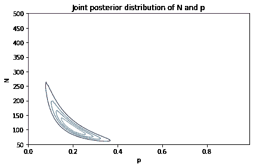
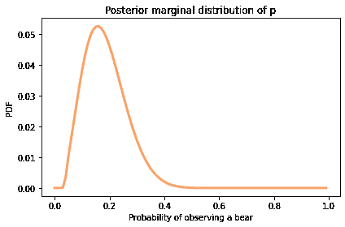
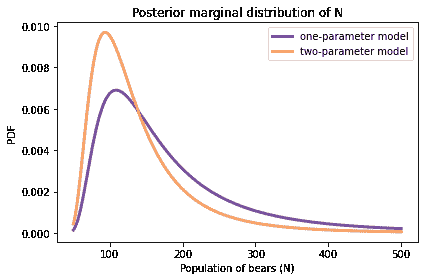
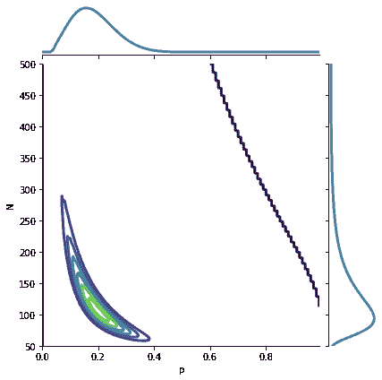
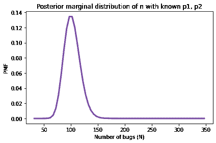
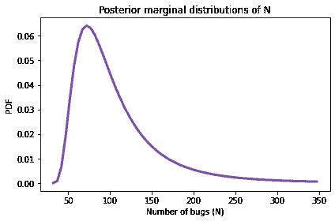
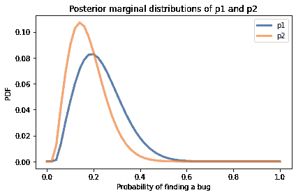
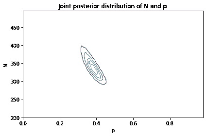
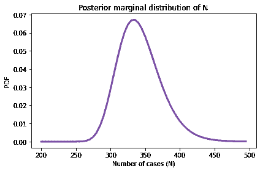
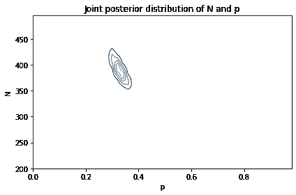

# 第十五章：标记和重捕

> 原文：[`allendowney.github.io/ThinkBayes2/chap15.html`](https://allendowney.github.io/ThinkBayes2/chap15.html)
> 
> 译者：[飞龙](https://github.com/wizardforcel)
> 
> 协议：[CC BY-NC-SA 4.0](http://creativecommons.org/licenses/by-nc-sa/4.0/)


本章介绍了“标记和重捕”实验，其中我们从一个种群中对个体进行采样，以某种方式对它们进行标记，然后从同一种群中进行第二次采样。通过观察第二次采样中有多少个体被标记，我们可以估计种群的大小。

这样的实验最初用于生态学，但事实证明在许多其他领域也很有用。本章的例子包括软件工程和流行病学。

此外，在本章中，我们将使用具有三个参数的模型，因此我们将扩展我们一直使用的联合分布到三维。

但首先，是灰熊。

## 灰熊问题

1996 年和 1997 年，研究人员在加拿大不列颠哥伦比亚省和阿尔伯塔省的地点部署了熊陷阱，以估计灰熊的种群。他们在[这篇文章](https://www.researchgate.net/publication/229195465_Estimating_Population_Size_of_Grizzly_Bears_Using_Hair_Capture_DNA_Profiling_and_Mark-Recapture_Analysis)中描述了这个实验。

“陷阱”由诱饵和几股带刺的铁丝组成，旨在捕捉拜访诱饵的熊的毛发样本。研究人员使用这些毛发样本，通过 DNA 分析来识别个体熊。

在第一次采样期间，研究人员在 76 个地点设置了陷阱。10 天后返回，他们获得了 1043 个毛发样本，并鉴定出了 23 只不同的熊。在第二个 10 天的采样期间，他们从 19 只不同的熊身上获得了 1191 个样本，其中 19 只熊中有 4 只是他们在第一批中鉴定出的。

为了从这些数据中估计熊的种群，我们需要一个模型，用于每只熊在每次采样期间被观察到的概率。作为起点，我们将做出最简单的假设，即种群中的每只熊在每次采样期间被采样到的概率相同（未知）。

在这些假设下，我们可以计算一系列可能种群的数据的概率。

举个例子，假设实际熊的种群大小为 100。

第一次采样后，100 只熊中有 23 只被鉴定出。在第二次采样期间，如果我们随机选择 19 只熊，那么其中有 4 只是之前被鉴定出的概率是多少？

我将定义

+   $N$：实际种群大小，100。

+   $K$：第一次采样中鉴定出的熊的数量，为 23。

+   $n$：在示例中，第二次采样中观察到的熊的数量，为 19。

+   $k$：第二次采样中之前被鉴定出的熊的数量，4。

对于给定的$N$、$K$和$n$的值，找到$k$只先前鉴定的熊的概率由[超几何分布](https://en.wikipedia.org/wiki/Hypergeometric_distribution)给出：

$$\binom{K}{k} \binom{N-K}{n-k}/ \binom{N}{n}$$

其中[二项式系数](https://en.wikipedia.org/wiki/Binomial_coefficient)，$\binom{K}{k}$，是我们可以从大小为$K$的种群中选择大小为$k$的子集的数量。

要理解为什么，考虑：

+   分母，$\binom{N}{n}$，是我们可以从$N$只熊的种群中选择$n$只的子集数量。

+   分子是包含来自先前鉴定的$K$只熊中的$k$只熊和来自先前未见的$N-K$只熊中的$n-k$只熊的子集数量。

SciPy 提供了`hypergeom`，我们可以用它来计算一系列$k$值的概率。

```py
import numpy as np
from scipy.stats import hypergeom

N = 100
K = 23
n = 19

ks = np.arange(12)
ps = hypergeom(N, K, n).pmf(ks) 
```

结果是具有给定参数$N$、$K$和$n$的$k$的分布。看起来是这样的。


```py
import matplotlib.pyplot as plt
from utils import decorate

plt.bar(ks, ps)

decorate(xlabel='Number of bears observed twice',
         ylabel='PMF',
         title='Hypergeometric distribution of k (known population 100)') 
```


$k$的最可能值是 4，这是实验中实际观察到的值。

这表明，鉴于这些数据，$N=100$是人口的一个合理估计。 

我们已经计算了给定`N`、`K`和`n`的情况下$k$的分布。现在让我们反过来：给定$K$、$n$和$k$，我们如何估计总体人口$N$？

## 更新

作为一个起点，让我们假设，在这项研究之前，一位专家估计当地的熊种群在 50 到 500 之间，并且任何一个值都有同样的可能性。

我将使用`make_uniform`在这个范围内制作一个整数的均匀分布。

```py
import numpy as np
from utils import make_uniform

qs = np.arange(50, 501)
prior_N = make_uniform(qs, name='N')
prior_N.shape 
```

```py
(451,) 
```

这就是我们的先验。

要计算数据的可能性，我们可以使用`hypergeom`与常数`K`和`n`，以及一系列`N`的值。

```py
Ns = prior_N.qs
K = 23
n = 19
k = 4

likelihood = hypergeom(Ns, K, n).pmf(k) 
```

我们可以按照通常的方式计算后验。

```py
posterior_N = prior_N * likelihood
posterior_N.normalize() 
```

```py
0.07755224277106727 
```

这就是它的样子。

```py
posterior_N.plot(color='C4')

decorate(xlabel='Population of bears (N)',
         ylabel='PDF',
         title='Posterior distribution of N') 
```


最可能的值是 109。

```py
posterior_N.max_prob() 
```

```py
109 
```

但是分布向右倾斜，所以后验均值明显更高。

```py
posterior_N.mean() 
```

```py
173.79880627085637 
```

而且可信区间非常宽。

```py
posterior_N.credible_interval(0.9) 
```

```py
array([ 77., 363.]) 
```

这个解决方案相对简单，但事实证明，如果我们明确地对观察到熊的未知概率进行建模，我们可以做得更好一点。

## 两参数模型

接下来我们将尝试一个具有两个参数的模型：熊的数量`N`和观察到熊的概率`p`。

我们假设在两轮中概率是相同的，这在这种情况下可能是合理的，因为它是同一个地方的同一种陷阱。

我们还假设这些概率是独立的；也就是说，观察到熊在第二轮的概率不取决于它是否在第一轮观察到。这个假设可能不太合理，但现在它是一个必要的简化。

这里再次是计数：

```py
K = 23
n = 19
k = 4 
```

对于这个模型，我将用一种更容易推广到两轮以上的符号表示数据：

+   `k10`是第一轮观察到的熊的数量，但第二轮没有观察到，

+   `k01`是第二轮观察到的熊的数量，但第一轮没有观察到，而

+   `k11`是两轮都观察到的熊的数量。

这是它们的值。

```py
k10 = 23 - 4
k01 = 19 - 4
k11 = 4 
```

假设我们知道`N`和`p`的实际值。我们可以使用它们来计算这些数据的可能性。

例如，假设我们知道`N=100`和`p=0.2`。我们可以使用`N`来计算`k00`，即未观察到的熊的数量。

```py
N = 100

observed = k01 + k10 + k11
k00 = N - observed
k00 
```

```py
62 
```

对于更新，将数据存储为一个代表每个类别中熊的数量的列表会更方便。

```py
x = [k00, k01, k10, k11]
x 
```

```py
[62, 15, 19, 4] 
```

现在，如果我们知道`p=0.2`，我们可以计算熊落入每个类别的概率。例如，在两轮中都被观察到的概率是`p*p`，在两轮中都未被观察到的概率是`q*q`（其中`q=1-p`）。

```py
p = 0.2
q = 1-p
y = [q*q, q*p, p*q, p*p]
y 
```

```py
[0.6400000000000001,
 0.16000000000000003,
 0.16000000000000003,
 0.04000000000000001] 
```

现在，数据的概率由[多项式分布](https://en.wikipedia.org/wiki/Multinomial_distribution)给出：

$$\frac{N!}{\prod x_i!} \prod y_i^{x_i}$$

其中$N$是实际人口，$x$是每个类别中的计数序列，$y$是每个类别的概率序列。

SciPy 提供了`multinomial`，它提供了`pmf`，用于计算这个概率。这是这些`N`和`p`值的数据的概率。

```py
from scipy.stats import multinomial

likelihood = multinomial.pmf(x, N, y)
likelihood 
```

```py
0.0016664011988507257 
```

这是我们知道`N`和`p`的情况下的可能性，但当然我们不知道。所以我们将为`N`和`p`选择先验分布，并使用可能性来更新它。

## 先验

我们将再次使用`prior_N`作为`N`的先验分布，并使用熊被观察到的概率`p`的均匀先验：

```py
qs = np.linspace(0, 0.99, num=100)
prior_p = make_uniform(qs, name='p') 
```

我们可以按照通常的方式制作一个联合分布。

```py
from utils import make_joint

joint_prior = make_joint(prior_p, prior_N)
joint_prior.shape 
```

```py
(451, 100) 
```

结果是一个 Pandas`DataFrame`，其中行是`N`的值，列是`p`的值。但是对于这个问题，将先验分布表示为 1-D`Series`而不是 2-D`DataFrame`会更方便。我们可以使用`stack`从一种格式转换为另一种格式。

```py
from empiricaldist import Pmf

joint_pmf = Pmf(joint_prior.stack())
joint_pmf.head(3) 
```

|  |  | probs |
| --- | --- | --- |
| N | p |  |
| --- | --- | --- |
| 50 | 0.00 | 0.000022 |
| 0.01 | 0.000022 |
| 0.02 | 0.000022 |


```py
type(joint_pmf) 
```

```py
empiricaldist.empiricaldist.Pmf 
``` 

```py
type(joint_pmf.index) 
```

```py
pandas.core.indexes.multi.MultiIndex 
``` 

```py
joint_pmf.shape 
```

```py
(45100,) 
```

结果是一个`Pmf`，其索引是`MultiIndex`。`MultiIndex`可以有多个列；在这个例子中，第一列包含`N`的值，第二列包含`p`的值。

`Pmf`对于每对参数`N`和`p`的可能性有一行（和一个先验概率）。因此，行的总数是`prior_N`和`prior_p`长度的乘积。

现在我们必须计算每对参数的数据可能性。

## 更新

为了分配空间给可能性，方便起见，我们可以复制`joint_pmf`：

```py
likelihood = joint_pmf.copy() 
```

当我们循环遍历参数对时，我们像前一节一样计算数据的可能性，然后将结果存储为`likelihood`的一个元素。

```py
observed = k01 + k10 + k11

for N, p in joint_pmf.index:
    k00 = N - observed
    x = [k00, k01, k10, k11]
    q = 1-p
    y = [q*q, q*p, p*q, p*p]
    likelihood[N, p] = multinomial.pmf(x, N, y) 
```

现在我们可以按照通常的方式计算后验分布。

```py
posterior_pmf = joint_pmf * likelihood
posterior_pmf.normalize() 
```

显示代码单元格输出 隐藏代码单元格输出

```py
2.9678796190279657e-05 
```

我们将再次使用`plot_contour`来可视化联合后验分布。但请记住，我们刚刚计算的后验分布表示为`Pmf`，它是一个`Series`，而`plot_contour`期望一个`DataFrame`。

由于我们使用`stack`从`DataFrame`转换为`Series`，我们可以使用`unstack`来进行相反的操作。

```py
joint_posterior = posterior_pmf.unstack() 
```

以下是结果的样子。


```py
from utils import plot_contour

plot_contour(joint_posterior)

decorate(title='Joint posterior distribution of N and p') 
```



`N`的最可能值接近 100，与之前的模型一样。`p`的最可能值接近 0.2。

这个轮廓的形状表明这些参数是相关的。如果`p`接近范围的低端，`N`的最可能值更高；如果`p`接近范围的高端，`N`更低。

现在我们有了后验`DataFrame`，我们可以按照通常的方式提取边际分布。

```py
from utils import marginal

posterior2_p = marginal(joint_posterior, 0)
posterior2_N = marginal(joint_posterior, 1) 
```

这是`p`的后验分布：


```py
posterior2_p.plot(color='C1')

decorate(xlabel='Probability of observing a bear',
         ylabel='PDF',
         title='Posterior marginal distribution of p') 
```



最可能的值接近 0.2。

这是基于两参数模型的`N`的后验分布，以及使用单参数（超几何）模型得到的后验分布。

```py
posterior_N.plot(label='one-parameter model', color='C4')
posterior2_N.plot(label='two-parameter model', color='C1')

decorate(xlabel='Population of bears (N)',
         ylabel='PDF',
         title='Posterior marginal distribution of N') 
```



使用两参数模型，均值略低，90%的可信区间略窄。


```py
print(posterior_N.mean(), 
      posterior_N.credible_interval(0.9)) 
```

```py
173.79880627085637 [ 77\. 363.] 
``` 

```py
print(posterior2_N.mean(), 
      posterior2_N.credible_interval(0.9)) 
```

```py
138.750521364726 [ 68\. 277.] 
```

与单参数模型相比，两参数模型对`N`的后验分布更窄，因为它利用了额外的信息来源：两个观察的一致性。

要了解这有何帮助，考虑一个`N`相对较低的情况，比如 138（两参数模型的后验均值）。


```py
N1 = 138 
```

考虑到我们在第一次试验中看到了 23 只熊，在第二次试验中看到了 19 只熊，我们可以估计相应的`p`值。


```py
mean = (23 + 19) / 2
p = mean/N1
p 
```

```py
0.15217391304347827 
```

有了这些参数，你期望从一次试验到下一次试验中看到的熊的数量有多大变化？我们可以通过计算具有这些参数的二项分布的标准差来量化这一点。


```py
from scipy.stats import binom

binom(N1, p).std() 
```

```py
4.219519857292647 
```

现在让我们考虑第二种情况，其中`N`为 173，即一参数模型的后验均值。相应的`p`值较低。


```py
N2 = 173
p = mean/N2
p 
```

```py
0.12138728323699421 
```

在这种情况下，我们期望从一次试验到下一次试验中看到的变化更大。


```py
binom(N2, p).std() 
```

```py
4.2954472470306415 
```

因此，如果我们观察到的熊的数量在两次试验中是相同的，这将是对较低值的`N`的证据，我们预期会有更多的一致性。如果两次试验中观察到的熊的数量有显著差异，这将是对较高值的`N`的证据。

在实际数据中，两次试验之间的差异很小，这就是为什么两参数模型的后验均值较低。两参数模型利用了额外的信息，这就是为什么可信区间更窄的原因。

## 联合和边际分布

边际分布之所以被称为“边际”，是因为在常见的可视化中，它们出现在图的边缘。

Seaborn 提供了一个名为`JointGrid`的类，用于创建这种可视化。以下函数使用它来在单个图中显示联合和边际分布。


```py
import pandas as pd
from seaborn import JointGrid

def joint_plot(joint, **options):
  """Show joint and marginal distributions.

 joint: DataFrame that represents a joint distribution
 options: passed to JointGrid
 """
    # get the names of the parameters
    x = joint.columns.name
    x = 'x' if x is None else x

    y = joint.index.name
    y = 'y' if y is None else y

    # make a JointGrid with minimal data
    data = pd.DataFrame({x:[0], y:[0]})
    g = JointGrid(x=x, y=y, data=data, **options)

    # replace the contour plot
    g.ax_joint.contour(joint.columns, 
                       joint.index, 
                       joint, 
                       cmap='viridis')

    # replace the marginals
    marginal_x = marginal(joint, 0)
    g.ax_marg_x.plot(marginal_x.qs, marginal_x.ps)

    marginal_y = marginal(joint, 1)
    g.ax_marg_y.plot(marginal_y.ps, marginal_y.qs) 
``` 

```py
joint_plot(joint_posterior) 
```



`JointGrid`是一种简洁的方式来直观地表示联合和边际分布。

## 林肯指数问题

在[一篇优秀的博客文章](http://www.johndcook.com/blog/2010/07/13/lincoln-index/)中，John D. Cook 写道林肯指数，这是一种通过比较两个独立测试者的结果来估计文档（或程序）中错误数量的方法。以下是他对问题的描述：

> “假设你有一个测试者在你的程序中发现了 20 个错误。你想要估计程序中实际有多少错误。你知道至少有 20 个错误，如果你对你的测试者非常有信心，你可能会假设大约有 20 个错误。但也许你的测试者不是很好。也许有数百个错误。你怎么知道有多少错误？有没有办法知道一个测试者。但如果你有两个测试者，即使你不知道测试者有多么熟练，你也可以得到一个好主意。”

假设第一个测试者发现 20 个错误，第二个发现 15 个，并且它们共同发现了 3 个；我们如何估计错误的数量？

这个问题类似于灰熊问题，所以我会以相同的方式表示数据。

```py
k10 = 20 - 3
k01 = 15 - 3
k11 = 3 
```

但在这种情况下，假设测试者具有相同的发现错误的概率可能是不合理的。所以我将定义两个参数，`p0`表示第一个测试者发现错误的概率，`p1`表示第二个测试者发现错误的概率。

我将继续假设这些概率是独立的，这就像假设所有的错误都同样容易找到。这可能不是一个好的假设，但现在让我们坚持下去。

例如，假设我们知道概率是 0.2 和 0.15。

```py
p0, p1 = 0.2, 0.15 
```

我们可以这样计算概率数组`y`：

```py
def compute_probs(p0, p1):
  """Computes the probability for each of 4 categories."""
    q0 = 1-p0
    q1 = 1-p1
    return [q0*q1, q0*p1, p0*q1, p0*p1] 
```

```py
y = compute_probs(p0, p1)
y 
```

```py
[0.68, 0.12, 0.17, 0.03] 
```

有了这些概率，两个测试者都找不到错误的概率为 68%，两个测试者都找到错误的概率为 3%。

假设这些概率已知，我们可以计算`N`的后验分布。这是一个先验分布，从 32 到 350 个错误均匀分布。

```py
qs = np.arange(32, 350, step=5) 
prior_N = make_uniform(qs, name='N')
prior_N.head(3) 
```

|  | 概率 |
| --- | --- |
| N |  |
| --- | --- |
| 32 | 0.015625 |
| 37 | 0.015625 |
| 42 | 0.015625 |

我将把数据放在一个数组中，0 作为未知值`k00`的占位符。

```py
data = np.array([0, k01, k10, k11]) 
```

对于每个`N`值，这里是每个可能性，`ps`是一个常数。

```py
likelihood = prior_N.copy()
observed = data.sum()
x = data.copy()

for N in prior_N.qs:
    x[0] = N - observed
    likelihood[N] = multinomial.pmf(x, N, y) 
```

我们可以按照通常的方式计算后验。

```py
posterior_N = prior_N * likelihood
posterior_N.normalize() 
```

```py
0.0003425201572557094 
```

这就是它的样子。

显示代码单元格源代码隐藏代码单元格源代码

```py
posterior_N.plot(color='C4')

decorate(xlabel='Number of bugs (N)',
         ylabel='PMF',
         title='Posterior marginal distribution of n with known p1, p2') 
```



```py
print(posterior_N.mean(), 
      posterior_N.credible_interval(0.9)) 
```

```py
102.1249999999998 [ 77\. 127.] 
```

假设`p0`和`p1`已知为`0.2`和`0.15`，后验均值为 102，90%的可信区间为(77, 127)。但这个结果是基于我们知道概率的假设，而我们并不知道。

## 三参数模型

我们需要一个有三个参数的模型：`N`，`p0`和`p1`。我们将再次使用`prior_N`作为`N`的先验分布，这是`p0`和`p1`的先验分布：

```py
qs = np.linspace(0, 1, num=51)
prior_p0 = make_uniform(qs, name='p0')
prior_p1 = make_uniform(qs, name='p1') 
```

现在我们必须将它们组装成一个具有三个维度的联合先验。我将首先把前两个放入`DataFrame`中。

```py
joint2 = make_joint(prior_p0, prior_N)
joint2.shape 
```

```py
(64, 51) 
```

现在我将它们堆叠起来，就像之前的例子一样，并将结果放入`Pmf`中。

```py
joint2_pmf = Pmf(joint2.stack())
joint2_pmf.head(3) 
```

|  |  | 概率 |
| --- | --- | --- |
| N | p0 |  |
| --- | --- | --- |
| 32 | 0.00 | 0.000306 |
| 0.02 | 0.000306 |
| 0.04 | 0.000306 |

我们可以再次使用`make_joint`来添加第三个参数。

```py
joint3 = make_joint(prior_p1, joint2_pmf)
joint3.shape 
```

```py
(3264, 51) 
```

结果是一个`DataFrame`，`N`和`p0`的值在沿行向下的`MultiIndex`中，`p1`的值在沿列的索引中。


```py
joint3.head(3) 
```

|  | p1 | 0.00 | 0.02 | 0.04 | 0.06 | 0.08 | 0.10 | 0.12 | 0.14 | 0.16 | 0.18 | ... | 0.82 | 0.84 | 0.86 | 0.88 | 0.90 | 0.92 | 0.94 | 0.96 | 0.98 | 1.00 |
| --- | --- | --- | --- | --- | --- | --- | --- | --- | --- | --- | --- | --- | --- | --- | --- | --- | --- | --- | --- | --- | --- | --- |
| N | p0 |  |  |  |  |  |  |  |  |  |  |  |  |  |  |  |  |  |  |  |  |  |
| --- | --- | --- | --- | --- | --- | --- | --- | --- | --- | --- | --- | --- | --- | --- | --- | --- | --- | --- | --- | --- | --- | --- |
| 32 | 0.00 | 0.000006 | 0.000006 | 0.000006 | 0.000006 | 0.000006 | 0.000006 | 0.000006 | 0.000006 | 0.000006 | 0.000006 | ... | 0.000006 | 0.000006 | 0.000006 | 0.000006 | 0.000006 | 0.000006 | 0.000006 | 0.000006 | 0.000006 | 0.000006 |
| 0.02 | 0.000006 | 0.000006 | 0.000006 | 0.000006 | 0.000006 | 0.000006 | 0.000006 | 0.000006 | 0.000006 | 0.000006 | ... | 0.000006 | 0.000006 | 0.000006 | 0.000006 | 0.000006 | 0.000006 | 0.000006 | 0.000006 | 0.000006 | 0.000006 |
| 0.04 | 0.000006 | 0.000006 | 0.000006 | 0.000006 | 0.000006 | 0.000006 | 0.000006 | 0.000006 | 0.000006 | 0.000006 | ... | 0.000006 | 0.000006 | 0.000006 | 0.000006 | 0.000006 | 0.000006 | 0.000006 | 0.000006 | 0.000006 | 0.000006 |

3 行×51 列

现在我再次应用`stack`：

```py
joint3_pmf = Pmf(joint3.stack())
joint3_pmf.head(3) 
```

|  |  |  | probs |
| --- | --- | --- | --- |
| N | p0 | p1 |  |
| --- | --- | --- | --- |
| 32 | 0.0 | 0.00 | 0.000006 |
| 0.02 | 0.000006 |
| 0.04 | 0.000006 |

结果是一个带有三列`MultiIndex`的`Pmf`，其中包含所有可能的参数三元组。

行数是三个先验值的值的乘积，几乎为 170,000。

```py
joint3_pmf.shape 
```

```py
(166464,) 
```

这仍然足够小，以至于实用，但计算可能需要比之前的例子更长的时间。

这是计算可能性的循环；它类似于前一节中的循环：

```py
likelihood = joint3_pmf.copy()
observed = data.sum()
x = data.copy()

for N, p0, p1 in joint3_pmf.index:
    x[0] = N - observed
    y = compute_probs(p0, p1)
    likelihood[N, p0, p1] = multinomial.pmf(x, N, y) 
```

我们可以按照通常的方式计算后验概率。

```py
posterior_pmf = joint3_pmf * likelihood
posterior_pmf.normalize() 
```

```py
8.941088283758206e-06 
```

现在，要提取边缘分布，我们可以像在前一节中那样取消堆叠联合后验。但`Pmf`提供了一个`marginal`的版本，它适用于`Pmf`而不是`DataFrame`。这是我们如何使用它来获得`N`的后验分布。

```py
posterior_N = posterior_pmf.marginal(0) 
```

这是它的样子。


```py
posterior_N.plot(color='C4')

decorate(xlabel='Number of bugs (N)',
         ylabel='PDF',
         title='Posterior marginal distributions of N') 
```



```py
posterior_N.mean() 
```

```py
105.7656173219623 
```

后验均值为 105 只虫子，这表明测试人员尚未发现许多虫子。

这是`p0`和`p1`的后验分布。


```py
posterior_p1 = posterior_pmf.marginal(1)
posterior_p2 = posterior_pmf.marginal(2)

posterior_p1.plot(label='p1')
posterior_p2.plot(label='p2')

decorate(xlabel='Probability of finding a bug',
         ylabel='PDF',
         title='Posterior marginal distributions of p1 and p2') 
```



```py
posterior_p1.mean(), posterior_p1.credible_interval(0.9) 
```

```py
(0.2297065971677732, array([0.1, 0.4])) 
``` 

```py
posterior_p2.mean(), posterior_p2.credible_interval(0.9) 
```

```py
(0.17501172155925757, array([0.06, 0.32])) 
```

比较后验分布，发现更多虫子的测试人员可能有更高的发现虫子的概率。后验均值约为 23%和 18%。但分布有重叠，所以我们不应太肯定。

这是我们看到的第一个具有三个参数的例子。随着参数数量的增加，组合数量会迅速增加。到目前为止我们一直使用的方法，枚举所有可能的组合，如果参数数量超过 3 或 4 个，就会变得不切实际。

然而，还有其他可以处理更多参数模型的方法，我们将在<<_MCMC>>中看到。

## 总结

本章中的问题是[标记和重捕](https://en.wikipedia.org/wiki/Mark_and_recapture)实验的例子，用于生态学中估计动物种群。它们在工程中也有应用，比如林肯指数问题。在练习中，你会看到它们在流行病学中也有用途。

本章介绍了两种新的概率分布：

+   超几何分布是二项分布的一种变体，其中从人群中抽取样本而不进行替换。

+   多项分布是二项分布的一种推广，其中有两种以上的可能结果。

此外，在本章中，我们看到了一个具有三个参数的模型的第一个例子。在后续章节中我们会看到更多。

## 练习

**练习：** [在一篇优秀的论文中](http://chao.stat.nthu.edu.tw/wordpress/paper/110.pdf)，Anne Chao 解释了标记和重捕实验在流行病学中如何根据多个不完整的病例清单估计人群中疾病的患病率。

其中一篇论文中的一个例子是一项研究，“估计 1995 年 4 月至 7 月台湾北部某学院及周边地区爆发的一起乙型肝炎感染的人数。”

有三个病例列表可用：

1.  使用血清测试鉴定了 135 例病例。

1.  当地医院报告了 122 例病例。

1.  由流行病学家收集的调查问卷报告了 126 例病例。

在这个练习中，我们将只使用前两个列表；在下一个练习中，我们将引入第三个列表。

制作一个联合先验，并使用这些数据进行更新，然后计算`N`的后验均值和 90%的可信区间。

以下数组包含 0 作为`k00`的未知值的占位符，然后是`k01`、`k10`和`k11`的已知值。


```py
data2 = np.array([0, 73, 86, 49]) 
```

这些数据表明，第二个列表中有 73 例病例不在第一个列表中，第一个列表中有 86 例病例不在第二个列表中，两个列表中都有 49 例病例。

为了简化问题，我们假设每个病例在每个列表上出现的概率相同。因此，我们将使用一个两参数模型，其中`N`是病例的总数，`p`是任何病例出现在任何列表上的概率。

这是您可以开始使用的先验（但请随意修改）。


```py
qs = np.arange(200, 500, step=5)
prior_N = make_uniform(qs, name='N')
prior_N.head(3) 
```

|  | 概率 |
| --- | --- |
| N |  |
| --- | --- |
| 200 | 0.016667 |
| 205 | 0.016667 |

| 210 | 0.016667 | 

```py
qs = np.linspace(0, 0.98, num=50)
prior_p = make_uniform(qs, name='p')
prior_p.head(3) 
```

|  | 概率 |
| --- | --- |
| p |  |
| --- | --- |
| 0.00 | 0.02 |
| 0.02 | 0.02 |

| 0.04 | 0.02 | 

```py
# Solution

joint_prior = make_joint(prior_p, prior_N)
joint_prior.head(3) 
```

| p | 0.00 | 0.02 | 0.04 | 0.06 | 0.08 | 0.10 | 0.12 | 0.14 | 0.16 | 0.18 | ... | 0.80 | 0.82 | 0.84 | 0.86 | 0.88 | 0.90 | 0.92 | 0.94 | 0.96 | 0.98 |
| --- | --- | --- | --- | --- | --- | --- | --- | --- | --- | --- | --- | --- | --- | --- | --- | --- | --- | --- | --- | --- | --- |
| N |  |  |  |  |  |  |  |  |  |  |  |  |  |  |  |  |  |  |  |  |  |
| --- | --- | --- | --- | --- | --- | --- | --- | --- | --- | --- | --- | --- | --- | --- | --- | --- | --- | --- | --- | --- | --- |
| 200 | 0.000333 | 0.000333 | 0.000333 | 0.000333 | 0.000333 | 0.000333 | 0.000333 | 0.000333 | 0.000333 | 0.000333 | ... | 0.000333 | 0.000333 | 0.000333 | 0.000333 | 0.000333 | 0.000333 | 0.000333 | 0.000333 | 0.000333 | 0.000333 |
| 205 | 0.000333 | 0.000333 | 0.000333 | 0.000333 | 0.000333 | 0.000333 | 0.000333 | 0.000333 | 0.000333 | 0.000333 | ... | 0.000333 | 0.000333 | 0.000333 | 0.000333 | 0.000333 | 0.000333 | 0.000333 | 0.000333 | 0.000333 | 0.000333 |
| 210 | 0.000333 | 0.000333 | 0.000333 | 0.000333 | 0.000333 | 0.000333 | 0.000333 | 0.000333 | 0.000333 | 0.000333 | ... | 0.000333 | 0.000333 | 0.000333 | 0.000333 | 0.000333 | 0.000333 | 0.000333 | 0.000333 | 0.000333 | 0.000333 |

3 行×50 列 

```py
# Solution

prior_pmf = Pmf(joint_prior.stack())
prior_pmf.head(3) 
```

|  |  | 概率 |
| --- | --- | --- |
| N | p |  |
| --- | --- | --- |
| 200 | 0.00 | 0.000333 |
| 0.02 | 0.000333 |

| 0.04 | 0.000333 | 

```py
# Solution

observed = data2.sum()
x = data2.copy()
likelihood = prior_pmf.copy()

for N, p in prior_pmf.index:
    x[0] = N - observed
    q = 1-p
    y = [q*q, q*p, p*q, p*p]
    likelihood.loc[N, p] = multinomial.pmf(x, N, y) 
``` 

```py
# Solution

posterior_pmf = prior_pmf * likelihood
posterior_pmf.normalize() 
```

```py
1.266226682238907e-06 
``` 

```py
# Solution

joint_posterior = posterior_pmf.unstack() 
``` 

```py
# Solution

plot_contour(joint_posterior)

decorate(title='Joint posterior distribution of N and p') 
```



```py
# Solution

marginal_N = marginal(joint_posterior, 1)
marginal_N.plot(color='C4')

decorate(xlabel='Number of cases (N)',
         ylabel='PDF',
         title='Posterior marginal distribution of N') 
```



```py
# Solution

marginal_N.mean(), marginal_N.credible_interval(0.9) 
```

```py
(342.1317040018937, array([295., 400.])) 
```

**练习：** 现在让我们使用所有三个列表的问题版本。这是 Chou 论文中的数据：

```py
Hepatitis A virus list
P    Q    E    Data
1    1    1    k111 =28
1    1    0    k110 =21
1    0    1    k101 =17
1    0    0    k100 =69
0    1    1    k011 =18
0    1    0    k010 =55
0    0    1    k001 =63
0    0    0    k000 =?? 
```

编写一个循环，计算每对参数的数据可能性，然后更新先验并计算`N`的后验均值。与仅使用前两个列表的结果相比如何？

这是一个 NumPy 数组中的数据（顺序相反）。


```py
data3 = np.array([0, 63, 55, 18, 69, 17, 21, 28]) 
```

再次，第一个值是未知的`k000`的占位符。第二个值是`k001`，这意味着有 63 个案例出现在第三个列表上，但前两个列表上没有。最后一个值是`k111`，这意味着有 28 个案例同时出现在三个列表上。

在问题的两个列表版本中，我们通过枚举`p`和`q`的组合来计算`ps`。


```py
q = 1-p
ps = [q*q, q*p, p*q, p*p] 
```

我们可以对三个列表版本做同样的事情，计算每个八个类别的概率。但是我们可以通过认识到我们正在计算`p`和`q`的笛卡尔积来进行泛化，每个列表重复一次。

我们可以使用以下函数（基于[此 StackOverflow 答案](https://stackoverflow.com/questions/58242078/cartesian-product-of-arbitrary-lists-in-pandas/58242079#58242079)）来计算笛卡尔积：


```py
def cartesian_product(*args, **options):
  """Cartesian product of sequences.

 args: any number of sequences
 options: passes to `MultiIndex.from_product`

 returns: DataFrame with one column per sequence
 """
    index = pd.MultiIndex.from_product(args, **options)
    return pd.DataFrame(index=index).reset_index() 
```

这是一个`p=0.2`的例子：


```py
p = 0.2
t = (1-p, p)
df = cartesian_product(t, t, t)
df 
```

|  | level_0 | level_1 | level_2 |
| --- | --- | --- | --- |
| 0 | 0.8 | 0.8 | 0.8 |
| 1 | 0.8 | 0.8 | 0.2 |
| 2 | 0.8 | 0.2 | 0.8 |
| 3 | 0.8 | 0.2 | 0.2 |
| 4 | 0.2 | 0.8 | 0.8 |
| 5 | 0.2 | 0.8 | 0.2 |
| 6 | 0.2 | 0.2 | 0.8 |

| 7 | 0.2 | 0.2 | 0.2 |

为了计算每个类别的概率，我们沿着列进行乘积：


```py
y = df.prod(axis=1)
y 
```

```py
0    0.512
1    0.128
2    0.128
3    0.032
4    0.128
5    0.032
6    0.032
7    0.008
dtype: float64 
```

然后你完成它。


```py
# Solution

observed = data3.sum()
x = data3.copy()
likelihood = prior_pmf.copy()

for N, p in prior_pmf.index:
    x[0] = N - observed
    t = (1-p, p)
    df = cartesian_product(t, t, t)
    y = df.prod(axis=1)
    likelihood.loc[N, p] = multinomial.pmf(x, N, y) 
``` 

```py
# Solution

posterior_pmf = prior_pmf * likelihood
posterior_pmf.normalize() 
```

```py
2.6359517829553705e-16 
``` 

```py
# Solution

joint_posterior = posterior_pmf.unstack() 
``` 

```py
# Solution

plot_contour(joint_posterior)

decorate(title='Joint posterior distribution of N and p') 
```



```py
# Solution

marginal3_N = marginal(joint_posterior, 1) 
``` 

```py
# Solution

marginal_N.plot(label='After two lists', color='C4')
marginal3_N.plot(label='After three lists', color='C1')

decorate(xlabel='Number of cases (N)',
         ylabel='PDF',
         title='Posterior marginal distribution of N') 
```


```py
# Solution

marginal_N.mean(), marginal_N.credible_interval(0.9) 
```

```py
(342.1317040018937, array([295., 400.])) 
``` 

```py
# Solution

marginal3_N.mean(), marginal3_N.credible_interval(0.9) 
```

```py
(391.0050140750373, array([360., 430.])) 
```
