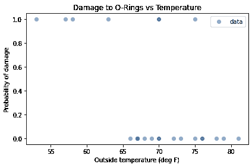
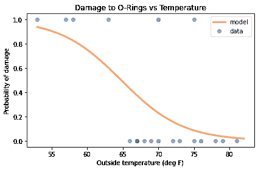
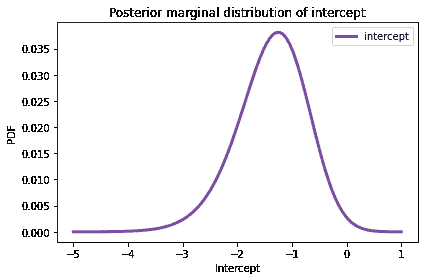
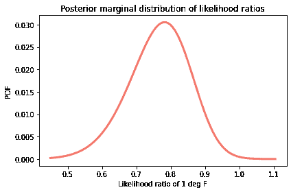
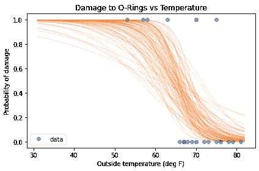
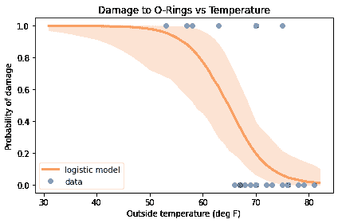
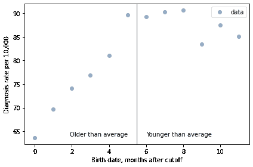
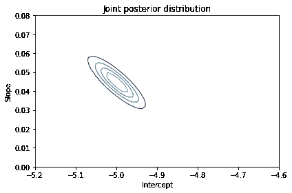
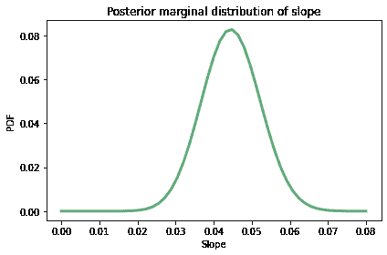

# 第十六章：逻辑回归

> 原文：[`allendowney.github.io/ThinkBayes2/chap16.html`](https://allendowney.github.io/ThinkBayes2/chap16.html)
> 
> 译者：[飞龙](https://github.com/wizardforcel)
> 
> 协议：[CC BY-NC-SA 4.0](http://creativecommons.org/licenses/by-nc-sa/4.0/)


本章介绍了两个相关主题：对数几率和逻辑回归。

在<<_BayessRule>>中，我们将贝叶斯定理重写为赔率的形式，并推导出贝叶斯定理，这可以是在纸上或心中进行贝叶斯更新的一种便捷方式。在本章中，我们将在对数刻度上研究贝叶斯定理，这可以揭示我们如何通过连续的更新积累证据。

这直接导致了逻辑回归，它基于证据与假设的对数几率之间的线性模型。作为例子，我们将使用航天飞机的数据来探索温度与 O 形密封圈损坏概率之间的关系。

作为练习，你将有机会模拟孩子上学时的年龄与被诊断为注意力缺陷多动障碍（ADHD）的概率之间的关系。

## 对数几率

当我在研究生学校时，我报名了一门关于计算理论的课程。在上课的第一天，我是第一个到达的。几分钟后，另一个学生到达了。

当时，计算机科学专业的学生中约 83%是男性，所以我对另一个学生是女性感到有些惊讶。

当另一个女学生几分钟后到达时，我开始觉得我可能在错误的房间里。当第三个女学生到达时，我确信我在错误的房间里。事实证明，我是对的。

我将利用这个轶事来演示贝叶斯定理在对数刻度上的应用，并展示它与逻辑回归的关系。

使用$H$代表我在正确的房间的假设，$F$代表第一个其他学生是女性的观察，我们可以这样写贝叶斯定理：

$$O(H|F) = O(H) \frac{P(F|H)}{P(F|not H)}$$

在看到其他学生之前，我确信我在正确的房间里，所以我可能会分配 10:1 的先验赔率：

$$O(H) = 10$$

如果我在正确的房间里，第一个女学生的可能性约为 17%。如果我不在正确的房间里，第一个女学生的可能性更接近 50%，

$$\frac{P(F|H)}{P(F|not H)} = 17 / 50$$

因此，似然比接近 1/3。应用贝叶斯定理，后验赔率为

$$O(H|F) = 10 / 3$$

两名学生之后，后验赔率为

$$O(H|FF) = 10 / 9$$

三名学生之后：

$$O(H|FFF) = 10 / 27$$

在那时，我怀疑我可能在错误的房间里是正确的。

以下表格显示了每次更新后的赔率、相应的概率以及每个步骤后的概率变化，以百分点表示。

Show code cell content Hide code cell content

```py
def prob(o):
    return o / (o+1) 
``` Show code cell source Hide code cell source

```py
import pandas as pd

index = ['prior', '1 student', '2 students', '3 students']

table = pd.DataFrame(index=index)
table['odds'] = [10, 10/3, 10/9, 10/27]
table['prob'] = prob(table['odds'])
table['prob diff'] = table['prob'].diff() * 100
table.fillna('--') 
```

|  | 奇数 | 概率 | 概率差 |
| --- | --- | --- | --- |
| 先验 | 10.000000 | 0.909091 | -- |
| 1 名学生 | 3.333333 | 0.769231 | -13.986014 |
| 2 名学生 | 1.111111 | 0.526316 | -24.291498 |
| 3 名学生 | 0.370370 | 0.270270 | -25.604552 |

每次更新使用相同的似然度，但概率的变化并不相同。第一次更新将概率减少了大约 14 个百分点，第二次减少了 24 个百分点，第三次减少了 26 个百分点。这对于这种更新是正常的，事实上是必要的；如果变化是相同大小的，我们很快就会得到负概率。

几率遵循更明显的模式。因为每次更新都将几率乘以相同的似然比，所以几率形成一个几何序列。这让我们考虑另一种表示不确定性的方式：**对数几率**，它是几率的对数，通常使用自然对数（以$e$为底）表示。

将对数几率添加到表中：

显示代码单元格源代码 隐藏代码单元格源代码

```py
import numpy as np

table['log odds'] = np.log(table['odds'])
table['log odds diff'] = table['log odds'].diff()
table.fillna('--') 
```

|  | 几率 | 概率 | 概率差 | 对数几率 | 对数几率差 |
| --- | --- | --- | --- | --- | --- |
| 先验 | 10.000000 | 0.909091 | -- | 2.302585 | -- |
| 1 名学生 | 3.333333 | 0.769231 | -13.986014 | 1.203973 | -1.098612 |
| 2 名学生 | 1.111111 | 0.526316 | -24.291498 | 0.105361 | -1.098612 |
| 3 名学生 | 0.370370 | 0.270270 | -25.604552 | -0.993252 | -1.098612 |

你可能会注意到：

+   当概率大于 0.5 时，几率大于 1，对数几率为正。

+   当概率小于 0.5 时，几率小于 1，对数几率为负数。

你可能还会注意到对数几率是等间距的。每次更新后对数几率的变化是似然比的对数。

```py
np.log(1/3) 
```

```py
-1.0986122886681098 
```

在这个例子中是正确的，我们可以通过对 Bayes 定理的两边取对数来证明这一点。

$$\log O(H|F) = \log O(H) + \log \frac{P(F|H)}{P(F|not H)}$$

在对数几率尺度上，贝叶斯更新是可加的。因此，如果$F^x$表示我在等待时到达$x$名女学生，那么我在正确房间的后验对数几率为：

$$\log O(H|F^x) = \log O(H) + x \log \frac{P(F|H)}{P(F|not H)}$$

这个方程表示对数似然比和后验对数几率之间的线性关系。

在这个例子中，线性方程是精确的，但即使不是，通常也可以使用线性函数来模拟解释变量$x$与以对数几率表示的因变量之间的关系，如下所示：

$$\log O(H | x) = \beta_0 + \beta_1 x$$

其中$\beta_0$和$\beta_1$是未知参数：

+   截距$\beta_0$是当$x$为 0 时的假设对数几率。

+   斜率$\beta_1$是似然比的对数。

这个方程是逻辑回归的基础。

## 航天飞机问题

作为逻辑回归的一个例子，我将解决 Cameron Davidson-Pilon 的书[*Bayesian Methods for Hackers*](http://nbviewer.jupyter.org/github/CamDavidsonPilon/Probabilistic-Programming-and-Bayesian-Methods-for-Hackers/blob/master/Chapter2_MorePyMC/Ch2_MorePyMC_PyMC2.ipynb)中的一个问题。他写道：

> “1986 年 1 月 28 日，美国航天飞机计划的第 25 次飞行在发射后不久，航天飞机挑战者号的火箭助推器之一爆炸，导致全部七名机组人员遇难。事故调查委员会得出的结论是，事故是由火箭助推器上的一个 O 形圈失效引起的，而这种失效是由于一个有缺陷的设计，使得 O 形圈对包括外部温度在内的多种因素敏感。在之前的 24 次飞行中，有 23 次（一次在海上丢失）有 O 形圈失效的数据可用，并且这些数据在挑战者号发射前的晚上进行了讨论，但不幸的是，只有 7 次飞行中发生损坏事件的数据被认为是重要的，而且这些数据被认为没有明显的趋势。”

该数据集最初来自[这篇论文](https://amstat.tandfonline.com/doi/abs/10.1080/01621459.1989.10478858)，也可以从[Davidson-Pilon](https://raw.githubusercontent.com/CamDavidsonPilon/Probabilistic-Programming-and-Bayesian-Methods-for-Hackers/master/Chapter2_MorePyMC/data/challenger_data.csv)获取。


```py
download('https://raw.githubusercontent.com/CamDavidsonPilon/Probabilistic-Programming-and-Bayesian-Methods-for-Hackers/master/Chapter2_MorePyMC/data/challenger_data.csv') 
```

我将读取数据并进行一些清理。


```py
data = pd.read_csv('challenger_data.csv', parse_dates=[0])

# avoiding column names with spaces
data.rename(columns={'Damage Incident': 'Damage'}, inplace=True)

# dropping row 3, in which Damage Incident is NaN,
# and row 24, which is the record for the Challenger
data.drop(labels=[3, 24], inplace=True)

# convert the Damage column to integer
data['Damage'] = data['Damage'].astype(int)

data 
```

|  | 日期 | 温度 | 损坏 |
| --- | --- | --- | --- |
| 0 | 1981-04-12 | 66 | 0 |
| 1 | 1981-11-12 | 70 | 1 |
| 2 | 1982-03-22 | 69 | 0 |
| 4 | 1982-01-11 | 68 | 0 |
| 5 | 1983-04-04 | 67 | 0 |
| 6 | 1983-06-18 | 72 | 0 |
| 7 | 1983-08-30 | 73 | 0 |
| 8 | 1983-11-28 | 70 | 0 |
| 9 | 1984-02-03 | 57 | 1 |
| 10 | 1984-04-06 | 63 | 1 |
| 11 | 1984-08-30 | 70 | 1 |
| 12 | 1984-10-05 | 78 | 0 |
| 13 | 1984-11-08 | 67 | 0 |
| 14 | 1985-01-24 | 53 | 1 |
| 15 | 1985-04-12 | 67 | 0 |
| 16 | 1985-04-29 | 75 | 0 |
| 17 | 1985-06-17 | 70 | 0 |
| 18 | 1985-07-29 | 81 | 0 |
| 19 | 1985-08-27 | 76 | 0 |
| 20 | 1985-10-03 | 79 | 0 |
| 21 | 1985-10-30 | 75 | 1 |
| 22 | 1985-11-26 | 76 | 0 |

| 23 | 1986-01-12 | 58 | 1 |

以下是前几行：

显示代码单元格源代码隐藏代码单元格源代码

```py
data.head() 
```

|  | 日期 | 温度 | 损坏 |
| --- | --- | --- | --- |
| 0 | 1981-04-12 | 66 | 0 |
| 1 | 1981-11-12 | 70 | 1 |
| 2 | 1982-03-22 | 69 | 0 |
| 4 | 1982-01-11 | 68 | 0 |
| 5 | 1983-04-04 | 67 | 0 |

列如下：

+   `日期`：发射日期，

+   `温度`：华氏温度，

+   `损坏`：如果发生损坏事件，则为`1`，否则为`0`。

数据集中有 23 次发射，其中 7 次发生了损坏事件。


```py
len(data), data['Damage'].sum() 
```

```py
(23, 7) 
```

以下图显示了损坏和温度之间的关系。

显示代码单元格源代码隐藏代码单元格源代码

```py
import matplotlib.pyplot as plt
from utils import decorate

def plot_data(data):
  """Plot damage as a function of temperature.

 data: DataFrame
 """
    plt.plot(data['Temperature'], data['Damage'], 'o', 
             label='data', color='C0', alpha=0.4)

    decorate(ylabel="Probability of damage",
         xlabel="Outside temperature (deg F)",
         title="Damage to O-Rings vs Temperature") 
``` 显示代码单元格源代码隐藏代码单元格源代码

```py
plot_data(data) 
``` 

当室外温度低于 65 度时，O 形圈总是会受损。当温度高于 65 度时，通常不会受损。

根据这个图，似乎有理由认为损坏的概率与温度有关。如果我们假设这个概率遵循逻辑模型，我们可以写成：

$$\log O(H | x) = \beta_0 + \beta_1 x$$

其中$H$是 O 形圈将受损的假设，$x$是温度，$\beta_0$和$\beta_1$是我们将要估计的参数。出于我很快会解释的原因，我将定义$x$为温度，通过一个偏移量进行了平移，使其平均值为 0。

```py
offset = data['Temperature'].mean().round()
data['x'] = data['Temperature'] - offset
offset 
```

```py
70.0 
```

为了保持一致，我将创建一个名为`y`的`Damage`列的副本。

```py
data['y'] = data['Damage'] 
```

在进行贝叶斯更新之前，我将使用`statsmodels`来运行传统（非贝叶斯）逻辑回归。

```py
import statsmodels.formula.api as smf

formula = 'y ~ x'
results = smf.logit(formula, data=data).fit(disp=False)
results.params 
```

```py
Intercept   -1.208490
x           -0.232163
dtype: float64 
```

`results`包含每个参数的“点估计”，即单个值而不是后验分布。

截距约为-1.2，估计斜率约为-0.23。为了查看这些参数的含义，我将使用它们来计算一系列温度的概率。以下是范围：

```py
inter = results.params['Intercept']
slope = results.params['x']
xs = np.arange(53, 83) - offset 
```

我们可以使用逻辑回归方程来计算对数几率：

```py
log_odds = inter + slope * xs 
```

然后转换为概率。

```py
odds = np.exp(log_odds)
ps = odds / (odds + 1) 
```


```py
ps.mean() 
```

```py
0.4155141126966854 
```

将对数几率转换为概率是一个很常见的操作，它有一个名字，`expit`，SciPy 提供了一个计算它的函数。

```py
from scipy.special import expit

ps = expit(inter + slope * xs) 
```


```py
ps.mean() 
```

```py
0.4155141126966854 
```

这是具有这些估计参数的逻辑模型的样子。

显示代码单元格源代码 隐藏代码单元格源代码

```py
plt.plot(xs+offset, ps, label='model', color='C1')

plot_data(data) 
``` 

在低温下，损坏的概率很高；在高温下，它接近于 0。

但这是基于传统的逻辑回归。现在我们将进行贝叶斯版本。

## 先验分布

我将为两个参数使用均匀分布，使用上一节的点估计来帮助我选择上限和下限。

```py
from utils import make_uniform

qs = np.linspace(-5, 1, num=101)
prior_inter = make_uniform(qs, 'Intercept') 
```

```py
qs = np.linspace(-0.8, 0.1, num=101)
prior_slope = make_uniform(qs, 'Slope') 
```

我们可以使用`make_joint`来构建联合先验分布。

```py
from utils import make_joint

joint = make_joint(prior_inter, prior_slope) 
```

`intercept`的值沿着列进行，`slope`的值沿着行进行。

对于这个问题，将先验“堆叠”起来，使参数成为`MultiIndex`中的级别，并将结果放入`Pmf`中会很方便。

```py
from empiricaldist import Pmf

joint_pmf = Pmf(joint.stack())
joint_pmf.head() 
```

|  |  | 概率 |
| --- | --- | --- |
| --- | --- | ---  |
| 斜率 | 截距 |  |
| --- | --- | ---  |
| -0.8 | -5.00 | 0.000098 |
| -4.94 | 0.000098 |
| -4.88 | 0.000098 |

`joint_pmf`是一个具有索引中的两个级别的`Pmf`，一个用于每个参数。这使得很容易循环遍历可能的参数对，正如我们将在下一节中看到的那样。

## 可能性

要进行更新，我们必须计算每对参数的数据的可能性。

为了使这更容易，我将按温度`x`对数据进行分组，并计算每个温度的发射次数和损坏事件的次数。

```py
grouped = data.groupby('x')['y'].agg(['count', 'sum'])
grouped.head() 
```

|  | 计数 | 总和 |
| --- | --- | --- |
| --- | --- | ---  |
| x |  |  |
| --- | --- | ---  |
| -17.0 | 1 | 1 |
| -13.0 | 1 | 1 |
| -12.0 | 1 | 1 |
| -7.0 | 1 | 1 |
| -4.0 | 1 | 0 |

结果是一个`DataFrame`，有两列：`count`是每个温度的发射次数；`sum`是损坏事件的次数。为了与二项分布的参数一致，我将它们分配给名为`ns`和`ks`的变量。

```py
ns = grouped['count']
ks = grouped['sum'] 
```

要计算数据的可能性，让我们暂时假设我们刚刚估计的参数`slope`和`inter`是正确的。

我们可以使用它们来计算每次发射温度的损坏概率，如下所示：

```py
xs = grouped.index
ps = expit(inter + slope * xs) 
```

`ps`包含根据模型每次发射温度的损坏概率。

现在，对于每个温度，我们有`ns`，`ps`和`ks`；我们可以使用二项分布来计算数据的可能性。

```py
from scipy.stats import binom

likes = binom.pmf(ks, ns, ps)
likes 
```

```py
array([0.93924781, 0.85931657, 0.82884484, 0.60268105, 0.56950687,
       0.24446388, 0.67790595, 0.72637895, 0.18815003, 0.8419509 ,
       0.87045398, 0.15645171, 0.86667894, 0.95545945, 0.96435859,
       0.97729671]) 
```

`likes`的每个元素是在`n`次发射中看到`k`次损坏事件的概率，如果损坏的概率是`p`。整个数据集的可能性是该数组的乘积。

```py
likes.prod() 
```

```py
0.0004653644508250066 
```

这就是我们如何计算特定参数对的数据可能性。现在我们可以计算所有可能对的数据可能性：

```py
likelihood = joint_pmf.copy()
for slope, inter in joint_pmf.index:
    ps = expit(inter + slope * xs)
    likes = binom.pmf(ks, ns, ps)
    likelihood[slope, inter] = likes.prod() 
```

为了初始化`likelihood`，我们复制`joint_pmf`，这是一种确保`likelihood`具有与`joint_pmf`相同的类型、索引和数据类型的便捷方式。

循环迭代参数。对于每个可能的对，它使用逻辑模型计算`ps`，计算数据的可能性，并将结果分配给`likelihood`中的一行。

## 更新

现在我们可以以通常的方式计算后验分布。

```py
posterior_pmf = joint_pmf * likelihood
posterior_pmf.normalize() 
```

因为我们使用了均匀先验，具有最高可能性的参数对也是具有最大后验概率的参数对：


```py
pd.Series(posterior_pmf.max_prob(),
          index=['slope', 'inter']) 
```

```py
slope   -0.233
inter   -1.220
dtype: float64 
```

因此，我们可以确认贝叶斯更新的结果与 StatsModels 计算的最大似然估计一致：


```py
results.params 
```

```py
Intercept   -1.208490
x           -0.232163
dtype: float64 
```

它们大致相同，在我们使用的网格的精度范围内。

如果我们取消堆叠后验`Pmf`，我们可以绘制联合后验分布的轮廓图。

```py
from utils import plot_contour

joint_posterior = posterior_pmf.unstack()
plot_contour(joint_posterior)
decorate(title='Joint posterior distribution') 
```


等高线图中的椭圆沿对角线排列，这表明后验分布中的`slope`和`inter`之间存在一定的相关性。

但相关性很弱，这也是我们在计算`x`时减去平均发射温度的原因之一；居中数据最小化了参数之间的相关性。

**练习：** 为了了解为什么这很重要，回去将`offset=60`并再次运行分析。斜率应该是相同的，但截距将会不同。如果绘制联合分布，得到的等高线将会被拉长，表明估计参数之间的相关性更强。

理论上，这种相关性并不是问题，但在实践中是问题。对于未居中的数据，后验分布更加分散，因此更难以覆盖联合先验分布。居中数据最大化了估计的精度；对于未居中的数据，我们需要进行更多的计算才能获得相同的精度。

## 边际分布

最后，我们可以提取边际分布。

```py
from utils import marginal

marginal_inter = marginal(joint_posterior, 0)
marginal_slope = marginal(joint_posterior, 1) 
```

这是`inter`的后验分布。

显示代码单元格源代码 隐藏代码单元格源代码

```py
marginal_inter.plot(label='intercept', color='C4')

decorate(xlabel='Intercept',
         ylabel='PDF',
         title='Posterior marginal distribution of intercept') 
``` 

这是`slope`的后验分布。

显示代码单元格源代码 隐藏代码单元格源代码

```py
marginal_slope.plot(label='slope', color='C2')

decorate(xlabel='Slope',
         ylabel='PDF',
         title='Posterior marginal distribution of slope') 
``` 

这是后验均值。


```py
pd.Series([marginal_inter.mean(), marginal_slope.mean()],
          index=['inter', 'slope']) 
```

```py
inter   -1.376107
slope   -0.289795
dtype: float64 
```

两个边际分布都有适度的偏斜，因此后验均值与点估计略有不同。


```py
results.params 
```

```py
Intercept   -1.208490
x           -0.232163
dtype: float64 
```

## 转换分布

让我们解释这些参数。回想一下，当 $x$ 为 0 时，也就是温度约为 70 华氏度（`offset`的值）时，截距是假设的对数几率。因此，我们可以将`marginal_inter`中的数量解释为对数几率。

为了将它们转换为概率，我将使用以下函数，该函数通过应用给定的函数来转换`Pmf`中的数量：

```py
def transform(pmf, func):
  """Transform the quantities in a Pmf."""
    ps = pmf.ps
    qs = func(pmf.qs)
    return Pmf(ps, qs, copy=True) 
```

如果我们调用`transform`并将`expit`作为参数传递，它将把`marginal_inter`中的对数几率转换为概率，并返回用概率表示的`inter`的后验分布。

```py
marginal_probs = transform(marginal_inter, expit) 
```

`Pmf`提供了一个`transform`方法，可以做同样的事情。

```py
marginal_probs = marginal_inter.transform(expit) 
```

这是温度为 70 华氏度时损坏概率的后验分布。

显示代码单元格源代码 隐藏代码单元格源代码

```py
marginal_probs.plot(color='C1')

decorate(xlabel='Probability of damage at 70 deg F',
         ylabel='PDF',
         title='Posterior marginal distribution of probabilities') 
``` 

这个分布的均值约为 22%，这是根据模型在 70 华氏度时的损坏概率。


```py
mean_prob = marginal_probs.mean()
mean_prob 
```

```py
0.2201937884647988 
```

这个结果显示了我将`x`定义为温度为 70 华氏度时为零的第二个原因；这样，截距对应于相关温度下的损坏概率，而不是 0 华氏度。

现在让我们更仔细地看一下估计的斜率。在逻辑模型中，参数 $\beta_1$ 是似然比的对数。

因此，我们可以将`marginal_slope`中的数量解释为对数似然比，并且我们可以使用`exp`将它们转换为似然比（也称为贝叶斯因子）。

```py
marginal_lr = marginal_slope.transform(np.exp) 
```

结果是似然比的后验分布；这是它的样子。

显示代码单元格源代码 隐藏代码单元格源代码

```py
marginal_lr.plot(color='C3')

decorate(xlabel='Likelihood ratio of 1 deg F',
         ylabel='PDF',
         title='Posterior marginal distribution of likelihood ratios') 
``` 

```py
mean_lr = marginal_lr.mean()
mean_lr 
```

```py
0.7542914170110268 
```

这个分布的均值约为 0.75，这意味着每增加一华氏度都会提供反对损坏可能性的证据，似然比（贝叶斯因子）为 0.75。

注意：

+   我通过将截距的边际分布转换为概率的边际分布，然后计算均值，计算了 70 华氏度下损坏概率的后验均值。

+   我通过将斜率的边际分布转换为似然比的边际分布，然后计算均值，计算了似然比的后验均值。

这是正确的操作顺序，而不是首先计算后验均值，然后再进行转换。

为了看到区别，让我们以另一种方式计算这两个值。这是`marginal_inter`的后验均值，转换为概率，与`marginal_probs`的均值进行比较。


```py
expit(marginal_inter.mean()), marginal_probs.mean() 
```

```py
(0.2016349762400815, 0.2201937884647988) 
```

这是`marginal_slope`的后验均值，转换为似然比，与`marginal_lr`的均值进行比较。


```py
np.exp(marginal_slope.mean()), marginal_lr.mean() 
```

```py
(0.7484167954660071, 0.7542914170110268) 
```

在这个例子中，差异并不是很大，但有时可能会很大。作为一般规则，首先进行转换，然后计算摘要统计。

## 预测分布

在逻辑模型中，参数是可以解释的，至少在转换之后是这样。但通常我们关心的是预测，而不是参数。在航天飞机的问题中，最重要的预测是：“如果室外温度为 31 华氏度，O 形圈损坏的概率是多少？”

为了进行这种预测，我将从后验分布中抽取参数对的样本。

```py
sample = posterior_pmf.choice(101) 
```

结果是一个包含 101 个元组的数组，每个元组代表一对可能的参数。我选择这个样本大小是为了加快计算速度。增加样本大小不会改变结果太多，但会更加精确一些。


```py
sample.shape 
```

```py
(101,) 
``` 

```py
sample.dtype 
```

```py
dtype('O') 
``` 

```py
type(sample[0]) 
```

```py
tuple 
```

为了生成预测，我将使用从 31 华氏度（挑战者号发射时的温度）到 82 华氏度（观测到的最高温度）的一系列温度。

```py
temps = np.arange(31, 83)
xs = temps - offset 
```

以下循环使用`xs`和参数样本来构建预测概率数组。

```py
pred = np.empty((len(sample), len(xs)))

for i, (slope, inter) in enumerate(sample):
    pred[i] = expit(inter + slope * xs) 
```

结果每个`xs`值对应一列，每个`sample`元素对应一行。

为了快速了解预测的样子，我们可以循环遍历行并绘制它们。


```py
for ps in pred:
    plt.plot(temps, ps, color='C1', lw=0.5, alpha=0.4)

plot_data(data) 
```



这个图中重叠的线条给出了每个温度下最可能的值和不确定性程度。

在每一列中，我将计算中位数来量化中心趋势，并计算 90%的可信区间来量化不确定性。

`np.percentile`计算给定百分位数；使用参数`axis=0`，它会为每一列计算百分位数。

```py
low, median, high = np.percentile(pred, [5, 50, 95], axis=0) 
```

结果是包含了 90% CI 下限、中位数和 CI 上限的预测概率的数组。

这就是它们的样子：

显示代码单元格源代码 隐藏代码单元格源代码

```py
plt.fill_between(temps, low, high, color='C1', alpha=0.2)
plt.plot(temps, median, color='C1', label='logistic model')

plot_data(data) 
``` 

根据这些结果，80 华氏度时 O 形圈损坏的概率接近 2%，但对于该预测存在一些不确定性；CI 的上限约为 10%。

在 60 度时，损坏的概率接近 80%，但 CI 甚至更宽，从 48%到 97%。

但模型的主要目标是预测 31 华氏度时损坏的概率，答案至少为 97%，更可能超过 99.9%。


```py
low = pd.Series(low, temps)
median = pd.Series(median, temps)
high = pd.Series(high, temps) 
``` 

```py
t = 80
print(median[t], (low[t], high[t])) 
```

```py
0.016956535510200765 (0.000563939208692237, 0.1335417225332125) 
``` 

```py
t = 60
print(median[t], (low[t], high[t])) 
```

```py
0.7738185742694538 (0.45512110762641983, 0.9654437697137236) 
``` 

```py
t = 31
print(median[t], (low[t], high[t])) 
```

```py
0.9998129598124814 (0.97280101769455, 0.999999987740933) 
```

我们可能得出的一个结论是：如果负责挑战者号发射的人考虑了所有的数据，而不仅仅是七次损坏事件，他们本来可以预测到 31 华氏度时损坏的概率几乎是确定的。如果他们这样做了，很可能会推迟发射。

同时，如果他们考虑了前面的图表，他们可能会意识到模型做出的预测远远超出了数据范围。当我们这样外推时，我们不仅要记住模型量化的不确定性，即我们表达为可信区间的不确定性；我们还必须考虑模型本身可能不可靠的可能性。

这个例子是基于一个逻辑模型，假设每增加一度温度都会对损坏的可能性提供相同数量的证据。在一个狭窄的温度范围内，这可能是一个合理的假设，特别是如果有数据支持。但在更广泛的范围内，以及超出数据范围之外，现实没有义务遵循模型。

## 经验贝叶斯

在本章中，我使用 StatsModels 来计算最大化数据概率的参数，然后使用这些估计值来选择均匀先验分布的边界。你可能已经意识到，这个过程使用了数据两次，一次是选择先验，一次是进行更新。如果这让你感到不安，你并不孤单。我使用的这个过程是所谓的[经验贝叶斯方法](https://en.wikipedia.org/wiki/Empirical_Bayes_method)的一个例子，尽管我认为这不是一个特别好的名字。

虽然使用数据两次可能看起来有问题，在这些例子中并不是。要明白为什么，考虑一个替代方案：而不是使用估计的参数来选择先验分布的边界，我可以使用范围更广的均匀分布。在这种情况下，结果将是一样的；唯一的区别是我会花更多的时间计算后验概率极小的参数的似然。

因此，你可以将这个版本的经验贝叶斯视为一种优化，通过将先验分布放在值得计算数据的似然处，从而最小化计算。这种优化不会影响结果，因此不会“双重计算”数据。

## 总结

到目前为止，我们已经看到了三种表示对假设信心程度的方法：概率、几率和对数几率。当我们用对数几率来写贝叶斯定理时，贝叶斯更新是先验和似然的总和；在这个意义上，贝叶斯统计是假设和证据的算术。

这种形式的贝叶斯定理也是逻辑回归的基础，我们用它来推断参数和做预测。在航天飞机问题中，我们建立了温度和损坏概率之间的关系，并表明挑战者号灾难可能是可以预测的。但这个例子也警示了使用模型远超出数据范围的危险。

在下面的练习中，你将有机会练习本章的材料，使用对数几率来评估政治专家，并使用逻辑回归来模拟注意力缺陷多动障碍（ADHD）的诊断率。

在下一章中，我们将从逻辑回归转向线性回归，我们将用它来模拟温度、降雪和马拉松世界纪录的时间变化。

## 练习

**练习：**假设一个政治专家声称能够预测选举结果，但他并不是选择赢家，而是给每个候选人一个获胜的概率。对于这种预测，很难说它是对还是错。

例如，假设专家说爱丽丝有 70%的机会击败鲍勃，然后鲍勃赢得了选举。这是否意味着专家是错误的？

回答这个问题的一种方法是考虑两种假设：

+   `H`：专家的算法是合法的；它产生的概率在某种意义上正确地反映了候选人获胜的概率。

+   `not H`：专家的算法是虚假的；它产生的概率是平均为 50%的随机值。

如果专家说爱丽丝有 70%的获胜机会，她确实获胜了，这提供了支持`H`的证据，其似然比为 70/50。

如果专家说爱丽丝有 70%的获胜机会，她输了，这是反对`H`的证据，其似然比为 50/30。

假设我们对算法有一些信心，所以先验几率是 4 比 1。并且假设专家对三次选举进行了预测：

+   在第一次选举中，专家说爱丽丝有 70%的获胜机会，她确实获胜了。

+   在第二次选举中，专家说鲍勃有 30%的获胜机会，他确实获胜了。

+   在第三次选举中，专家说卡罗尔有 90%的获胜机会，她确实获胜了。

每个结果的对数似然比是多少？使用贝叶斯定理的对数几率形式来计算这些结果后的后验对数几率。总的来说，这些结果增加还是减少了你对专家的信心？

如果你对这个话题感兴趣，你可以[在这篇博客文章中阅读更多内容](http://allendowney.blogspot.com/2016/11/why-are-we-so-surprised.html)。


```py
# Solution

prior_log_odds = np.log(4)
prior_log_odds 
```

```py
1.3862943611198906 
``` 

```py
# Solution

lr1 = np.log(7/5)
lr2 = np.log(3/5)
lr3 = np.log(9/5)

lr1, lr2, lr3 
```

```py
(0.3364722366212129, -0.5108256237659907, 0.5877866649021191) 
``` 

```py
# Solution

# In total, these three outcomes provide evidence that the
# pundit's algorithm is legitmate, although with K=1.8,
# it is weak evidence.

posterior_log_odds = prior_log_odds + lr1 + lr2 + lr3
posterior_log_odds 
```

```py
1.7997276388772319 
```

**练习：**《新英格兰医学杂志》上的一篇文章报告了一项研究的结果，该研究调查了多动症（ADHD）的诊断率与出生月份的关系：[“多动症和入学月份”](https://www.nejm.org/doi/10.1056/NEJMoa1806828)。

他们发现，在六月、七月和八月出生的儿童被诊断为多动症的可能性要大得多，与九月出生的儿童相比，但只有在那些将九月作为幼儿园入学截止日期的州。 在这些州，八月出生的孩子比九月出生的孩子小近一年开始上学。 该研究的作者认为原因是“行为上的年龄差异可能被归因于多动症，而不是孩子年龄较小”。

使用本章的方法来估计诊断概率作为出生月份的函数。 本章的笔记本提供了数据和一些建议，可以开始使用。

文章中包括这张图：


在我看来，这种数据的表现形式并没有清楚地显示出效果。

但是这张图包括原始数据，所以我们可以自己分析它。

注意：图中有一个错误，通过个人通信确认：

> 五月和六月的[诊断]被颠倒了。 五月应该是 317（而不是 287），六月应该是 287（而不是 317）。

所以这是更正后的数据，其中`n`是每个月出生的孩子人数，从一月开始，`k`是被诊断为多动症的孩子人数。


```py
n = np.array([32690, 31238, 34405, 34565, 34977, 34415, 
                   36577, 36319, 35353, 34405, 31285, 31617])

k = np.array([265, 280, 307, 312, 317, 287, 
                      320, 309, 225, 240, 232, 243]) 
```

首先，我将“滚动”数据，使其从九月开始，而不是一月。


```py
x = np.arange(12)
n = np.roll(n, -8)
k = np.roll(k, -8) 
```

然后我将把它放在一个`DataFrame`中，每个月一行，每万人中的诊断率。


```py
adhd = pd.DataFrame(dict(x=x, k=k, n=n))
adhd['rate'] = adhd['k'] / adhd['n'] * 10000
adhd 
```

|  | x | k | n | 率 |
| --- | --- | --- | --- | --- |
| 0 | 0 | 225 | 35353 | 63.643821 |
| 1 | 1 | 240 | 34405 | 69.757303 |
| 2 | 2 | 232 | 31285 | 74.156944 |
| 3 | 3 | 243 | 31617 | 76.857387 |
| 4 | 4 | 265 | 32690 | 81.064546 |
| 5 | 5 | 280 | 31238 | 89.634420 |
| 6 | 6 | 307 | 34405 | 89.231216 |
| 7 | 7 | 312 | 34565 | 90.264719 |
| 8 | 8 | 317 | 34977 | 90.630986 |
| 9 | 9 | 287 | 34415 | 83.393869 |
| 10 | 10 | 320 | 36577 | 87.486672 |

| 11 | 11 | 309 | 36319 | 85.079435 |

这就是诊断率的样子。


```py
def plot_adhd(adhd):
    plt.plot(adhd['x'], adhd['rate'], 'o', 
             label='data', color='C0', alpha=0.4)

    plt.axvline(5.5, color='gray', alpha=0.2)
    plt.text(6, 64, 'Younger than average')
    plt.text(5, 64, 'Older than average', horizontalalignment='right')

    decorate(xlabel='Birth date, months after cutoff',
             ylabel='Diagnosis rate per 10,000') 
``` 

```py
plot_adhd(adhd) 
```



对于前 9 个月，从 9 月到 5 月，我们看到了如果一些过多的诊断是由于“基于年龄的行为变异”而导致的情况。对于年龄差异的每个月，我们都看到诊断数量的增加。

这种模式在过去的三个月，即 6 月、7 月和 8 月，都有所下降。这可能可以用随机变异来解释，但也可能是由于父母的操纵；如果一些父母推迟了接近截止日期出生的孩子，这些月份的观察结果将包括一些相对年龄较大、因此更不可能被诊断的孩子。

不幸的是，数据集只包括出生月份，没有年份，所以我们不知道这些学生在开始上学时的实际年龄。然而，我们可以使用前九个月来估计年龄对诊断率的影响；然后我们可以考虑如何处理其他三个月。

使用本章的方法来估计诊断的概率作为出生月份的函数。从以下先验分布开始。


```py
qs = np.linspace(-5.2, -4.6, num=51)
prior_inter = make_uniform(qs, 'Intercept') 
``` 

```py
qs = np.linspace(0.0, 0.08, num=51)
prior_slope = make_uniform(qs, 'Slope') 
```

1.  制作一个联合先验分布，并使用前九个月的数据对其进行更新。

1.  然后从后验分布中抽取一个样本，并用它来计算每个月的诊断概率的中位数和 90%的可信区间。

1.  作为一个额外的练习，使用过去三个月的数据进行第二次更新，但将观察到的诊断数量视为如果没有孩子被留下来会有的诊断数量的下限。


```py
# Solution

joint = make_joint(prior_inter, prior_slope)
joint.head() 
```

| 截距 | -5.200 | -5.188 | -5.176 | -5.164 | -5.152 | -5.140 | -5.128 | -5.116 | -5.104 | -5.092 | ... | -4.708 | -4.696 | -4.684 | -4.672 | -4.660 | -4.648 | -4.636 | -4.624 | -4.612 | -4.600 |
| --- | --- | --- | --- | --- | --- | --- | --- | --- | --- | --- | --- | --- | --- | --- | --- | --- | --- | --- | --- | --- | --- |
| 斜率 |  |  |  |  |  |  |  |  |  |  |  |  |  |  |  |  |  |  |  |  |  |
| --- | --- | --- | --- | --- | --- | --- | --- | --- | --- | --- | --- | --- | --- | --- | --- | --- | --- | --- | --- | --- | --- |
| 0.0000 | 0.000384 | 0.000384 | 0.000384 | 0.000384 | 0.000384 | 0.000384 | 0.000384 | 0.000384 | 0.000384 | 0.000384 | ... | 0.000384 | 0.000384 | 0.000384 | 0.000384 | 0.000384 | 0.000384 | 0.000384 | 0.000384 | 0.000384 | 0.000384 |
| 0.0016 | 0.000384 | 0.000384 | 0.000384 | 0.000384 | 0.000384 | 0.000384 | 0.000384 | 0.000384 | 0.000384 | 0.000384 | ... | 0.000384 | 0.000384 | 0.000384 | 0.000384 | 0.000384 | 0.000384 | 0.000384 | 0.000384 | 0.000384 | 0.000384 |
| 0.0032 | 0.000384 | 0.000384 | 0.000384 | 0.000384 | 0.000384 | 0.000384 | 0.000384 | 0.000384 | 0.000384 | 0.000384 | ... | 0.000384 | 0.000384 | 0.000384 | 0.000384 | 0.000384 | 0.000384 | 0.000384 | 0.000384 | 0.000384 | 0.000384 |
| 0.0048 | 0.000384 | 0.000384 | 0.000384 | 0.000384 | 0.000384 | 0.000384 | 0.000384 | 0.000384 | 0.000384 | 0.000384 | ... | 0.000384 | 0.000384 | 0.000384 | 0.000384 | 0.000384 | 0.000384 | 0.000384 | 0.000384 | 0.000384 | 0.000384 |
| 0.0064 | 0.000384 | 0.000384 | 0.000384 | 0.000384 | 0.000384 | 0.000384 | 0.000384 | 0.000384 | 0.000384 | 0.000384 | ... | 0.000384 | 0.000384 | 0.000384 | 0.000384 | 0.000384 | 0.000384 | 0.000384 | 0.000384 | 0.000384 | 0.000384 |

5 行×51 列 

```py
# Solution

joint_pmf = Pmf(joint.stack())
joint_pmf.head() 
```

|  |  | 概率 |
| --- | --- | --- |
| 斜率 | 截距 |  |
| --- | --- | --- |
| 0.0 | -5.200 | 0.000384 |
| -5.188 | 0.000384 |

| -5.176 | 0.000384 | 

```py
# Solution

num_legit = 9
adhd1 = adhd.loc[0:num_legit-1]
adhd2 = adhd.loc[num_legit:]
adhd1 
```

|  | x | k | n | rate |
| --- | --- | --- | --- | --- |
| 0 | 0 | 225 | 35353 | 63.643821 |
| 1 | 1 | 240 | 34405 | 69.757303 |
| 2 | 2 | 232 | 31285 | 74.156944 |
| 3 | 3 | 243 | 31617 | 76.857387 |
| 4 | 4 | 265 | 32690 | 81.064546 |
| 5 | 5 | 280 | 31238 | 89.634420 |
| 6 | 6 | 307 | 34405 | 89.231216 |
| 7 | 7 | 312 | 34565 | 90.264719 |

| 8 | 8 | 317 | 34977 | 90.630986 | 

```py
# Solution

adhd2 
```

|  | x | k | n | rate |
| --- | --- | --- | --- | --- |
| 9 | 9 | 287 | 34415 | 83.393869 |
| 10 | 10 | 320 | 36577 | 87.486672 |

| 11 | 11 | 309 | 36319 | 85.079435 | 

```py
# Solution

from scipy.stats import binom

likelihood1 = joint_pmf.copy()

xs = adhd1['x']
ks = adhd1['k']
ns = adhd1['n']

for slope, inter in joint_pmf.index:
    ps = expit(inter + slope * xs)
    likes = binom.pmf(ks, ns, ps)
    likelihood1[slope, inter] = likes.prod()

likelihood1.sum() 
```

```py
3.5436858189129196e-14 
``` 

```py
# Solution

# This update uses the binomial survival function to compute
# the probability that the number of cases *exceeds* `ks`.

likelihood2 = joint_pmf.copy()

xs = adhd2['x']
ks = adhd2['k']
ns = adhd2['n']

for slope, inter in joint_pmf.index:
    ps = expit(inter + slope * xs)
    likes = binom.sf(ks, ns, ps)
    likelihood2[slope, inter] = likes.prod()

likelihood2.sum() 
```

```py
1905.3511925068485 
``` 

```py
# Solution

posterior_pmf = joint_pmf * likelihood1
posterior_pmf.normalize() 
```

```py
1.3624320718619453e-17 
``` 

```py
# Solution

posterior_pmf.max_prob() 
```

```py
(0.0448, -4.996) 
``` 

```py
# Solution

posterior_pmf = joint_pmf * likelihood1 * likelihood2
posterior_pmf.normalize() 
```

```py
1.3403142133315614e-17 
``` 

```py
# Solution

posterior_pmf.max_prob() 
```

```py
(0.0448, -4.996) 
``` 

```py
# Solution

joint_posterior = posterior_pmf.unstack()

plot_contour(joint_posterior)
decorate(title='Joint posterior distribution') 
```



```py
# Solution

marginal_inter = marginal(joint_posterior, 0)
marginal_slope = marginal(joint_posterior, 1)

marginal_inter.mean(), marginal_slope.mean() 
```

```py
(-4.999322906782624, 0.044607616771986124) 
``` 

```py
# Solution

marginal_inter.plot(color='C4')
decorate(xlabel='Intercept',
         ylabel='PDF',
         title='Posterior marginal distribution of intercept') 
```


```py
# Solution

marginal_slope.plot(color='C2')

decorate(xlabel='Slope',
         ylabel='PDF',
         title='Posterior marginal distribution of slope') 
```



```py
# Solution

sample = posterior_pmf.choice(101)
xs = adhd['x']
ps = np.empty((len(sample), len(xs)))

for i, (slope, inter) in enumerate(sample):
    ps[i] = expit(inter + slope * xs)

ps.shape 
```

```py
(101, 12) 
``` 

```py
# Solution

low, median, high = np.percentile(ps, [2.5, 50, 97.5], axis=0)
median 
```

```py
array([0.00663988, 0.00695303, 0.00728085, 0.00762401, 0.00798321,
       0.00835919, 0.00875272, 0.00915734, 0.00955774, 0.00997548,
       0.01043603, 0.01094356]) 
``` 

```py
# Solution

plt.fill_between(xs, low*10000, high*10000, 
                 color='C1', alpha=0.2)

plt.plot(xs, median*10000, label='model',
         color='C1', alpha=0.5)

plot_adhd(adhd) 
```


