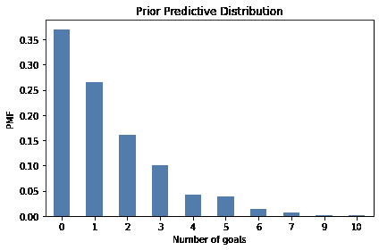
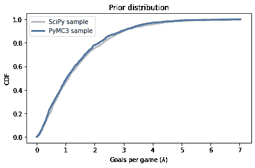
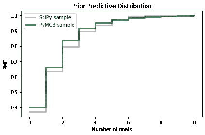
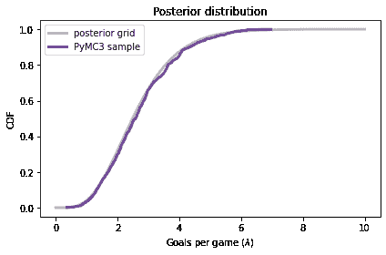
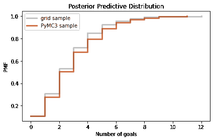
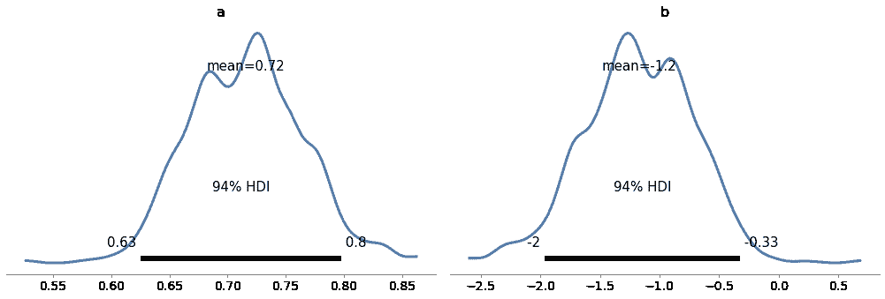
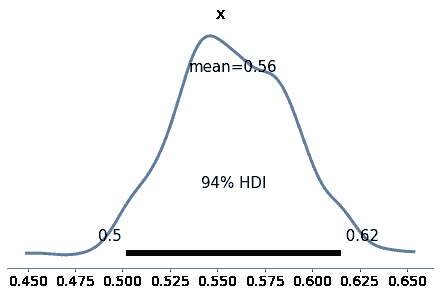
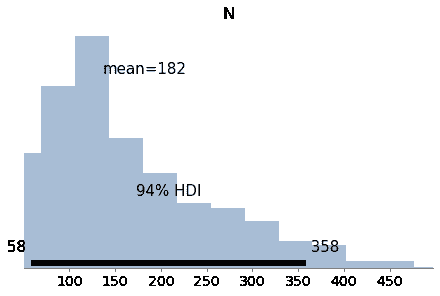
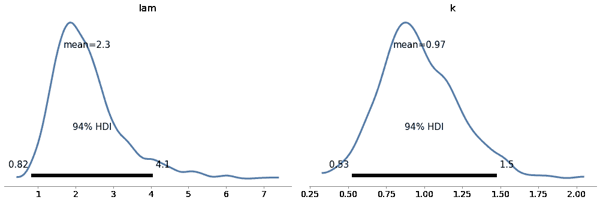
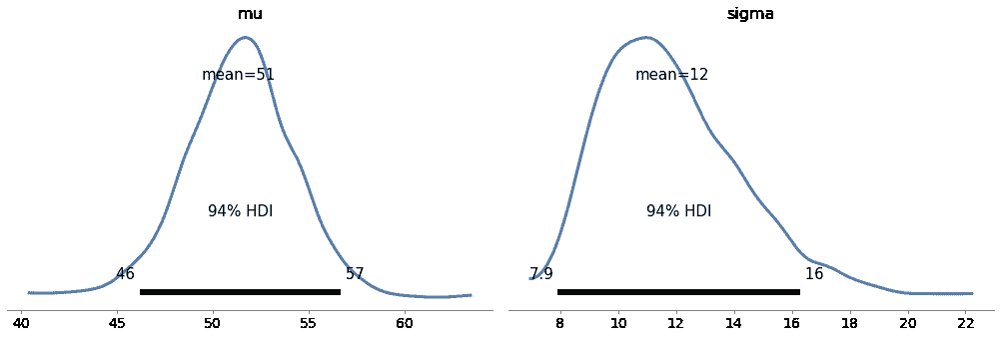

# 第十九章：MCMC

> 原文：[`allendowney.github.io/ThinkBayes2/chap19.html`](https://allendowney.github.io/ThinkBayes2/chap19.html)
> 
> 译者：[飞龙](https://github.com/wizardforcel)
> 
> 协议：[CC BY-NC-SA 4.0](http://creativecommons.org/licenses/by-nc-sa/4.0/)

在本书的大部分内容中，我们一直在使用网格方法来近似后验分布。对于具有一个或两个参数的模型，网格算法速度快，结果对于大多数实际目的而言足够精确。对于三个参数，它们开始变慢，而对于三个以上的参数，它们通常不实用。

在上一章中，我们看到可以使用共轭先验解决一些问题。但是我们可以用网格算法解决的问题往往是可以用共轭先验解决的问题。

对于具有多个参数的问题，我们拥有的最强大的工具是 MCMC，它代表“马尔可夫链蒙特卡洛”。在这种情况下，“蒙特卡洛”是指从分布中生成随机样本的方法。与网格方法不同，MCMC 方法不试图计算后验分布；它们只是从中抽样。

你可能会觉得奇怪，你可以在不计算分布的情况下生成样本，但这就是 MCMC 的魔力。

为了演示，我们将首先解决世界杯问题。是的，再次。

## 世界杯问题

在<<_PoissonProcesses>>中，我们将足球（足球）中的进球得分建模为由进球率$\lambda$表示的泊松过程。

我们使用伽玛分布来表示$\lambda$的先验分布，然后我们使用比赛结果来计算两支球队的后验分布。

为了回答第一个问题，我们使用后验分布来计算法国的“优势概率”。

为了回答第二个问题，我们计算了每支球队的后验预测分布，即我们在复赛中预期的进球分布。

在本章中，我们将再次使用 PyMC3 解决这个问题，PyMC3 是一个提供多种 MCMC 方法实现的库。但我们将首先回顾先验的网格近似和先验预测分布。

## 网格近似

就像我们在<<_TheGammaDistribution>>中所做的那样，我们将使用参数$\alpha=1.4$的伽玛分布来表示先验。

```py
from scipy.stats import gamma

alpha = 1.4
prior_dist = gamma(alpha) 
```

我将使用`linspace`生成$\lambda$的可能值，并使用`pmf_from_dist`计算先验的离散近似。

```py
import numpy as np
from utils import pmf_from_dist

lams = np.linspace(0, 10, 101)
prior_pmf = pmf_from_dist(prior_dist, lams) 
```

我们可以使用泊松分布来计算数据的似然性；例如，我们将使用 4 个进球。

```py
from scipy.stats import poisson

data = 4
likelihood = poisson.pmf(data, lams) 
```

现在我们可以按照通常的方式进行更新。

```py
posterior = prior_pmf * likelihood
posterior.normalize() 
```

```py
0.05015532557804499 
```

很快我们将使用 PyMC3 解决相同的问题，但首先介绍一些新内容：先验预测分布。

## 先验预测分布

我们在以前的章节中已经看到了后验预测分布；先验预测分布类似，只是（你可能已经猜到）它是基于先验的。

为了估计先验预测分布，我们将从先验中抽取样本。

```py
sample_prior = prior_dist.rvs(1000) 
```

结果是一个可能值数组，对于`sample_prior`中的每个值，我将从泊松分布中生成一个值。

```py
from scipy.stats import poisson

sample_prior_pred = poisson.rvs(sample_prior) 
```

`sample_prior_pred`是先验预测分布的样本。为了看看它的样子，我们将计算样本的 PMF。

```py
from empiricaldist import Pmf

pmf_prior_pred = Pmf.from_seq(sample_prior_pred) 
```

这是它的样子：

显示代码单元格源代码隐藏代码单元格源代码

```py
from utils import decorate

pmf_prior_pred.bar()
decorate(xlabel='Number of goals',
         ylabel='PMF',
         title='Prior Predictive Distribution') 
```



计算先验预测分布的一个原因是检查我们对系统的模型是否合理。在这种情况下，进球的分布似乎与我们对世界杯足球的了解一致。

但在本章中，我们有另一个原因：计算先验预测分布是使用 MCMC 的第一步。

## 介绍 PyMC3

PyMC3 是一个提供多种 MCMC 方法的 Python 库。要使用 PyMC3，我们必须指定生成数据的过程的模型。在这个例子中，模型有两个步骤：

+   首先我们从先验分布中抽取一个进球率，

+   然后我们从泊松分布中抽取一定数量的进球。

以下是我们在 PyMC3 中指定此模型的方式：

```py
import pymc3 as pm

with pm.Model() as model:
    lam = pm.Gamma('lam', alpha=1.4, beta=1.0)
    goals = pm.Poisson('goals', lam) 
```

导入`pymc3`后，我们创建了一个名为`model`的`Model`对象。

如果您对 Python 中的`with`语句不熟悉，它是一种将一组语句与对象关联的方法。在这个例子中，两个缩进的语句与新的`Model`对象相关联。因此，当我们创建分布对象`Gamma`和`Poisson`时，它们被添加到`Model`中。

在`with`语句内部：

+   第一行创建了先验，这是一个具有给定参数的 gamma 分布。

+   第二行创建了先验预测，这是一个具有参数`lam`的泊松分布。

`Gamma`和`Poisson`的第一个参数是一个字符串变量名。

PyMC3 提供了一个生成模型的可视化表示的函数。


```py
pm.model_to_graphviz(model) 
```


在这个可视化中，椭圆形显示`lam`是从 gamma 分布中抽取的，`goals`是从泊松分布中抽取的。箭头显示`lam`的值被用作`goals`分布的参数。

## 抽样先验

PyMC3 提供了一个从先验和先验预测分布中生成样本的函数。我们可以使用`with`语句在模型的上下文中运行此函数。

```py
with model:
    trace = pm.sample_prior_predictive(1000) 
```

结果是一个类似字典的对象，将变量`lam`和`goals`映射到样本。我们可以这样提取`lam`的样本：

```py
sample_prior_pymc = trace['lam']
sample_prior_pymc.shape 
```

```py
(1000,) 
```

以下图比较了此样本的 CDF 与使用 SciPy 中的`gamma`对象生成的样本的 CDF。


```py
from empiricaldist import Cdf

def plot_cdf(sample, **options):
  """Plot the CDF of a sample.

 sample: sequence of quantities
 """
    Cdf.from_seq(sample).plot(**options) 
``` 

```py
plot_cdf(sample_prior, 
         label='SciPy sample',
         color='C5')
plot_cdf(sample_prior_pymc, 
         label='PyMC3 sample',
         color='C0')
decorate(xlabel=r'Goals per game ($\lambda$)',
         ylabel='CDF',
         title='Prior distribution') 
```



结果是相似的，这证实了模型的规范是正确的，采样器的工作是如广告所述的。

从跟踪中我们还可以提取`goals`，这是从先验预测分布中抽取的样本。

```py
sample_prior_pred_pymc = trace['goals']
sample_prior_pred_pymc.shape 
```

```py
(1000,) 
```

我们可以将其与使用 SciPy 中的`poisson`对象生成的样本进行比较。

因为后验预测分布中的数量是离散的（进球数），我将绘制 CDF 作为阶梯函数。


```py
def plot_pred(sample, **options):
    Cdf.from_seq(sample).step(**options) 
``` 

```py
plot_pred(sample_prior_pred, 
          label='SciPy sample', 
          color='C5')
plot_pred(sample_prior_pred_pymc, 
          label='PyMC3 sample', 
          color='C13')
decorate(xlabel='Number of goals',
         ylabel='PMF',
         title='Prior Predictive Distribution') 
```



同样，结果是相似的，因此我们有一些信心我们正在正确使用 PyMC3。

## 何时进行推断？

最后，我们准备进行实际推断。我们只需要做一个小改变。这是我们用来生成先验预测分布的模型：

```py
with pm.Model() as model:
    lam = pm.Gamma('lam', alpha=1.4, beta=1.0)
    goals = pm.Poisson('goals', lam) 
```

这是我们将用于计算后验分布的模型。

```py
with pm.Model() as model2:
    lam = pm.Gamma('lam', alpha=1.4, beta=1.0)
    goals = pm.Poisson('goals', lam, observed=4) 
```

不同之处在于我们将 goals 标记为`observed`并提供观察数据`4`。

而不是调用`sample_prior_predictive`，我们将调用`sample`，这被理解为从`lam`的后验分布中抽样。

```py
options = dict(return_inferencedata=False)

with model2:
    trace2 = pm.sample(500, **options) 
```

显示代码单元格输出 隐藏代码单元格输出

```py
Auto-assigning NUTS sampler...
Initializing NUTS using jitter+adapt_diag...
Multiprocess sampling (2 chains in 2 jobs)
NUTS: [lam] 
```

<progress value="3000" class="" max="3000" style="width:300px; height:20px; vertical-align: middle;">100.00% [3000/3000 00:01<00:00 Sampling 2 chains, 0 divergences]</progress>

```py
Sampling 2 chains for 1_000 tune and 500 draw iterations (2_000 + 1_000 draws total) took 1 seconds. 
```

尽管这些模型的规范是相似的，但采样过程是非常不同的。我不会详细介绍 PyMC3 的工作原理，但有几件事情你应该知道：

+   根据模型的不同，PyMC3 使用几种 MCMC 方法之一；在这个例子中，它使用[无 U 转弯采样器](https://en.wikipedia.org/wiki/Hamiltonian_Monte_Carlo#No_U-Turn_Sampler) (NUTS)，这是我们拥有的最有效和可靠的方法之一。

+   当采样器启动时，它生成的第一个值通常不是来自后验分布的代表性样本，因此这些值被丢弃。这个过程称为“调整”。

+   PyMC3 不是使用单一的马尔可夫链，而是使用多个链。然后我们可以比较多个链的结果，以确保它们是一致的。

尽管我们要求 500 个样本，PyMC3 生成了两个 1000 个样本，丢弃了一半，返回了剩下的 1000 个。从`trace2`中，我们可以提取后验分布的样本，就像这样：

```py
sample_post_pymc = trace2['lam'] 
```


```py
sample_post_pymc.shape 
```

```py
(1000,) 
```

我们可以将这个样本的 CDF 与我们通过网格近似计算的后验进行比较：


```py
posterior.make_cdf().plot(label='posterior grid', 
                          color='C5')
plot_cdf(sample_post_pymc, 
         label='PyMC3 sample',
         color='C4')

decorate(xlabel=r'Goals per game ($\lambda$)',
         ylabel='CDF',
         title='Posterior distribution') 
```



PyMC3 的结果与网格近似的结果一致。

## 后验预测分布

最后，要从后验预测分布中采样，我们可以使用`sample_posterior_predictive`：

```py
with model2:
    post_pred = pm.sample_posterior_predictive(trace2) 
```

显示代码单元格输出 隐藏代码单元格输出 <progress value="1000" class="" max="1000" style="width:300px; height:20px; vertical-align: middle;">100.00% [1000/1000 00:00<00:00]</progress>

结果是一个包含`goals`样本的字典。

```py
sample_post_pred_pymc = post_pred['goals'] 
```


```py
sample_post_pred_pymc.shape 
```

```py
(1000,) 
```

我还将从我们通过网格近似计算的后验分布中生成一个样本。

```py
sample_post = posterior.sample(1000)
sample_post_pred = poisson(sample_post).rvs() 
```

我们可以比较这两个样本。


```py
plot_pred(sample_post_pred, 
          label='grid sample',
          color='C5')
plot_pred(sample_post_pred_pymc, 
          label='PyMC3 sample',
          color='C12')

decorate(xlabel='Number of goals',
         ylabel='PMF',
         title='Posterior Predictive Distribution') 
```



同样，结果是一致的。因此，我们已经确定我们可以使用网格近似或 PyMC3 计算相同的结果。

但可能不清楚原因。在这个例子中，网格算法所需的计算量比 MCMC 少，结果是后验分布的一个相当不错的近似，而不是一个样本。

然而，这是一个只有一个参数的简单模型。事实上，我们甚至可以用更少的计算来解决它，使用共轭先验。PyMC3 的强大之处将在更复杂的模型中更加明显。

## 幸福

最近我阅读了 Esteban Ortiz-Ospina 和 Max Roser 的[“幸福和生活满意度”](https://ourworldindata.org/happiness-and-life-satisfaction)，其中讨论了收入和幸福之间的关系，包括国家之间、国家内部和随时间的变化。

它引用了[“世界幸福报告”](https://worldhappiness.report/)，其中包括[多元回归分析的结果](https://worldhappiness.report/ed/2020/social-environments-for-world-happiness/)，探讨了幸福与六个潜在预测因素之间的关系：

+   收入以人均 GDP 表示

+   社会支持

+   出生时的健康预期寿命

+   自由选择生活的自由

+   慷慨

+   对腐败的看法

因变量是国家对“Cantril 梯子问题”的平均回答，该问题由[盖洛普世界民意调查](https://news.gallup.com/poll/122453/understanding-gallup-uses-cantril-scale.aspx)使用：

> 请想象一个阶梯，从底部编号为零到顶部编号为 10。梯子的顶部代表您的最佳生活，梯子的底部代表您的最糟糕的生活。您会说您个人感觉您现在站在梯子的哪一步？

我将这些回答称为“幸福”，但更精确地说，它们可能更多地被认为是对生活质量满意度的衡量。

在接下来的几节中，我们将使用贝叶斯回归复制此报告中的分析。

我们可以使用 Pandas 将数据读入`DataFrame`。

```py
import pandas as pd

filename = 'WHR20_DataForFigure2.1.xls'
df = pd.read_excel(filename) 
```


```py
df.head(3) 
```

|  | 国家名称 | 区域指标 | 梯子分数 | 梯子分数的标准误差 | 上边缘 | 下边缘 | 每人 GDP 的自然对数 | 社会支持 | 健康预期寿命 | 自由选择生活的自由 | 慷慨 | 对腐败的看法 | 理想国梯子分数 | 由:每人 GDP 的自然对数解释 | 由:社会支持解释 | 由:健康预期寿命解释 | 由:自由选择生活的自由解释 | 由:慷慨解释 | 由:对腐败的看法解释 | 理想国+残差 |
| --- | --- | --- | --- | --- | --- | --- | --- | --- | --- | --- | --- | --- | --- | --- | --- | --- | --- | --- | --- | --- |
| 0 | 芬兰 | 西欧 | 7.8087 | 0.031156 | 7.869766 | 7.747634 | 10.639267 | 0.954330 | 71.900826 | 0.949172 | -0.059482 | 0.195445 | 1.972317 | 1.285190 | 1.499526 | 0.961271 | 0.662317 | 0.159670 | 0.477857 | 2.762835 |
| 1 | 丹麦 | 西欧 | 7.6456 | 0.033492 | 7.711245 | 7.579955 | 10.774001 | 0.955991 | 72.402504 | 0.951444 | 0.066202 | 0.168489 | 1.972317 | 1.326949 | 1.503449 | 0.979333 | 0.665040 | 0.242793 | 0.495260 | 2.432741 |

| 2 | 瑞士 | 西欧 | 7.5599 | 0.035014 | 7.628528 | 7.491272 | 10.979933 | 0.942847 | 74.102448 | 0.921337 | 0.105911 | 0.303728 | 1.972317 | 1.390774 | 1.472403 | 1.040533 | 0.628954 | 0.269056 | 0.407946 | 2.350267 | 

```py
df.shape 
```

```py
(153, 20) 
```

`DataFrame`每个 153 个国家有一行，每个 20 个变量有一列。

名为“梯子分数”的列包含我们将尝试预测的幸福测量值。

```py
score = df['Ladder score'] 
```

## 简单回归

要开始，让我们看看幸福与收入之间的关系，收入以人均国内生产总值（GDP）表示。

`'Logged GDP per capita'`列代表每个国家的 GDP 的自然对数，除以人口，校正了[购买力平价](https://en.wikipedia.org/wiki/Purchasing_power_parity)（PPP）。

```py
log_gdp = df['Logged GDP per capita'] 
```

以下图是`score`与`log_gdp`的散点图，每个国家一个标记。


```py
import matplotlib.pyplot as plt

plt.plot(log_gdp, score, '.')

decorate(xlabel='Log GDP per capita at PPP',
         ylabel='Happiness ladder score') 
```


很明显这些变量之间存在关系：在 GDP 较高的国家，人们通常报告更高的幸福水平。

我们可以使用 SciPy 中的`linregress`来计算这些变量的简单回归。

```py
from scipy.stats import linregress

result = linregress(log_gdp, score) 
```

这里是结果。


```py
pd.DataFrame([result.slope, result.intercept],
             index=['Slope', 'Intercept'],
             columns=['']) 
```

| | |
| --- | --- |
| 斜率 | 0.717738 |
| 截距 | -1.198646 |

估计的斜率约为 0.72，这表明对数 GDP 增加一个单位（GDP 的因子为$e \approx 2.7$）与幸福阶梯上升 0.72 个单位相关。

现在让我们使用 PyMC3 来估计相同的参数。我们将使用与第<<_RegressionModel>>节中相同的回归模型：

$$y = a x + b + \epsilon$$

其中$y$是因变量（阶梯分数），$x$是预测变量（对数 GDP），$\epsilon$是来自标准差为$\sigma$的正态分布的一系列值。

$a$和$b$是回归线的斜率和截距。它们是未知参数，因此我们将使用数据来估计它们。

以下是此模型的 PyMC3 规范。

```py
x_data = log_gdp
y_data = score

with pm.Model() as model3:
    a = pm.Uniform('a', 0, 4)
    b = pm.Uniform('b', -4, 4)
    sigma = pm.Uniform('sigma', 0, 2)

    y_est = a * x_data + b
    y = pm.Normal('y', 
                  mu=y_est, sd=sigma, 
                  observed=y_data) 
```

参数`a`，`b`和`sigma`的先验分布是均匀的，范围足够宽以覆盖后验分布。

`y_est`是基于回归方程估计的因变量的值。`y`是均值为`y_est`，标准差为`sigma`的正态分布。

注意数据如何包含在模型中：

+   预测变量`x_data`的值用于计算`y_est`。

+   因变量`y_data`的值作为`y`的观察值提供。

现在我们可以使用这个模型从后验分布中生成一个样本。

```py
with model3:
    trace3 = pm.sample(500, **options) 
```

显示代码单元格输出 隐藏代码单元格输出

```py
Auto-assigning NUTS sampler...
Initializing NUTS using jitter+adapt_diag...
Multiprocess sampling (2 chains in 2 jobs)
NUTS: [sigma, b, a] 
```

进度值="3000" class="" max="3000" style="width:300px; height:20px; vertical-align: middle;">100.00% [3000/3000 00:04<00:00 Sampling 2 chains, 0 divergences]</progress>

```py
Sampling 2 chains for 1_000 tune and 500 draw iterations (2_000 + 1_000 draws total) took 5 seconds.
The number of effective samples is smaller than 25% for some parameters. 
```

当运行采样器时，您可能会收到关于“发散”和“接受概率”的警告消息。现在可以忽略它们。

结果是一个包含来自`a`，`b`和`sigma`联合后验分布的样本的对象。


```py
trace3 
```

```py
<MultiTrace: 2 chains, 500 iterations, 6 variables> 
```

ArviZ 提供了`plot_posterior`，我们可以使用它来绘制参数的后验分布。这是斜率`a`和截距`b`的后验分布。

```py
import arviz as az

with model3:
    az.plot_posterior(trace3, var_names=['a', 'b']); 
```



图表显示了样本的分布，由 KDE 估计，并显示了 94%的可信区间。在图中，“HDI”代表[“最高密度区间”](https://www.sciencedirect.com/topics/mathematics/highest-density-interval)。

这些样本的均值与我们用`linregress`估计的参数一致。


```py
print('Sample mean:', trace3['a'].mean())
print('Regression slope:', result.slope) 
```

```py
Sample mean: 0.715698157714354
Regression slope: 0.717738495630452 
``` 

```py
print('Sample mean:', trace3['b'].mean())
print('Regression intercept:', result.intercept) 
```

```py
Sample mean: -1.174412246262264
Regression intercept: -1.1986460618088843 
```

最后，我们可以检查`sigma`的边际后验分布


```py
az.plot_posterior(trace3['sigma']); 
```


`sigma`的后验分布中的值似乎是合理的。

简单回归模型只有三个参数，所以我们可以使用网格算法。但是幸福报告中的回归模型有六个预测变量，因此总共有八个参数，包括截距和`sigma`。

对于具有八个参数的模型来说，计算网格逼近是不切实际的。即使是粗网格，每个维度有 20 个点，也会有超过 250 亿个点。而且有 153 个国家，我们将不得不计算近 4 万亿个可能性。

但是 PyMC3 可以轻松处理具有八个参数的模型，我们将在下一节中看到。


```py
20 ** 8 / 1e9 
```

```py
25.6 
``` 

```py
153 * 20 ** 8 / 1e12 
```

```py
3.9168 
```

## 多元回归

在我们实施多元回归模型之前，我将从`DataFrame`中选择我们需要的列。

```py
columns = ['Ladder score',
           'Logged GDP per capita',
           'Social support',
           'Healthy life expectancy',
           'Freedom to make life choices',
           'Generosity',
           'Perceptions of corruption']

subset = df[columns] 
```


```py
subset.head(3) 
```

|  | 阶梯分数 | 人均 GDP | 社会支持 | 健康预期寿命 | 自由度 | 慷慨 | 对腐败的看法 |
| --- | --- | --- | --- | --- | --- | --- | --- |
| 0 | 7.8087 | 10.639267 | 0.954330 | 71.900826 | 0.949172 | -0.059482 | 0.195445 |
| 1 | 7.6456 | 10.774001 | 0.955991 | 72.402504 | 0.951444 | 0.066202 | 0.168489 |

| 2 | 7.5599 | 10.979933 | 0.942847 | 74.102448 | 0.921337 | 0.105911 | 0.303728 |

预测变量具有不同的单位：对数 GDP 以对数美元表示，预期寿命以年为单位，其他变量以任意比例表示。为了使这些因素可比较，我将标准化数据，使每个变量的均值为 0，标准差为 1。

```py
standardized = (subset - subset.mean()) / subset.std() 
```

现在让我们构建模型。我将提取因变量。

```py
y_data = standardized['Ladder score'] 
```

以及自变量。

```py
x1 = standardized[columns[1]]
x2 = standardized[columns[2]]
x3 = standardized[columns[3]]
x4 = standardized[columns[4]]
x5 = standardized[columns[5]]
x6 = standardized[columns[6]] 
```

这就是模型。`b0`是截距；`b1`到`b6`是与预测变量相关的参数。

```py
with pm.Model() as model4:
    b0 = pm.Uniform('b0', -4, 4)
    b1 = pm.Uniform('b1', -4, 4)
    b2 = pm.Uniform('b2', -4, 4)
    b3 = pm.Uniform('b3', -4, 4)
    b4 = pm.Uniform('b4', -4, 4)
    b5 = pm.Uniform('b5', -4, 4)
    b6 = pm.Uniform('b6', -4, 4)
    sigma = pm.Uniform('sigma', 0, 2)

    y_est = b0 + b1*x1 + b2*x2 + b3*x3 + b4*x4 + b5*x5 + b6*x6
    y = pm.Normal('y', 
                  mu=y_est, sd=sigma, 
                  observed=y_data) 
```

我们可以使用预测变量的向量和参数的向量更简洁地表示这个模型，但我决定保持简单。

现在我们可以从联合后验分布中抽样。

```py
with model4:
    trace4 = pm.sample(500, **options) 
```

显示代码单元格输出 隐藏代码单元格输出

```py
Auto-assigning NUTS sampler...
Initializing NUTS using jitter+adapt_diag...
Multiprocess sampling (2 chains in 2 jobs)
NUTS: [sigma, b6, b5, b4, b3, b2, b1, b0] 
```

<progress value="3000" class="" max="3000" style="width:300px; height:20px; vertical-align: middle;">100.00% [3000/3000 00:04<00:00 Sampling 2 chains, 0 divergences]</progress>

```py
Sampling 2 chains for 1_000 tune and 500 draw iterations (2_000 + 1_000 draws total) took 4 seconds. 
```

因为我们对数据进行了标准化，我们期望截距为 0，事实上`b0`的后验均值接近于 0。


```py
trace4['b0'].mean() 
```

```py
-0.0009400028402880869 
```

我们还可以检查`sigma`的后验均值：


```py
trace4['sigma'].mean() 
```

```py
0.5157546237813752 
```

从`trace4`中，我们可以提取参数的后验分布样本并计算它们的均值。

```py
param_names = ['b1', 'b3', 'b3', 'b4', 'b5', 'b6']

means = [trace4[name].mean() 
         for name in param_names] 
```

我们还可以计算 94%的可信区间（在第 3 和第 97 百分位之间）。

```py
def credible_interval(sample):
  """Compute 94% credible interval."""
    ci = np.percentile(sample, [3, 97])
    return np.round(ci, 3)

cis = [credible_interval(trace4[name])
       for name in param_names] 
```

以下表格总结了结果。

显示代码单元格来源 隐藏代码单元格来源

```py
index = columns[1:]
table = pd.DataFrame(index=index)
table['Posterior mean'] = np.round(means, 3)
table['94% CI'] = cis
table 
```

|  | 后验均值 | 94% CI |
| --- | --- | --- |
| 人均 GDP | 0.244 | [0.085, 0.41] |
| 社会支持 | 0.225 | [0.081, 0.377] |
| 健康预期寿命 | 0.225 | [0.081, 0.377] |
| 自由度 | 0.187 | [0.087, 0.289] |
| 慷慨 | 0.054 | [-0.039, 0.14] |
| 对腐败的看法 | -0.100 | [-0.197, 0.002] |

看起来 GDP 与幸福（或满意度）之间的关联最为密切，其次是社会支持、预期寿命和自由。

在控制了其他因素之后，其他因素的参数显著较小，由于慷慨的置信区间包括 0，可以认为慷慨与幸福没有显著相关，至少在这项研究中是这样测量的。

这个例子展示了 MCMC 处理具有多个参数的模型的能力。但它并没有真正展示贝叶斯回归的能力。

如果回归模型的目标是估计参数，与传统的最小二乘回归相比，贝叶斯回归并没有太大的优势。

如果我们计划将参数的后验分布作为决策分析过程的一部分使用，贝叶斯方法将更有用。

## 总结

在本章中，我们使用 PyMC3 实现了我们之前见过的两个模型：足球进球的泊松模型和简单的回归模型。然后我们实现了一个多元回归模型，这是使用网格近似计算不可能的。

MCMC 比网格方法更强大，但这种力量也伴随着一些缺点：

+   MCMC 算法很棘手。同一个模型可能对一些先验表现良好，对其他先验表现不佳。采样过程通常会产生有关调整步骤、发散、“r-hat 统计”、接受率和有效样本的警告。诊断和纠正这些问题需要一些专业知识。

+   我发现使用网格算法逐步开发模型，并在途中检查中间结果更容易。使用 PyMC3，很难确信您已正确指定了模型。

出于这些原因，我建议从网格算法开始的模型开发过程，并在必要时使用 MCMC。正如我们在前几章中看到的，您可以使用网格方法解决许多现实世界的问题。但是当您需要 MCMC 时，有一个网格算法进行比较是有用的（即使它是基于一个更简单的模型）。

本书中的所有模型都可以在 PyMC3 中实现，但其中一些比其他模型更容易转换。在练习中，您将有机会进行练习。

## 练习

**练习：** 作为热身，让我们使用 PyMC3 来解决欧元问题。假设我们抛硬币 250 次，有 140 次是正面。$x$的后验分布是多少，即正面的概率？

对于先验，使用参数$\alpha=1$和$\beta=1$的贝塔分布。

参见[PyMC3 文档](https://docs.pymc.io/api/distributions/continuous.html)以获取连续分布列表。


```py
# Solution

n = 250
k_obs = 140

with pm.Model() as model5:
    x = pm.Beta('x', alpha=1, beta=1)
    k = pm.Binomial('k', n=n, p=x, observed=k_obs)
    trace5 = pm.sample(500, **options)
    az.plot_posterior(trace5) 
```

```py
Auto-assigning NUTS sampler...
Initializing NUTS using jitter+adapt_diag...
Multiprocess sampling (2 chains in 2 jobs)
NUTS: [x] 
```

<progress value="3000" class="" max="3000" style="width:300px; height:20px; vertical-align: middle;">100.00% [3000/3000 00:00<00:00 Sampling 2 chains, 0 divergences]</progress>

```py
Sampling 2 chains for 1_000 tune and 500 draw iterations (2_000 + 1_000 draws total) took 1 seconds. 
```



**练习：** 现在让我们使用 PyMC3 复制<<_TheGrizzlyBearProblem>>中的灰熊问题的解决方案，该问题基于超几何分布。

我将以略有不同的符号提出问题，以使其与 PyMC3 保持一致。

假设在第一次会话期间，有`k=23`只熊被标记。在第二次会话期间，有`n=19`只熊被识别，其中`x=4`只被标记。

估计环境中熊的数量`N`的后验分布。

对于先验，使用从 50 到 500 的离散均匀分布。

参见[PyMC3 文档](https://docs.pymc.io/api/distributions/discrete.html)以获取离散分布列表。

注意：`HyperGeometric`在版本 3.8 之后添加到 PyMC3 中，因此您可能需要更新您的安装来完成这个练习。


```py
# Solution

k = 23
n = 19
x = 4

with pm.Model() as model6:
    N = pm.DiscreteUniform('N', 50, 500)
    y = pm.HyperGeometric('y', N=N, k=k, n=n, observed=x)
    trace6 = pm.sample(1000, **options)
    az.plot_posterior(trace6) 
```

```py
Multiprocess sampling (2 chains in 2 jobs)
Metropolis: [N] 
```

<progress value="4000" class="" max="4000" style="width:300px; height:20px; vertical-align: middle;">100.00% [4000/4000 00:00<00:00 Sampling 2 chains, 0 divergences]</progress>

```py
Sampling 2 chains for 1_000 tune and 1_000 draw iterations (2_000 + 2_000 draws total) took 1 seconds.
The number of effective samples is smaller than 25% for some parameters. 
```



**练习：** 在<<_WeibullDistribution>>中，我们从 Weibull 分布中生成了一个样本，其中$\lambda=3$，$k=0.8$。然后我们使用数据来计算这些参数的后验分布的网格近似。

现在让我们用 PyMC3 做同样的事情。

对于先验，你可以使用像我们在<<_SurvivalAnalysis>>中使用的均匀分布，或者你可以使用 PyMC3 提供的`HalfNormal`分布。

注意：PyMC3 中的`Weibull`类使用的参数与 SciPy 不同。PyMC3 中的参数`alpha`对应于$k$，而`beta`对应于$\lambda$。

以下是数据：

```py
data = [0.80497283, 2.11577082, 0.43308797, 0.10862644, 5.17334866,
       3.25745053, 3.05555883, 2.47401062, 0.05340806, 1.08386395] 
```


```py
# Solution

with pm.Model() as model7:
    lam = pm.Uniform('lam', 0.1, 10.1)
    k = pm.Uniform('k', 0.1, 5.1)
    y = pm.Weibull('y', alpha=k, beta=lam, observed=data)
    trace7 = pm.sample(1000, **options)
    az.plot_posterior(trace7) 
```

```py
Auto-assigning NUTS sampler...
Initializing NUTS using jitter+adapt_diag...
Multiprocess sampling (2 chains in 2 jobs)
NUTS: [k, lam] 
```

<progress value="4000" class="" max="4000" style="width:300px; height:20px; vertical-align: middle;">100.00% [4000/4000 00:01<00:00 Sampling 2 chains, 0 divergences]</progress>

```py
Sampling 2 chains for 1_000 tune and 1_000 draw iterations (2_000 + 2_000 draws total) took 2 seconds.
The acceptance probability does not match the target. It is 0.8819724175144361, but should be close to 0.8\. Try to increase the number of tuning steps. 
```



**练习：** 在<<_ImprovingReadingAbility>>中，我们使用了阅读测试的数据来估计正态分布的参数。

创建一个模型，为`mu`和`sigma`定义均匀先验分布，并使用数据来估计它们的后验分布。

现在估计受试组的参数。


```py
data = responses['Treated'] 
``` 

```py
# Solution

with pm.Model() as model8:
    mu = pm.Uniform('mu', 20, 80)
    sigma = pm.Uniform('sigma', 5, 30)
    y = pm.Normal('y', mu, sigma, observed=data)
    trace8 = pm.sample(500, **options) 
```

```py
Auto-assigning NUTS sampler...
Initializing NUTS using jitter+adapt_diag...
Multiprocess sampling (2 chains in 2 jobs)
NUTS: [sigma, mu] 
```

<progress value="3000" class="" max="3000" style="width:300px; height:20px; vertical-align: middle;">100.00% [3000/3000 00:01<00:00 Sampling 2 chains, 0 divergences]</progress>

```py
Sampling 2 chains for 1_000 tune and 500 draw iterations (2_000 + 1_000 draws total) took 2 seconds. 
``` 

```py
# Solution

with model8:
    az.plot_posterior(trace8) 
```



**练习：** 在<<_TheLincolnIndexProblem>>中，我们使用了一个网格算法来解决由 John D. Cook 提出的 Lincoln 指数问题：

> “假设你有一个测试者在你的程序中发现了 20 个错误。你想要估计程序中实际有多少错误。你知道至少有 20 个错误，如果你对你的测试者非常有信心，你可以假设大约有 20 个错误。但也许你的测试者不是很好。也许有数百个错误。你怎么知道有多少错误呢？没有办法知道一个测试者。但如果你有两个测试者，即使你不知道测试者有多么熟练，你也可以得到一个很好的想法。”

假设第一个测试者发现了 20 个错误，第二个测试者发现了 15 个错误，他们共同发现了 3 个错误；使用 PyMC3 来估计错误的数量。

注意：这个练习比之前的一些练习更难。其中一个挑战是数据包括`k00`，它取决于`N`：

```py
k00 = N - num_seen 
```

因此，我们必须将数据构建为模型的一部分。为此，我们可以使用`pm.math.stack`，它可以生成一个数组：

```py
data = pm.math.stack((k00, k01, k10, k11)) 
```

最后，你可能会发现使用`pm.Multinomial`很有帮助。

我将使用以下符号表示数据：

+   k11 是两个测试者发现的错误数量，

+   k10 是第一个测试者发现的错误数量，但第二个测试者没有发现，

+   k01 是第二个测试者发现的错误数量，但第一个测试者没有发现，而

+   k00 是未发现的错误的未知数量。

这里是除了`k00`之外的所有值:

<细节 类="隐藏在输入上方"><摘要 aria-label="切换隐藏内容"></摘要>

```py
k10 = 20 - 3
k01 = 15 - 3
k11 = 3 
```</细节>

总共发现了 32 个错误:

<细节 类="隐藏在输入上方"><摘要 aria-label="切换隐藏内容"></摘要>

```py
num_seen = k01 + k10 + k11
num_seen 
```

```py
32 
```</细节> <细节 类="隐藏在输入上方"><摘要 aria-label="切换隐藏内容"></摘要>

```py
# Solution

with pm.Model() as model9:
    p0 = pm.Beta('p0', alpha=1, beta=1)
    p1 = pm.Beta('p1', alpha=1, beta=1)
    N = pm.DiscreteUniform('N', num_seen, 350)

    q0 = 1-p0
    q1 = 1-p1
    ps = [q0*q1, q0*p1, p0*q1, p0*p1]

    k00 = N - num_seen
    data = pm.math.stack((k00, k01, k10, k11))
    y = pm.Multinomial('y', n=N, p=ps, observed=data) 
```</细节> <细节 类="隐藏在输入上方"><摘要 aria-label="切换隐藏内容"></摘要>

```py
# Solution

with model9:
    trace9 = pm.sample(1000, **options) 
```

```py
Multiprocess sampling (2 chains in 2 jobs)
CompoundStep
>NUTS: [p1, p0]
>Metropolis: [N] 
```

<进度 value="4000" 类="" 最大="4000" 样式="宽度:300 像素; 高度:20 像素; 垂直对齐: 中间;">100.00% [4000/4000 00:02<00:00 采样 2 链, 0 发散]</进度>

```py
Sampling 2 chains for 1_000 tune and 1_000 draw iterations (2_000 + 2_000 draws total) took 3 seconds.
The acceptance probability does not match the target. It is 0.5430480274605854, but should be close to 0.8\. Try to increase the number of tuning steps.
The rhat statistic is larger than 1.05 for some parameters. This indicates slight problems during sampling.
The estimated number of effective samples is smaller than 200 for some parameters. 
```</细节> <细节 类="隐藏在输入上方"><摘要 aria-label="切换隐藏内容"></摘要>

```py
# Solution

with model9:
    az.plot_posterior(trace9) 
```

</细节>
