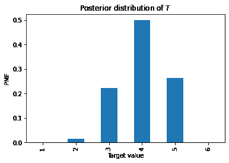

# 贝叶斯骰子

> 原文：[`allendowney.github.io/ThinkBayes2/bayes_dice.html`](https://allendowney.github.io/ThinkBayes2/bayes_dice.html)

[点击这里在 Colab 上运行这个笔记本](https://colab.research.google.com/github/AllenDowney/ThinkBayes2/blob/master/examples/bayes_dice.ipynb)

我一直在享受奥布里·克莱顿的新书[*伯努利的谬误*](https://aubreyclayton.com/bernoulli)。第一章讲述了概率竞争定义的历史发展，单独就值得一读。

第一章的一个例子是托马斯·贝叶斯提出的一个简化版本的问题。原始版本，[我在这里写过](https://allendowney.blogspot.com/2015/06/bayesian-billiards.html)，涉及到一个台球桌；克莱顿的版本使用了骰子：

> 你的朋友掷一个六面骰子并秘密记录结果；这个数字成为目标*T*。然后你蒙上眼睛，一遍又一遍地掷同一个六面骰子。你看不见它是如何落地的，所以每次你的朋友[…]只告诉你刚刚掷出的数字是大于、等于还是小于*T*。
> 
> 假设在游戏的一轮中，我们有这样的结果序列，其中 G 代表更大的掷出，L 代表较小的掷出，E 代表相等的掷出：
> 
> G, G, L, E, L, L, L, E, G, L

根据这些数据，*T*的后验分布是什么？

## 计算可能性

我的解决方案有两个部分；计算每个假设下数据的可能性，然后使用这些可能性来计算*T*的后验分布。

为了计算可能性，我将演示我最喜欢的习语之一，使用网格来对两个序列的所有值对应应用操作，比如`>`。

在这种情况下，序列是

+   `hypos`：*T*的假设值，和

+   `outcomes`：每次掷骰子的可能结果

```py
hypos = [1,2,3,4,5,6]
outcomes = [1,2,3,4,5,6] 
```

如果我们计算`outcomes`和`hypos`的网格，结果是两个数组。

```py
import numpy as np

O, H = np.meshgrid(outcomes, hypos) 
```

第一个包含了可能的结果，按列重复。

```py
O 
```

```py
array([[1, 2, 3, 4, 5, 6],
       [1, 2, 3, 4, 5, 6],
       [1, 2, 3, 4, 5, 6],
       [1, 2, 3, 4, 5, 6],
       [1, 2, 3, 4, 5, 6],
       [1, 2, 3, 4, 5, 6]]) 
```

第二个包含了假设在行中重复。

```py
H 
```

```py
array([[1, 1, 1, 1, 1, 1],
       [2, 2, 2, 2, 2, 2],
       [3, 3, 3, 3, 3, 3],
       [4, 4, 4, 4, 4, 4],
       [5, 5, 5, 5, 5, 5],
       [6, 6, 6, 6, 6, 6]]) 
```

如果我们应用像`>`这样的操作符，结果是一个布尔数组。

```py
O > H 
```

```py
array([[False,  True,  True,  True,  True,  True],
       [False, False,  True,  True,  True,  True],
       [False, False, False,  True,  True,  True],
       [False, False, False, False,  True,  True],
       [False, False, False, False, False,  True],
       [False, False, False, False, False, False]]) 
```

现在我们可以使用`mean`和`axis=1`来计算每行中`True`值的比例。

```py
(O > H).mean(axis=1) 
```

```py
array([0.83333333, 0.66666667, 0.5       , 0.33333333, 0.16666667,
       0\.        ]) 
```

结果是每个假设值*T*的结果大于*T*的概率。我将命名这个数组为`gt`：

```py
gt = (O > H).mean(axis=1)
gt 
```

```py
array([0.83333333, 0.66666667, 0.5       , 0.33333333, 0.16666667,
       0\.        ]) 
```

数组的第一个元素是 5/6，这表明如果*T*是 1，超过*T*的概率是 5/6。第二个元素是 2/3，这表明如果*T*是 2，超过*T*的概率是 2/3。以此类推。

现在我们可以计算小于和等于的相应数组。

```py
lt = (O < H).mean(axis=1)
lt 
```

```py
array([0\.        , 0.16666667, 0.33333333, 0.5       , 0.66666667,
       0.83333333]) 
```

```py
eq = (O == H).mean(axis=1)
eq 
```

```py
array([0.16666667, 0.16666667, 0.16666667, 0.16666667, 0.16666667,
       0.16666667]) 
```

在下一节中，我们将使用这些数组来进行贝叶斯更新。

## 更新

在这个例子中，计算可能性是困难的部分。贝叶斯更新很容易。由于*T*是通过掷一个公平的骰子选择的，*T*的先验分布是均匀的。我将使用 Pandas `Series`来表示它。

```py
import pandas as pd

pmf = pd.Series(1/6, hypos)
pmf 
```

```py
1    0.166667
2    0.166667
3    0.166667
4    0.166667
5    0.166667
6    0.166667
dtype: float64 
```

现在这是数据序列，使用我们在上一节中计算的可能性。

```py
data = [gt, gt, lt, eq, lt, lt, lt, eq, gt, lt] 
```

以下循环通过将每个可能性相乘来更新先验分布。

```py
for datum in data:
    pmf *= datum 
```

最后，我们对后验进行归一化。

```py
pmf /= pmf.sum()
pmf 
```

```py
1    0.000000
2    0.016427
3    0.221766
4    0.498973
5    0.262834
6    0.000000
dtype: float64 
```

这就是它的样子。

```py
pmf.plot.bar(xlabel='Target value', 
             ylabel='PMF', 
             title='Posterior distribution of $T$'); 
```



顺便说一句，你可能已经注意到`eq`中的值都是相同的。所以当我们掷出的值等于\(T\)时，我们不会得到关于*T*的任何新信息。我们可以把`eq`的实例从数据中去掉，我们会得到相同的答案。
