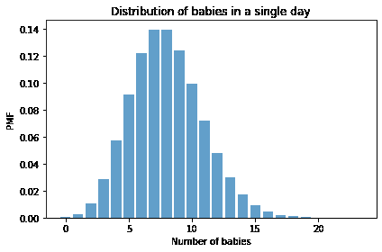
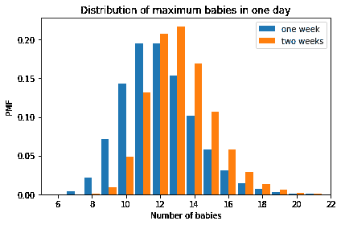
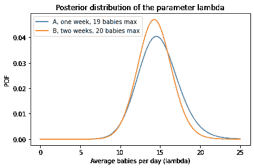

# 第二十八章：比较分娩率

> 原文：[`allendowney.github.io/ThinkBayes2/hospital_birth_rate.html`](https://allendowney.github.io/ThinkBayes2/hospital_birth_rate.html)
> 
> 译者：[飞龙](https://github.com/wizardforcel)
> 
> 协议：[CC BY-NC-SA 4.0](http://creativecommons.org/licenses/by-nc-sa/4.0/)


[在 Colab 上运行这个笔记本](https://colab.research.google.com/github/AllenDowney/ThinkBayes2/blob/master/examples/hospital_birth_rate.ipynb)

这是一个在*Think Bayes*草稿中的练习，但我最终删掉了它。

**练习：** 两位刚从医学院毕业的医生正在争论他们所在医院的分娩婴儿数量。第一位医生说：“我在 A 医院待了一周，我们已经有一天分娩了 19 个婴儿。”

第二位医生说：“我在 B 医院待了两个星期，已经有一天出生了 20 个婴儿。”

你认为哪家医院平均分娩的婴儿更多？你可以假设一天出生的婴儿数量很好地符合[泊松分布](https://en.wikipedia.org/wiki/Poisson_distribution)的参数$\lambda$，这是希腊字母“lambda”的发音。

以下函数计算参数为`lam`的泊松分布在整数范围`qs`上的 PMF：

```py
from empiricaldist import Pmf
from scipy.stats import poisson

def make_poisson_pmf(lam, qs):
  """Make a PMF of a Poisson distribution.

 lam: event rate
 qs: sequence of values for `k`

 returns: Pmf
 """
    ps = poisson(lam).pmf(qs)
    pmf = Pmf(ps, qs)
    pmf.normalize()
    return pmf 
```

例如，如果$\lambda$的实际值为 8，我们可以这样计算单日出生的婴儿的分布：

```py
import numpy as np

lam = 8
qs = np.arange(24)
pmf = make_poisson_pmf(lam, qs) 
```

以下是它的样子。

<details class="hide above-input"><summary aria-label="Toggle hidden content">显示代码单元格源代码 隐藏代码单元格源代码</summary>

```py
from utils import decorate

pmf.bar(alpha=0.7)
decorate(xlabel='Number of babies', 
         ylabel='PMF',
         title='Distribution of babies in a single day') 
```</details> 

这个分布的均值是参数$\lambda$。

```py
pmf.mean() 
```

```py
7.999938721091352 
```

以下是一周或两周后出生的婴儿的最大数量的分布。

```py
pmf_max1 = pmf.max_dist(7)
pmf_max1.bar(label='one week', align='edge', width=-0.45)

pmf_max2 = pmf.max_dist(2 * 7)
pmf_max2.bar(label='two weeks', align='edge', width=0.45)

decorate(xlabel='Number of babies',
         xlim=[5, 22],
         ylabel='PMF',
         title='Distribution of maximum babies in one day') 
```



现在你可以从这里完成它。

```py
# Solution

# Here's a prior distribution for the values of lamdba

hypos = np.linspace(0, 25, 101)
prior = Pmf(1, hypos) 
```

```py
# Solution

# Here's the likelihood of the data for each hypothetical
# value of lambda, for the doctor who reported the maximum
# number of babies in one week

days = 1 * 7      # one week
data = 19         # maximum of 19 babies

likelihood1 = [make_poisson_pmf(hypo, qs).max_dist(days)(data)
               for hypo in hypos] 
```

```py
# Solution

# And here's the first posterior distribution

posterior1 = prior * likelihood1
posterior1.normalize() 
```

```py
4.201483589848796 
```

```py
# Solution

# Here's the likelihood for the doctor who reported the
# maximum number of babies in two weeks.

days = 2 * 7
data = 20

likelihood2 = [make_poisson_pmf(hypo, qs).max_dist(days)(data)
               for hypo in hypos] 
```

```py
# Solution

# And here's the second posterior

posterior2 = prior * likelihood2
posterior2.normalize() 
```

```py
4.259983296308155 
```

```py
# Solution

# And here's what the two posterior distributions look like

posterior1.plot(label='A, one week, 19 babies max')
posterior2.plot(label='B, two weeks, 20 babies max')

decorate(xlabel='Average babies per day (lambda)', 
         ylabel='PDF',
         title='Posterior distribution of the parameter lambda') 
```



```py
# Solution

# The posterior mean is a little higher for hospital A,
# based on one week of data and a slightly lower maximum

posterior1.mean(), posterior2.mean() 
```

```py
(14.794330239819137, 14.327038448986379) 
```

```py
# And here's the probability that the birth rate is 
# higher in Hospital A

posterior1.gt_dist(posterior2) + posterior1.eq_dist(posterior2) / 2 
```

```py
0.5511810168369614 
```
