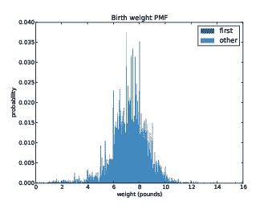
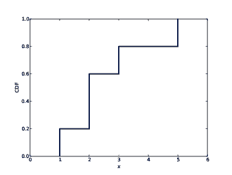
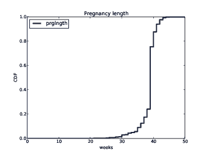
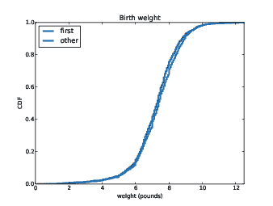
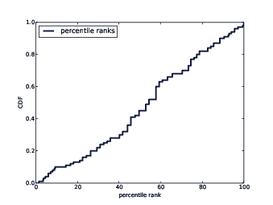

# 第四章：累积分布函数

> 原文：[`greenteapress.com/thinkstats2/html/thinkstats2005.html`](https://greenteapress.com/thinkstats2/html/thinkstats2005.html)
> 
> 译者：[飞龙](https://github.com/wizardforcel)
> 
> 协议：[CC BY-NC-SA 4.0](http://creativecommons.org/licenses/by-nc-sa/4.0/)


本章的代码在`cumulative.py`中。有关下载和使用此代码的信息，请参阅第 0.2 节。

## 4.1 PMFs 的限制

如果值的数量较少，PMFs 效果很好。但是随着值的数量增加，与每个值相关的概率变小，随机噪声的影响增加。

例如，我们可能对出生体重的分布感兴趣。在 NSFG 数据中，变量`totalwgt_lb`记录了出生体重（以磅为单位）。图 4.1 显示了这些值的 PMF，分别为第一个孩子和其他孩子。

> * * *
> 
> 
> 
> | 图 4.1：出生体重的 PMF。这张图显示了 PMFs 的一个限制：它们在视觉上很难比较。 |
> | --- |
> 
> * * *

总的来说，这些分布类似于正态分布的钟形，大部分值接近平均值，而少数值则高于或低于平均值。

但是，这个图的某些部分很难解释。有许多尖峰和低谷，以及分布之间的一些明显差异。很难判断这些特征哪些是有意义的。此外，很难看出整体模式；例如，你认为哪个分布的平均值更高？

这些问题可以通过对数据进行分箱来缓解；即将值的范围分成不重叠的间隔，并计算每个箱中的值的数量。分箱可能很有用，但要正确确定箱的大小很棘手。如果它们足够大以平滑噪声，它们可能也会平滑掉有用的信息。

避免这些问题的另一种选择是累积分布函数（CDF），这是本章的主题。但在我解释 CDF 之前，我必须解释百分位数。

## 4.2 百分位数

如果你参加过标准化考试，你可能得到了原始分数和百分位数排名。在这种情况下，百分位数排名是得分低于你（或相同）的人的比例。因此，如果你处于“90 百分位数”，你的表现和 90%参加考试的人一样好或更好。

以下是如何计算值`your_score`相对于序列`scores`中的值的百分位数排名的：

```py
def PercentileRank(scores, your_score):
    count = 0
    for score in scores:
        if score <= your_score:
            count += 1

    percentile_rank = 100.0 * count / len(scores)
    return percentile_rank 
```

例如，如果序列中的分数是 55、66、77、88 和 99，而你得到了 88，那么你的百分位数排名将是`100 * 4 / 5`，即 80。

如果给定一个值，找到它的百分位数排名很容易；反过来则稍微困难一些。如果给定一个百分位数排名，想要找到相应的值，一种选择是对值进行排序并搜索你想要的值：

```py
def Percentile(scores, percentile_rank):
    scores.sort()
    for score in scores:
        if PercentileRank(scores, score) >= percentile_rank:
            return score 
```

这个计算的结果是一个百分位数。例如，第 50 百分位数是具有百分位数排名 50 的值。在考试分数的分布中，第 50 百分位数是 77。

`Percentile`的这种实现效率不高。更好的方法是使用百分位数排名来计算相应百分位数的索引：

```py
def Percentile2(scores, percentile_rank):
    scores.sort()
    index = percentile_rank * (len(scores)-1) // 100
    return scores[index] 
```

“百分位数”和“百分位数排名”的区别可能令人困惑，人们并不总是精确地使用这些术语。总之，`PercentileRank`接受一个值并计算其在一组值中的百分位数排名；`Percentile`接受一个百分位数排名并计算相应的值。

## 4.3 CDFs

现在我们了解了百分位数和百分位数排名，我们准备好处理累积分布函数（CDF）了。CDF 是将值映射到其百分位数排名的函数。

CDF 是 x 的函数，其中 x 是可能出现在分布中的任何值。要评估特定值 x 的 CDF(x)，我们计算分布中小于或等于 x 的值的比例。

以下是一个以序列`sample`和一个值`x`为参数的函数的样子：

```py
def EvalCdf(sample, x):
    count = 0.0
    for value in sample:
        if value <= x:
            count += 1

    prob = count / len(sample)
    return prob 
```

这个函数几乎和 `PercentileRank` 一样，不同之处在于结果是一个范围在 0-1 之间的概率，而不是范围在 0-100 之间的百分位秩。

举个例子，假设我们收集了一个样本，其中包含值 `[1, 2, 2, 3, 5]`。这是它的 CDF 中的一些值：

| CDF(0) = 0 |
| --- |
| CDF(1) = 0.2 |
| CDF(2) = 0.6 |
| CDF(3) = 0.8 |
| CDF(4) = 0.8 |
| CDF(5) = 1 |

我们可以对 x 的任何值评估 CDF，而不仅仅是样本中出现的值。如果 x 小于样本中的最小值，CDF(x) 为 0。如果 x 大于最大值，CDF(x) 为 1。

> * * *
> 
> 
> 
> | 图 4.2: CDF 的示例。 |
> | --- |
> 
> * * *

图 4.2 是这个 CDF 的图形表示。样本的 CDF 是一个阶梯函数。

## 4.4 表示 CDFs

`thinkstats2` 提供了一个名为 Cdf 的类，表示 CDFs。Cdf 提供的基本方法有：

+   `Prob(x)`: 给定一个值 `x`，计算概率 p = CDF(x)。括号操作符等同于 `Prob`。

+   `Value(p)`: 给定一个概率 `p`，计算相应的值 `x`；也就是说，`p` 的逆 CDF。

> * * *
> 
> 
> 
> | 图 4.3: 怀孕时长的 CDF。 |
> | --- |
> 
> * * *

Cdf 构造函数可以接受一个值列表、一个 pandas Series、一个 Hist、Pmf，或者另一个 Cdf 作为参数。下面的代码创建了一个 NSFG 怀孕时长分布的 Cdf：

```py
 live, firsts, others = first.MakeFrames()
    cdf = thinkstats2.Cdf(live.prglngth, label='prglngth') 
```

`thinkplot` 提供了一个名为 `Cdf` 的函数，用于绘制 CDFs 作为线：

```py
 thinkplot.Cdf(cdf)
    thinkplot.Show(xlabel='weeks', ylabel='CDF') 
```

图 4.3 显示了结果。读取 CDF 的一种方法是查找百分位数。例如，看起来大约 10% 的怀孕时长小于 36 周，大约 90% 的怀孕时长小于 41 周。CDF 还提供了分布形状的可视化表示。常见值在 CDF 的陡峭或垂直部分出现；在这个例子中，39 周的众数是明显的。在 30 周以下的值很少，所以这个范围内的 CDF 是平的。

需要一些时间来适应 CDFs，但一旦适应了，我认为你会发现它们比 PMFs 显示更多信息，更清晰。

## 4.5 比较 CDFs

CDFs 特别适用于比较分布。例如，这是绘制第一个宝宝和其他宝宝出生体重的 CDF 的代码。

```py
 first_cdf = thinkstats2.Cdf(firsts.totalwgt_lb, label='first')
    other_cdf = thinkstats2.Cdf(others.totalwgt_lb, label='other')

    thinkplot.PrePlot(2)
    thinkplot.Cdfs([first_cdf, other_cdf])
    thinkplot.Show(xlabel='weight (pounds)', ylabel='CDF') 
```

> * * *
> 
> 
> 
> | 图 4.4: 第一个宝宝和其他宝宝的出生体重的 CDF。 |
> | --- |
> 
> * * *

图 4.4 显示了结果。与图 4.1 相比，这张图更清晰地展示了分布的形状和它们之间的差异。我们可以看到，第一个宝宝在整个分布中稍微更轻，而且在均值以上的差距更大。

## 4.6 基于百分位数的统计

一旦计算了 CDF，就很容易计算百分位数和百分位秩。Cdf 类提供了这两种方法：

+   `PercentileRank(x)`: 给定一个值 `x`，计算它的百分位秩，即 100 · CDF(x)。

+   `Percentile(p)`: 给定一个百分位秩 `p`，计算相应的值 `x`。等同于 `Value(p/100)`。

`Percentile` 可以用来计算基于百分位数的摘要统计。例如，第 50 百分位数是将分布分成两半的值，也称为中位数。和均值一样，中位数是分布集中趋势的一种度量。

实际上，“中位数”有几种不同的定义，每种都有不同的特性。但 `Percentile(50)` 简单且高效。

另一个基于百分位数的统计量是四分位距（IQR），它是分布的扩展度量。IQR 是第 75 百分位数和第 25 百分位数之间的差异。

更一般地，百分位数经常用于总结分布的形状。例如，收入分布通常以“五分位数”报告；也就是说，它在第 20、40、60 和 80 百分位数处分割。其他分布被分为十个“分位数”。这些代表 CDF 中等间隔点的统计数据称为分位数。更多信息，请参阅[`en.wikipedia.org/wiki/Quantile`](https://en.wikipedia.org/wiki/Quantile)。

## 4.7 随机数

假设我们从活产儿人群中随机选择一个样本，并查找其出生体重的百分位数。现在假设我们计算百分位数的 CDF。你认为分布会是什么样子？

这是我们如何计算的。首先，我们制作出生体重的 Cdf：

```py
 weights = live.totalwgt_lb
    cdf = thinkstats2.Cdf(weights, label='totalwgt_lb') 
```

然后我们生成一个样本，并计算样本中每个值的百分位数。

```py
 sample = np.random.choice(weights, 100, replace=True)
    ranks = [cdf.PercentileRank(x) for x in sample] 
```

`sample`是一个包含 100 个出生体重的随机样本，可以重复选择；也就是说，同一个值可能会被选择多次。`ranks`是一个百分位数的列表。

最后，我们制作并绘制百分位数的 Cdf。

```py
 rank_cdf = thinkstats2.Cdf(ranks)
    thinkplot.Cdf(rank_cdf)
    thinkplot.Show(xlabel='percentile rank', ylabel='CDF') 
```

> * * *
> 
> 
> 
> | 图 4.5：随机出生体重样本的百分位数累积分布函数。 |
> | --- |
> 
> * * *

图 4.5 显示了结果。CDF 大致是一条直线，这意味着分布是均匀的。

这个结果可能不明显，但它是 CDF 定义的一个结果。这个图表显示的是样本的 10%在第 10 百分位以下，20%在第 20 百分位以下，依此类推，正如我们应该期望的那样。

因此，不管 CDF 的形状如何，百分位数的分布都是均匀的。这个特性很有用，因为它是生成具有给定 CDF 的随机数的一个简单有效的算法的基础。这是如何做的：

+   均匀地从 0-100 范围内选择一个百分位数。

+   使用`Cdf.Percentile`找到与您选择的百分位数相对应的分布中的值。

Cdf 提供了这个算法的实现，称为`Random`：

```py
# class Cdf:
    def Random(self):
        return self.Percentile(random.uniform(0, 100)) 
```

Cdf 还提供了`Sample`，它接受一个整数`n`，并返回从 Cdf 中随机选择的`n`个值的列表。

## 4.8 比较百分位数

百分位数对于比较不同组的测量结果很有用。例如，参加足球比赛的人通常按年龄和性别分组。要比较不同年龄组的人，可以将比赛时间转换为百分位数。

几年前，我在马萨诸塞州德德姆参加了詹姆斯·乔伊斯漫步 10 公里赛；我以 42:44 的成绩获得了 1633 名选手中的第 97 名。我在 1633 名选手中击败或并列 1537 名，所以我在该领域的百分位数是 94%。

更一般地，给定位置和字段大小，我们可以计算百分位数：

```py
def PositionToPercentile(position, field_size):
    beat = field_size - position + 1
    percentile = 100.0 * beat / field_size
    return percentile 
```

在我的年龄组 M4049 中，我在 256 个人中排名第 26。所以我的年龄组中的百分位数是 90%。

如果我还在跑步 10 年（我希望我是），我将进入 M5059 组。假设我的年龄组中的百分位数相同，我应该期望慢多少？

我可以通过将 M4049 的百分位数转换为 M5059 的位置来回答这个问题。这是代码：

```py
def PercentileToPosition(percentile, field_size):
    beat = percentile * field_size / 100.0
    position = field_size - beat + 1
    return position 
```

M5059 组有 171 人，所以我必须在第 17 和第 18 名之间才能有相同的百分位数。M5059 组中第 17 名选手的完赛时间是 46:05，所以这就是我要超越的时间，以保持我的百分位数。

## 4.9 练习

对于以下练习，可以从`chap04ex.ipynb`开始。我的解决方案在`chap04soln.ipynb`中。

练习 1 *你出生时有多重？如果你不知道，打电话给你的母亲或其他知道的人。使用 NSFG 数据（所有活产），计算出生体重的分布，并用它来找到你的百分位数。如果你是第一个宝宝，找到你在第一个宝宝分布中的百分位数。否则使用其他人的分布。如果你在 90 分位数或更高，请给你的母亲打电话道歉。* 练习 2 *由`random.random`生成的数字应该在 0 到 1 之间均匀分布；也就是说，范围内的每个值应该具有相同的概率。*

*从`random.random`生成 1000 个数字并绘制它们的 PMF 和 CDF。分布是否均匀？*

## 4.10 术语表

+   百分位数：分布中小于或等于给定值的值的百分比。

+   百分位数：与给定百分位数相关联的值。

+   累积分布函数（CDF）：一个将值映射到它们的累积概率的函数。 CDF（x）是样本小于或等于 x 的分数。

+   逆累积分布函数：一个将累积概率 p 映射到相应值的函数。

+   中位数：第 50 百分位数，通常用作中心趋势的度量。

+   四分位距：第 75 和 25 百分位数之间的差异，用作传播的度量。

+   分位数：对应于等间隔百分位数的一系列值；例如，分布的四分位数是第 25、50 和 75 百分位数。

+   替换：抽样过程的一个属性。“有替换”意味着同一个值可以被选择多次；“无替换”意味着一旦选择了一个值，它就从总体中移除。
