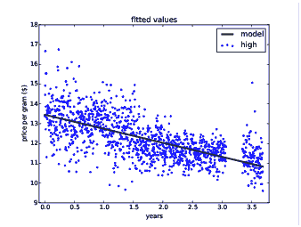
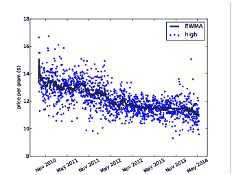
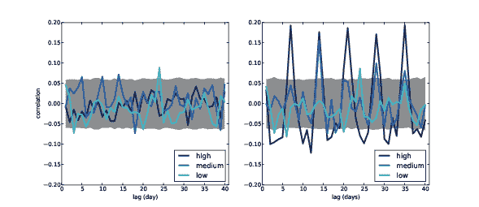
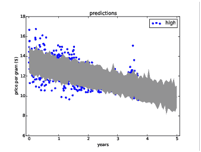
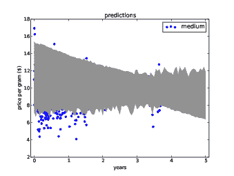

# 第十二章：时间序列分析

> 原文：[`greenteapress.com/thinkstats2/html/thinkstats2013.html`](https://greenteapress.com/thinkstats2/html/thinkstats2013.html)
> 
> 译者：[飞龙](https://github.com/wizardforcel)
> 
> 协议：[CC BY-NC-SA 4.0](http://creativecommons.org/licenses/by-nc-sa/4.0/)


时间序列是系统随时间变化的一系列测量。一个著名的例子是显示全球平均温度随时间变化的“曲棍球杆图”（参见[`en.wikipedia.org/wiki/Hockey_stick_graph`](https://en.wikipedia.org/wiki/Hockey_stick_graph)）。

我在本章中使用的例子来自政治科学研究人员扎卡里·M·琼斯（Zachary M. Jones），他研究美国大麻黑市（[`zmjones.com/marijuana`](http://zmjones.com/marijuana)）。他从一个名为“大麻价格”的网站收集了数据，该网站通过要求参与者报告大麻交易的价格、数量、质量和地点来众包市场信息（[`www.priceofweed.com/`](http://www.priceofweed.com/)）。他的项目目标是调查政策决定（如合法化）对市场的影响。我觉得这个项目很有吸引力，因为它是一个使用数据来解决重要政治问题（如毒品政策）的例子。

我希望您会发现本章有趣，但我要借此机会重申保持专业的数据分析态度的重要性。毒品是否应该非法化是重要且困难的公共政策问题；我们的决定应该基于诚实报告的准确数据。

本章的代码在`timeseries.py`中。有关下载和使用此代码的信息，请参见第 0.2 节。

## 12.1  导入和清理

我从琼斯先生的网站下载的数据在本书的存储库中。以下代码将其读入 pandas DataFrame：

```py
 transactions = pandas.read_csv('mj-clean.csv', parse_dates=[5]) 
```

`parse_dates`告诉`read_csv`将第 5 列的值解释为日期并将其转换为 NumPy `datetime64`对象。

DataFrame 中每个报告的交易都有一行，以下是列：

+   city：字符串城市名。

+   state：两个字母的州缩写。

+   price：以美元支付的价格。

+   amount：以克为单位购买的数量。

+   quality：购买者报告的高、中、低质量。

+   date：报告日期，假定为购买日期后不久。

+   ppg：每克的价格，以美元计价。

+   state.name：字符串州名。

+   lat：基于城市名称的交易的大致纬度。

+   lon：交易的大致经度。

每个交易都是时间中的一个事件，所以我们可以将这个数据集视为时间序列。但是这些事件在时间上并不是等间隔的；每天报告的交易数量从 0 到几百不等。许多用于分析时间序列的方法要求测量值是等间隔的，或者至少如果它们是等间隔的话，事情会更简单。

为了演示这些方法，我将数据集按报告的质量分组，然后通过计算每日平均每克价格来将每个组转换为等间隔系列。

```py
def GroupByQualityAndDay(transactions):
    groups = transactions.groupby('quality')
    dailies = {}
    for name, group in groups:
        dailies[name] = GroupByDay(group)

    return dailies 
```

`groupby`是一个返回 GroupBy 对象`groups`的 DataFrame 方法；在 for 循环中使用，它遍历组的名称和代表它们的 DataFrame。由于`quality`的值是`low`、`medium`和`high`，我们得到了这些名称的三个组。

循环遍历组并调用`GroupByDay`，它计算每日平均价格并返回一个新的 DataFrame：

```py
def GroupByDay(transactions, func=np.mean):
    grouped = transactions[['date', 'ppg']].groupby('date')
    daily = grouped.aggregate(func)

    daily['date'] = daily.index
    start = daily.date[0]
    one_year = np.timedelta64(1, 'Y')
    daily['years'] = (daily.date - start) / one_year

    return daily 
```

参数`transactions`是一个包含`date`和`ppg`列的 DataFrame。我们选择这两列，然后按`date`分组。

结果`grouped`是从每个日期到包含在该日期报告的价格的 DataFrame 的映射。`aggregate`是一个 GroupBy 方法，它遍历组并对每个组的列应用函数；在这种情况下只有一列，`ppg`。因此，`aggregate`的结果是一个每个日期一行、一列`ppg`的 DataFrame。

这些 DataFrame 中的日期存储为 NumPy `datetime64`对象，它们表示为纳秒的 64 位整数。对于即将进行的一些分析，使用更人性化的单位（如年）来处理时间将更加方便。因此，`GroupByDay`添加了一个名为`date`的列，通过复制`index`，然后添加`years`，其中包含自第一笔交易以来的年数作为浮点数。

生成的 DataFrame 具有`ppg`、`date`和`years`列。

## 12.2 绘图

`GroupByQualityAndDay`的结果是从每种质量到每日价格的 DataFrame 的映射。以下是我用来绘制三个时间序列的代码：

```py
 thinkplot.PrePlot(rows=3)
    for i, (name, daily) in enumerate(dailies.items()):
        thinkplot.SubPlot(i+1)
        title = 'price per gram ($)' if i==0 else ''
        thinkplot.Config(ylim=[0, 20], title=title)
        thinkplot.Scatter(daily.index, daily.ppg, s=10, label=name)
        if i == 2:
            pyplot.xticks(rotation=30)
        else:
            thinkplot.Config(xticks=[]) 
```

`PrePlot`与`rows=3`表示我们打算制作三个按三行布局的子图。循环遍历 DataFrame 并为每个创建散点图。通常情况下，会使用线段在点之间绘制时间序列，但在这种情况下，有许多数据点且价格变动很大，因此添加线条并没有帮助。

由于 x 轴上的标签是日期，我使用`pyplot.xticks`将“刻度”旋转 30 度，使其更易读。

> * * *
> 
> 
> 
> | 图 12.1：高、中、低质量大麻每克每日价格的时间序列。 |
> | --- |
> 
> * * *

图 12.1 显示了结果。这些图中一个明显的特征是在 2013 年 11 月左右有一个间隙。可能是在这段时间内数据收集不活跃，或者数据可能不可用。我们将考虑如何处理这些缺失数据。

从视觉上看，高质量大麻的价格在这段时间内似乎在下降，而中等质量的价格在上升。低质量的价格也可能在上升，但很难说，因为它似乎更加波动。请记住，质量数据是由志愿者报告的，因此随时间的趋势可能反映了参与者如何应用这些标签的变化。

## 12.3 线性回归

尽管有一些特定于时间序列分析的方法，但对于许多问题，一个简单的入门方法是应用线性回归等通用工具。以下函数接受每日价格的 DataFrame 并计算最小二乘拟合，返回 StatsModels 的模型和结果对象：

```py
def RunLinearModel(daily):
    model = smf.ols('ppg ~ years', data=daily)
    results = model.fit()
    return model, results 
```

然后我们可以遍历质量并为每个拟合模型：

```py
 for name, daily in dailies.items():
        model, results = RunLinearModel(daily)
        print(name)
        regression.SummarizeResults(results) 
```

以下是结果：

| 质量 | 截距 | 斜率 | R² |
| --- | --- | --- | --- |
| 高质量 | 13.450 | -0.708 | 0.444 |
| 中等 | 8.879 | 0.283 | 0.050 |
| 低 | 5.362 | 0.568 | 0.030 |

估计的斜率表明，观察期间高质量大麻的价格每年下降约 71 美分；中等质量的价格每年增加 28 美分，低质量的价格每年增加 57 美分。这些估计都具有非常小的 p 值，是统计上显著的。

高质量大麻的 R²值为 0.44，这意味着时间作为解释变量解释了价格观察变异性的 44%。对于其他质量，价格变化较小，价格变动性较大，因此 R²的值较小（但仍具有统计学意义）。

以下代码绘制了观察到的价格和拟合值：

```py
def PlotFittedValues(model, results, label=''):
    years = model.exog[:,1]
    values = model.endog
    thinkplot.Scatter(years, values, s=15, label=label)
    thinkplot.Plot(years, results.fittedvalues, label='model') 
```

正如我们在第[11.8]节中看到的那样，`model`包含`exog`和`endog`，它们是 NumPy 数组，其中包含外生（解释性）和内生（依赖性）变量。

> * * *
> 
> 
> 
> | 图 12.2：高质量大麻每克每日价格的时间序列，以及线性最小二乘拟合。 |
> | --- |
> 
> * * *

`PlotFittedValues`绘制了数据点的散点图和拟合值的线图。图 12.2 显示了高质量大麻的结果。该模型似乎是数据的良好线性拟合；然而，线性回归并不是这些数据的最合适选择：

+   首先，没有理由期望长期趋势是一条直线或任何其他简单的函数。一般来说，价格是由供应和需求决定的，二者随时间以不可预测的方式变化。

+   其次，线性回归模型对所有数据，包括最近和过去的数据，给予相等的权重。为了预测的目的，我们可能应该给予最近的数据更多的权重。

+   最后，线性回归的一个假设是残差是不相关的噪音。对于时间序列数据，这个假设通常是错误的，因为连续的值是相关的。

下一节介绍了更适合时间序列数据的替代方法。

## 12.4 移动平均

大多数时间序列分析都是基于这样的建模假设：观察到的系列是三个组成部分的总和：

+   趋势：捕捉持续变化的平滑函数。

+   季节性：周期性变化，可能包括每日、每周、每月或每年的周期。

+   噪音：长期趋势周围的随机变化。

回归是从系列中提取趋势的一种方法，正如我们在前一节中看到的。但是，如果趋势不是一个简单的函数，一个很好的替代方法是移动平均。移动平均将系列分成重叠的区域，称为窗口，并计算每个窗口中值的平均值。

最简单的移动平均之一是滚动均值，它计算每个窗口中值的平均值。例如，如果窗口大小为 3，滚动均值计算值 0 到 2、1 到 3、2 到 4 等的平均值。

pandas 提供了`rolling_mean`，它接受一个 Series 和一个窗口大小，并返回一个新的 Series。

```py
>>> series = np.arange(10)
array([0, 1, 2, 3, 4, 5, 6, 7, 8, 9])

>>> pandas.rolling_mean(series, 3)
array([ nan,  nan,   1,   2,   3,   4,   5,   6,   7,   8]) 
```

前两个值是`nan`；下一个值是前三个元素 0、1 和 2 的平均值。下一个值是 1、2 和 3 的平均值。依此类推。

在我们可以将`rolling_mean`应用于大麻数据之前，我们必须处理缺失值。在观察区间中有几天没有报告某一或多个品质类别的交易，以及 2013 年数据收集不活跃的时期。

在我们迄今为止使用的 DataFrame 中，这些日期是缺失的；索引跳过了没有数据的日期。对于接下来的分析，我们需要明确地表示这些缺失的数据。我们可以通过“重新索引”DataFrame 来做到这一点：

```py
 dates = pandas.date_range(daily.index.min(), daily.index.max())
    reindexed = daily.reindex(dates) 
```

第一行计算了一个日期范围，包括观察区间的开始到结束的每一天。第二行创建了一个新的 DataFrame，其中包含了来自`daily`的所有数据，但包括了所有日期的行，填充为`nan`。

现在我们可以这样绘制滚动均值：

```py
 roll_mean = pandas.rolling_mean(reindexed.ppg, 30)
    thinkplot.Plot(roll_mean.index, roll_mean) 
```

窗口大小为 30，因此`roll_mean`中的每个值都是从`reindexed.ppg`中的 30 个值的平均值。

> * * *
> 
> 
> 
> | 图 12.3：每日价格和滚动均值（左）以及指数加权移动平均（右）。 |
> | --- |
> 
> * * *

图 12.3（左）显示了结果。滚动均值似乎很好地平滑了噪音并提取了趋势。前 29 个值是`nan`，并且在每个缺失值后面都有另外 29 个`nan`。有方法可以填补这些间隙，但它们只是一个小麻烦。

一种替代方法是指数加权移动平均（EWMA），它有两个优点。首先，正如其名称所示，它计算加权平均值，其中最近的值具有最高的权重，先前值的权重呈指数下降。其次，pandas 对 EWMA 的实现更好地处理了缺失值。

```py
 ewma = pandas.ewma(reindexed.ppg, span=30)
    thinkplot.Plot(ewma.index, ewma) 
```

span 参数大致对应于移动平均的窗口大小；它控制权重的下降速度，因此确定了对每个平均值做出非可忽略贡献的点的数量。

图 12.3（右侧）显示了相同数据的 EWMA。它类似于滚动均值，在定义时它们都有，但它没有缺失值，这使得它更容易处理。这些值在时间序列开始时很嘈杂，因为它们是基于较少的数据点。

## 12.5 缺失值

现在我们已经描述了时间序列的趋势，下一步是调查季节性，即周期行为。基于人类行为的时间序列数据通常表现出每日、每周、每月或每年的周期。在下一节中，我将介绍测试季节性的方法，但它们在存在缺失数据时效果不佳，因此我们必须先解决这个问题。

填充缺失数据的一种简单常见方法是使用移动平均。Series 方法`fillna`正是我们想要的：

```py
 reindexed.ppg.fillna(ewma, inplace=True) 
```

无论`reindexed.ppg`在哪里是`nan`，`fillna`都会用`ewma`中对应的值替换它。`inplace`标志告诉`fillna`修改现有的 Series 而不是创建新的 Series。

这种方法的缺点是它低估了系列中的噪音。我们可以通过添加重新采样的残差来解决这个问题：

```py
 resid = (reindexed.ppg - ewma).dropna()
    fake_data = ewma + thinkstats2.Resample(resid, len(reindexed))
    reindexed.ppg.fillna(fake_data, inplace=True) 
```

`resid` 包含残差值，不包括 `ppg` 为 `nan` 的天数。 `fake_data` 包含移动平均和残差的随机样本之和。最后，`fillna` 用 `fake_data` 中的值替换 `nan`。

> * * *
> 
> 
> 
> | 图 12.4：填充数据的每日价格。 |
> | --- |
> 
> * * *

图 12.4 显示了结果。填充数据在视觉上与实际值相似。由于重新采样的残差是随机的，结果每次都不同；稍后我们将看到如何描述由缺失值产生的误差。

## 12.6 串行相关

随着价格日益变化，您可能会期望看到一些模式。如果周一价格高，您可能会期望它在接下来的几天内保持高位；如果价格低，您可能会期望它保持低位。这样的模式称为串行相关，因为每个值与系列中的下一个值相关。

为了计算串行相关，我们可以将时间序列按一个称为滞后的间隔移动，然后计算移动后的序列与原始序列的相关性：

```py
def SerialCorr(series, lag=1):
    xs = series[lag:]
    ys = series.shift(lag)[lag:]
    corr = thinkstats2.Corr(xs, ys)
    return corr 
```

移位后，前`lag`个值为`nan`，因此我使用切片在计算`Corr`之前将它们移除。

如果我们将`SerialCorr`应用于具有滞后 1 的原始价格数据，我们发现高质量类别的串行相关性为 0.48，中等为 0.16，低为 0.10。在具有长期趋势的任何时间序列中，我们都希望看到强烈的串行相关性；例如，如果价格下跌，我们期望在系列的前半部分看到高于平均值的值，并在后半部分看到低于平均值的值。

如果减去趋势后仍然存在相关性，那就更有趣了。例如，我们可以计算 EWMA 的残差，然后计算其串行相关性：

```py
 ewma = pandas.ewma(reindexed.ppg, span=30)
    resid = reindexed.ppg - ewma
    corr = SerialCorr(resid, 1) 
```

当滞后=1 时，去趋势数据的串行相关性分别为高质量-0.022，中等-0.015，低 0.036。这些值很小，表明该系列中几乎没有一天的串行相关性。

为了检查每周、每月和每年的季节性，我使用不同的滞后再次进行了分析。以下是结果：

| 滞后 | 高 | 中 | 低 |
| --- | --- | --- | --- |
| 1 | -0.029 | -0.014 | 0.034 |
| 7 | 0.02 | -0.042 | -0.0097 |
| 30 | 0.014 | -0.0064 | -0.013 |
| 365 | 0.045 | 0.015 | 0.033 |

在下一节中，我们将测试这些相关性是否具有统计学意义（它们没有），但在这一点上，我们可以初步得出结论，即这些系列中没有实质性的季节性模式，至少在这些滞后中没有。

## 12.7 自相关

如果你认为一个系列可能存在一些串行相关性，但你不知道要测试哪些滞后期，你可以测试它们全部！自相关函数是一个将滞后期映射到给定滞后期的串行相关性的函数。“自相关”是串行相关的另一个名称，当滞后期不是 1 时更常用。

我们在第 11.1 节中用于线性回归的 StatsModels 还提供了用于时间序列分析的函数，包括`acf`，它计算自相关函数：

```py
 import statsmodels.tsa.stattools as smtsa
    acf = smtsa.acf(filled.resid, nlags=365, unbiased=True) 
```

`acf`计算从 0 到`nlags`的滞后期的串行相关性。`unbiased`标志告诉`acf`对样本大小进行估计校正。结果是一系列相关性。如果我们选择高质量的每日价格，并提取滞后期为 1、7、30 和 365 的相关性，我们可以确认`acf`和`SerialCorr`产生大致相同的结果：

```py
>>> acf[0], acf[1], acf[7], acf[30], acf[365]
1.000, -0.029, 0.020, 0.014, 0.044 
```

对于`lag=0`，`acf`计算系列与自身的相关性，这总是 1。

> * * *
> 
> 
> 
> | 图 12.5：每日价格的自相关函数（左）和具有模拟每周季节性的每日价格（右）。 |
> | --- |
> 
> * * *

图 12.5（左）显示了三个质量类别的自相关函数，其中`nlags=40`。灰色区域显示了我们在没有实际自相关性时预期的正常变异性；任何落在此范围之外的都具有统计显著性，p 值小于 5%。由于误报率为 5%，我们正在计算 120 个相关性（3 个时间序列的每个 40 个滞后期），我们预计会看到大约 6 个点在此范围之外。实际上有 7 个。我们得出结论，这些系列中没有自相关性，这种自相关性不能用偶然解释。

我通过对残差重新采样来计算灰色区域。你可以在`timeseries.py`中看到我的代码；该函数名为`SimulateAutocorrelation`。

为了看到存在季节性成分时自相关函数的样子，我通过添加一个每周循环来生成模拟数据。假设大麻的需求在周末更高，我们可能会预期价格更高。为了模拟这种效应，我选择落在星期五或星期六的日期，并向价格添加一个随机量，该随机量从 0 到 2 的均匀分布中选择。

```py
def AddWeeklySeasonality(daily):
    frisat = (daily.index.dayofweek==4) | (daily.index.dayofweek==5)
    fake = daily.copy()
    fake.ppg[frisat] += np.random.uniform(0, 2, frisat.sum())
    return fake 
```

`frisat`是一个布尔 Series，如果一周的某一天是星期五或星期六，则为`True`。`fake`是一个新的 DataFrame，最初是`daily`的副本，我们通过向`ppg`添加随机值来修改它。`frisat.sum()`是星期五和星期六的总数，这就是我们需要生成的随机值的数量。

图 12.5（右）显示了具有这种模拟季节性的价格的自相关函数。如预期的那样，当滞后期是 7 的倍数时，相关性最高。对于高和中等质量，新的相关性具有统计显著性。对于低质量，它们没有，因为该类别中的残差较大；效应必须更大才能通过噪音可见。

## 12.8 预测

时间序列分析可用于研究并有时解释随时间变化的系统行为。它也可以进行预测。

我们在第 12.3 节中使用的线性回归可以用于预测。RegressionResults 类提供了`predict`，它接受包含解释变量的 DataFrame 并返回一系列预测。以下是代码：

```py
def GenerateSimplePrediction(results, years):
    n = len(years)
    inter = np.ones(n)
    d = dict(Intercept=inter, years=years)
    predict_df = pandas.DataFrame(d)
    predict = results.predict(predict_df)
    return predict 
```

`results`是一个 RegressionResults 对象；`years`是我们想要进行预测的时间值序列。该函数构建一个 DataFrame，将其传递给`predict`，并返回结果。

如果我们只想要一个单一的最佳预测，那么我们已经完成了。但是对于大多数目的来说，量化误差是很重要的。换句话说，我们想知道预测有多大可能是准确的。

我们应该考虑三种误差来源：

+   抽样误差：预测是基于估计参数的，这些参数取决于样本中的随机变化。如果我们再次运行实验，我们预计估计值会有所变化。

+   随机变化：即使估计的参数是完美的，观察到的数据也会围绕长期趋势随机变化，我们预计这种变化将在未来继续。

+   建模误差：我们已经看到长期趋势不是线性的证据，因此基于线性模型的预测最终会失败。

需要考虑的另一个错误来源是意外的未来事件。农产品价格受天气影响，所有价格都受政治和法律影响。在我写这篇文章时，大麻在两个州是合法的，在另外 20 个州是合法的医疗用途。如果更多的州合法化，价格可能会下降。但如果联邦政府打击，价格可能会上涨。

建模误差和意外未来事件很难量化。抽样误差和随机变化更容易处理，所以我们将首先处理这些。

为了量化抽样误差，我使用重新采样，就像我们在第 10.4 节中所做的那样。与往常一样，目标是使用实际观察结果来模拟如果我们再次运行实验会发生什么。这些模拟是基于估计参数是正确的假设，但随机残差可能是不同的。这是一个运行模拟的函数：

```py
def SimulateResults(daily, iters=101):
    model, results = RunLinearModel(daily)
    fake = daily.copy()

    result_seq = []
    for i in range(iters):
        fake.ppg = results.fittedvalues + Resample(results.resid)
        _, fake_results = RunLinearModel(fake)
        result_seq.append(fake_results)

    return result_seq 
```

`daily`是包含观察价格的 DataFrame；`iters`是要运行的模拟次数。

`SimulateResults`使用`RunLinearModel`，来自第 12.3 节，来估计观察值的斜率和截距。

每次循环时，它通过重新采样残差并将其添加到拟合值来生成“假”数据集。然后它在假数据上运行线性模型并存储 RegressionResults 对象。

下一步是使用模拟结果生成预测：

```py
def GeneratePredictions(result_seq, years, add_resid=False):
    n = len(years)
    d = dict(Intercept=np.ones(n), years=years, years2=years**2)
    predict_df = pandas.DataFrame(d)

    predict_seq = []
    for fake_results in result_seq:
        predict = fake_results.predict(predict_df)
        if add_resid:
            predict += thinkstats2.Resample(fake_results.resid, n)
        predict_seq.append(predict)

    return predict_seq 
```

`GeneratePredictions`获取前一步结果的序列，以及`years`，这是一个指定要生成预测的区间的浮点数序列，以及`add_resid`，它指示是否应将重新采样的残差添加到直线预测中。`GeneratePredictions`遍历 RegressionResults 序列并生成预测序列。

> * * *
> 
> 
> 
> | 图 12.6：基于线性拟合的预测，显示由于抽样误差和预测误差的变化。 |
> | --- |
> 
> * * *

最后，这是绘制预测的 90%置信区间的代码：

```py
def PlotPredictions(daily, years, iters=101, percent=90):
    result_seq = SimulateResults(daily, iters=iters)
    p = (100 - percent) / 2
    percents = p, 100-p

    predict_seq = GeneratePredictions(result_seq, years, True)
    low, high = thinkstats2.PercentileRows(predict_seq, percents)
    thinkplot.FillBetween(years, low, high, alpha=0.3, color='gray')

    predict_seq = GeneratePredictions(result_seq, years, False)
    low, high = thinkstats2.PercentileRows(predict_seq, percents)
    thinkplot.FillBetween(years, low, high, alpha=0.5, color='gray') 
```

`PlotPredictions`两次调用`GeneratePredictions`：一次是`add_resid=True`，另一次是`add_resid=False`。它使用`PercentileRows`来选择每年的第 5 和第 95 百分位数，然后在这些边界之间绘制一个灰色区域。

图 12.6 显示了结果。深灰色区域表示抽样误差的 90%置信区间；即由于抽样而对估计的斜率和截距的不确定性。

浅色区域显示了预测误差的 90%置信区间，这是抽样误差和随机变化的总和。

这些区域量化了抽样误差和随机变化，但没有建模误差。一般来说，建模误差很难量化，但在这种情况下，我们至少可以解决一个错误来源，即不可预测的外部事件。

回归模型基于系统是稳态的假设；也就是说，模型的参数随时间不会改变。具体来说，它假设斜率和截距是恒定的，以及残差的分布也是恒定的。

但是看图 12.3 中的移动平均线，似乎斜率在观察区间内至少改变了一次，并且残差的方差在前半部分似乎比后半部分大。

因此，我们得到的参数取决于我们观察的时间间隔。为了了解这对预测的影响有多大，我们可以扩展`SimulateResults`以使用具有不同开始和结束日期的观察间隔。我的实现在`timeseries.py`中。

> * * *
> 
> 
> 
> | 图 12.7：基于线性拟合的预测，显示由于观察间隔的变化而产生的变化。 |
> | --- |
> 
> * * *

图 12.7 显示了中等质量类别的结果。最浅灰色区域显示了包括由于抽样误差、随机变化和观察间隔变化而产生的不确定性的置信区间。

基于整个时间间隔的模型具有正斜率，表明价格正在上涨。但最近的时间间隔显示出价格下降的迹象，因此基于最近数据的模型具有负斜率。因此，最宽的预测间隔包括了未来一年价格下降的可能性。

## 12.9 进一步阅读

时间序列分析是一个庞大的主题；本章只是触及了表面。处理时间序列数据的一个重要工具是自回归，我在这里没有涉及，主要是因为它对我处理的示例数据没有用处。

但是一旦您学习了本章的材料，您就已经准备好了解自回归。我推荐的一个资源是 Philipp Janert 的书《Data Analysis with Open Source Tools》，O'Reilly Media，2011 年。他关于时间序列分析的章节延续了本章的内容。

## 12.10 练习

我对这些练习的解决方案在`chap12soln.py`中。

练习 1 *我在本章中使用的线性模型的明显缺点是它是线性的，没有理由期望价格随时间线性变化。我们可以通过添加二次项来为模型增加灵活性，就像我们在第 11.3 节中所做的那样。*

*使用二次模型拟合每日价格的时间序列，并使用该模型生成预测。您将需要编写一个运行二次模型的`RunLinearModel`的版本，但之后您应该能够重用`timeseries.py`中的代码来生成预测。*

练习 2 *编写一个名为`SerialCorrelationTest`的类的定义，该类扩展了第 9.2 节中的`HypothesisTest`。它应该接受一个系列和一个滞后作为数据，计算给定滞后的系列的串行相关性，然后计算观察到的相关性的 p 值。*

*使用这个类来测试原始价格数据中的串行相关性是否具有统计学意义。还要测试线性模型的残差以及（如果您完成了前一个练习）二次模型。*

练习 3 *有几种方法可以扩展 EWMA 模型以生成预测。其中最简单的一种是这样的：*

1.  *计算时间序列的 EWMA，并使用最后一个点作为截距，`inter`。*

1.  *计算时间序列中连续元素之间的差异的 EWMA，并使用最后一个点作为斜率，`slope`。*

1.  *要预测未来时间的值，计算`inter + slope * dt`，其中`dt`是预测时间和最后观察时间之间的差异。*

*使用这种方法生成最后观察后一年的预测。一些建议：*

+   *使用`timeseries.FillMissing`在运行此分析之前填充缺失值。这样，连续元素之间的时间是一致的。*

+   *使用`Series.diff`计算连续元素之间的差异。*

+   *使用`reindex`将 DataFrame 索引扩展到未来。*

+   *使用`fillna`将预测值放入 DataFrame 中。*

## 12.11 术语表

+   时间序列：每个值都与时间戳相关联的数据集，通常是一系列测量值和它们收集的时间。

+   窗口：时间序列中连续值的序列，通常用于计算移动平均值。

+   移动平均：用于估计时间序列中潜在趋势的几种统计量之一，通过计算一系列重叠窗口的平均值（某种类型的）。

+   滚动平均：基于每个窗口中的平均值的移动平均。

+   指数加权移动平均（EWMA）：基于加权平均的移动平均，对最近的值给予最高权重，并对较早的值指数级减小权重。

+   跨度：确定权重如何快速减小的 EWMA 的参数。

+   串行相关：时间序列与其自身的移位或滞后版本之间的相关性。

+   滞后：串行相关或自相关中的移位大小。

+   自相关：串行相关的更一般术语，具有任意滞后量。

+   自相关函数：将滞后映射到串行相关的函数。

+   平稳：如果模型的参数和残差的分布随时间不变，则模型是平稳的。
