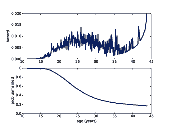
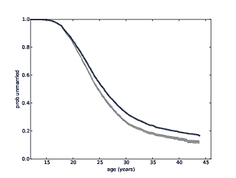
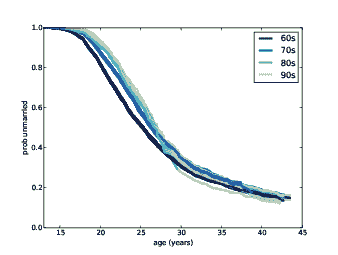

# 第十三章  生存分析

> 原文：[`greenteapress.com/thinkstats2/html/thinkstats2014.html`](https://greenteapress.com/thinkstats2/html/thinkstats2014.html)

生存分析是描述事物持续多久的一种方法。它经常用于研究人类寿命，但也适用于机械和电子部件的“生存”，或者更一般地说，适用于事件发生前的时间间隔。

如果你认识有人被诊断患有危及生命的疾病，你可能见过“5 年生存率”，这是诊断后存活五年的概率。这一估计和相关统计数据是生存分析的结果。

本章的代码在`survival.py`中。有关下载和使用此代码的信息，请参见第 0.2 节。

## 13.1  生存曲线

生存分析中的基本概念是生存曲线 S(t)，它是一个将持续时间 t 映射到生存时间长于 t 的概率的函数。如果你知道持续时间或“寿命”的分布，找到生存曲线就很容易；它只是 CDF 的补集：

| S(t) = 1 − CDF (t)  |
| --- |

其中 CDF(t)是寿命小于或等于 t 的概率。

例如，在 NSFG 数据集中，我们知道 11189 个完整怀孕的持续时间。我们可以读取这些数据并计算 CDF：

```py
 preg = nsfg.ReadFemPreg()
    complete = preg.query('outcome in [1, 3, 4]').prglngth
    cdf = thinkstats2.Cdf(complete, label='cdf') 
```

结果代码`1, 3, 4`表示活产、死胎和流产。在这个分析中，我排除了人工流产、异位妊娠和在受访者接受采访时正在进行的怀孕。

DataFrame 方法`query`接受一个布尔表达式并对每一行进行评估，选择产生 True 的行。

> * * *
> 
> 
> 
> | 图 13.1：怀孕期长度的 CDF 和生存曲线（顶部），危险曲线（底部）。 |
> | --- |
> 
> * * *

图 13.1（顶部）显示了怀孕期长度的 CDF 及其补集，即生存曲线。为了表示生存曲线，我定义了一个包装 CDF 并适应接口的对象：

```py
class SurvivalFunction(object):
    def __init__(self, cdf, label=''):
        self.cdf = cdf
        self.label = label or cdf.label

    @property
    def ts(self):
        return self.cdf.xs

    @property
    def ss(self):
        return 1 - self.cdf.ps 
```

`SurvivalFunction`提供了两个属性：`ts`，它是寿命的序列，`ss`，它是生存曲线。在 Python 中，“属性”是一个可以像变量一样调用的方法。

我们可以通过传递寿命的 CDF 来实例化`SurvivalFunction`：

```py
 sf = SurvivalFunction(cdf) 
```

`SurvivalFunction`还提供了`__getitem__`和`Prob`，用于评估生存曲线。

```py
# class SurvivalFunction

    def __getitem__(self, t):
        return self.Prob(t)

    def Prob(self, t):
        return 1 - self.cdf.Prob(t) 
```

例如，`sf[13]`是持续到第一孕期后的怀孕的比例：

```py
>>> sf[13]
0.86022
>>> cdf[13]
0.13978 
```

大约 86%的怀孕在第一孕期后继续进行；大约 14%不会。

`SurvivalFunction`还提供了`Render`，所以我们可以使用`thinkplot`中的函数绘制`sf`：

```py
 thinkplot.Plot(sf) 
```

图 13.1（顶部）显示了结果。曲线在 13 到 26 周之间几乎是平的，这表明很少的怀孕在第二孕期结束。曲线在 39 周左右最陡，这是最常见的怀孕期长。

## 13.2  危险函数

从生存曲线中，我们可以推导出危险函数；对于怀孕期长度，危险函数从时间 t 映射到继续进行直到 t 然后在 t 结束的怀孕的比例。更准确地说：

| λ(t) =  |
| --- |

&#124; S(t) − S(t+1) &#124;

&#124;  &#124;

&#124; S(t) &#124;

|   |
| --- |

分子是在 t 结束的寿命的比例，也是 PMF(t)。

`SurvivalFunction`提供了`MakeHazard`，它计算危险函数：

```py
# class SurvivalFunction

    def MakeHazard(self, label=''):
        ss = self.ss
        lams = {}
        for i, t in enumerate(self.ts[:-1]):
            hazard = (ss[i] - ss[i+1]) / ss[i]
            lams[t] = hazard

        return HazardFunction(lams, label=label) 
```

`HazardFunction`对象是 pandas Series 的包装器：

```py
class HazardFunction(object):

    def __init__(self, d, label=''):
        self.series = pandas.Series(d)
        self.label = label 
```

`d`可以是一个字典或任何其他可以初始化 Series 的类型，包括另一个 Series。`label`是用于标识 HazardFunction 的字符串。

`HazardFunction`提供了`__getitem__`，所以我们可以这样评估它：

```py
>>> hf = sf.MakeHazard()
>>> hf[39]
0.49689 
```

因此，在所有持续到第 39 周的怀孕中，大约 50%在第 39 周结束。

图 13.1（底部）显示了怀孕期长度的危险函数。在 42 周后的时间，危险函数是不稳定的，因为它是基于少量案例。除此之外，曲线的形状如预期的那样：在 39 周左右最高，在第一孕期比第二孕期略高。

危险函数本身就很有用，但它也是估计生存曲线的重要工具，我们将在下一节中看到。

## 13.3 推断生存曲线

如果有人给您寿命的 CDF，那么计算生存和危险函数就很容易。但在许多现实世界的情况下，我们无法直接测量寿命的分布。我们必须推断它。

例如，假设您正在跟踪一组患者，以查看他们在诊断后存活多长时间。并非所有患者在同一天被诊断，因此在任何时间点，有些患者的存活时间比其他患者长。如果有些患者已经去世，我们知道他们的存活时间。对于仍然存活的患者，我们不知道存活时间，但我们有一个下限。

如果我们等到所有患者都去世，我们可以计算生存曲线，但如果我们正在评估一种新治疗的有效性，我们不能等那么久！我们需要一种方法来使用不完整信息估计生存曲线。

作为一个更愉快的例子，我将使用 NSFG 数据来量化 respondents 首次结婚“存活”多长时间。respondents 年龄的范围是 14 到 44 岁，因此数据集提供了生活不同阶段的女性的快照。

对于已婚的女性，数据集包括她们的第一次婚姻日期和当时的年龄。对于未婚的女性，我们知道她们接受采访时的年龄，但无法知道她们何时或是否会结婚。

由于我们知道*一些*女性的初婚年龄，可能会诱人地排除其他女性并计算已知数据的 CDF。这是一个坏主意。结果会产生双重误导：（1）年龄较大的女性会被过度代表，因为她们更有可能在接受采访时已婚，（2）已婚女性会被过度代表！实际上，这种分析会导致结论所有女性都结婚，这显然是不正确的。

## 13.4 Kaplan-Meier 估计

在这个例子中，不仅是值得的，而且是必要的，包括未婚女性的观察结果，这将引出生存分析中的一个中心算法之一，Kaplan-Meier 估计。

总体思想是我们可以使用数据来估计危险函数，然后将危险函数转换为生存曲线。为了估计危险函数，我们考虑每个年龄的（1）在该年龄结婚的女性人数和（2）“处于风险”结婚的女性人数，其中包括所有在较早年龄未婚的女性。

以下是代码：

```py
def EstimateHazardFunction(complete, ongoing, label=''):

    hist_complete = Counter(complete)
    hist_ongoing = Counter(ongoing)

    ts = list(hist_complete | hist_ongoing)
    ts.sort()

    at_risk = len(complete) + len(ongoing)

    lams = pandas.Series(index=ts)
    for t in ts:
        ended = hist_complete[t]
        censored = hist_ongoing[t]

        lams[t] = ended / at_risk
        at_risk -= ended + censored

    return HazardFunction(lams, label=label) 
```

`complete`是完整观察的集合；在这种情况下，是 respondents 结婚时的年龄。`ongoing`是不完整观察的集合；也就是说，在被采访时未婚女性的年龄。

首先，我们预先计算`hist_complete`，它是一个计数器，将每个年龄映射到在该年龄结婚的女性人数，以及`hist_ongoing`，它将每个年龄映射到在该年龄接受采访的未婚女性人数。

`ts`是 respondents 结婚时的年龄和未婚女性接受采访时的年龄的并集，按增加顺序排序。

`at_risk` 跟踪被认为在每个年龄“处于风险”respondents 的数量；最初，它是 respondents 的总数。

结果存储在一个 Pandas `Series`中，该系列将每个年龄映射到该年龄的估计危险函数。

每次循环时，我们考虑一个年龄`t`，并计算在`t`结束的事件数（即在该年龄结婚的受访者人数）以及在`t`被截尾的事件数（即在`t`接受采访的女性中，未来结婚日期被截尾的人数）。在这种情况下，“被截尾”意味着由于数据收集过程而无法获得数据。

估计的危险函数是在`t`结束的风险案例的比例。

在循环结束时，我们从`at_risk`中减去在`t`结束或被截尾的案例数。

最后，我们将`lams`传递给`HazardFunction`构造函数并返回结果。

## 13.5 婚姻曲线

为了测试这个函数，我们需要进行一些数据清理和转换。我们需要的 NSFG 变量是：

+   `cmbirth`：受访者的出生日期，对所有受访者都已知。

+   `cmintvw`：受访者接受采访的日期，对所有受访者都已知。

+   `cmmarrhx`：如果适用且已知，受访者首次结婚的日期。

+   `evrmarry`：如果受访者在采访日期之前结过婚，则为 1，否则为 0。

前三个变量以“世纪-月”编码；即自 1899 年 12 月以来的整数月数。所以世纪-月 1 是 1900 年 1 月。

首先，我们读取受访者文件并替换`cmmarrhx`的无效值：

```py
 resp = chap01soln.ReadFemResp()
    resp.cmmarrhx.replace([9997, 9998, 9999], np.nan, inplace=True) 
```

然后我们计算每个受访者的结婚年龄和接受采访时的年龄：

```py
 resp['agemarry'] = (resp.cmmarrhx - resp.cmbirth) / 12.0
    resp['age'] = (resp.cmintvw - resp.cmbirth) / 12.0 
```

接下来我们提取`complete`，这是已婚妇女的结婚年龄，以及`ongoing`，这是未婚妇女的采访年龄：

```py
 complete = resp[resp.evrmarry==1].agemarry
    ongoing = resp[resp.evrmarry==0].age 
```

最后我们计算危险函数。

```py
 hf = EstimateHazardFunction(complete, ongoing) 
```

图 13.2（顶部）显示了估计的危险函数；在十几岁时较低，在 20 多岁时较高，在 30 多岁时下降。在 40 多岁时再次增加，但这是估计过程的产物；随着“处于风险中”的受访者数量减少，少数结婚的女性产生了较大的估计危险。生存曲线将平滑这种噪音。

## 13.6 估计生存曲线

一旦我们有了危险函数，我们就可以估计生存曲线。在时间`t`之后生存的机会是在`t`之前所有时间生存的机会，这是补集危险函数的累积乘积：

| [1−λ(0)] [1−λ(1)] … [1−λ(t)] |
| --- |

`HazardFunction`类提供了`MakeSurvival`，计算这个乘积：

```py
# class HazardFunction:

    def MakeSurvival(self):
        ts = self.series.index
        ss = (1 - self.series).cumprod()
        cdf = thinkstats2.Cdf(ts, 1-ss)
        sf = SurvivalFunction(cdf)
        return sf 
```

`ts`是估计危险函数的时间序列。`ss`是补集危险函数的累积乘积，因此它是生存曲线。

由于`SurvivalFunction`的实现方式，我们必须计算`ss`的补集，制作一个 Cdf，然后实例化一个 SurvivalFunction 对象。

> * * *
> 
> 
> 
> | 图 13.2：首次婚姻年龄的危险函数（顶部）和生存曲线（底部）。 |
> | --- |
> 
> * * *

图 13.2（底部）显示了结果。生存曲线在 25 岁到 35 岁之间最陡，这时大多数女性结婚。35 岁到 45 岁之间，曲线几乎是平的，表明在 35 岁之前没有结婚的女性不太可能结婚。

1986 年，一篇著名的杂志文章以这样的曲线为基础；《新闻周刊》报道说，一个 40 岁未婚女性“更有可能被恐怖分子杀死”而不是结婚。这些统计数据被广泛报道，并成为流行文化的一部分，但当时是错误的（因为它们基于错误的分析），后来证明更加错误（因为已经在进行并持续的文化变革）。2006 年，《新闻周刊》发表了另一篇文章承认他们错了。

我鼓励你阅读更多关于这篇文章、它所基于的统计数据以及反应的内容。这应该提醒你有道德义务以谨慎的态度进行统计分析，以适当的怀疑态度解释结果，并准确诚实地向公众呈现它们。

## 13.7 置信区间

Kaplan-Meier 分析产生了生存曲线的单一估计，但量化估计的不确定性也很重要。通常，有三种可能的错误来源：测量误差、抽样误差和建模误差。

在这个例子中，测量误差可能很小。人们通常知道自己的出生日期，是否结婚以及何时结婚。并且可以预期他们会准确报告这些信息。

我们可以通过重新抽样来量化抽样误差。以下是代码：

```py
def ResampleSurvival(resp, iters=101):
    low, high = resp.agemarry.min(), resp.agemarry.max()
    ts = np.arange(low, high, 1/12.0)

    ss_seq = []
    for i in range(iters):
        sample = thinkstats2.ResampleRowsWeighted(resp)
        hf, sf = EstimateSurvival(sample)
        ss_seq.append(sf.Probs(ts))

    low, high = thinkstats2.PercentileRows(ss_seq, [5, 95])
    thinkplot.FillBetween(ts, low, high) 
```

`ResampleSurvival`获取`resp`，受访者的 DataFrame，和`iters`，重新抽样的次数。它计算`ts`，这是我们将评估生存曲线的年龄序列。

在循环内，`ResampleSurvival`：

+   使用`ResampleRowsWeighted`对受访者进行重新抽样，我们在第 10.7 节中看到过。

+   调用`EstimateSurvival`，它使用前几节中的过程来估计危险和生存曲线，以及

+   评估`ts`中每个年龄的生存曲线。

`ss_seq`是评估的生存曲线序列。`PercentileRows`获取此序列并计算第 5 和第 95 百分位数，返回生存曲线的 90%置信区间。

> * * *
> 
> 
> 
> | 图 13.3：首次婚姻年龄的生存曲线（深色线）和基于加权重新抽样的 90%置信区间（灰色线）。 |
> | --- |
> 
> * * *

图 13.3 显示了我们在上一节中估计的生存曲线以及结果。置信区间考虑了抽样权重，而估计曲线没有。它们之间的差异表明抽样权重对估计有实质影响——我们必须记住这一点。

## 13.8  队列效应

生存分析的一个挑战是估计曲线的不同部分基于不同的受访者群体。曲线在时间`t`的部分基于受访者的年龄至少为`t`时进行了访谈。因此曲线的最左侧部分包括所有受访者的数据，但最右侧部分只包括最年长的受访者。

如果受访者的相关特征随时间不发生变化，那就没问题，但在这种情况下，似乎不同年代出生的女性的婚姻模式可能是不同的。我们可以通过根据受访者的出生年代对其进行分组来研究这种影响。像这样由出生日期或类似事件定义的群体称为队列，群体之间的差异称为队列效应。

为了研究 NSFG 婚姻数据中的队列效应，我收集了 2002 年使用的第 6 周期数据，这些数据在本书中使用；2006 年至 2010 年在第 9.11 节中使用的第 7 周期数据；以及 1995 年的第 5 周期数据。总共这些数据集包括 30769 名受访者。

```py
 resp5 = ReadFemResp1995()
    resp6 = ReadFemResp2002()
    resp7 = ReadFemResp2010()
    resps = [resp5, resp6, resp7] 
```

对于每个 DataFrame，`resp`，我使用`cmbirth`计算每个受访者的出生年代：

```py
 month0 = pandas.to_datetime('1899-12-15')
    dates = [month0 + pandas.DateOffset(months=cm)
             for cm in resp.cmbirth]
    resp['decade'] = (pandas.DatetimeIndex(dates).year - 1900) // 10 
```

`cmbirth`编码为自 1899 年 12 月以来的整数月数；`month0`将该日期表示为 Timestamp 对象。对于每个出生日期，我们实例化一个包含世纪月份的`DateOffset`并将其添加到`month0`；结果是一个 Timestamp 序列，它被转换为`DateTimeIndex`。最后，我们提取`year`并计算十年。

为了考虑抽样权重，并且显示由于抽样误差而产生的变异性，我重新对数据进行抽样，按十年龄段分组受访者，并绘制生存曲线：

```py
 for i in range(iters):
        samples = [thinkstats2.ResampleRowsWeighted(resp)
                   for resp in resps]
        sample = pandas.concat(samples, ignore_index=True)
        groups = sample.groupby('decade')

        EstimateSurvivalByDecade(groups, alpha=0.2) 
```

来自三个 NSFG 周期的数据使用不同的抽样权重，因此我分别对它们进行重新抽样，然后使用`concat`将它们合并成一个 DataFrame。参数`ignore_index`告诉`concat`不要通过索引匹配受访者；而是创建一个从 0 到 30768 的新索引。

`EstimateSurvivalByDecade`为每个队列绘制生存曲线：

```py
def EstimateSurvivalByDecade(resp):
    for name, group in groups:
        hf, sf = EstimateSurvival(group)
        thinkplot.Plot(sf) 
```

> * * *
> 
> 
> 
> | 图 13.4：不同年代出生的受访者的生存曲线。 |
> | --- |
> 
> * * *

图 13.4 显示了结果。有几种模式是可见的：

+   60 年代出生的女性最早结婚，随后的队列结婚的时间越来越晚，至少在 30 岁左右。

+   60 年代出生的女性遵循了一个令人惊讶的模式。25 岁之前，她们的结婚速度比她们的前辈慢。25 岁之后，她们的结婚速度加快了。到 32 岁时，她们已经超过了 50 年代的队列，44 岁时她们结婚的可能性要大得多。

    60 年代出生的女性在 1985 年至 1995 年之间年满 25 岁。记得我提到的《Newsweek》文章是在 1986 年发表的，很诱人地想象这篇文章引发了一场结婚热潮。这种解释可能太过简单，但有可能这篇文章及其引起的反应反映了影响这一队行为的情绪。

+   70 年代队列的模式类似。他们在 25 岁之前结婚的可能性比前辈小，但到 35 岁时，他们已经赶上了前两队。

+   80 年代出生的女性在 25 岁之前结婚的可能性甚至更小。之后会发生什么并不清楚；要获得更多数据，我们必须等待下一轮 NSFG 的数据。

与此同时，我们可以做一些预测。

## 13.9 推断

70 年代队列的生存曲线在大约 38 岁结束；80 年代队列在 28 岁结束，90 年代队列我们几乎没有任何数据。

我们可以通过“借用”上一队的数据来推断这些曲线。HazardFunction 提供了一个名为 `Extend` 的方法，它可以从另一个更长的 HazardFunction 中复制尾部：

```py
# class HazardFunction

    def Extend(self, other):
        last = self.series.index[-1]
        more = other.series[other.series.index > last]
        self.series = pandas.concat([self.series, more]) 
```

正如我们在第 13.2 节中看到的，HazardFunction 包含了一个从 t 到 λ(t) 的 Series。`Extend` 找到了 `last`，它是 `self.series` 中的最后一个索引，然后从 `other` 中选择比 `last` 更晚的值，并将它们附加到 `self.series` 上。

现在我们可以扩展每个队列的 HazardFunction，使用前任的值：

```py
def PlotPredictionsByDecade(groups):
    hfs = []
    for name, group in groups:
        hf, sf = EstimateSurvival(group)
        hfs.append(hf)

    thinkplot.PrePlot(len(hfs))
    for i, hf in enumerate(hfs):
        if i > 0:
            hf.Extend(hfs[i-1])
        sf = hf.MakeSurvival()
        thinkplot.Plot(sf) 
```

`groups` 是一个按出生年代分组的 GroupBy 对象。第一个循环计算了每个组的 HazardFunction。

第二个循环将每个 HazardFunction 扩展到其前任的值，这些值可能包含来自上一组的值，依此类推。然后将每个 HazardFunction 转换为 SurvivalFunction 并绘制出来。

> * * *
> 
> 
> 
> | 图 13.5：不同年代出生的受访者的生存曲线，以及对后续队列的预测。 |
> | --- |
> 
> * * *

图 13.5 显示了结果；我已经移除了 50 年代队列，以使预测更加明显。这些结果表明，到 40 岁时，最近的队列将与 60 年代队列趋于一致，不到 20%的人未婚。

## 13.10 预期剩余寿命

给定一个生存曲线，我们可以计算当前年龄的预期剩余寿命。例如，给定来自第 13.1 节的怀孕时长的生存曲线，我们可以计算预期的分娩时间。

第一步是提取寿命的 PMF。`SurvivalFunction` 提供了一个可以做到这一点的方法：

```py
# class SurvivalFunction

    def MakePmf(self, filler=None):
        pmf = thinkstats2.Pmf()
        for val, prob in self.cdf.Items():
            pmf.Set(val, prob)

        cutoff = self.cdf.ps[-1]
        if filler is not None:
            pmf[filler] = 1-cutoff

        return pmf 
```

请记住，SurvivalFunction 包含了寿命的 Cdf。循环将这些值和概率从 Cdf 复制到 Pmf 中。

`cutoff` 是 Cdf 中最高的概率，如果 Cdf 完整，则为 1，否则小于 1。如果 Cdf 不完整，我们会插入提供的值 `filler` 来进行封顶。

怀孕时长的 Cdf 已经完整，所以我们不必担心这个细节。

下一步是计算预期剩余寿命，这里的“预期”是指平均值。`SurvivalFunction` 也提供了一个可以做到这一点的方法：

```py
# class SurvivalFunction

    def RemainingLifetime(self, filler=None, func=thinkstats2.Pmf.Mean):
        pmf = self.MakePmf(filler=filler)
        d = {}
        for t in sorted(pmf.Values())[:-1]:
            pmf[t] = 0
            pmf.Normalize()
            d[t] = func(pmf) - t

        return pandas.Series(d) 
```

`RemainingLifetime` 接受 `filler`，它会传递给 `MakePmf`，以及 `func`，它是用于总结剩余寿命分布的函数。

`pmf`是从 SurvivalFunction 中提取的寿命的 Pmf。`d`是一个包含结果的字典，从当前年龄`t`到预期剩余寿命的映射。

循环遍历 Pmf 中的值。对于每个`t`的值，它计算给定寿命超过`t`的条件分布。它通过逐个删除 Pmf 中的值并重新归一化剩余值来实现这一点。

然后它使用`func`来总结条件分布。在这个例子中，结果是给定长度超过`t`的情况下的平均怀孕时长。通过减去`t`，我们得到了平均剩余怀孕时长。

> * * *
> 
> 
> 
> | 图 13.6：预期剩余怀孕时长（左）和首次婚姻年龄（右）。 |
> | --- |
> 
> * * *

图 13.6（左）显示了预期剩余怀孕时长与当前持续时间的函数关系。例如，在第 0 周，预期剩余时间约为 34 周。这比满期（39 周）少，因为在第一季度终止怀孕会使平均值降低。

曲线在第一季度缓慢下降。13 周后，预期寿命仅下降了 9 周，为 25 周。之后曲线下降速度加快，每周大约下降一周。

在第 37 周和 42 周之间，曲线在 1 到 2 周之间水平。在此期间的任何时候，预期剩余寿命都是相同的；随着每周的过去，目的地并没有更近。具有这种特性的过程被称为无记忆，因为过去对预测没有影响。这种行为是产科护士令人恼火的口头禅“任何一天都有可能”背后的数学基础。

图 13.6（右）显示了年龄的中位数剩余时间直到首次婚姻。对于一个 11 岁的女孩，首次婚姻的中位时间约为 14 年。曲线下降直到 22 岁时，中位剩余时间约为 7 年。之后又增加：到 30 岁时又回到了 14 年。

根据这些数据，年轻女性的剩余“寿命”在减少。具有这种特性的机械部件被称为 NBUE，“在期望中新的比使用的更好”，这意味着新部件预期寿命更长。

22 岁以上的女性剩余时间直到首次婚姻增加。具有这种特性的组件被称为 UBNE，“在期望中比新的更好使用”。也就是说，部件越老，预期寿命越长。新生儿和癌症患者也是 UBNE；他们的预期寿命随着他们的生活时间增加而增加。

在这个例子中，我计算了中位数，而不是平均数，因为 Cdf 是不完整的；生存曲线预测大约 20%的受访者在 44 岁之前不会结婚。这些女性的首次婚姻年龄是未知的，可能不存在，因此我们无法计算平均值。

我通过用`np.inf`替换这些未知值来处理它们，`np.inf`是表示无穷大的特殊值。这使得所有年龄的平均值都是无穷大，但只要超过 50%的剩余寿命是有限的，中位数就是明确定义的，这在 30 岁之前是正确的。之后很难定义有意义的预期剩余寿命。

这是计算和绘制这些函数的代码：

```py
 rem_life1 = sf1.RemainingLifetime()
    thinkplot.Plot(rem_life1)

    func = lambda pmf: pmf.Percentile(50)
    rem_life2 = sf2.RemainingLifetime(filler=np.inf, func=func)
    thinkplot.Plot(rem_life2) 
```

`sf1`是怀孕时长的生存曲线；在这种情况下，我们可以使用`RemainingLifetime`的默认值。

`sf2`是首次婚姻年龄的生存曲线；`func`是一个接受 Pmf 并计算其中位数（第 50 百分位数）的函数。

## 13.11 练习

我对这个练习的解决方案在`chap13soln.py`中。

练习 1 *在 NSFG 循环 6 和 7 中，变量`cmdivorcx`包含了受访者第一次婚姻的离婚日期（如果适用），以世纪-月份编码。*

*计算已经离婚的婚姻的持续时间，以及目前正在进行的婚姻的持续时间。估计婚姻持续时间的危险和生存曲线。*

*使用重采样来考虑抽样权重，并绘制来自多个重采样的数据以可视化抽样误差。*

*考虑按出生年代和可能的初婚年龄将受访者分成几组。*

## 13.12 术语表

+   生存分析：一组用于描述和预测寿命，或更一般地，直到事件发生的时间的方法。

+   生存曲线：将时间 t 映射到超过 t 的生存概率的函数。

+   危险函数：将 t 映射到在 t 时死亡的活着的人的比例的函数。

+   Kaplan-Meier 估计：用于估计危险和生存函数的算法。

+   队列：由事件（如出生日期）定义的一组受试者，在特定时间间隔内。

+   队列效应：队列之间的差异。

+   NBUE：预期剩余寿命的属性，“期望中比使用的更好。”

+   UBNE：预期剩余寿命的属性，“期望中比新的更好。”
